# MediaGit Architecture

**Version**: 0.3.0-rc.4

> **Media-first version control** built on Git semantics with intelligent compression,
> content-defined chunking, delta encoding, and media-aware merging.

---

## System Overview

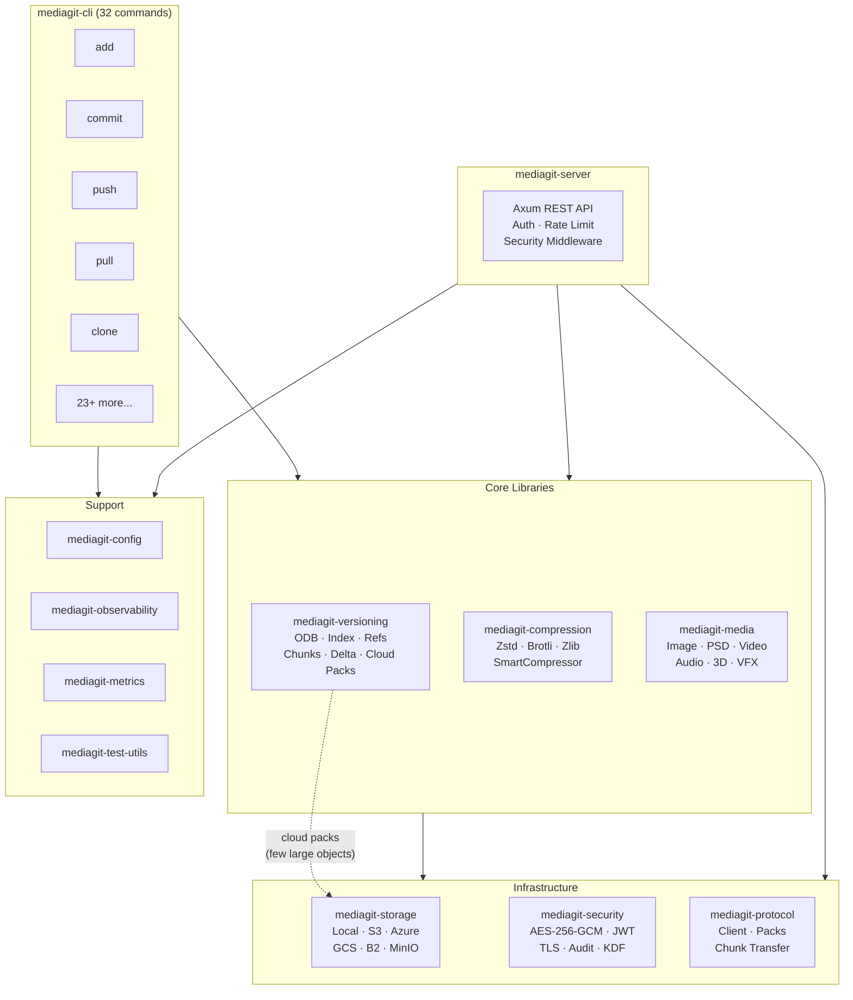
```mermaid
graph TD
    subgraph CLI["mediagit-cli (32 commands)"]
        ADD["add"]
        COMMIT["commit"]
        PUSH["push"]
        PULL["pull"]
        CLONE["clone"]
        OTHER["23+ more..."]
    end

    subgraph Core["Core Libraries"]
        VER["mediagit-versioning<br/>ODB · Index · Refs<br/>Chunks · Delta · Cloud Packs"]
        COMP["mediagit-compression<br/>Zstd · Brotli · Zlib<br/>SmartCompressor"]
        MEDIA["mediagit-media<br/>Image · PSD · Video<br/>Audio · 3D · VFX"]
    end

    subgraph Infra["Infrastructure"]
        STORE["mediagit-storage<br/>Local · S3 · Azure<br/>GCS · B2 · MinIO"]
        SEC["mediagit-security<br/>AES-256-GCM · JWT<br/>TLS · Audit · KDF"]
        PROTO["mediagit-protocol<br/>Client · Packs<br/>Chunk Transfer"]
    end

    subgraph Support["Support"]
        CFG["mediagit-config"]
        OBS["mediagit-observability"]
        MET["mediagit-metrics"]
        TEST["mediagit-test-utils"]
    end

    subgraph Server["mediagit-server"]
        AXUM["Axum REST API<br/>Auth · Rate Limit<br/>Security Middleware"]
    end

    CLI --> Core
    Core --> Infra
    Server --> Core
    Server --> Infra
    CLI --> Support
    Server --> Support
    VER -.->|"cloud packs<br/>(few large objects)"| STORE
```

---

## Workspace Crates (14)

| Crate | Role | Key Modules |
|-------|------|-------------|
| **mediagit-cli** | CLI binary (32 commands) | `commands/`, main entry |
| **mediagit-versioning** | Core VCS engine | `odb/` & `chunking/` (submodules), index, refs, tree, commit, delta, similarity, cloud packs (`streaming_pack`, `streaming_index`, `pack`, `transaction`) |
| **mediagit-compression** | Smart compression | Zstd, Brotli, Zlib, Store; `SmartCompressor` with type+size awareness |
| **mediagit-media** | Media parsing & merging | Image, PSD, Video, Audio, 3D, VFX parsers & merge strategies |
| **mediagit-storage** | Storage abstraction | `StorageBackend` trait + 7 implementations |
| **mediagit-protocol** | Network protocol | `client/` (submodule), pack reader/writer, streaming pack, chunk transfer, cloud-pack transfer |
| **mediagit-server** | HTTP server | Axum routes, `handlers/` (submodule), auth middleware, rate limiting, security |
| **mediagit-security** | Security layer | Encryption (AES-256-GCM), Auth (JWT + API keys), TLS, audit, KDF |
| **mediagit-config** | Configuration | TOML config file management |
| **mediagit-observability** | Logging/tracing | Structured tracing with env-filter |
| **mediagit-metrics** | Prometheus metrics | Operation stats, dedup ratios |
| **mediagit-test-utils** | Test utilities | Shared test helpers |

### Workspace Dependency Graph

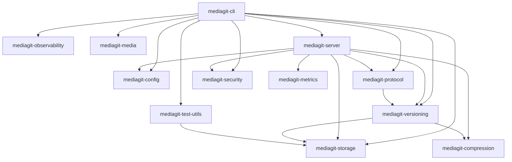
```mermaid
graph TD
    CLI["mediagit-cli"] --> CFG["mediagit-config"]
    CLI --> STORE["mediagit-storage"]
    CLI --> VER["mediagit-versioning"]
    CLI --> OBS["mediagit-observability"]
    CLI --> PROTO["mediagit-protocol"]
    CLI --> MEDIA["mediagit-media"]
    CLI --> SEC["mediagit-security"]
    CLI --> TU["mediagit-test-utils"]
    CLI --> SRV["mediagit-server"]

    SRV --> PROTO
    SRV --> VER
    SRV --> COMP["mediagit-compression"]
    SRV --> STORE
    SRV --> CFG
    SRV --> SEC
    SRV --> MET["mediagit-metrics"]

    PROTO --> VER
    VER --> STORE
    VER --> COMP
    TU --> STORE
```

---

## CLI Commands (32)

### Core Workflow
| Command | Description |
|---------|-------------|
| `init` | Initialize a new `.mediagit` repository |
| `add` | Stage files with smart compression, chunking, delta encoding |
| `commit` | Create a commit from staged changes |
| `status` | Show working tree and index status |
| `log` | Display commit history |
| `diff` | Show differences between versions |
| `show` | Show object contents |

### Branching & History
| Command | Description |
|---------|-------------|
| `branch` | List, create, switch, or delete branches (supports remote branches via `-r`) |
| `merge` | Merge branches with media-aware strategies |
| `rebase` | Reapply commits on top of another base |
| `cherry-pick` | Apply specific commits to current branch |
| `tag` | Create, list, or delete tags |
| `stash` | Temporarily shelve changes |
| `bisect` | Binary search for bug-introducing commit |
| `reflog` | Show reference logs (when branch tips were updated) |

### File Locking
| Command | Description |
|---------|-------------|
| `lock` | Manage server-enforced file locks (`create`/`unlock`/`list`) |

### Remote Operations
| Command | Description |
|---------|-------------|
| `clone` | Clone a repository (all branches) |
| `push` | Push commits and chunks to remote; supports `--delete` to remove remote branches |
| `pull` | Fetch and merge remote changes |
| `fetch` | Fetch all remote refs without merging |
| `remote` | Manage remote repositories |
| `download` | Download a single file from a remote repository by path |

### Media & Sparse Checkout
| Command | Description |
|---------|-------------|
| `media` | Inspect media file metadata (image/video/audio/PSD/3D) |
| `sparse-checkout` | Manage sparse checkout (partial working tree) |

### File & History Operations
| Command | Description |
|---------|-------------|
| `reset` | Unstage files or reset to a commit |
| `revert` | Create a new commit that undoes changes (working tree updated) |

### Administration
| Command | Description |
|---------|-------------|
| `gc` | Garbage collection: sweep unreachable objects, orphaned chunks & manifests |
| `fsck` | Verify object database integrity |
| `verify` | Quick commit and signature verification |
| `stats` | Show repository statistics (storage, files, compression, dedup) |
| `completions` | Generate shell completions |
| `version` | Show version information |

### Importing from Git or git-lfs — not available
There is **no supported path** for importing an existing git or git-lfs
repository into MediaGit. Two crates (`mediagit-git`, `mediagit-migration`)
claimed to provide one and were deleted in 0.3.0-rc.4; neither had ever been
wired to the CLI, and `mediagit-git`'s clean filter replaced file content with a
pointer **without storing the content anywhere**, logging success. Configured as
a real git filter, it would have destroyed every file it touched.

MediaGit is a standalone VCS for media, not a git front-end, so an importer has
to reconstruct history through MediaGit's own object model rather than reuse
git's. That work has not been done. Recorded here so the gap is a known absence
rather than a broken feature someone finds by trying it.

---

## Object Database (ODB)

The ODB is the core storage engine (`mediagit-versioning/src/odb/` — split into submodules after the god-file refactor).

### Object Types
- **Blob** — File content (raw or chunked)
- **Tree** — Directory listing (path → OID mapping)
- **Commit** — Snapshot with parent, tree, author, message, timestamp
- **Tag** — Named pointer to any object

### Content-Addressable Storage
- **Hashing**: BLAKE3 (via `blake3` crate)
- **Deduplication**: Identical content → same OID, stored once
- **LRU Cache**: Configurable in-memory cache for hot objects
- **Metrics**: Tracks reads, writes, cache hits, bytes saved

### ODB Write Pipeline

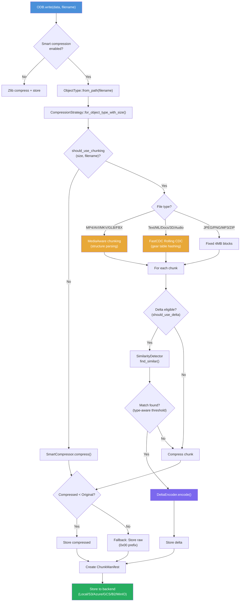
```mermaid
graph TD
    A["ODB.write(data, filename)"] --> B{"Smart compression<br/>enabled?"}
    B -->|No| Z1["Zlib compress + store"]
    B -->|Yes| C["ObjectType::from_path(filename)"]
    C --> D["CompressionStrategy::for_object_type_with_size()"]
    D --> E{"should_use_chunking<br/>(size, filename)?"}
    E -->|No| F["SmartCompressor.compress()"]
    F --> G{"Compressed < Original?"}
    G -->|Yes| H["Store compressed"]
    G -->|No| I["Fallback: Store raw<br/>(0x00 prefix)"]
    E -->|Yes| J{"File type?"}
    J -->|"MP4/AVI/MKV/GLB/FBX"| K["MediaAware chunking<br/>(structure parsing)"]
    J -->|"Text/ML/Docs/3D/Audio"| L["FastCDC Rolling CDC<br/>(gear table hashing)"]
    J -->|"JPEG/PNG/MP3/ZIP"| M["Fixed 4MB blocks"]
    K --> N["For each chunk"]
    L --> N
    M --> N
    N --> O{"Delta eligible?<br/>(should_use_delta)"}
    O -->|Yes| P["SimilarityDetector<br/>find_similar()"]
    P --> Q{"Match found?<br/>(type-aware threshold)"}
    Q -->|Yes| R["DeltaEncoder.encode()"]
    Q -->|No| S["Compress chunk"]
    O -->|No| S
    R --> T["Store delta"]
    S --> G
    T --> U["Create ChunkManifest"]
    H --> U
    I --> U
    U --> V["Store to backend<br/>(Local/S3/Azure/GCS/B2/MinIO)"]

    style A fill:#4A90D9,color:#fff
    style L fill:#E8A838,color:#fff
    style K fill:#E8A838,color:#fff
    style R fill:#7B68EE,color:#fff
    style V fill:#27AE60,color:#fff
```

### Constants
| Constant | Value | Purpose |
|----------|-------|---------|
| `MAX_DELTA_DEPTH` | 10 | Max delta chain before re-storing as full object |
| `MAX_OBJECT_SIZE` | 16 GB | Prevents allocation failures from corrupt manifests |
| `LARGE_TEXT_THRESHOLD` | 500 MB | Switch from Brotli to Zstd for text files |

---

## Compression Engine

**Crate**: `mediagit-compression` · **Key module**: `smart_compressor/` (submodule directory after the god-file refactor)

### Compression Strategy Selection

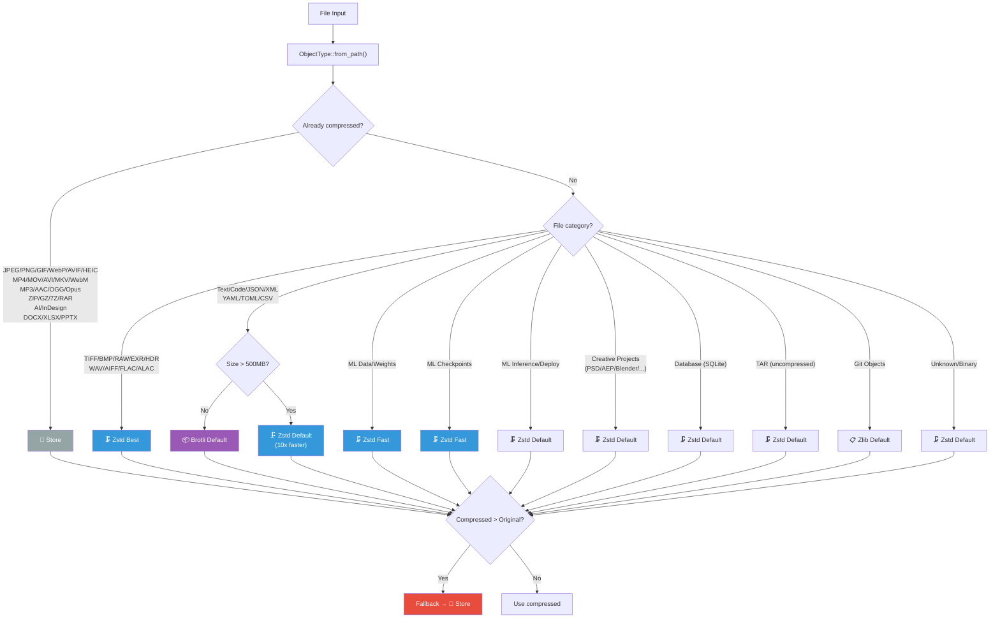
```mermaid
graph TD
    A["File Input"] --> B["ObjectType::from_path()"]
    B --> C{"Already compressed?"}
    C -->|"JPEG/PNG/GIF/WebP/AVIF/HEIC<br/>MP4/MOV/AVI/MKV/WebM<br/>MP3/AAC/OGG/Opus<br/>ZIP/GZ/7Z/RAR<br/>AI/InDesign<br/>DOCX/XLSX/PPTX"| D["💾 Store"]
    C -->|No| E{"File category?"}
    E -->|"TIFF/BMP/RAW/EXR/HDR<br/>WAV/AIFF/FLAC/ALAC"| F["🗜️ Zstd Best"]
    E -->|"Text/Code/JSON/XML<br/>YAML/TOML/CSV"| G{"Size > 500MB?"}
    G -->|No| H["📦 Brotli Default"]
    G -->|Yes| I["🗜️ Zstd Default<br/>(10x faster)"]
    E -->|"ML Data/Weights"| J["🗜️ Zstd Fast"]
    E -->|"ML Checkpoints"| K["🗜️ Zstd Fast"]
    E -->|"ML Inference/Deploy"| L["🗜️ Zstd Default"]
    E -->|"Creative Projects<br/>(PSD/AEP/Blender/...)"| M["🗜️ Zstd Default"]
    E -->|"Database (SQLite)"| N["🗜️ Zstd Default"]
    E -->|"TAR (uncompressed)"| O["🗜️ Zstd Default"]
    E -->|"Git Objects"| P["📋 Zlib Default"]
    E -->|"Unknown/Binary"| Q["🗜️ Zstd Default"]

    D --> R{"Compressed > Original?"}
    F --> R
    H --> R
    I --> R
    J --> R
    K --> R
    L --> R
    M --> R
    N --> R
    O --> R
    P --> R
    Q --> R
    R -->|Yes| S["Fallback → 💾 Store"]
    R -->|No| T["Use compressed"]

    style D fill:#95a5a6,color:#fff
    style F fill:#3498db,color:#fff
    style H fill:#9b59b6,color:#fff
    style I fill:#3498db,color:#fff
    style J fill:#3498db,color:#fff
    style K fill:#3498db,color:#fff
    style S fill:#e74c3c,color:#fff
```

### Type Classification (`ObjectType`)

60+ file types classified into categories:

| Category | Types | Strategy |
|----------|-------|----------|
| **Image (compressed)** | JPEG, PNG, GIF, WebP, AVIF, HEIC, GPU textures | **Store** |
| **Image (uncompressed)** | TIFF, BMP, RAW, EXR, HDR | **Zstd Best** |
| **Video** | MP4, MOV, AVI, MKV, WebM, FLV, WMV, MPG | **Store** |
| **Audio (compressed)** | MP3, AAC, OGG, Opus | **Store** |
| **Audio (uncompressed)** | FLAC, WAV, AIFF, ALAC | **Zstd Best** |
| **Text/Code** | 30+ extensions (rs, py, js, md, etc.) | **Brotli Default** (Zstd if >500MB) |
| **Archives** | ZIP, GZ, 7Z, RAR, Parquet | **Store** |
| **TAR** | Uncompressed containers | **Zstd Default** |
| **ML Data** | HDF5, NPY, TFRecords, etc. | **Zstd Fast** |
| **ML Checkpoints** | .pt, .pth, .ckpt, .bin | **Zstd Fast** |
| **ML Inference** | ONNX, GGUF, TFLite, etc. | **Zstd Default** |
| **Adobe PDF-based** | AI, InDesign | **Store** (internal compression) |
| **Creative Projects** | PSD, AEP, Blender, Maya, C4D, etc. | **Zstd Default** |
| **Office** | DOCX, XLSX, PPTX, ODP | **Store** (ZIP containers) |
| **Database** | SQLite | **Zstd Default** |
| **Git Objects** | Blob, Tree, Commit | **Zlib Default** |

### Compression Algorithms

| Algorithm | Levels | Use Case |
|-----------|--------|----------|
| **Zstd** | Fast (1), Default (3), Best (19) | General purpose, large files |
| **Brotli** | Default (9) | Text/structured data, best ratio |
| **Zlib** | Default (6) | Git object compatibility |
| **Store** | — | Already-compressed content |
| **Delta** | — | Similar file versions |

### Smart Fallback
If compression **expands** the data (common for embedded JPEGs in AI/PSD files),
`compress_with_strategy()` automatically falls back to Store mode with a `0x00` prefix byte.

### Decompression
Auto-detects algorithm from magic bytes:
- `0x00` → Store (strip prefix)
- `0x78` → Zlib
- `0x28 0xB5 0x2F 0xFD` → Zstd
- Other → Brotli

---

## Chunking Engine

**Crate**: `mediagit-versioning` · **Key module**: `chunking/` (submodule directory after the god-file refactor)

### Chunking Strategy Decision

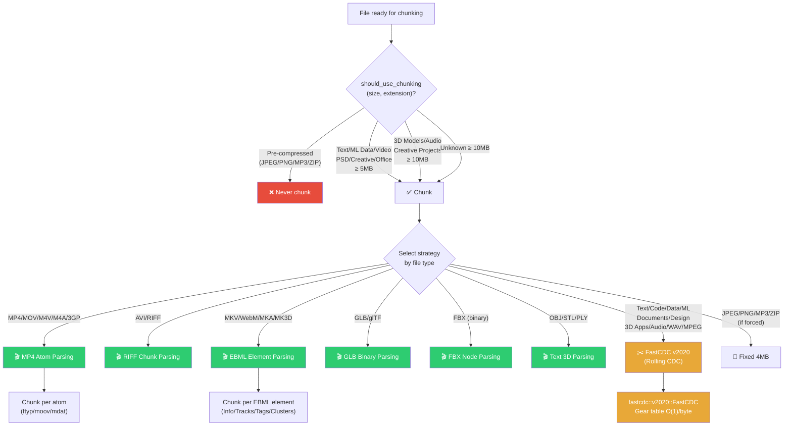
```mermaid
graph TD
    A["File ready for chunking"] --> B{"should_use_chunking<br/>(size, extension)?"}
    B -->|"Pre-compressed<br/>(JPEG/PNG/MP3/ZIP)"| C["❌ Never chunk"]
    B -->|"Text/ML Data/Video<br/>PSD/Creative/Office<br/>≥ 5MB"| D["✅ Chunk"]
    B -->|"3D Models/Audio<br/>Creative Projects<br/>≥ 10MB"| D
    B -->|"Unknown ≥ 10MB"| D
    D --> E{"Select strategy<br/>by file type"}
    E -->|"MP4/MOV/M4V/M4A/3GP"| F["🎬 MP4 Atom Parsing"]
    E -->|"AVI/RIFF"| G["🎬 RIFF Chunk Parsing"]
    E -->|"MKV/WebM/MKA/MK3D"| H["🎬 EBML Element Parsing"]
    E -->|"GLB/glTF"| I["🎬 GLB Binary Parsing"]
    E -->|"FBX (binary)"| J["🎬 FBX Node Parsing"]
    E -->|"OBJ/STL/PLY"| K["🎬 Text 3D Parsing"]
    E -->|"Text/Code/Data/ML<br/>Documents/Design<br/>3D Apps/Audio/WAV/MPEG"| L["✂️ FastCDC v2020<br/>(Rolling CDC)"]
    E -->|"JPEG/PNG/MP3/ZIP<br/>(if forced)"| M["📐 Fixed 4MB"]

    L --> N["fastcdc::v2020::FastCDC<br/>Gear table O(1)/byte"]
    F --> O["Chunk per atom<br/>(ftyp/moov/mdat)"]
    H --> P["Chunk per EBML element<br/>(Info/Tracks/Tags/Clusters)"]

    style L fill:#E8A838,color:#fff
    style N fill:#E8A838,color:#fff
    style F fill:#2ECC71,color:#fff
    style G fill:#2ECC71,color:#fff
    style H fill:#2ECC71,color:#fff
    style I fill:#2ECC71,color:#fff
    style J fill:#2ECC71,color:#fff
    style K fill:#2ECC71,color:#fff
    style C fill:#e74c3c,color:#fff
```

### Structure-Aware Parsers

Each media format has a dedicated parser that understands the container structure and creates semantically meaningful chunks:

#### MP4 Atom Parser (`chunk_mp4`)
- Parses MP4/MOV/M4V/M4A/3GP atom hierarchy
- `ftyp` → single Metadata chunk
- `moov` → parsed into nested sub-atoms (mvhd, trak, udta) for granular dedup
- `mdat` header → stable `Metadata` chunk; payload CDC-subdivided with FastCDC (2MB avg / 1MB min / 8MB max) into `VideoStream` chunks
- Fragmented MP4 (DASH/fMP4): `moof` atoms detected → same CDC path
- `fill_coverage_gaps` called after parsing to patch any uncovered byte ranges (atom-size edge cases, unknown atoms) with `Generic` chunks, ensuring byte-exact reconstruction

#### Matroska/EBML Parser (`chunk_matroska`)
- Parses MKV/WebM/MKA/MK3D EBML element hierarchy using custom VINT parser
- **Per-element metadata chunking**: each top-level metadata element (Info, Tracks, SeekHead, Cues, Chapters, Tags) becomes its own chunk — changing tags won't invalidate tracks or cues
- Segment container → header-only chunk (children get individual chunks)
- Cluster header → stable `Metadata` chunk; cluster payload CDC-subdivided with FastCDC (2MB avg / 1MB min / 8MB max) into `VideoStream` chunks
- Attachments → separate `Generic` chunk
- `fill_coverage_gaps` called after parsing to patch EBML Void (`0xEC`) and CRC-32 (`0xBF`) elements (skipped during structural parsing) with `Generic` chunks, ensuring byte-exact reconstruction
- Fallback: invalid EBML data → fixed 4MB chunking

#### AVI/RIFF Parser (`chunk_avi`)
- Walks at RIFF-block level: handles both AVI 1.0 (`RIFF/AVI `) and OpenDML AVI 2.0 (`RIFF/AVIX`) extension blocks
- `LIST/movi` payload CDC-subdivided with FastCDC (2MB avg / 1MB min / 8MB max) into `VideoStream` chunks
- Structural chunks (`LIST/hdrl`, `LIST/INFO`, `idx1`, `JUNK`) emitted as `Metadata`
- `fill_coverage_gaps` called after parsing to patch any uncovered ranges, ensuring byte-exact reconstruction

#### GLB Parser (`chunk_glb`)
- Parses binary glTF structure: 12-byte header + JSON chunk + BIN chunk(s)
- Each GLB section header (8 bytes) emitted as a stable `Metadata` chunk
- JSON chunk → always a single `Metadata` chunk (typically small)
- BIN chunk ≤ 4MB → single `Generic` chunk
- BIN chunk > 4MB → CDC-subdivided using FastCDC (1MB avg / 512KB min / 4MB max), matching the MKV large-Cluster pattern. Common for scanned meshes, photogrammetry, and terrain models where the binary buffer is 20–200MB.
- Verified: 100% delta efficiency with 3–4 KB overhead on 13–24MB GLB files

#### FBX Parser (`chunk_fbx`)
- Parses binary FBX node tree structure

### FastCDC Integration

MediaGit uses the **`fastcdc` crate v3.2** (specifically `fastcdc::v2020`, the 2020 algorithm revision) for all content-defined chunking. FastCDC replaces traditional rolling hash with a **gear table-based hash** that achieves **O(1) boundary detection per byte** — approximately **10× faster** than Buzhash or Rabin fingerprint.

#### Two Modes of Operation

| Mode | API | Used In | When |
|------|-----|---------|------|
| **In-memory** | `fastcdc::v2020::FastCDC::new(data, min, avg, max)` | `chunk_fastcdc()` | Files loaded into memory (default path via `chunk_media_aware`) |
| **mmap (format-aware)** | `memmap2::Mmap` + `chunk_media_aware()` | `collect_file_chunks_blocking()` | All files including >100 MB — mmap gives `&[u8]` without loading into heap; falls back to StreamCDC on mmap failure |
| **Streaming (fallback)** | `fastcdc::v2020::StreamCDC::new(file, min, avg, max)` | `collect_file_chunks_blocking()` | mmap unavailable (FUSE/network FS, 32-bit targets with >4 GB file) |

#### FastCDC Data Flow

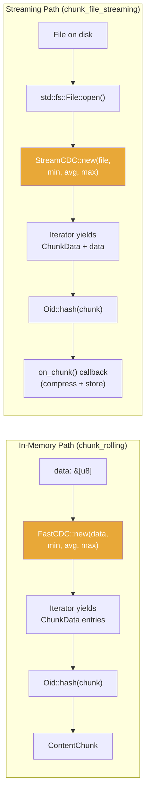
```mermaid
graph LR
    subgraph InMemory["In-Memory Path (chunk_rolling)"]
        A1["data: &[u8]"] --> B1["FastCDC::new(data,<br/>min, avg, max)"]
        B1 --> C1["Iterator yields<br/>ChunkData entries"]
        C1 --> D1["Oid::hash(chunk)"]
        D1 --> E1["ContentChunk"]
    end

    subgraph Streaming["Streaming Path (chunk_file_streaming)"]
        A2["File on disk"] --> B2["std::fs::File::open()"]
        B2 --> C2["StreamCDC::new(file,<br/>min, avg, max)"]
        C2 --> D2["Iterator yields<br/>ChunkData + data"]
        D2 --> E2["Oid::hash(chunk)"]
        E2 --> F2["on_chunk() callback<br/>(compress + store)"]
    end

    style B1 fill:#E8A838,color:#fff
    style C2 fill:#E8A838,color:#fff
```

#### Where FastCDC Is Dispatched

The `chunk_media_aware()` method dispatches to FastCDC (`chunk_fastcdc()`) for these format groups:

| Format Group | Extensions | Chunk Params |
|--------------|-----------|--------------|
| **Text/Code** | csv, tsv, json, xml, html, txt, md, rs, py, js, ts, go, java, c, cpp, yaml, sql, proto, ... | Adaptive by size |
| **ML Data** | parquet, arrow, feather, orc, avro, hdf5, h5, npy, npz, tfrecords, petastorm | Adaptive by size |
| **ML Models** | pt, pth, ckpt, pb, safetensors, bin, pkl, joblib | Adaptive by size |
| **ML Deployment** | onnx, gguf, ggml, tflite, mlmodel, coreml, keras, pte, mleap, pmml, llamafile | Adaptive by size |
| **Documents** | pdf, svg, eps, ai | Adaptive by size |
| **Design Tools** | fig, sketch, xd, indd, indt | Adaptive by size |
| **Lossless Audio** | wav, flac, aiff, alac | Adaptive by size |
| **MPEG Streams** | mpg, mpeg, vob, mts, m2ts | Adaptive by size |
| **USD/Alembic** | usd, usda, usdc, usdz, abc | Adaptive by size |
| **3D Apps** | blend, max, ma, mb, c4d, hip, zpr, ztl | Adaptive by size |
| **Unknown** | All unrecognized extensions | Adaptive by size |

The `collect_file_chunks_blocking()` method (ODB streaming path) memory-maps the file and routes it through `chunk_media_aware()`, giving all files — including those >100 MB — full format-aware parsing. `StreamCDC` is used only as a fallback when mmap fails.

> **Note on structural parsers**: MP4 (`chunk_mp4`) and Matroska (`chunk_matroska`) use FastCDC internally for CDC-subdivision fallbacks with **video-optimized parameters** `(avg=2MB, min=1MB, max=8MB)` — larger than the generic 1 MB tier — to improve delta dictionary matching for video content.

### Chunk Sizing (Adaptive)

The `get_chunk_params(file_size)` function selects FastCDC parameters:

| File Size | Avg Chunk | Min Chunk | Max Chunk |
|-----------|-----------|-----------|-----------|
| < 100 MB | 1 MB | 512 KB | 4 MB |
| 100 MB–10 GB | 2 MB | 1 MB | 8 MB |
| 10–100 GB | 4 MB | 1 MB | 16 MB |
| > 100 GB | 8 MB | 1 MB | 32 MB |

### Chunking Eligibility (`should_use_chunking`)

| Category | Min Size | Examples |
|----------|----------|---------|
| Text/Data | 5 MB | CSV, JSON, XML, YAML |
| ML Data | 5 MB | Parquet, HDF5, NPY, TFRecords |
| ML Models | 5 MB | .pt, .safetensors, ONNX, GGUF |
| Video | 5 MB | MP4, MKV, AVI, MOV |
| Uncompressed Images | 5 MB | PSD, TIFF, BMP, EXR |
| PDF/Creative | 5 MB | AI, InDesign, PDF, EPS |
| Creative Projects | 10 MB | AEP, Premiere, DaVinci |
| Lossless Audio | 10 MB | WAV, FLAC, AIFF |
| 3D Models | 10 MB | GLB, FBX, Blender, USD |
| Office | 5 MB | DOCX, XLSX, PPTX |
| Archives (uncompressed) | 5 MB | TAR, CPIO, ISO, DMG |
| Pre-compressed | **Never** | JPEG, PNG, MP3, ZIP |
| Unknown | 10 MB | Conservative default |

---

## Delta Compression

**Crate**: `mediagit-versioning` · **Key files**: `delta.rs` (~290 lines), `similarity.rs` (524 lines)

### Delta Encoder — Zstd Dictionary Mode
- **Algorithm**: Zstd dictionary compression — base chunk serves as the raw dictionary
- **Encoder**: `zstd::bulk::Compressor::with_dictionary(19, base_bytes)`
- **Decoder**: `zstd::bulk::Decompressor::with_dictionary(base_bytes)`
- **Wire format**: `[0x5A, 0x44]` magic ("ZD") + varint(base_size) + varint(result_size) + zstd-compressed bytes
- **Max chain depth**: 10 (then re-stored as full object)
- **Note**: Delta bytes are already zstd-compressed, so outer `compress_typed()` in ODB falls back to Store

### Similarity Detection

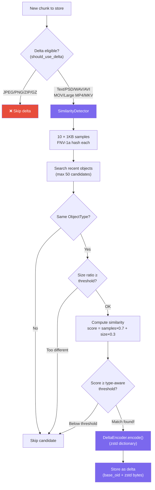
```mermaid
graph TD
    A["New chunk to store"] --> B{"Delta eligible?<br/>(should_use_delta)"}
    B -->|"JPEG/PNG/ZIP/GZ"| C["❌ Skip delta"]
    B -->|"Text/PSD/WAV/AVI<br/>MOV/Large MP4/MKV"| D["SimilarityDetector"]
    D --> E["10 × 1KB samples<br/>FNV-1a hash each"]
    E --> F["Search recent objects<br/>(max 50 candidates)"]
    F --> G{"Same ObjectType?"}
    G -->|No| H["Skip candidate"]
    G -->|Yes| I{"Size ratio ≥<br/>threshold?"}
    I -->|"Too different"| H
    I -->|OK| J["Compute similarity<br/>score = samples×0.7 + size×0.3"]
    J --> K{"Score ≥ type-aware<br/>threshold?"}
    K -->|"Below threshold"| H
    K -->|"Match found!"| L["DeltaEncoder.encode()<br/>(zstd dictionary)"]
    L --> M["Store as delta<br/>(base_oid + zstd bytes)"]

    style D fill:#7B68EE,color:#fff
    style L fill:#7B68EE,color:#fff
    style M fill:#7B68EE,color:#fff
    style C fill:#e74c3c,color:#fff
```

**Sampling**: 10 evenly-distributed 1 KB samples per object, FNV-1a hashed.

**Score formula**: `similarity = (sample_matches/total × 0.7) + (size_ratio × 0.3)`

#### Type-Aware Similarity Thresholds

| File Type | Threshold | Rationale |
|-----------|-----------|-----------|
| Creative/PDF (AI, InDesign) | 0.15 | Embedded compressed streams shift boundaries |
| Office (DOCX, XLSX) | 0.20 | ZIP containers with shared structure |
| Video (MP4, MKV) | 0.50 | Metadata/timeline changes significant |
| Audio (WAV, MP3) | 0.65 | Medium structural similarity |
| Images (JPEG, PSD) | 0.70 | Perceptual similarity |
| 3D Models (FBX, Blend) | 0.70 | Geometric data similarity |
| Text/Code | 0.85 | Small changes matter |
| Config (JSON, YAML) | 0.95 | Near-exact matches preferred |
| Default | 0.30 | Conservative baseline |

#### Type-Aware Size Ratio Thresholds

| File Type | Threshold | Max Size Diff Allowed |
|-----------|-----------|----------------------|
| Creative/PDF | 0.50 | 50% |
| Office | 0.60 | 40% |
| Video | 0.70 | 30% |
| Default | 0.80 | 20% |

### Delta Eligibility (`should_use_delta`)

| Category | Eligible? | Condition |
|----------|-----------|-----------|
| Text/Code | ✅ Always | — |
| Uncompressed media (PSD, TIFF, WAV) | ✅ Always | — |
| Uncompressed video (AVI, MOV) | ✅ Always | — |
| Compressed video (MP4, MKV) | ✅ Conditional | File > 100 MB |
| PDF/Creative (AI, InDesign, PDF) | ✅ Conditional | File > 50 MB |
| 3D Text (OBJ, glTF, PLY, STL) | ✅ Always | — |
| 3D Binary (GLB, FBX, Blend, USD) | ✅ Conditional | File > 1 MB |
| Vector (EPS, SVG) | ✅ Always | — |
| Compressed images (JPEG, PNG) | ❌ Never | — |
| Archives (ZIP, GZ) | ❌ Never | — |
| Unknown | ✅ Conditional | File > 50 MB |

---

## Media Merge Strategies

**Crate**: `mediagit-media` · **Key file**: `strategy.rs` (619 lines)

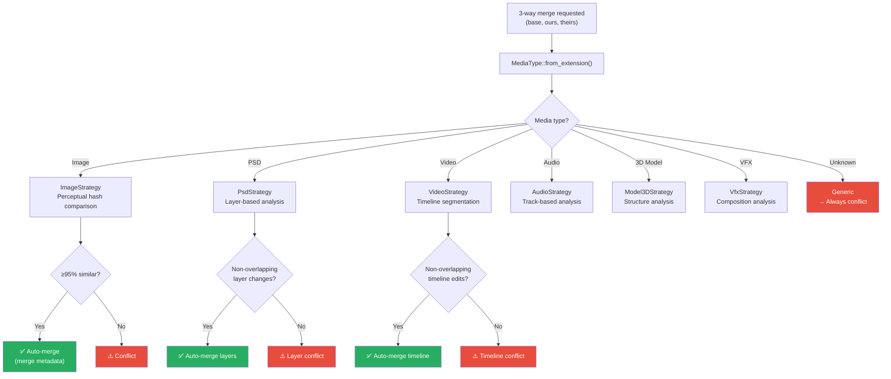
```mermaid
graph TD
    A["3-way merge requested<br/>(base, ours, theirs)"] --> B["MediaType::from_extension()"]
    B --> C{"Media type?"}
    C -->|Image| D["ImageStrategy<br/>Perceptual hash comparison"]
    C -->|PSD| E["PsdStrategy<br/>Layer-based analysis"]
    C -->|Video| F["VideoStrategy<br/>Timeline segmentation"]
    C -->|Audio| G["AudioStrategy<br/>Track-based analysis"]
    C -->|"3D Model"| H["Model3DStrategy<br/>Structure analysis"]
    C -->|VFX| I["VfxStrategy<br/>Composition analysis"]
    C -->|Unknown| J["Generic<br/>→ Always conflict"]

    D --> K{"≥95% similar?"}
    K -->|Yes| L["✅ Auto-merge<br/>(merge metadata)"]
    K -->|No| M["⚠️ Conflict"]

    E --> N{"Non-overlapping<br/>layer changes?"}
    N -->|Yes| O["✅ Auto-merge layers"]
    N -->|No| P["⚠️ Layer conflict"]

    F --> Q{"Non-overlapping<br/>timeline edits?"}
    Q -->|Yes| R["✅ Auto-merge timeline"]
    Q -->|No| S["⚠️ Timeline conflict"]

    style L fill:#27AE60,color:#fff
    style O fill:#27AE60,color:#fff
    style R fill:#27AE60,color:#fff
    style M fill:#e74c3c,color:#fff
    style P fill:#e74c3c,color:#fff
    style S fill:#e74c3c,color:#fff
    style J fill:#e74c3c,color:#fff
```

Six format-specific merge strategies with automatic conflict detection:

| Strategy | Formats | Auto-Merge Logic |
|----------|---------|------------------|
| **Image** | JPEG, PNG, TIFF, WebP, RAW, HEIC, EXR, AVIF | Perceptual hashing (95% threshold) + metadata merge (EXIF, IPTC, XMP) |
| **PSD** | PSD, PSB, XCF, KRA, ORA | Layer-based: auto-merge non-overlapping layer changes |
| **Video** | MP4, MOV, AVI, MKV, WebM, MXF, R3D, BRAW | Timeline-based: auto-merge non-overlapping segments |
| **Audio** | MP3, WAV, FLAC, AAC, OGG, MIDI | Track-based: auto-merge non-overlapping track changes |
| **3D Model** | OBJ, FBX, glTF/GLB, STL, USD, Alembic, Blender | Structure analysis (always flags for manual review) |
| **VFX** | Adobe suite, DaVinci, Nuke, Figma, Sketch | Composition analysis (always flags for manual review) |
| **Generic** | Unknown formats | Always creates conflict |

---

## Staging & Index

**Crate**: `mediagit-versioning` · **Key file**: `index.rs` (296 lines)

### IndexEntry Fields
```rust
pub struct IndexEntry {
    pub path: PathBuf,      // Relative to repo root
    pub oid: Oid,           // BLAKE3 of staged content
    pub mode: u32,          // File permissions
    pub size: u64,          // File size in bytes
    pub mtime: Option<u64>, // Modification time (stat-cache)
}
```

### Stat-Cache Optimization
The `add` command uses a **size + mtime** stat-cache to skip unchanged files:
1. Build `HashMap<PathBuf, (size, mtime)>` from the current index
2. Compare file's current metadata against the index entry
3. If both match → skip (no re-hashing or re-chunking needed)
4. Backward-compatible: `mtime` defaults to `None` via `#[serde(default)]`

---

## Storage Backends

**Crate**: `mediagit-storage` · **Trait**: `StorageBackend` (async, Send + Sync)

| Backend | Module | Description |
|---------|--------|-------------|
| **Local** | `local.rs` | Filesystem-based (default) |
| **S3** | `s3.rs` | Amazon S3 (via `aws-sdk-s3`) |
| **Azure** | `azure.rs` | Azure Blob Storage |
| **GCS** | `gcs.rs` | Google Cloud Storage |
| **B2/Spaces** | `b2_spaces.rs` | Backblaze B2 / DigitalOcean Spaces |
| **MinIO** | `minio.rs` | S3-compatible (self-hosted) |
| **Mock** | `mock.rs` | In-memory backend for testing |

### Trait Methods
```rust
#[async_trait]
pub trait StorageBackend: Send + Sync + Debug {
    async fn get(&self, key: &str) -> Result<Vec<u8>>;
    async fn put(&self, key: &str, data: &[u8]) -> Result<()>;
    async fn exists(&self, key: &str) -> Result<bool>;
    async fn delete(&self, key: &str) -> Result<()>;
    async fn list_prefix(&self, prefix: &str) -> Result<Vec<String>>;
    // ... additional methods for streaming, size checks, etc.
}
```

---

## Server & Protocol

### HTTP Server

**Crate**: `mediagit-server` · **Framework**: Axum · **Port**: Configurable

#### Endpoints (25 repo routes + health + auth)

Handler fn names below are exactly as registered in `mediagit-server/src/lib.rs` (`handlers/` submodule). Routes that bind two methods (`objects/pack`, `chunks/:chunk_id`, `chunk-deltas/:chunk_id`, `manifests/:oid`) are shown as combined GET/PUT (or GET/POST) rows.

| Method | Path | Handler | Purpose |
|--------|------|---------|---------|
| GET | `/:repo/info/refs` | `get_refs` | List all refs |
| POST | `/:repo/refs/update` | `update_refs` | Update or delete refs |
| POST | `/:repo/objects/want` | `request_objects` | Request specific objects |
| GET / POST | `/:repo/objects/pack` | `download_pack` / `upload_pack` | Download / upload legacy object pack (streaming) |
| POST | `/:repo/chunks/check` | `check_chunks_exist` | Check which chunks exist |
| POST | `/:repo/chunks/upload-urls` | `presign_chunk_uploads` | Mint presigned PUT URLs for chunks |
| POST | `/:repo/chunks/download-urls` | `presign_chunk_downloads` | Mint presigned GET URLs for chunks |
| POST | `/:repo/chunks/complete` | `complete_chunk_uploads` | Confirm direct chunk uploads |
| POST | `/:repo/chunks/verify-integrity` | `verify_chunk_integrity` | Server-side fsck of stored chunks |
| POST | `/:repo/chunks/mpu/start` | `mpu_start` | Begin presigned multipart upload (S3/MinIO) |
| POST | `/:repo/chunks/mpu/complete` | `mpu_complete` | Complete multipart upload |
| POST | `/:repo/chunks/mpu/abort` | `mpu_abort` | Abort multipart upload |
| GET / PUT | `/:repo/chunks/:chunk_id` | `download_chunk` / `upload_chunk` | Proxy-fallback single-chunk download / upload |
| POST | `/:repo/chunks/locate` | `locate_chunks` | Resolve chunk IDs → pack id + byte offset/length |
| POST | `/:repo/chunk-deltas/check` | `check_chunk_deltas_exist` | Check chunk delta availability |
| GET / PUT | `/:repo/chunk-deltas/:chunk_id` | `download_chunk_delta` / `upload_chunk_delta` | Chunk delta sidecar transfer |
| GET / PUT | `/:repo/manifests/:oid` | `download_manifest` / `upload_manifest` | Chunk manifest transfer |
| POST | `/:repo/packs/complete` | `complete_pack` | Register a finalized cloud pack + its index (F6) |
| POST | `/:repo/packs/upload-urls` | `presign_pack_uploads` | Mint presigned PUT URLs for pack objects |
| PUT | `/:repo/packs/:pack_id` | `upload_pack_proxy` | Proxy-upload a pack when backend can't sign |
| POST | `/:repo/packs/presign-download-urls` | `presign_pack_downloads` | Mint presigned GET URLs for pack Range reads |
| POST | `/:repo/packs/rebuild-index` | `rebuild_pack_index` | Rebuild the server-side pack index |
| GET | `/:repo/files/*path` | `download_file_by_path` | Stream file by path from any ref |
| GET | `/:repo/tree/*path` | `list_tree` | List directory contents as JSON |
| GET | `/:repo/tree` | `list_tree_root` | List root tree contents |
| GET | `/health`, `/healthz` | `health_handler` | Health check (merged after middleware, bypasses auth + rate limiting) |
| — | `/auth/*` | Auth routes (`create_auth_router`) | Login, register, token refresh (only when auth enabled) |

#### Security Middleware Stack

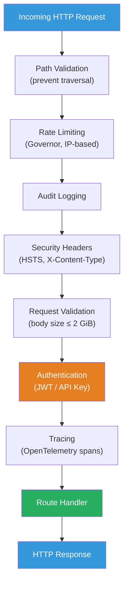
```mermaid
graph TD
    REQ["Incoming HTTP Request"] --> PV["Path Validation<br/>(prevent traversal)"]
    PV --> RL["Rate Limiting<br/>(Governor, IP-based)"]
    RL --> AU["Audit Logging"]
    AU --> SH["Security Headers<br/>(HSTS, X-Content-Type)"]
    SH --> RV["Request Validation<br/>(body size ≤ 2 GiB)"]
    RV --> AUTH["Authentication<br/>(JWT / API Key)"]
    AUTH --> TR["Tracing<br/>(OpenTelemetry spans)"]
    TR --> HANDLER["Route Handler"]
    HANDLER --> RES["HTTP Response"]

    style REQ fill:#3498db,color:#fff
    style AUTH fill:#e67e22,color:#fff
    style HANDLER fill:#27AE60,color:#fff
    style RES fill:#3498db,color:#fff
```

### Protocol Client

**Crate**: `mediagit-protocol`

- **Pack format**: Custom binary with streaming support
- **Chunk transfer**: Parallel upload/download of individual chunks (presigned-direct with proxy fallback)
- **Object negotiation**: Want/Have protocol for efficient sync
- **Streaming**: `StreamingPackWriter` + `StreamingPackReader` for memory-efficient transfers
- **Cloud packs**: client bundles many chunks into a few large pack objects (see below)

---

## Server-Enforced File Locking

**Crate**: `mediagit-server` · **Key file**: `locks.rs` · **CLI**: `crates/mediagit-cli/src/commands/lock.rs`

Path-based locks let a team reserve non-mergeable binary assets (e.g. a PSD or a level file) so two people don't clobber each other's work.

- **Keying**: locks are keyed by repo-relative path, not object id.
- **Storage**: the in-memory map on `AppState` is the hot-path source of truth; it's mirrored to `<repo>/.mediagit/locks.jsonl` (`{"v":1}` header, tmp+rename writes) purely so locks survive a server restart.
- **Enforcement point**: `check_push_locks` runs at push time. It walks the commits between the ref's old and new OID (`TreeDiffer`) to compute touched paths, then rejects the push if any touched path is locked by someone other than the pusher.
- **Identity**: the authenticated pusher's `user_id` is compared against the lock owner. On a no-auth server there's no provable identity at push time, so any touched, locked path always rejects the push.
- **CLI**: `mediagit lock create <path> [--owner <name>]`, `mediagit lock unlock <path>|--id <LOCK_ID> [--force]` (`--force` releases someone else's lock and requires `repo:admin`), `mediagit lock list [--json]`.
- **Env knobs**: `MEDIAGIT_LOCKS_ENFORCE=0` disables enforcement entirely; `MEDIAGIT_LOCKS_MAX_COMMITS` (default 1000) caps how many commits the touched-paths walk will traverse — exceeding it fails **open** (warns and allows the push) rather than stalling a large push on lock computation.

---

## Cloud Packs

**Crate**: `mediagit-versioning` · **Key files**: `streaming_pack.rs` (`StreamingPackWriter` / `StreamingPackReader`, `CloudPackResult`, `finalize_cloud()`, `PackKind::CloudObject`), `streaming_index.rs` (`StreamingPackIndex`, O(1) memory), `pack.rs`, `transaction.rs` (`PackTransaction`) · **Server**: `handlers/transfer.rs`, `chunks.rs`, `repo.rs`

Phase-3 **Track F** (shipped, F1–F11). Instead of uploading thousands of tiny per-chunk objects, the client **bundles chunks into pack objects** (cap **≤ 64 MiB / ≤ 1024 chunks**) with an **embedded index**, then uploads each pack as a single large cloud object. This collapses object counts dramatically (e.g. **10k objects → 100s**), which is the dominant cost on small-chunk repos against object storage.

**F8 integrity**: each pack slice carries a **compressed-hash** verification — the server (and `fsck`) re-hashes the stored compressed bytes per slice to detect corruption end-to-end.

### Cloud Pack Flow

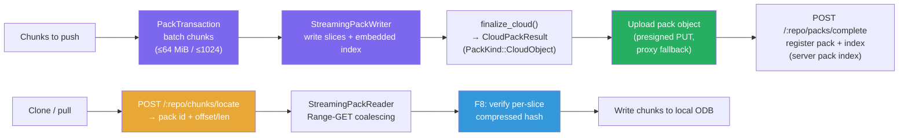
```mermaid
graph LR
    A["Chunks to push"] --> B["PackTransaction<br/>batch chunks<br/>(≤64 MiB / ≤1024)"]
    B --> C["StreamingPackWriter<br/>write slices + embedded index"]
    C --> D["finalize_cloud()<br/>→ CloudPackResult<br/>(PackKind::CloudObject)"]
    D --> E["Upload pack object<br/>(presigned PUT,<br/>proxy fallback)"]
    E --> F["POST /:repo/packs/complete<br/>register pack + index<br/>(server pack index)"]

    G["Clone / pull"] --> H["POST /:repo/chunks/locate<br/>→ pack id + offset/len"]
    H --> I["StreamingPackReader<br/>Range-GET coalescing"]
    I --> J["F8: verify per-slice<br/>compressed hash"]
    J --> K["Write chunks to local ODB"]

    style B fill:#7B68EE,color:#fff
    style C fill:#7B68EE,color:#fff
    style E fill:#27AE60,color:#fff
    style H fill:#E8A838,color:#fff
    style J fill:#3498db,color:#fff
```

Clone/pull never re-downloads whole packs: `locate_chunks` resolves each wanted chunk to its `(pack_id, offset, length)`, and the client issues coalesced HTTP **Range GETs** so only the needed byte ranges are fetched.

---

## Presigned Transfer

To avoid funneling all bytes through the server, transfers default to **presigned direct** access to object storage, with an **automatic proxy fallback** through the server when the backend cannot sign URLs.

- **Upload**: server mints presigned **PUT** URLs (`POST /:repo/packs/upload-urls`, `POST /:repo/chunks/upload-urls`). The client PUTs directly to backend object storage, bypassing the server. If a backend can't sign, the server returns a **null** entry for that key → the client falls back to **proxy upload** (`PUT /:repo/chunks/:id`, `PUT /:repo/packs/:pack_id`). Large chunks use presigned **multipart upload** (`/:repo/chunks/mpu/start|complete|abort`) on S3/MinIO.
- **Download**: server mints presigned **GET** URLs (`POST /:repo/chunks/download-urls`, `POST /:repo/packs/presign-download-urls`; handlers call `backend.presign_get`). The client GETs directly from the backend; on **404 or null** entry it automatically falls back to **proxy GET** through the server. Pack-mode pull uses client-side Range-GET coalescing.
- **Signing capability**: S3, MinIO, and Azure sign natively. **GCS requires a service-account key**; under ADC `authorized_user` credentials there is no private key, so presign returns null and the proxy path is always used.

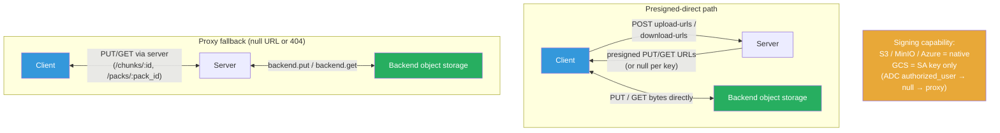
```mermaid
flowchart TD
    subgraph Direct["Presigned-direct path"]
        C1["Client"] -->|"POST upload-urls /<br/>download-urls"| S1["Server"]
        S1 -->|"presigned PUT/GET URLs<br/>(or null per key)"| C1
        C1 <-->|"PUT / GET bytes directly"| BE1["Backend object storage"]
    end

    subgraph Proxy["Proxy fallback (null URL or 404)"]
        C2["Client"] <-->|"PUT/GET via server<br/>(/chunks/:id, /packs/:pack_id)"| S2["Server"]
        S2 <-->|"backend.put / backend.get"| BE2["Backend object storage"]
    end

    SC["Signing capability:<br/>S3 / MinIO / Azure = native<br/>GCS = SA key only<br/>(ADC authorized_user → null → proxy)"]

    style C1 fill:#3498db,color:#fff
    style C2 fill:#3498db,color:#fff
    style BE1 fill:#27AE60,color:#fff
    style BE2 fill:#27AE60,color:#fff
    style SC fill:#E8A838,color:#fff
```

---

## Security

**Crate**: `mediagit-security`

| Module | Files | Purpose |
|--------|-------|---------|
| **Encryption** | `encryption.rs`, `envelope.rs` | XAES-256-GCM primitives + the `MGEN` v2 object envelope. Wired into `SmartCompressor`. Key management (`mediagit key init/status/recover/rotate-master`; passphrase+Argon2id, OS keychain, or keyfile-env). Push and clone work via key escrow (DC-7 D4): the client hands its repo key to the server, which wraps it under a server master key in `<repo>/.mediagit/key.json`. Encryption is enabled at creation only — `key init` refuses on a repository that already holds objects |
| **KDF** | `kdf.rs` | Key derivation (Argon2/PBKDF2) |
| **Auth** | `auth/jwt.rs`, `auth/apikey.rs`, `auth/credentials.rs` | JWT tokens + API keys |
| **Middleware** | `auth/middleware.rs` | Axum auth extraction |
| **Handlers** | `auth/handlers.rs` | Login, register, token refresh |
| **User** | `auth/user.rs` | User model and permissions |
| **TLS** | `tls/cert.rs`, `tls/config.rs` | Certificate management |
| **Audit** | `audit.rs` | Security event logging |

### Path-Traversal Hardening

`validate_object_key()` (`crates/mediagit-storage/src/lib.rs:651-694`) is the single choke point every `StorageBackend` implementation and wrapper (`NamespacedBackend`, `local::LocalBackend`) must call before turning a caller-supplied key into a filesystem path or remote object key. It rejects absolute paths, Windows drive/UNC prefixes, and `..`/`..\` traversal components (normalizing backslashes first so the check is platform-independent) — without it, a user-controlled chunk/pack id containing `..` could escape the repo's storage root or, once namespaced, escape into another tenant's namespace. Server handlers add a second layer of hex-id guards on untrusted path segments (e.g. `crates/mediagit-server/src/handlers/chunks.rs:507,517` reject any `chunk_id`/delta-base header that isn't exactly 64 hex characters) before those ids ever reach the storage layer.

---

## Authentication & Authorization

**Crate**: `mediagit-security` (JWT/API keys) · **Server**: `crates/mediagit-server/src/handlers/mod.rs`

- **Bootstrap**: `mediagit-server init --enable-auth` wizard writes the server config, generates a random JWT secret, and creates the first admin in one step (offline equivalent: `mediagit-server admin create`). `enable_auth` is OFF by default, matching the product default.
- **Roles**: `Read`, `Write`, `Admin` (wire form capitalized, e.g. `"Write"`). `Read` = `repo:read`; `Write` = `repo:read` + `repo:write` (self-registration default); `Admin` = all of the above + `repo:admin` + `user:manage` (the marker permission for admin-only routes).
- **Tokens**: JWT access tokens (HS256, 24h TTL, self-contained claims — a password change does **not** revoke existing tokens) + refresh tokens (30d); API keys (64 hex chars, id `ak_<32hex>`) as a long-lived alternative for machine clients, created/listed/revoked via `mediagit auth key`.
- **Persistence**: users, API keys, and per-repo grants are persisted to `users.jsonl` / `api_keys.jsonl` / `grants.jsonl` under `auth_store_dir`. Writes are atomic (tmp file + rename); each file starts with a `{"v":1}` version header, and a corrupt file is a **hard load-time error** — never silently dropped or reset.
- **Per-repo grants**: `GrantLevel` is ordered `Read < Write < Admin`. `check_permission()` (`crates/mediagit-server/src/handlers/mod.rs:69-119`) checks in order:
  1. Auth disabled → allow everything.
  2. No authenticated user → reject.
  3. Admin role (flat `user:manage` permission) → always allowed, regardless of grants.
  4. Zero-grants deployment or `MEDIAGIT_GRANTS_ENFORCE=0` → fall back to the flat role-permission check (pre-grants behavior).
  5. Otherwise, per-repo grant lookup: the user's grant level for the repo must be at or above the level implied by the required permission.
- **Admin routes**: `/auth/users`, `/auth/users/{id}/grants`, `/auth/keys` — user and grant management, gated on the admin role.
- **Env knobs**: `MEDIAGIT_AUTH_PERSIST` (enable disk persistence), `MEDIAGIT_GRANTS_ENFORCE` (`0` to disable per-repo grant checks and fall back to flat roles).

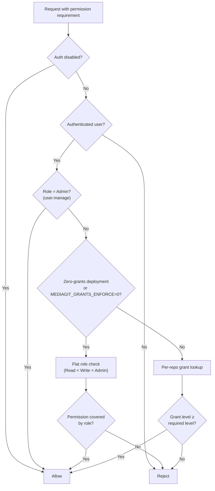
```mermaid
flowchart TD
    A["Request with permission requirement"] --> B{"Auth disabled?"}
    B -->|"Yes"| C["Allow"]
    B -->|"No"| D{"Authenticated user?"}
    D -->|"No"| E["Reject"]
    D -->|"Yes"| F{"Role = Admin?<br/>(user:manage)"}
    F -->|"Yes"| C
    F -->|"No"| G{"Zero-grants deployment<br/>or MEDIAGIT_GRANTS_ENFORCE=0?"}
    G -->|"Yes"| H["Flat role check<br/>(Read < Write < Admin)"]
    G -->|"No"| I["Per-repo grant lookup"]
    H --> J{"Permission covered<br/>by role?"}
    J -->|"Yes"| C
    J -->|"No"| E
    I --> K{"Grant level ≥<br/>required level?"}
    K -->|"Yes"| C
    K -->|"No"| E
```

### Client Credential Resolution

The CLI resolves a credential for a remote in this order, caching env/config
hits to the OS keychain after the first successful request:

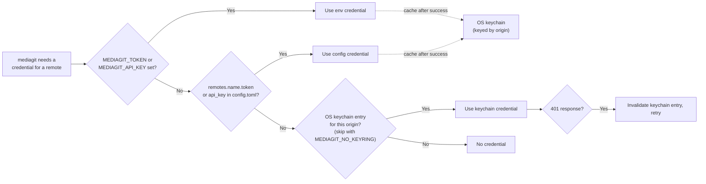
```mermaid
flowchart LR
    A["mediagit needs a<br/>credential for a remote"] --> B{"MEDIAGIT_TOKEN or<br/>MEDIAGIT_API_KEY set?"}
    B -->|"Yes"| C["Use env credential"]
    B -->|"No"| D{"remotes.name.token<br/>or api_key in config.toml?"}
    D -->|"Yes"| E["Use config credential"]
    D -->|"No"| F{"OS keychain entry<br/>for this origin?<br/>(skip with MEDIAGIT_NO_KEYRING)"}
    F -->|"Yes"| G["Use keychain credential"]
    F -->|"No"| H["No credential"]
    C -.->|"cache after success"| KC["OS keychain<br/>(keyed by origin)"]
    E -.->|"cache after success"| KC
    G --> I{"401 response?"}
    I -->|"Yes"| J["Invalidate keychain entry, retry"]
```

JWT (from `mediagit auth login`) and API keys (from `mediagit auth key
create`) are interchangeable at this layer — both resolve to a bearer
credential the server authenticates the same way.

---

## Data Flow

### `mediagit add <file>`

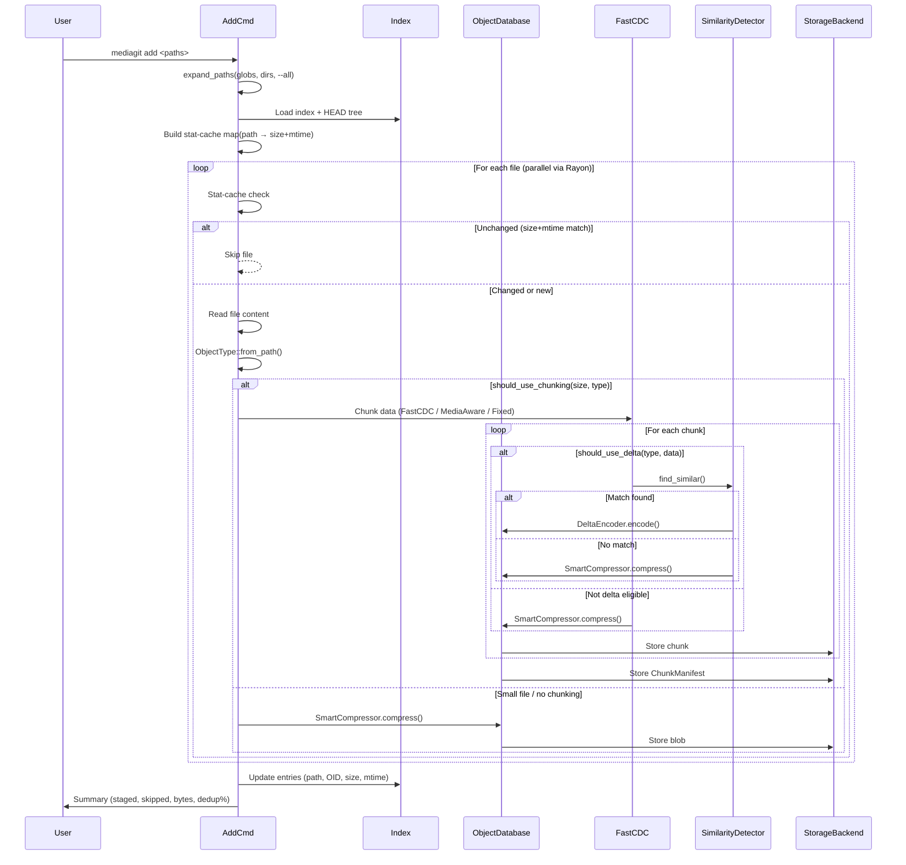
```mermaid
sequenceDiagram
    participant User
    participant CLI as AddCmd
    participant IDX as Index
    participant ODB as ObjectDatabase
    participant CDC as FastCDC
    participant SIM as SimilarityDetector
    participant BE as StorageBackend

    User->>CLI: mediagit add <paths>
    CLI->>CLI: expand_paths(globs, dirs, --all)
    CLI->>IDX: Load index + HEAD tree
    CLI->>CLI: Build stat-cache map(path → size+mtime)

    loop For each file (parallel via Rayon)
        CLI->>CLI: Stat-cache check
        alt Unchanged (size+mtime match)
            CLI-->>CLI: Skip file
        else Changed or new
            CLI->>CLI: Read file content
            CLI->>CLI: ObjectType::from_path()
            alt should_use_chunking(size, type)
                CLI->>CDC: Chunk data (FastCDC / MediaAware / Fixed)
                loop For each chunk
                    alt should_use_delta(type, data)
                        CDC->>SIM: find_similar()
                        alt Match found
                            SIM->>ODB: DeltaEncoder.encode()
                        else No match
                            SIM->>ODB: SmartCompressor.compress()
                        end
                    else Not delta eligible
                        CDC->>ODB: SmartCompressor.compress()
                    end
                    ODB->>BE: Store chunk
                end
                ODB->>BE: Store ChunkManifest
            else Small file / no chunking
                CLI->>ODB: SmartCompressor.compress()
                ODB->>BE: Store blob
            end
        end
    end

    CLI->>IDX: Update entries (path, OID, size, mtime)
    CLI->>User: Summary (staged, skipped, bytes, dedup%)
```

### `mediagit push`

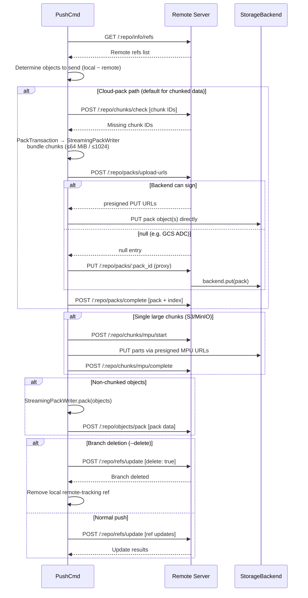
```mermaid
sequenceDiagram
    participant CLI as PushCmd
    participant Server as Remote Server
    participant BE as StorageBackend

    CLI->>Server: GET /:repo/info/refs
    Server-->>CLI: Remote refs list

    CLI->>CLI: Determine objects to send (local − remote)

    alt Cloud-pack path (default for chunked data)
        CLI->>Server: POST /:repo/chunks/check [chunk IDs]
        Server-->>CLI: Missing chunk IDs
        CLI->>CLI: PackTransaction → StreamingPackWriter<br/>bundle chunks (≤64 MiB / ≤1024)
        CLI->>Server: POST /:repo/packs/upload-urls
        alt Backend can sign
            Server-->>CLI: presigned PUT URLs
            CLI->>BE: PUT pack object(s) directly
        else null (e.g. GCS ADC)
            Server-->>CLI: null entry
            CLI->>Server: PUT /:repo/packs/:pack_id (proxy)
            Server->>BE: backend.put(pack)
        end
        CLI->>Server: POST /:repo/packs/complete [pack + index]
    end

    alt Single large chunks (S3/MinIO)
        CLI->>Server: POST /:repo/chunks/mpu/start
        CLI->>BE: PUT parts via presigned MPU URLs
        CLI->>Server: POST /:repo/chunks/mpu/complete
    end

    alt Non-chunked objects
        CLI->>CLI: StreamingPackWriter.pack(objects)
        CLI->>Server: POST /:repo/objects/pack [pack data]
    end

    alt Branch deletion (--delete)
        CLI->>Server: POST /:repo/refs/update [delete: true]
        Server-->>CLI: Branch deleted
        CLI->>CLI: Remove local remote-tracking ref
    else Normal push
        CLI->>Server: POST /:repo/refs/update [ref updates]
        Server-->>CLI: Update results
    end
```

### `mediagit clone`

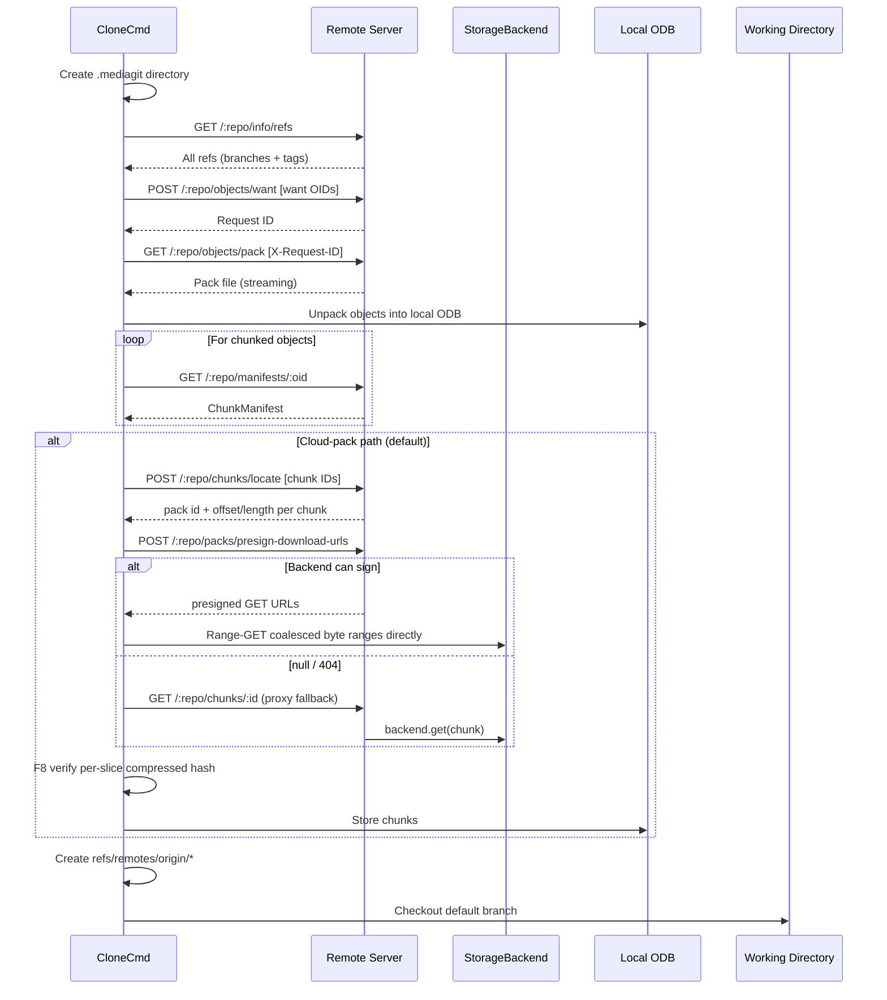
```mermaid
sequenceDiagram
    participant CLI as CloneCmd
    participant Server as Remote Server
    participant BE as StorageBackend
    participant ODB as Local ODB
    participant FS as Working Directory

    CLI->>CLI: Create .mediagit directory

    CLI->>Server: GET /:repo/info/refs
    Server-->>CLI: All refs (branches + tags)

    CLI->>Server: POST /:repo/objects/want [want OIDs]
    Server-->>CLI: Request ID

    CLI->>Server: GET /:repo/objects/pack [X-Request-ID]
    Server-->>CLI: Pack file (streaming)

    CLI->>ODB: Unpack objects into local ODB

    loop For chunked objects
        CLI->>Server: GET /:repo/manifests/:oid
        Server-->>CLI: ChunkManifest
    end

    alt Cloud-pack path (default)
        CLI->>Server: POST /:repo/chunks/locate [chunk IDs]
        Server-->>CLI: pack id + offset/length per chunk
        CLI->>Server: POST /:repo/packs/presign-download-urls
        alt Backend can sign
            Server-->>CLI: presigned GET URLs
            CLI->>BE: Range-GET coalesced byte ranges directly
        else null / 404
            CLI->>Server: GET /:repo/chunks/:id (proxy fallback)
            Server->>BE: backend.get(chunk)
        end
        CLI->>CLI: F8 verify per-slice compressed hash
        CLI->>ODB: Store chunks
    end

    CLI->>CLI: Create refs/remotes/origin/*
    CLI->>FS: Checkout default branch
```

---

## Garbage Collection (GC)

**Crate**: `mediagit-cli` · **Key file**: `commands/gc.rs`

GC uses a **mark-sweep** algorithm that handles three object types:

### GC Algorithm

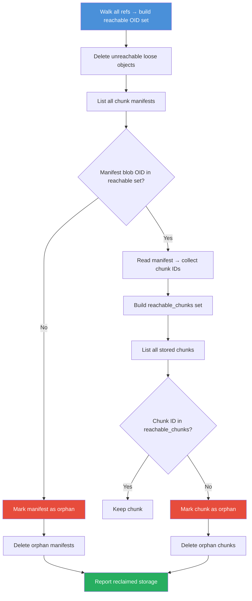
```mermaid
flowchart TD
    A["Walk all refs → build reachable OID set"] --> B["Delete unreachable loose objects"]
    B --> C["List all chunk manifests"]
    C --> D{"Manifest blob OID in reachable set?"}
    D -->|Yes| E["Read manifest → collect chunk IDs"]
    D -->|No| F["Mark manifest as orphan"]
    E --> G["Build reachable_chunks set"]
    G --> H["List all stored chunks"]
    H --> I{"Chunk ID in reachable_chunks?"}
    I -->|Yes| J["Keep chunk"]
    I -->|No| K["Mark chunk as orphan"]
    F --> L["Delete orphan manifests"]
    K --> M["Delete orphan chunks"]
    L --> N["Report reclaimed storage"]
    M --> N

    style A fill:#4A90D9,color:#fff
    style F fill:#e74c3c,color:#fff
    style K fill:#e74c3c,color:#fff
    style N fill:#27AE60,color:#fff
```

### GC Stats

| Metric | Description |
|--------|-------------|
| `objects_deleted` | Unreachable loose objects swept |
| `manifests_deleted` | Orphaned chunk manifests removed |
| `chunks_deleted` | Orphaned chunks removed |
| `bytes_reclaimed` | Total storage freed |

### Safety

- `--dry-run` mode reports what would be deleted without touching data
- Chunks are **content-addressed** — a chunk stays alive if ANY reachable manifest references it
- The `--aggressive` flag performs deeper sweeps and pack recompaction

---

## Reachability Bitmaps

**Crate**: `mediagit-versioning` · **Key file**: `bitmap.rs`

A Roaring-bitmap-backed reachability index that speeds up pack negotiation, `gc`, and `fsck` on large repos.

- **Purpose**: persists a commit's full object closure — everything `walk_reachable` would visit from it (commits/trees/blobs) — as a compact, versioned artifact under the `bitmaps/` storage namespace. When a valid bitmap exists for a commit tip, callers skip the BFS walk (one ODB read per object) entirely.
- **Correctness contract**: this is **derived data** — a pure speedup, never a correctness dependency. Any miss, staleness, corruption, or format-version mismatch silently falls back to `walk_reachable`; it must never error the caller. `gc` may prune bitmaps for commits no longer reachable, and a missing/stale bitmap is never treated as a corruption signal.
- **Format versioning**: `BITMAP_FORMAT_VERSION` is bumped whenever the on-disk format changes; readers reject any other version by falling back to BFS rather than erroring.
- **Env knob**: `MEDIAGIT_BITMAP` (default ON) — set to `0`/`false`/`off` to disable both generation and consumption; every caller then falls back to BFS.
- **Scope**: the id space is local to a single bitmap file (per-commit), not a global cross-commit numbering — sufficient for today's single-bitmap lookups; multi-bitmap set algebra (cheap AND/OR across commits) is future scope.

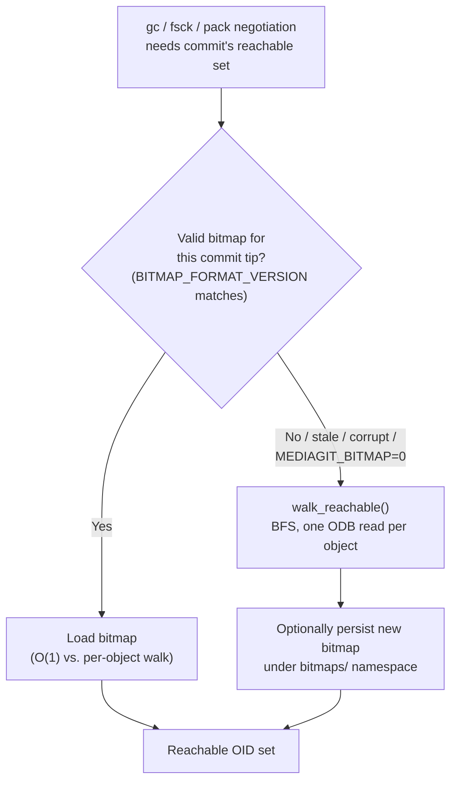
```mermaid
flowchart TD
    A["gc / fsck / pack negotiation<br/>needs commit's reachable set"] --> B{"Valid bitmap for<br/>this commit tip?<br/>(BITMAP_FORMAT_VERSION matches)"}
    B -->|"Yes"| C["Load bitmap<br/>(O(1) vs. per-object walk)"]
    B -->|"No / stale / corrupt /<br/>MEDIAGIT_BITMAP=0"| D["walk_reachable()<br/>BFS, one ODB read per object"]
    D --> E["Optionally persist new bitmap<br/>under bitmaps/ namespace"]
    C --> F["Reachable OID set"]
    E --> F
```

---

## Configuration

**File**: `.mediagit/config.toml`

```toml
[core]
compression = true          # Enable smart compression
chunk_strategy = "rolling"  # fixed | rolling | media_aware
delta_enabled = true        # Enable delta compression

[remote "origin"]
url = "http://localhost:3000"
push_url = ""               # Optional separate push URL
auth_method = "bearer"

[branch "main"]
remote = "origin"
merge = "refs/heads/main"
```

---

## Build & Distribution

- **MSRV**: Rust 1.97
- **License**: AGPL-3.0
- **Release profile**: `opt-level = 3`, LTO, `codegen-units = 1`
- **Distribution**: cargo-dist (v0.26.0) with GitHub CI
- **Installers**: Shell, PowerShell, Homebrew, MSI
- **Targets**: x86_64 + aarch64 for Linux, macOS, Windows

---

## Performance Benchmarks

See **[BENCHMARKS.md](BENCHMARKS.md)** for current storage-savings and cross-backend
throughput measurements, methodology, and reproduction steps — measured on the
v0.3.0-rc.4 tree (SCALE QA campaign, 220 gates, 0 failures, August 18 2026).
