# MediaGit Architecture

> **Media-first version control** built on Git semantics with intelligent compression,
> content-defined chunking, delta encoding, and media-aware merging.

---

## System Overview

```mermaid
graph TD
    subgraph CLI["mediagit-cli (32 commands)"]
        ADD["add"]
        COMMIT["commit"]
        PUSH["push"]
        PULL["pull"]
        CLONE["clone"]
        OTHER["27+ more..."]
    end

    subgraph Core["Core Libraries"]
        VER["mediagit-versioning<br/>ODB · Index · Refs<br/>Chunks · Delta · Packs"]
        COMP["mediagit-compression<br/>Zstd · Brotli · Zlib<br/>SmartCompressor"]
        MEDIA["mediagit-media<br/>Image · PSD · Video<br/>Audio · 3D · VFX"]
    end

    subgraph Infra["Infrastructure"]
        STORE["mediagit-storage<br/>Local · S3 · Azure<br/>GCS · B2 · MinIO"]
        SEC["mediagit-security<br/>AES-256-GCM · JWT<br/>TLS · Audit · KDF"]
        PROTO["mediagit-protocol<br/>Client · Packs<br/>Chunk Transfer"]
    end

    subgraph Support["Support"]
        CFG["mediagit-config"]
        OBS["mediagit-observability"]
        MET["mediagit-metrics"]
        GIT["mediagit-git"]
        MIG["mediagit-migration"]
        TEST["mediagit-test-utils"]
    end

    subgraph Server["mediagit-server"]
        AXUM["Axum REST API<br/>Auth · Rate Limit<br/>Security Middleware"]
    end

    CLI --> Core
    Core --> Infra
    Server --> Core
    Server --> Infra
    CLI --> Support
    Server --> Support
```



---

## Workspace Crates (14+)

| Crate | Role | Key Modules |
|-------|------|-------------|
| **mediagit-cli** | CLI binary (32 commands) | `commands/`, main entry |
| **mediagit-versioning** | Core VCS engine | ODB, index, refs, tree, commit, chunking, delta, similarity, packs, streaming |
| **mediagit-compression** | Smart compression | Zstd, Brotli, Zlib, Store; `SmartCompressor` with type+size awareness |
| **mediagit-media** | Media parsing & merging | Image, PSD, Video, Audio, 3D, VFX parsers & merge strategies |
| **mediagit-storage** | Storage abstraction | `StorageBackend` trait + 7 implementations |
| **mediagit-protocol** | Network protocol | Client, pack reader/writer, streaming pack, chunk transfer |
| **mediagit-server** | HTTP server | Axum routes, handlers, auth middleware, rate limiting, security |
| **mediagit-security** | Security layer | Encryption (AES-256-GCM), Auth (JWT + API keys), TLS, audit, KDF |
| **mediagit-config** | Configuration | TOML config file management |
| **mediagit-observability** | Logging/tracing | Structured tracing with env-filter |
| **mediagit-metrics** | Prometheus metrics | Operation stats, dedup ratios |
| **mediagit-git** | Git interop | Git repository integration |
| **mediagit-migration** | Migration tools | Git → MediaGit migration |
| **mediagit-test-utils** | Test utilities | Shared test helpers |

---

## CLI Commands (32)

### Core Workflow
| Command | Description |
|---------|-------------|
| `init` | Initialize a new `.mediagit` repository |
| `add` | Stage files with smart compression, chunking, delta encoding |
| `commit` | Create a commit from staged changes |
| `status` | Show working tree and index status |
| `log` | Display commit history |
| `diff` | Show differences between versions |
| `show` | Show object contents |

### Branching & History
| Command | Description |
|---------|-------------|
| `branch` | List, create, switch, or delete branches (supports remote branches via `-r`) |
| `merge` | Merge branches with media-aware strategies |
| `rebase` | Reapply commits on top of another base |
| `cherry-pick` | Apply specific commits to current branch |
| `tag` | Create, list, or delete tags |
| `stash` | Temporarily shelve changes |
| `bisect` | Binary search for bug-introducing commit |
| `reflog` | Show reference logs (when branch tips were updated) |

### Remote Operations
| Command | Description |
|---------|-------------|
| `clone` | Clone a repository (all branches) |
| `push` | Push commits and chunks to remote; supports `--delete` to remove remote branches |
| `pull` | Fetch and merge remote changes |
| `fetch` | Fetch all remote refs without merging |
| `remote` | Manage remote repositories |

### File & History Operations
| Command | Description |
|---------|-------------|
| `reset` | Unstage files or reset to a commit |
| `revert` | Create a new commit that undoes changes |

### Administration
| Command | Description |
|---------|-------------|
| `gc` | Garbage collection: sweep unreachable objects, orphaned chunks & manifests |
| `fsck` | Verify object database integrity |
| `verify` | Quick commit and signature verification |
| `stats` | Show repository statistics (storage, files, compression, dedup) |
| `completions` | Generate shell completions |
| `version` | Show version information |

### Git Integration
| Command | Description |
|---------|-------------|
| `install` | Install MediaGit filter driver for Git integration |
| `filter` | Git filter driver operations (clean/smudge) |
| `track` | Register file patterns for MediaGit tracking |
| `untrack` | Remove file patterns from MediaGit tracking |

---

## Object Database (ODB)

The ODB is the core storage engine (`mediagit-versioning/src/odb.rs`, 3,310 lines).

### Object Types
- **Blob** — File content (raw or chunked)
- **Tree** — Directory listing (path → OID mapping)
- **Commit** — Snapshot with parent, tree, author, message, timestamp
- **Tag** — Named pointer to any object

### Content-Addressable Storage
- **Hashing**: SHA-256 (via `sha2` crate)
- **Deduplication**: Identical content → same OID, stored once
- **LRU Cache**: Configurable in-memory cache for hot objects
- **Metrics**: Tracks reads, writes, cache hits, bytes saved

### ODB Write Pipeline


### Constants
| Constant | Value | Purpose |
|----------|-------|---------|
| `MAX_DELTA_DEPTH` | 10 | Max delta chain before re-storing as full object |
| `MAX_OBJECT_SIZE` | 16 GB | Prevents allocation failures from corrupt manifests |
| `LARGE_TEXT_THRESHOLD` | 500 MB | Switch from Brotli to Zstd for text files |

---

## Compression Engine

**Crate**: `mediagit-compression` · **Key file**: `smart_compressor.rs` (1,637 lines)

### Compression Strategy Selection

```mermaid
graph TD
    A["File Input"] --> B["ObjectType::from_path()"]
    B --> C{"Already compressed?"}
    C -->|"JPEG/PNG/GIF/WebP/AVIF/HEIC<br/>MP4/MOV/AVI/MKV/WebM<br/>MP3/AAC/OGG/Opus<br/>ZIP/GZ/7Z/RAR<br/>AI/InDesign<br/>DOCX/XLSX/PPTX"| D["💾 Store"]
    C -->|No| E{"File category?"}
    E -->|"TIFF/BMP/RAW/EXR/HDR<br/>WAV/AIFF/FLAC/ALAC"| F["🗜️ Zstd Best"]
    E -->|"Text/Code/JSON/XML<br/>YAML/TOML/CSV"| G{"Size > 500MB?"}
    G -->|No| H["📦 Brotli Default"]
    G -->|Yes| I["🗜️ Zstd Default<br/>(10x faster)"]
    E -->|"ML Data/Weights"| J["🗜️ Zstd Fast"]
    E -->|"ML Checkpoints"| K["🗜️ Zstd Fast"]
    E -->|"ML Inference/Deploy"| L["🗜️ Zstd Default"]
    E -->|"Creative Projects<br/>(PSD/AEP/Blender/...)"| M["🗜️ Zstd Default"]
    E -->|"Database (SQLite)"| N["🗜️ Zstd Default"]
    E -->|"TAR (uncompressed)"| O["🗜️ Zstd Default"]
    E -->|"Git Objects"| P["📋 Zlib Default"]
    E -->|"Unknown/Binary"| Q["🗜️ Zstd Default"]

    D --> R{"Compressed > Original?"}
    F --> R
    H --> R
    I --> R
    J --> R
    K --> R
    L --> R
    M --> R
    N --> R
    O --> R
    P --> R
    Q --> R
    R -->|Yes| S["Fallback → 💾 Store"]
    R -->|No| T["Use compressed"]

    style D fill:#95a5a6,color:#fff
    style F fill:#3498db,color:#fff
    style H fill:#9b59b6,color:#fff
    style I fill:#3498db,color:#fff
    style J fill:#3498db,color:#fff
    style K fill:#3498db,color:#fff
    style S fill:#e74c3c,color:#fff
```



### Type Classification (`ObjectType`)

60+ file types classified into categories:

| Category | Types | Strategy |
|----------|-------|----------|
| **Image (compressed)** | JPEG, PNG, GIF, WebP, AVIF, HEIC, GPU textures | **Store** |
| **Image (uncompressed)** | TIFF, BMP, RAW, EXR, HDR | **Zstd Best** |
| **Video** | MP4, MOV, AVI, MKV, WebM, FLV, WMV, MPG | **Store** |
| **Audio (compressed)** | MP3, AAC, OGG, Opus | **Store** |
| **Audio (uncompressed)** | FLAC, WAV, AIFF, ALAC | **Zstd Best** |
| **Text/Code** | 30+ extensions (rs, py, js, md, etc.) | **Brotli Default** (Zstd if >500MB) |
| **Archives** | ZIP, GZ, 7Z, RAR, Parquet | **Store** |
| **TAR** | Uncompressed containers | **Zstd Default** |
| **ML Data** | HDF5, NPY, TFRecords, etc. | **Zstd Fast** |
| **ML Checkpoints** | .pt, .pth, .ckpt, .bin | **Zstd Fast** |
| **ML Inference** | ONNX, GGUF, TFLite, etc. | **Zstd Default** |
| **Adobe PDF-based** | AI, InDesign | **Store** (internal compression) |
| **Creative Projects** | PSD, AEP, Blender, Maya, C4D, etc. | **Zstd Default** |
| **Office** | DOCX, XLSX, PPTX, ODP | **Store** (ZIP containers) |
| **Database** | SQLite | **Zstd Default** |
| **Git Objects** | Blob, Tree, Commit | **Zlib Default** |

### Compression Algorithms

| Algorithm | Levels | Use Case |
|-----------|--------|----------|
| **Zstd** | Fast (1), Default (3), Best (19) | General purpose, large files |
| **Brotli** | Default (9) | Text/structured data, best ratio |
| **Zlib** | Default (6) | Git object compatibility |
| **Store** | — | Already-compressed content |
| **Delta** | — | Similar file versions |

### Smart Fallback
If compression **expands** the data (common for embedded JPEGs in AI/PSD files),
`compress_with_strategy()` automatically falls back to Store mode with a `0x00` prefix byte.

### Decompression
Auto-detects algorithm from magic bytes:
- `0x00` → Store (strip prefix)
- `0x78` → Zlib
- `0x28 0xB5 0x2F 0xFD` → Zstd
- Other → Brotli

---

## Chunking Engine

**Crate**: `mediagit-versioning` · **Key file**: `chunking.rs` (1,945 lines)

### Chunking Strategy Decision

```mermaid
graph TD
    A["File ready for chunking"] --> B{"should_use_chunking<br/>(size, extension)?"}
    B -->|"Pre-compressed<br/>(JPEG/PNG/MP3/ZIP)"| C["❌ Never chunk"]
    B -->|"Text/ML Data/Video<br/>PSD/Creative/Office<br/>≥ 5MB"| D["✅ Chunk"]
    B -->|"3D Models/Audio<br/>Creative Projects<br/>≥ 10MB"| D
    B -->|"Unknown ≥ 10MB"| D
    D --> E{"Select strategy<br/>by file type"}
    E -->|"MP4/MOV/M4V/M4A/3GP"| F["🎬 MP4 Atom Parsing"]
    E -->|"AVI/RIFF/WAV"| G["🎬 RIFF Chunk Parsing"]
    E -->|"MKV/WebM/MKA/MK3D"| H["🎬 EBML Element Parsing"]
    E -->|"GLB/glTF"| I["🎬 GLB Binary Parsing"]
    E -->|"FBX (binary)"| J["🎬 FBX Node Parsing"]
    E -->|"OBJ/STL/PLY"| K["🎬 Text 3D Parsing"]
    E -->|"Text/Code/Data/ML<br/>Documents/Design<br/>3D Apps/Audio/MPEG"| L["✂️ FastCDC v2020<br/>(Rolling CDC)"]
    E -->|"JPEG/PNG/MP3/ZIP<br/>(if forced)"| M["📐 Fixed 4MB"]

    L --> N["fastcdc::v2020::FastCDC<br/>Gear table O(1)/byte"]
    F --> O["Chunk per atom<br/>(ftyp/moov/mdat)"]

    style L fill:#E8A838,color:#fff
    style N fill:#E8A838,color:#fff
    style F fill:#2ECC71,color:#fff
    style G fill:#2ECC71,color:#fff
    style H fill:#2ECC71,color:#fff
    style I fill:#2ECC71,color:#fff
    style J fill:#2ECC71,color:#fff
    style K fill:#2ECC71,color:#fff
    style C fill:#e74c3c,color:#fff
```



### FastCDC Integration

MediaGit uses the **`fastcdc` crate v3.2** (specifically `fastcdc::v2020`, the 2020 algorithm revision) for all content-defined chunking. FastCDC replaces traditional rolling hash with a **gear table-based hash** that achieves **O(1) boundary detection per byte** — approximately **10× faster** than Buzhash or Rabin fingerprint.

#### Two Modes of Operation

| Mode | API | Used In | When |
|------|-----|---------|------|
| **In-memory** | `fastcdc::v2020::FastCDC::new(data, min, avg, max)` | `chunk_rolling()` | Files loaded into memory (default path via `chunk_media_aware`) |
| **Streaming** | `fastcdc::v2020::StreamCDC::new(file, min, avg, max)` | `chunk_file_streaming()` | Large files streamed from disk (ODB streaming path) |

#### FastCDC Data Flow


#### Where FastCDC Is Dispatched

The `chunk_media_aware()` method dispatches to FastCDC (`chunk_rolling()`) for these format groups:

| Format Group | Extensions | Chunk Params |
|--------------|-----------|--------------|
| **Text/Code** | csv, tsv, json, xml, html, txt, md, rs, py, js, ts, go, java, c, cpp, yaml, sql, proto, ... | Adaptive by size |
| **ML Data** | parquet, arrow, feather, orc, avro, hdf5, h5, npy, npz, tfrecords, petastorm | Adaptive by size |
| **ML Models** | pt, pth, ckpt, pb, safetensors, bin, pkl, joblib | Adaptive by size |
| **ML Deployment** | onnx, gguf, ggml, tflite, mlmodel, coreml, keras, pte, mleap, pmml, llamafile | Adaptive by size |
| **Documents** | pdf, svg, eps, ai | Adaptive by size |
| **Design Tools** | fig, sketch, xd, indd, indt | Adaptive by size |
| **Lossless Audio** | flac, aiff, alac | Adaptive by size |
| **MPEG Streams** | mpg, mpeg, vob, mts, m2ts | Adaptive by size |
| **USD/Alembic** | usd, usda, usdc, usdz, abc | Adaptive by size |
| **3D Apps** | blend, max, ma, mb, c4d, hip, zpr, ztl | Adaptive by size |
| **Unknown** | All unrecognized extensions | Adaptive by size |

The `chunk_file_streaming()` method (ODB streaming path) also uses FastCDC's `StreamCDC` for streaming I/O on large files, reading directly from disk without loading the entire file into memory.

### Chunk Sizing (Adaptive)

The `get_chunk_params(file_size)` function selects FastCDC parameters:

| File Size | Avg Chunk | Min Chunk | Max Chunk |
|-----------|-----------|-----------|-----------|
| < 1 MB | 256 KB | 128 KB | 512 KB |
| 1–10 MB | 512 KB | 256 KB | 1 MB |
| 10–100 MB | 1 MB | 512 KB | 2 MB |
| 100 MB–1 GB | 2 MB | 1 MB | 4 MB |
| > 1 GB | 4 MB | 2 MB | 8 MB |

### Chunking Eligibility (`should_use_chunking`)

| Category | Min Size | Examples |
|----------|----------|---------|
| Text/Data | 5 MB | CSV, JSON, XML, YAML |
| ML Data | 5 MB | Parquet, HDF5, NPY, TFRecords |
| ML Models | 5 MB | .pt, .safetensors, ONNX, GGUF |
| Video | 5 MB | MP4, MKV, AVI, MOV |
| Uncompressed Images | 5 MB | PSD, TIFF, BMP, EXR |
| PDF/Creative | 5 MB | AI, InDesign, PDF, EPS |
| Creative Projects | 10 MB | AEP, Premiere, DaVinci |
| Lossless Audio | 10 MB | WAV, FLAC, AIFF |
| 3D Models | 10 MB | GLB, FBX, Blender, USD |
| Office | 5 MB | DOCX, XLSX, PPTX |
| Pre-compressed | **Never** | JPEG, PNG, MP3, ZIP |
| Unknown | 10 MB | Conservative default |

---

## Delta Compression

**Crate**: `mediagit-versioning` · **Key files**: `delta.rs` (446 lines), `similarity.rs` (541 lines)

### Delta Encoder
- **Algorithm**: Sliding-window pattern matching
- **Instructions**: `Copy { offset, length }` and `Insert(Vec<u8>)`
- **Serialization**: Custom varint-based binary format
- **Max chain depth**: 10 (then re-stored as full object)

### Similarity Detection

```mermaid
graph TD
    A["New chunk to store"] --> B{"Delta eligible?<br/>(should_use_delta)"}
    B -->|"JPEG/PNG/ZIP/GZ"| C["❌ Skip delta"]
    B -->|"Text/PSD/WAV/AVI<br/>MOV/Large MP4/MKV"| D["SimilarityDetector"]
    D --> E["10 × 1KB samples<br/>FNV-1a hash each"]
    E --> F["Search recent objects<br/>(max 50 candidates)"]
    F --> G{"Same ObjectType?"}
    G -->|No| H["Skip candidate"]
    G -->|Yes| I{"Size ratio ≥<br/>threshold?"}
    I -->|"Too different"| H
    I -->|OK| J["Compute similarity<br/>score = samples×0.7 + size×0.3"]
    J --> K{"Score ≥ type-aware<br/>threshold?"}
    K -->|"Below threshold"| H
    K -->|"Match found!"| L["DeltaEncoder.encode()<br/>(sliding window)"]
    L --> M["Store as delta<br/>(base_oid + instructions)"]

    style D fill:#7B68EE,color:#fff
    style L fill:#7B68EE,color:#fff
    style M fill:#7B68EE,color:#fff
    style C fill:#e74c3c,color:#fff
```



**Sampling**: 10 evenly-distributed 1 KB samples per object, FNV-1a hashed.

**Score formula**: `similarity = (sample_matches/total × 0.7) + (size_ratio × 0.3)`

#### Type-Aware Similarity Thresholds

| File Type | Threshold | Rationale |
|-----------|-----------|-----------|
| Creative/PDF (AI, InDesign) | 0.15 | Embedded compressed streams shift boundaries |
| Office (DOCX, XLSX) | 0.20 | ZIP containers with shared structure |
| Video (MP4, MKV) | 0.50 | Metadata/timeline changes significant |
| Audio (WAV, MP3) | 0.65 | Medium structural similarity |
| Images (JPEG, PSD) | 0.70 | Perceptual similarity |
| 3D Models (FBX, Blend) | 0.70 | Geometric data similarity |
| Text/Code | 0.85 | Small changes matter |
| Config (JSON, YAML) | 0.95 | Near-exact matches preferred |
| Default | 0.30 | Conservative baseline |

#### Type-Aware Size Ratio Thresholds

| File Type | Threshold | Max Size Diff Allowed |
|-----------|-----------|----------------------|
| Creative/PDF | 0.50 | 50% |
| Office | 0.60 | 40% |
| Video | 0.70 | 30% |
| Default | 0.80 | 20% |

### Delta Eligibility (`should_use_delta`)

| Category | Eligible? | Condition |
|----------|-----------|-----------|
| Text/Code | ✅ Always | — |
| Uncompressed media (PSD, TIFF, WAV) | ✅ Always | — |
| Uncompressed video (AVI, MOV) | ✅ Always | — |
| Compressed video (MP4, MKV) | ✅ Conditional | File > 100 MB |
| Compressed images (JPEG, PNG) | ❌ Never | — |
| Archives (ZIP, GZ) | ❌ Never | — |
| Unknown | ✅ Conditional | File > 50 MB |

---

## Media Merge Strategies

**Crate**: `mediagit-media` · **Key file**: `strategy.rs` (596 lines)

```mermaid
graph TD
    A["3-way merge requested<br/>(base, ours, theirs)"] --> B["MediaType::from_extension()"]
    B --> C{"Media type?"}
    C -->|Image| D["ImageStrategy<br/>Perceptual hash comparison"]
    C -->|PSD| E["PsdStrategy<br/>Layer-based analysis"]
    C -->|Video| F["VideoStrategy<br/>Timeline segmentation"]
    C -->|Audio| G["AudioStrategy<br/>Track-based analysis"]
    C -->|"3D Model"| H["Model3DStrategy<br/>Structure analysis"]
    C -->|VFX| I["VfxStrategy<br/>Composition analysis"]
    C -->|Unknown| J["Generic<br/>→ Always conflict"]

    D --> K{"≥95% similar?"}
    K -->|Yes| L["✅ Auto-merge<br/>(merge metadata)"]
    K -->|No| M["⚠️ Conflict"]

    E --> N{"Non-overlapping<br/>layer changes?"}
    N -->|Yes| O["✅ Auto-merge layers"]
    N -->|No| P["⚠️ Layer conflict"]

    F --> Q{"Non-overlapping<br/>timeline edits?"}
    Q -->|Yes| R["✅ Auto-merge timeline"]
    Q -->|No| S["⚠️ Timeline conflict"]

    style L fill:#27AE60,color:#fff
    style O fill:#27AE60,color:#fff
    style R fill:#27AE60,color:#fff
    style M fill:#e74c3c,color:#fff
    style P fill:#e74c3c,color:#fff
    style S fill:#e74c3c,color:#fff
    style J fill:#e74c3c,color:#fff
```



Six format-specific merge strategies with automatic conflict detection:

| Strategy | Formats | Auto-Merge Logic |
|----------|---------|------------------|
| **Image** | JPEG, PNG, TIFF, WebP, RAW, HEIC, EXR, AVIF | Perceptual hashing (95% threshold) + metadata merge (EXIF, IPTC, XMP) |
| **PSD** | PSD, PSB, XCF, KRA, ORA | Layer-based: auto-merge non-overlapping layer changes |
| **Video** | MP4, MOV, AVI, MKV, WebM, MXF, R3D, BRAW | Timeline-based: auto-merge non-overlapping segments |
| **Audio** | MP3, WAV, FLAC, AAC, OGG, MIDI | Track-based: auto-merge non-overlapping track changes |
| **3D Model** | OBJ, FBX, glTF/GLB, STL, USD, Alembic, Blender | Structure analysis (always flags for manual review) |
| **VFX** | Adobe suite, DaVinci, Nuke, Figma, Sketch | Composition analysis (always flags for manual review) |
| **Generic** | Unknown formats | Always creates conflict |

---

## Staging & Index

**Crate**: `mediagit-versioning` · **Key file**: `index.rs` (269 lines)

### IndexEntry Fields
```rust
pub struct IndexEntry {
    pub path: PathBuf,      // Relative to repo root
    pub oid: Oid,           // SHA-256 of staged content
    pub mode: u32,          // File permissions
    pub size: u64,          // File size in bytes
    pub mtime: Option<u64>, // Modification time (stat-cache)
}
```

### Stat-Cache Optimization
The `add` command uses a **size + mtime** stat-cache to skip unchanged files:
1. Build `HashMap<PathBuf, (size, mtime)>` from the current index
2. Compare file's current metadata against the index entry
3. If both match → skip (no re-hashing or re-chunking needed)
4. Backward-compatible: `mtime` defaults to `None` via `#[serde(default)]`

---

## Storage Backends

**Crate**: `mediagit-storage` · **Trait**: `StorageBackend` (async, Send + Sync)

| Backend | Module | Description |
|---------|--------|-------------|
| **Local** | `local.rs` | Filesystem-based (default) |
| **S3** | `s3.rs` | Amazon S3 (via `aws-sdk-s3`) |
| **Azure** | `azure.rs` | Azure Blob Storage |
| **GCS** | `gcs.rs` | Google Cloud Storage |
| **B2/Spaces** | `b2_spaces.rs` | Backblaze B2 / DigitalOcean Spaces |
| **MinIO** | `minio.rs` | S3-compatible (self-hosted) |
| **Mock** | `mock.rs` | In-memory backend for testing |

### Trait Methods
```rust
#[async_trait]
pub trait StorageBackend: Send + Sync + Debug {
    async fn get(&self, key: &str) -> Result<Vec<u8>>;
    async fn put(&self, key: &str, data: &[u8]) -> Result<()>;
    async fn exists(&self, key: &str) -> Result<bool>;
    async fn delete(&self, key: &str) -> Result<()>;
    async fn list_prefix(&self, prefix: &str) -> Result<Vec<String>>;
    // ... additional methods for streaming, size checks, etc.
}
```

---

## Server & Protocol

### HTTP Server

**Crate**: `mediagit-server` · **Framework**: Axum · **Port**: Configurable

#### Endpoints (11 routes)

| Method | Path | Handler | Purpose |
|--------|------|---------|---------|
| GET | `/:repo/info/refs` | `get_refs` | List all refs |
| POST | `/:repo/refs/update` | `update_refs` | Update or delete refs |
| POST | `/:repo/objects/want` | `request_objects` | Request specific objects |
| GET | `/:repo/objects/pack` | `download_pack` | Download pack file |
| POST | `/:repo/objects/pack` | `upload_pack` | Upload pack file |
| POST | `/:repo/chunks/check` | `check_chunks_exist` | Check which chunks exist |
| PUT | `/:repo/chunks/:chunk_id` | `upload_chunk` | Upload a single chunk |
| PUT | `/:repo/manifests/:oid` | `upload_manifest` | Upload chunk manifest |
| GET | `/:repo/chunks/:chunk_id` | `download_chunk` | Download a single chunk |
| GET | `/:repo/manifests/:oid` | `download_manifest` | Download chunk manifest |
| — | `/auth/*` | Auth routes | Login, register, token refresh |

#### Security Middleware Stack


### Protocol Client

**Crate**: `mediagit-protocol`

- **Pack format**: Custom binary with streaming support
- **Chunk transfer**: Parallel upload/download of individual chunks
- **Object negotiation**: Want/Have protocol for efficient sync
- **Streaming**: `StreamingPackWriter` + `StreamingPackReader` for memory-efficient transfers

---

## Security

**Crate**: `mediagit-security`

| Module | Files | Purpose |
|--------|-------|---------|
| **Encryption** | `encryption.rs` | AES-256-GCM at-rest encryption |
| **KDF** | `kdf.rs` | Key derivation (Argon2/PBKDF2) |
| **Auth** | `auth/jwt.rs`, `auth/apikey.rs`, `auth/credentials.rs` | JWT tokens + API keys |
| **Middleware** | `auth/middleware.rs` | Axum auth extraction |
| **Handlers** | `auth/handlers.rs` | Login, register, token refresh |
| **User** | `auth/user.rs` | User model and permissions |
| **TLS** | `tls/cert.rs`, `tls/config.rs` | Certificate management |
| **Audit** | `audit.rs` | Security event logging |

---

## Data Flow

```mermaid
sequenceDiagram
    participant User
    participant CLI as AddCmd
    participant IDX as Index
    participant ODB as ObjectDatabase
    participant CDC as FastCDC
    participant SIM as SimilarityDetector
    participant BE as StorageBackend

    User->>CLI: mediagit add <paths>
    CLI->>CLI: expand_paths(globs, dirs, --all)
    CLI->>IDX: Load index + HEAD tree
    CLI->>CLI: Build stat-cache map(path → size+mtime)

    loop For each file (parallel via Rayon)
        CLI->>CLI: Stat-cache check
        alt Unchanged (size+mtime match)
            CLI-->>CLI: Skip file
        else Changed or new
            CLI->>CLI: Read file content
            CLI->>CLI: ObjectType::from_path()
            alt should_use_chunking(size, type)
                CLI->>CDC: Chunk data (FastCDC / MediaAware / Fixed)
                loop For each chunk
                    alt should_use_delta(type, data)
                        CDC->>SIM: find_similar()
                        alt Match found
                            SIM->>ODB: DeltaEncoder.encode()
                        else No match
                            SIM->>ODB: SmartCompressor.compress()
                        end
                    else Not delta eligible
                        CDC->>ODB: SmartCompressor.compress()
                    end
                    ODB->>BE: Store chunk
                end
                ODB->>BE: Store ChunkManifest
            else Small file / no chunking
                CLI->>ODB: SmartCompressor.compress()
                ODB->>BE: Store blob
            end
        end
    end

    CLI->>IDX: Update entries (path, OID, size, mtime)
    CLI->>User: Summary (staged, skipped, bytes, dedup%)
```

### `mediagit add <file>`



### `mediagit push`

```mermaid
sequenceDiagram
    participant CLI as PushCmd
    participant Server as Remote Server
    participant BE as StorageBackend

    CLI->>Server: GET /:repo/info/refs
    Server-->>CLI: Remote refs list

    CLI->>CLI: Determine objects to send (local − remote)

    alt Chunked objects
        CLI->>Server: POST /:repo/chunks/check [chunk IDs]
        Server-->>CLI: Missing chunk IDs
        loop For each missing chunk
            CLI->>Server: PUT /:repo/chunks/:id [data]
        end
        CLI->>Server: PUT /:repo/manifests/:oid [manifest]
    end

    alt Non-chunked objects
        CLI->>CLI: StreamingPackWriter.pack(objects)
        CLI->>Server: POST /:repo/objects/pack [pack data]
    end

    alt Branch deletion (--delete)
        CLI->>Server: POST /:repo/refs/update [delete: true]
        Server-->>CLI: Branch deleted
        CLI->>CLI: Remove local remote-tracking ref
    else Normal push
        CLI->>Server: POST /:repo/refs/update [ref updates]
        Server-->>CLI: Update results
    end
```



### `mediagit clone`


---

## Garbage Collection (GC)

**Crate**: `mediagit-cli` · **Key file**: `commands/gc.rs`

GC uses a **mark-sweep** algorithm that handles three object types:

### GC Algorithm


### GC Stats

| Metric | Description |
|--------|-------------|
| `objects_deleted` | Unreachable loose objects swept |
| `manifests_deleted` | Orphaned chunk manifests removed |
| `chunks_deleted` | Orphaned chunks removed |
| `bytes_reclaimed` | Total storage freed |

### Safety

- `--dry-run` mode reports what would be deleted without touching data
- Chunks are **content-addressed** — a chunk stays alive if ANY reachable manifest references it
- The `--aggressive` flag performs deeper sweeps and pack recompaction

---

## Configuration

**File**: `.mediagit/config.toml`

```toml
[core]
compression = true          # Enable smart compression
chunk_strategy = "rolling"  # fixed | rolling | media_aware
delta_enabled = true        # Enable delta compression

[remote "origin"]
url = "http://localhost:3000"
push_url = ""               # Optional separate push URL
auth_method = "bearer"

[branch "main"]
remote = "origin"
merge = "refs/heads/main"
```

---

## Build & Distribution

- **MSRV**: Rust 1.91.0
- **License**: AGPL-3.0
- **Release profile**: `opt-level = 3`, LTO, `codegen-units = 1`
- **Distribution**: cargo-dist (v0.26.0) with GitHub CI
- **Installers**: Shell, PowerShell, Homebrew, MSI
- **Targets**: x86_64 + aarch64 for Linux, macOS, Windows
