# MediaGit-Core Complete Architecture Reference

> **High-performance Git-like version control optimized for large media files and binary assets**

MediaGit is a Rust-based workspace with **14 specialized crates**, **28 CLI commands**, **100+ file formats**, and cloud-native storage backends.

---

## System Architecture

```mermaid
flowchart TD
    subgraph Interface["🖥️ Interface Layer"]
        CLI["mediagit-cli<br/>28 Commands"]
        SERVER["mediagit-server<br/>Axum HTTP/HTTPS"]
    end
    
    subgraph Protocol["🔄 Protocol Layer"]
        PROTO["mediagit-protocol<br/>Pack/Fetch/Push"]
    end
    
    subgraph Core["⚙️ Core Engine"]
        VERSIONING["mediagit-versioning<br/>ODB • Branch • Merge"]
        COMPRESSION["mediagit-compression<br/>Zstd • Brotli • Delta"]
        MEDIA["mediagit-media<br/>PSD • Video • Audio • 3D"]
        GIT["mediagit-git<br/>Git Interop"]
    end
    
    subgraph Infra["💾 Infrastructure"]
        STORAGE["mediagit-storage<br/>7 Backends"]
        CONFIG["mediagit-config"]
        SECURITY["mediagit-security<br/>Auth • Encryption • TLS"]
    end
    
    subgraph Observe["📊 Observability"]
        OBS["mediagit-observability"]
        METRICS["mediagit-metrics"]
        MIGRATION["mediagit-migration"]
    end
    
    subgraph Cloud["☁️ Cloud Backends"]
        S3[(AWS S3)]
        AZURE[(Azure Blob)]
        GCS[(GCS)]
        MINIO[(MinIO)]
        B2[(Backblaze)]
        DO[(DO Spaces)]
        LOCAL[(Local FS)]
    end
    
    CLI --> VERSIONING & COMPRESSION & MEDIA & GIT & PROTO & CONFIG & OBS & STORAGE
    SERVER --> PROTO & VERSIONING & STORAGE & CONFIG & SECURITY
    PROTO --> VERSIONING & STORAGE
    VERSIONING --> STORAGE & COMPRESSION
    METRICS --> OBS
    MIGRATION --> STORAGE
    STORAGE --> S3 & AZURE & GCS & MINIO & B2 & DO & LOCAL
```

---

## Crate Dependency Graph

---

## Complete Crate Reference

### Interface Layer

| Crate | Lines | Purpose | Key Modules |
|-------|-------|---------|-------------|
| **mediagit-cli** | 28 cmds | CLI application | `add`, `commit`, `push`, `pull`, `clone`, `branch`, `merge`, `rebase`, `cherry-pick`, `stash`, `tag`, `bisect`, `gc`, `fsck`, `verify`, `stats`, `remote`, `fetch`, `diff`, `log`, `show`, `status`, `init`, `install`, `filter`, `track` |
| **mediagit-server** | 7 modules | HTTP server | `handlers` (12 endpoints), `auth_routes`, `security`, `config`, `state` |

### Protocol Layer

| Crate | Purpose | Key Components |
|-------|---------|----------------|
| **mediagit-protocol** | Network sync | `client` (pack uploads/downloads), `streaming` (chunk transfer), `types` (RefInfo, WantRequest) |

### Core Engine Layer

| Crate | Lines | Purpose | Key Modules |
|-------|-------|---------|-------------|
| **mediagit-versioning** | 22 modules | Object database & VCS | `odb` (2705), `chunking` (2000), `branch`, `merge`, `refs`, `index`, `pack`, `delta`, `conflict` (685), `checkout`, `similarity`, `lca`, `tree`, `commit`, `fsck` |
| **mediagit-compression** | 10 modules | Smart compression | `smart_compressor` (1550, 60+ types), `adaptive`, `delta`, `per_type`, `zstd`, `brotli`, `zlib` |
| **mediagit-media** | 10 modules | Media intelligence | `psd`, `video`, `audio`, `image`, `model3d`, `vfx`, `phash`, `strategy` |
| **mediagit-git** | 4 modules | Git interop | `filter`, `pointer` |

### Infrastructure Layer

| Crate | Lines | Purpose | Key Modules |
|-------|-------|---------|-------------|
| **mediagit-storage** | 8 backends | Storage abstraction | `s3`, `azure`, `gcs`, `minio`, `b2_spaces`, `local`, `cache`, `mock` |
| **mediagit-config** | 931 | Configuration | `schema` (storage, remotes, branches, protection) |
| **mediagit-security** | 12 modules | Security | `auth/` (jwt, apikey, credentials, middleware), `encryption`, `kdf`, `audit`, `tls/` |

### Observability Layer

| Crate | Purpose |
|-------|---------|
| **mediagit-observability** | Structured logging (tracing) |
| **mediagit-metrics** | Prometheus integration |
| **mediagit-migration** | Storage backend migration |
| **mediagit-test-utils** | Test utilities |

---

## CLI Commands (28)

| Category | Commands | Key Flags |
|----------|----------|-----------|
| **Setup** | `init`, `clone`, `install`, `remote` | `--bare`, `--branch`, `--global` |
| **Basic** | `add`, `commit`, `status`, `log`, `diff`, `show` | `--all`, `-m`, `--oneline`, `--stat`, `--no-chunking`, `--no-delta` |
| **Branching** | `branch`, `merge`, `rebase`, `cherry-pick` | `--no-ff`, `-i`, `--abort`, `--continue`, `--protect` |
| **Remote** | `push`, `pull`, `fetch` | `-f`, `--rebase`, `--prune`, `--set-upstream`, `--force-with-lease` |
| **Tags** | `tag create/list/delete/show/verify` | `-m`, `--annotated`, `--sort` |
| **Stash** | `stash save/apply/pop/list/drop/clear` | `--include-untracked`, `--index` |
| **Debug** | `bisect start/good/bad/reset/log` | `--replay` |
| **Maintenance** | `gc`, `fsck`, `verify`, `stats` | `--aggressive`, `--repair`, `--prune`, `--json`, `--prometheus` |
| **Advanced** | `filter clean/smudge`, `track` | `--list` |

---

## Server API Endpoints (12)

| Method | Endpoint | Description |
|--------|----------|-------------|
| `GET` | `/:repo/info/refs` | List all refs |
| `POST` | `/:repo/objects/pack` | Upload pack file |
| `GET` | `/:repo/objects/pack` | Download pack (X-Request-ID) |
| `POST` | `/:repo/objects/want` | Request specific objects |
| `POST` | `/:repo/refs/update` | Update refs |
| `POST` | `/:repo/chunks/check` | Check chunk existence |
| `PUT` | `/:repo/chunks/:id` | Upload chunk |
| `GET` | `/:repo/chunks/:id` | Download chunk |
| `PUT` | `/:repo/manifests/:oid` | Upload manifest |
| `GET` | `/:repo/manifests/:oid` | Download manifest |

---

## File Formats (100+)

### Media-Aware Chunking

| Category | Extensions | Strategy |
|----------|------------|----------|
| **Video** | `mp4`, `mov`, `avi`, `mkv`, `webm`, `mxf`, `r3d`, `braw` | Atom/EBML/RIFF boundaries |
| **Audio** | `wav`, `aiff` | RIFF structure |
| **3D Models** | `glb`, `gltf`, `fbx`, `obj`, `stl` | Binary structure |

### Rolling CDC Chunking

| Category | Extensions |
|----------|------------|
| **Design** | `pdf`, `ai`, `fig`, `sketch`, `xd` |
| **Text/Data** | `csv`, `json`, `xml`, `parquet`, `py`, `rs`, `js` |
| **ML Models** | `pt`, `pth`, `ckpt`, `safetensors`, `onnx`, `gguf` |
| **Creative** | `indd`, `aep`, `prproj`, `drp`, `nk`, `blend`, `c4d` |
| **USD** | `usd`, `usda`, `usdc`, `usdz`, `abc` |

### Fixed Chunking (Pre-Compressed)

| Category | Extensions |
|----------|------------|
| **Images** | `jpg`, `png`, `gif`, `webp`, `heic`, `avif`, `exr` |
| **Compressed Audio** | `mp3`, `aac`, `ogg`, `opus`, `flac` |
| **Archives** | `zip`, `7z`, `rar`, `gz`, `tar` |

### PSD/Layered Images

| Application | Extensions |
|-------------|------------|
| Photoshop | `psd`, `psb` |
| GIMP / Krita / OpenRaster | `xcf`, `kra`, `ora` |

---

## Chunking Strategy

```mermaid
flowchart LR
    FILE[File] --> SIZE{Size?}
    SIZE -->|< 10MB| DIRECT[Store Direct]
    SIZE -->|≥ 10MB| CHUNK{Type?}
    
    CHUNK -->|MP4/MOV| ATOMS[Atom Boundaries]
    CHUNK -->|MKV/WebM| EBML[EBML Elements]
    CHUNK -->|WAV/AVI| RIFF[RIFF Chunks]
    CHUNK -->|GLB| GLB_C[GLB Binary]
    CHUNK -->|Other| CDC[Rolling CDC]
```

### Size Parameters

| File Size | Avg Chunk | Min | Max |
|-----------|-----------|-----|-----|
| < 100MB | 1MB | 512KB | 4MB |
| 100MB - 10GB | 2MB | 1MB | 8MB |
| 10GB - 100GB | 4MB | 2MB | 16MB |
| > 100GB | 8MB | 4MB | 32MB |

---

## Compression Pipeline

### Algorithm Selection

| File Type | Size | Algorithm | Ratio |
|-----------|------|-----------|-------|
| Text/CSV/JSON/XML | < 500MB | **Brotli** | 85-93% |
| Text/CSV/JSON/XML | ≥ 500MB | **Zstd** | 80-90% |
| ML Checkpoints | Any | **Zstd Fast** | 70-80% |
| Creative Projects | Any | **Zstd + Delta** | 80-95% |
| Already Compressed | Any | **Store** | 0% |

> **Size Threshold**: Files > 500MB auto-switch from Brotli to Zstd for 10x faster compression.

### Delta Compression

| Category | Similarity | Chain Depth |
|----------|------------|-------------|
| Creative Projects | 70% | 10 |
| ML Models | 75% | 8 |
| Video | 80% | 3 |
| Images | 85% | 3 |

---

## Merge Strategies

---

## Conflict Detection

### Conflict Types

| Type | Description |
|------|-------------|
| **ModifyModify** | Both sides modified same file differently |
| **AddAdd** | Both sides added same path with different content |
| **DeleteModify** | One deleted, other modified |
| **ModifyDelete** | One modified, other deleted |

### Auto-Merge Rules

| Scenario | Result |
|----------|--------|
| Same change both sides | ✅ Auto-merge |
| One side changed, other unchanged | ✅ Auto-merge |
| Different changes to same file | ❌ Conflict |
| Delete vs modify | ❌ Conflict |

---

## Configuration Schema

### Config Methods

| Method | Description |
|--------|-------------|
| `load()` / `save()` | TOML persistence |
| `set_remote()` / `remove_remote()` | Remote management |
| `set_branch_upstream()` | Tracking configuration |
| `protect_branch()` / `unprotect_branch()` | Branch protection |

---

## Security Architecture

| Feature | Implementation |
|---------|----------------|
| Encryption at Rest | AES-256-GCM, ChaCha20-Poly1305 |
| Key Derivation | Argon2 |
| TLS | rustls + rcgen |
| Secret Handling | zeroize, secrecy |

---

## Object Database (ODB)

### Core Operations

| Method | Description |
|--------|-------------|
| `write()` | SHA-256 content-addressed storage |
| `write_with_path()` | Smart compression by file type |
| `write_chunked()` | Chunk large files with manifests |
| `write_chunked_from_file()` | Streaming (constant memory) |
| `write_with_delta()` | Delta compression vs similar |
| `read()` | Read with LRU cache |
| `repack()` | Pack file optimization |

### Constants

| Constant | Value |
|----------|-------|
| `MAX_DELTA_DEPTH` | 10 |
| Cache | Moka LRU |

---

## Data Flow

---

## Storage Backends

| Backend | Features |
|---------|----------|
| **Local FS** | Development, testing |
| **AWS S3** | Encryption, multipart |
| **Azure Blob** | Managed identity, tiers |
| **GCS** | Service account auth |
| **MinIO** | S3-compatible, 100+ MB/s |
| **Backblaze B2** | Cost-effective |
| **DO Spaces** | S3-compatible |

---

## Performance Metrics

| Metric | Achieved |
|--------|----------|
| Clone (depth=1) | **0.1ms** |
| Shallow Clone | **0.9µs** |
| MinIO Upload | **108 MB/s** |
| MinIO Download | **263 MB/s** |
| Staging Throughput | **3-35 MB/s** |

---

## Technology Stack

| Layer | Technologies |
|-------|-------------|
| Runtime | Tokio, Rayon |
| CLI | Clap 4.5, indicatif |
| HTTP | Axum 0.7, Tower |
| TLS | rustls, rcgen |
| Serialization | Serde, TOML, bincode |
| Hashing | SHA-256, BLAKE3 |
| Compression | Zstd, Brotli, xdelta3 |
| Cloud | aws-sdk-s3, azure_storage_blobs, google-cloud-storage |
| Media | mp4parse, symphonia, psd, image |
| Caching | Moka |

---

## Stats Summary

| Metric | Value |
|--------|-------|
| **Crates** | 14 |
| **CLI Commands** | 28 |
| **File Formats** | 100+ |
| **Lines of Code** | 15,000+ Rust |
| **Tests** | 599 passing |
| **Max File Tested** | 6GB (1,541 chunks) |
