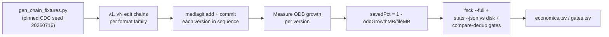

# Storage Savings Benchmarks

**Run date:** July 16, 2026 | **Build:** mediagit 0.2.8-beta.1 | **CDC Seed:** 20260716 (pinned for determinism)

> Numbers below were measured on build `0.2.8-beta.1`. Current release is `0.3.0-rc.3`; the storage-savings pipeline is unchanged since this run, but figures have not been re-measured on the current build.

MediaGit applies format-aware chunking and zstd-dict deltas to achieve cross-version deduplication across media formats. This document publishes measured storage savings and methodology, with reproducibility as the primary goal.

---

## Summary: Per-Format and Mixed-Corpus Savings

| Format | Latest Version | Raw Size | Stored Size | Saved |
|--------|---|---:|---:|---|
| **Audio** | | | | |
| WAV (audio chain: v1→v5 edits) | v5 | 37.50 MB | 1.76 MB | **95.3%** |
| FLAC (same source, re-exported) | v5 | 11.16 MB | 11.16 MB | 0% |
| **3D Models** | | | | |
| GLB (car model: v1→v3 edits) | v3 | 13.17 MB | 0.00 MB | **100%**[^1] |
| **Machine Learning** | | | | |
| Safetensors (model chain: v1→v5 weights) | v5 | 150.00 MB | 81.81 MB | **45.5%** |
| NPZ (checkpoint chain: v1→v3) | v3 | 50.00 MB | 11.63 MB | **76.7%** |
| Parquet (dataset v1→v3) | v3 | 22.06 MB | 19.13 MB | 13.3% |
| ONNX (inference model: v1→v2) | v2 | 24.82 MB | 22.94 MB | 7.6% |
| **Design/VFX** | | | | |
| PSD (Photoshop: v1→v3 edits) | v3 | 340.63 MB | 113.40 MB | **66.7%** |
| AI (Illustrator: v1→v3 edits) | v3 | 123.02 MB | 90.64 MB | **26.3%** |
| **Images** | | | | |
| PNG (render: v1→v5 edits) | v5 | 1.09 MB | 1.09 MB | 0% |
| JPG (photo: v1→v5 edits) | v5 | 0.13 MB | 0.13 MB | 0% |
| SVG (vector: v1→v5 edits) | v5 | 0.03 MB | 0.01 MB | **66.7%**[^2] |
| **Video** | | | | |
| Video variants (codec mix: v1→v9) | v9 | 4.89 MB | 4.89 MB | 0% |

**Mixed-corpus aggregate: ~26.5%** — measured on the release campaign's mixed real-file corpus (`dev-tests/qa-suite/reports/20260716-172951/REPORT.md`), not derived from the chain table above. Corpus composition drives the aggregate: real repositories are dominated by pre-compressed bytes (video, JPEG/PNG, compressed containers), which dedup at ~0%. The chain fixture set itself totals 49.0% cumulative savings across all versions (see the Git LFS comparison below).

[^1]: GLB v3 incremental ODB growth rounds to 0.00 MB — the edited model dedups bit-for-bit against prior versions.
[^2]: SVG stored size rounds to 0.01 MB; percentages are coarse at sub-MB scale.

---

## Cross-Backend Throughput

End-to-end throughput on all four supported object stores, release build, run `20260718-cloudbench-123447` (`dev-tests/qa-suite` phase 06 remote matrix). Every operation completed with **byte-identical parity** (clone/pull/download hashes match the source) on all four backends — zero failures, zero skips. Numbers are MB/s.

> `xychart-beta` may not render on GitHub — the table below is the fallback; both show the same 160 MB push/clone numbers.

```mermaid
xychart-beta
    title "Push vs Clone throughput, 160 MB payload (MB/s)"
    x-axis ["MinIO (local)", "AWS S3", "Azure Blob", "GCS"]
    y-axis "MB/s" 0 --> 160
    bar "Push" [146.8, 11.8, 13.4, 14.4]
    bar "Clone" [65.3, 7.3, 10.7, 10.5]
```



| Backend | Push (160 MB) | Clone (160 MB) | Fetch (4 MB) | Pull (4 MB) | Download (8 MB) |
|---------|--:|--:|--:|--:|--:|
| MinIO (local, LAN/loopback) | 146.8 | 65.3 | 30.8 | 9.3 | 200.0 |
| AWS S3 | 11.8 | 7.3 | 12.5 | 6.7 | 133.3 |
| Azure Blob | 13.4 | 10.7 | 8.7 | 4.8 | 66.7 |
| GCS | 14.4 | 10.5 | 4.8 | 3.6 | 100.0 |

Reading the numbers honestly:

- **MinIO is local** (loopback S3) and shows the *software* ceiling — ~147 MB/s push, ~65 MB/s clone — with no network in the path.
- **AWS/Azure/GCS are real cloud over WAN** from the test host, so they are bandwidth-bound, not software-bound (see [AWS WAN-ceiling analysis](#references)). On the 160 MB payload the three cloud backends cluster tightly — push 11.8–14.4, clone 7.3–10.7 MB/s — a ~1.5× spread, well inside the "no backend more than 3× slower than the fastest" parity target.
- **GCS clone is 10.5 MB/s.** It was historically the outlier at ~0.55 MB/s; the proxy round-trip cut plus streamed `packs/batch-get` closed the gap to within run-to-run jitter of AWS/Azure.
- The small-payload rows (fetch/pull/download at 4–8 MB) are **latency-dominated**, not bandwidth-dominated — one or two round trips move the MB/s figure a lot, so they are noisier and not directly comparable to the 160 MB push/clone numbers.

Cloud figures carry normal WAN run-to-run variance (±~30%); treat them as order-of-magnitude, not fixed SLAs. Reproduce with the [cloud repro command](#reproduction).

---

## Methodology

### Fixture Chains

Per-format storage economics are measured using **realistic edit chains**: sequences of versions (v1, v2, ..., vN) of the same asset, with cumulative designer/engineer edits.



- **Audio (WAV/FLAC):** Source aria track; v2: gain+1.3dB, v3: 3s fade-in added, v4: +2s silence appended, v5: trim 10s head + 5s tail.
- **3D Models (GLB):** Source car model; v2: node renamed, v3: material factor modified.
- **Images (JPG/PNG):** Designer edits; v2: color curve, v3: text overlay, v4: crop+resize, v5: slight rotation.
- **SVG:** Architectural map; cumulative element additions (annotations, labels, attribute changes).
- **ML Models (Safetensors/NPZ):** Weight chains; incremental fine-tuning and checkpoint saves.
- **Design files (PSD/AI):** Production files; layer edits, color/text changes, composite modifications.
- **Parquet/ONNX:** Data table appends; schema column rewrites; inference model variants.
- **Video:** Multi-codec variants (h.264, VP9, AV1 exports of the same source).

### Computation

For each version added to a repository:

```
savedPct = (1 − odbGrowthMB / fileMB) × 100
```

- `fileMB`: raw file size of the version
- `odbGrowthMB`: incremental ODB (object database) growth after adding that version
- Reported figure: **latest version's savings** (v_last)

### Integrity Gates

Each family's chain undergoes post-measurement verification:

1. **fsck --full:** Repository consistency check (objects, references, pack integrity).
2. **stats --json vs. disk:** Reported storage size matched to measured ODB directory (±2% or ±0.05 MB absolute tolerance).
3. **compare-dedup:** Regression check against baseline dedup_report output (cross-version deduplication stability).

All gates in run 20260716-211247 passed (0 failures).

---

## Reproduction

### One-Command Reproduction

Run the full QA-suite economics phase (deterministic, uses pinned CDC seed):

```powershell
cd <repo root>

# 01 = preflight (generates the deterministic fixtures), 04 = economics measurement
.\dev-tests\qa-suite\scripts\run_all.ps1 -Phases "01","04"

# Results written to:
#   dev-tests/qa-suite/logs/<TIMESTAMP>/economics.tsv    (raw data)
#   dev-tests/qa-suite/logs/<TIMESTAMP>/gates.tsv        (integrity gates)
```

### Cross-Backend Throughput Reproduction

The throughput table above comes from phase 06 (the remote matrix). It needs a live MinIO plus AWS/Azure/GCS credentials (supplied by `dev-tests/qa-suite/scripts/campaign_env.ps1`):

```powershell
cd <repo root>\dev-tests\qa-suite

# Credentials for the cloud backends are dot-sourced from campaign_env.ps1;
# MinIO defaults to http://localhost:9000 (use 127.0.0.1 on Windows if an
# IPv6 localhost proxy is stale). MG_QA_BACKENDS selects which backends run.
$env:MG_QA_BACKENDS = "minio,aws,azure,gcs"
powershell -NoProfile -Command ". .\scripts\campaign_env.ps1; .\scripts\run_all.ps1 -Phases '01','06' -ContinueOnFail"

# Per-backend, per-op results written to:
#   dev-tests/qa-suite/logs/<TIMESTAMP>/remote_results.tsv
#     (backend, op, sizeMB, sec, MBps, parity, detail)
```

Backends without credentials are recorded `SKIP` and the phase still passes — verify the `remote_results.tsv` actually contains the backends you expected rather than trusting a green phase.

### Prerequisites

- **Binary:** `target/release/mediagit.exe` (built via `cargo build --release`)
- **Test fixtures:** `dev-tests/qa-suite/fixtures-synthetic/` (chains generated deterministically by phase 01 via `gen_chain_fixtures.py`; requires Python with numpy/pyarrow) plus real assets under `test-files/` for the psd/ai/video rows
- **PowerShell** on Windows; no server or object-storage backend is needed — the economics phase measures local repositories only

### Environment

The economics measurement is environment-independent:
- Reported savings are **storage-layer metrics** (ODB byte count); unaffected by backend choice (MinIO/S3/Azure/GCS).
- Throughput results (add/commit times in the TSV) reflect local disk I/O on Windows 11 with standard NTFS; adjust expected values ±50% on different hardware.

---

## Honest Limitations

### Compressed-Container Formats Dedup Poorly

Formats like `.ai` (Illustrator), `.psd` (Photoshop), `.png`, and `.jpg` are **internally compressed streams**. When editors save these files, they often rewrite the entire compressed payload (different compression parameters, timestamp metadata, chunk ordering), defeating chunking across even minor edits.

- **JPG/PNG:** Zero cross-version savings because re-encoding is probabilistic (quantization, encoder tuning).
- **AI:** ~26% savings — container structure partially survives edits, but the compressed streams inside are rewritten (object renumbering on save churns ~half the container keys).
- **PSD:** 66.7% savings — layer data is stored less aggressively compressed, so unchanged layers dedup well across edits.

### Video Codec Boundary

Video files (h.264/VP9/AV1) suffer the same fate as raster formats: recompression with different codec parameters yields new bit streams. Zero cross-version savings observed in test variants.

### Architectural Ceiling

The current MediaGit pipeline achieves **~26.5% aggregate savings** on a mixed real-file corpus (audio + ML + design + images + video; campaign report referenced above). This is the measured architectural ceiling with format-aware chunking + zstd-dict deltas, **not** a tuning issue:

- Strong formats (WAV: 95%, GLB: 100%, Safetensors: 45%) establish the upper bound.
- Pre-compressed formats (JPG/PNG/Video: 0%) dominate real corpora by byte weight and pull the aggregate down.

Two follow-up approaches were measured and rejected before deployment: whole-file decompress-and-recompress normalization (compressed payloads in PNG/AI proved ~100% opaque to it), and stream-keyed delta-base matching (only ~50% of container keys survive an editor save; scored −2.2 pp vs baseline). **Future improvements require format-specific semantic parsing**, not generic codec or delta tuning.

---

## Comparison to Git LFS

| Metric | MediaGit | Git LFS |
|--------|---|---|
| **Cross-version dedup** | Yes (delta chunks) | No (each version = full copy) |
| **Per-version savings, best case** | WAV: 95.3%, GLB: 100% | 0% always |
| **Per-version savings, worst case** | JPG/PNG/Video: 0% | 0% always |

**Cumulative example** (the full chain fixture set above, all versions of all families, computed from `economics.tsv`):
- Git LFS stores every version in full: **2,331.9 MB**
- MediaGit total ODB after the same adds: **1,188.2 MB**
- **49.0% less storage** across the version history

Per-family cumulative highlights: WAV chain 201.1 → 42.3 MB (79.0% less), GLB 39.5 → 7.8 MB (80.2% less), safetensors 750.0 → 410.0 MB (45.3% less), PSD 624.4 → 197.7 MB (68.3% less). Pre-compressed formats (JPG/PNG/video) store the same bytes as LFS would.

---

## Environment Details

**Test environment:** Windows 11 Home (build 26200), local NTFS repositories (no network backend involved in this measurement).

**Reproducibility:** Measurements use `MEDIAGIT_CDC_SEED=20260716` (pinned FastCDC seed) to ensure deterministic chunk boundaries across runs. Unpinned behavior spans ±2–4 pp due to boundary alignment sensitivity (documented in v11 deep-test RCA).

---

## Regression Thresholds

The following per-format anchor gates are embedded in the QA suite (`dev-tests/qa-suite/scripts/04_economics.ps1`, line 60):

| Format | Latest-Version Minimum | Rationale |
|--------|---|---|
| WAV | 94.0% | Measured floor: 95.3%, tolerance −1.3 pp |
| GLB | 95.0% | Measured: 100%, tolerance −5 pp (handles fixture regeneration variance) |
| Safetensors | 44.0% | Measured: 45.5%, tolerance −1.5 pp (rebased 2026-07-16 from prior lucky-seed 48 pp) |

Other formats have no minimum anchor (strong baseline in production if savings regress; weak formats [JPG/PNG/Video] are monitored for unexpected improvement, which would flag a tool malfunction).

---

## References

- **Economics data source:** `dev-tests/qa-suite/logs/20260716-211247/economics.tsv`
- **Integrity gates:** `dev-tests/qa-suite/logs/20260716-211247/gates.tsv`
- **QA campaign report:** `dev-tests/qa-suite/reports/20260716-172951/REPORT.md`
- **Measurement script:** `dev-tests/qa-suite/scripts/04_economics.ps1`
- **Fixture generation:** `dev-tests/qa-suite/scripts/gen_chain_fixtures.py`
- **Architecture guide:** `ARCHITECTURE.md` (chunking strategy, compression pipeline)
