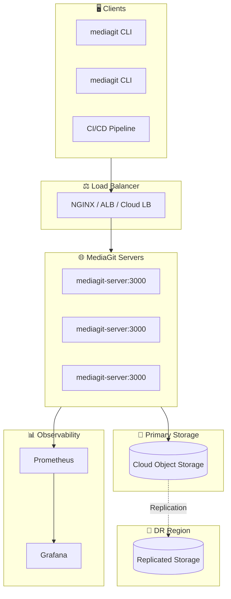
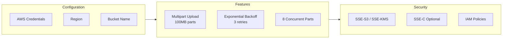
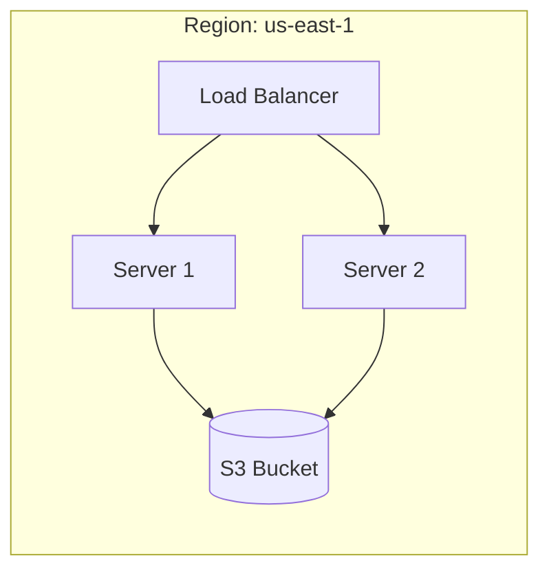
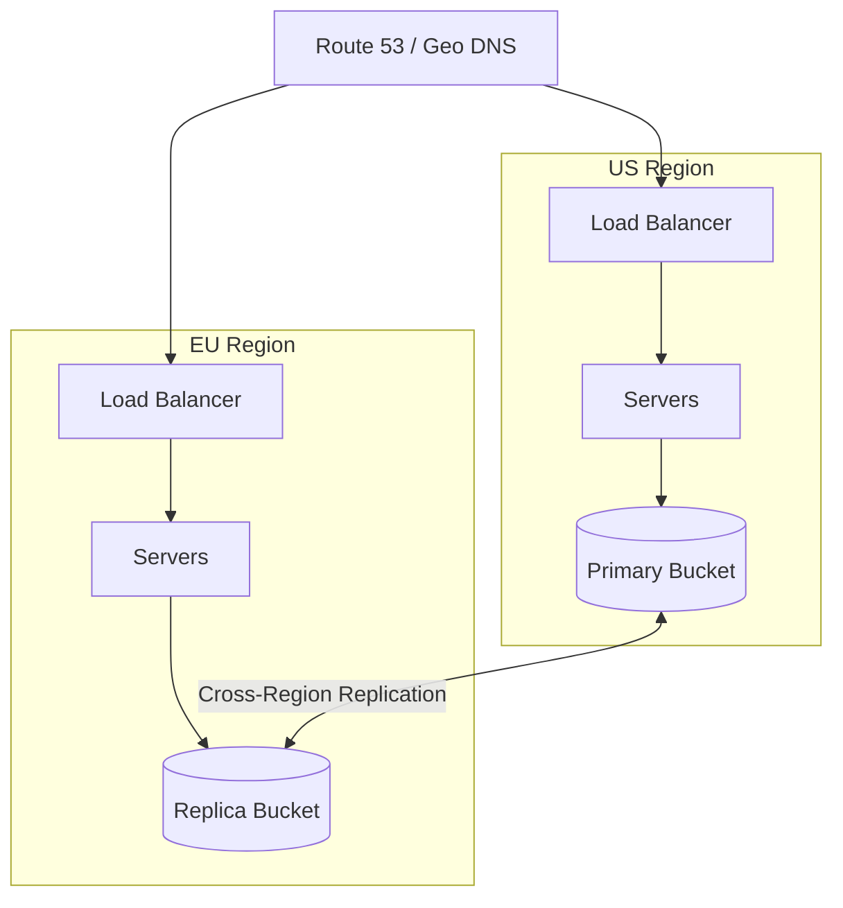
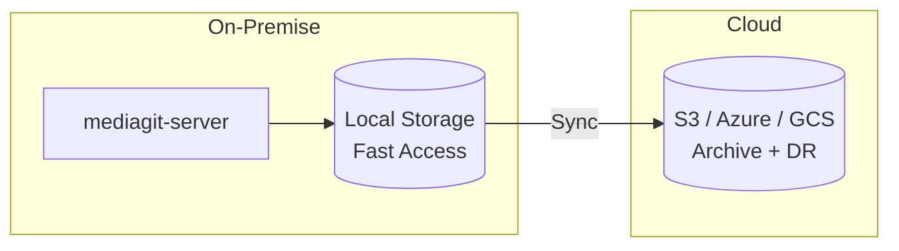
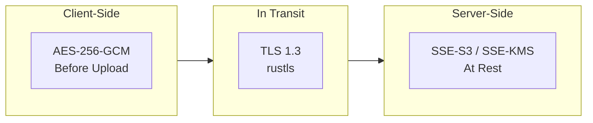
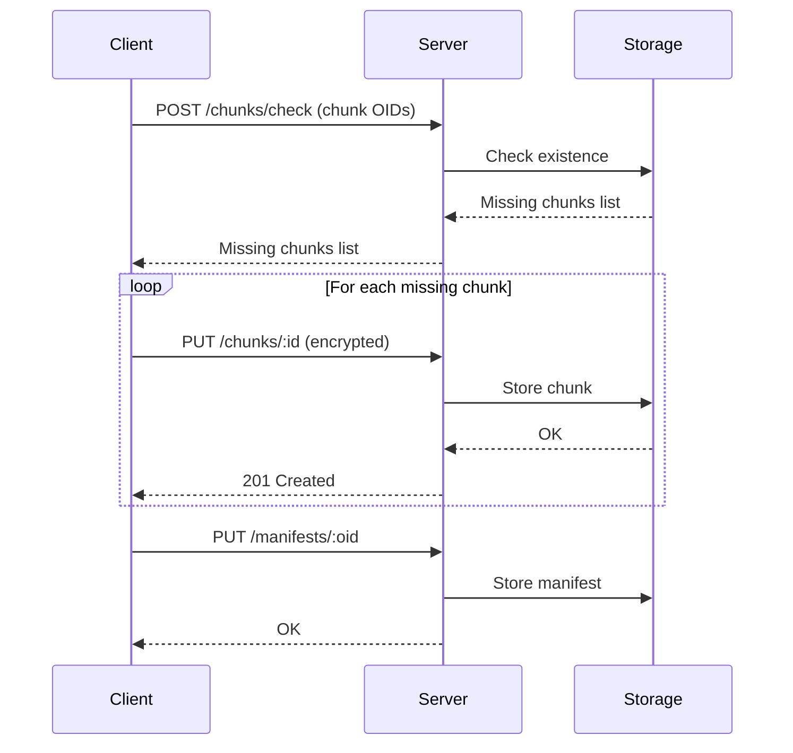
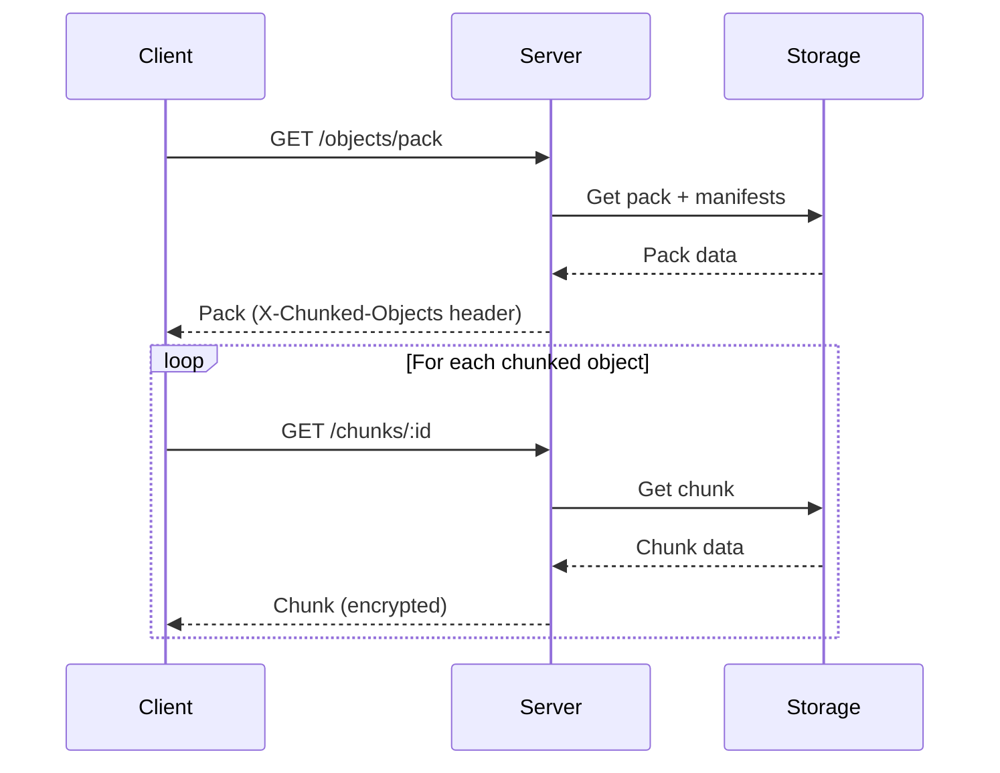
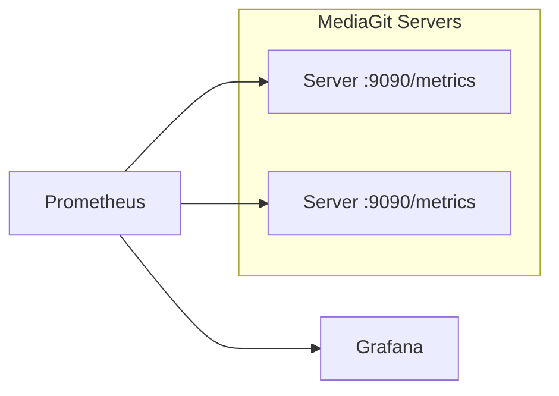

# MediaGit Cloud Architecture Reference

> **Production deployment guide for cloud-native MediaGit infrastructure**

---

## Reference Architecture



---

## Storage Backends

### AWS S3



| Setting | Default | Description |
|---------|---------|-------------|
| `bucket` | Required | S3 bucket name |
| `region` | Auto-detect | AWS region |
| `endpoint` | AWS S3 | Custom endpoint for S3-compatible |
| `part_size` | 100MB | Multipart upload part size |
| `max_concurrent_parts` | 8 | Parallel part uploads |
| `max_retries` | 3 | Retry attempts |

**Credential Chain:**
1. Environment variables (`AWS_ACCESS_KEY_ID`, `AWS_SECRET_ACCESS_KEY`)
2. IAM role (EC2, ECS, Lambda)
3. AWS profile files (`~/.aws/credentials`)

---

### Azure Blob Storage

| Setting | Description |
|---------|-------------|
| `account_name` | Storage account name |
| `account_key` | Storage account key |
| `container` | Blob container name |
| `use_managed_identity` | Use Azure AD auth |

**Storage Tiers:**
- **Hot**: Frequently accessed data (active repos)
- **Cool**: Infrequent access (archived branches)
- **Archive**: Long-term retention (compliance)

---

### Google Cloud Storage

| Setting | Description |
|---------|-------------|
| `project` | GCP project ID |
| `bucket` | GCS bucket name |
| `credentials_path` | Service account JSON path |

---

### MinIO (S3-Compatible)

| Setting | Value |
|---------|-------|
| `endpoint` | `http://minio:9000` |
| `access_key` | MinIO access key |
| `secret_key` | MinIO secret key |
| `bucket` | Bucket name |
| `force_path_style` | `true` |

**Production Performance:**
- Upload: **108 MB/s**
- Download: **263 MB/s**

---

### Backblaze B2

| Setting | Value |
|---------|-------|
| `endpoint` | `https://s3.{region}.backblazeb2.com` |
| `access_key` | B2 Application Key ID |
| `secret_key` | B2 Application Key |
| `region` | `us-west-002` |

---

### DigitalOcean Spaces

| Setting | Value |
|---------|-------|
| `endpoint` | `https://{region}.digitaloceanspaces.com` |
| `access_key` | Spaces access key |
| `secret_key` | Spaces secret key |
| `region` | `nyc3`, `sfo3`, etc. |

---

## Deployment Patterns

### Single-Region



**Use Case:** Development, small teams, single-geography

---

### Multi-Region (Active-Active)



**Use Case:** Global teams, low latency worldwide, DR

---

### Hybrid (Local + Cloud)



**Use Case:** Media studios, large file workflows, cost optimization

---

## Security Architecture



### Security Layers

| Layer | Implementation | Purpose |
|-------|---------------|---------|
| **Client Encryption** | AES-256-GCM | End-to-end encryption |
| **Transport** | TLS 1.3 (rustls) | In-transit protection |
| **Server Encryption** | SSE-S3 / SSE-KMS | At-rest protection |
| **Authentication** | JWT / API Keys | Access control |
| **Key Derivation** | Argon2 | Password-based keys |
| **Rate Limiting** | tower_governor | DDoS protection |
| **Audit Logging** | Built-in | Compliance |

---

## Data Flow

### Upload Flow (Chunks)



### Download Flow



---

## High Availability & DR

### Server Availability

| Component | Strategy |
|-----------|----------|
| **Servers** | Stateless, horizontally scalable |
| **Load Balancer** | Health checks, auto-failover |
| **Storage** | Cloud-managed durability (11 9s) |

### Disaster Recovery

| Strategy | RPO | RTO | Cost |
|----------|-----|-----|------|
| **Cross-Region Replication** | Minutes | Minutes | High |
| **Daily Snapshots** | 24 hours | Hours | Medium |
| **Backup to Different Provider** | Hours | Hours | Medium |

---

## Monitoring & Observability

### Prometheus Metrics



### Key Metrics

| Metric | Type | Description |
|--------|------|-------------|
| `mediagit_bytes_uploaded_total` | Counter | Total bytes uploaded |
| `mediagit_bytes_downloaded_total` | Counter | Total bytes downloaded |
| `mediagit_objects_stored_total` | Counter | Total objects stored |
| `mediagit_dedup_ratio` | Gauge | Deduplication ratio |
| `mediagit_compression_ratio` | Gauge | Compression ratio |
| `mediagit_request_duration_seconds` | Histogram | Request latency |

---

## Cost Optimization

### Storage Cost Reduction

| Strategy | Savings |
|----------|---------|
| **Deduplication** | 60-95% (chunk-level) |
| **Compression** | 50-93% (type-aware) |
| **Delta Encoding** | Up to 95% (versioning) |
| **Infrequent Access Tier** | 40-50% (old refs) |

### Egress Optimization

| Strategy | Benefit |
|----------|---------|
| **Compression** | Reduced transfer size |
| **Have/Want Protocol** | Only transfer missing objects |
| **Chunked Transfer** | Resume interrupted downloads |
| **Regional Caching** | Reduce cross-region egress |

---

## Configuration Examples

### AWS S3 (mediagit.toml)

```toml
[storage]
backend = "s3"

[storage.s3]
bucket = "my-mediagit-repo"
region = "us-east-1"
# Uses AWS credential chain by default

# Optional: Custom endpoint for S3-compatible
# endpoint = "https://s3.us-east-1.amazonaws.com"
```

### Azure Blob (mediagit.toml)

```toml
[storage]
backend = "azure"

[storage.azure]
account_name = "mediagitstorage"
container = "repos"
# account_key = "..." # Or use managed identity
use_managed_identity = true
```

### MinIO (mediagit.toml)

```toml
[storage]
backend = "s3"

[storage.s3]
bucket = "mediagit"
endpoint = "http://minio.internal:9000"
access_key = "minioadmin"
secret_key = "minioadmin"
force_path_style = true
```

### Multi-Backend (mediagit.toml)

```toml
[storage]
backend = "multi"

[storage.multi]
primary = "local"
secondary = "s3"

[storage.multi.local]
path = "/fast-storage/mediagit"

[storage.multi.s3]
bucket = "mediagit-backup"
region = "us-west-2"
```

---

## Server Configuration

### Environment Variables

```bash
# Server
MEDIAGIT_PORT=3000
MEDIAGIT_HOST=0.0.0.0

# TLS
MEDIAGIT_TLS_CERT=/certs/server.crt
MEDIAGIT_TLS_KEY=/certs/server.key

# Auth
MEDIAGIT_JWT_SECRET=your-secret-key
MEDIAGIT_API_KEY_ENABLED=true

# Storage (AWS)
AWS_ACCESS_KEY_ID=AKIA...
AWS_SECRET_ACCESS_KEY=...
AWS_REGION=us-east-1

# Metrics
MEDIAGIT_METRICS_ENABLED=true
MEDIAGIT_METRICS_PORT=9090
```

### Docker Compose Example

```yaml
version: '3.8'
services:
  mediagit:
    image: mediagit/server:latest
    ports:
      - "3000:3000"
      - "9090:9090"
    environment:
      - AWS_REGION=us-east-1
      - MEDIAGIT_METRICS_ENABLED=true
    volumes:
      - ./config:/etc/mediagit
    deploy:
      replicas: 3
      
  prometheus:
    image: prom/prometheus
    volumes:
      - ./prometheus.yml:/etc/prometheus/prometheus.yml
      
  grafana:
    image: grafana/grafana
    ports:
      - "3001:3000"
```

---

## Performance Tuning

### S3 Backend

| Setting | Recommended | Impact |
|---------|-------------|--------|
| `part_size` | 100MB (default) | Larger = fewer API calls |
| `max_concurrent_parts` | 8-16 | Higher = faster uploads |
| `max_retries` | 3-5 | More resilience |

### Server

| Setting | Recommended | Impact |
|---------|-------------|--------|
| Worker threads | CPU cores x 2 | Throughput |
| Connection pool | 100-500 | Concurrent requests |
| Request timeout | 300s | Large file handling |

---

## Summary

| Aspect | Recommendation |
|--------|----------------|
| **Primary Storage** | AWS S3 / Azure Blob / GCS |
| **Cost-Optimized** | Backblaze B2, MinIO |
| **Enterprise** | Multi-region with replication |
| **Studios** | Hybrid (Local + Cloud) |
| **Security** | TLS + Client-side AES-256-GCM |
| **Monitoring** | Prometheus + Grafana |
