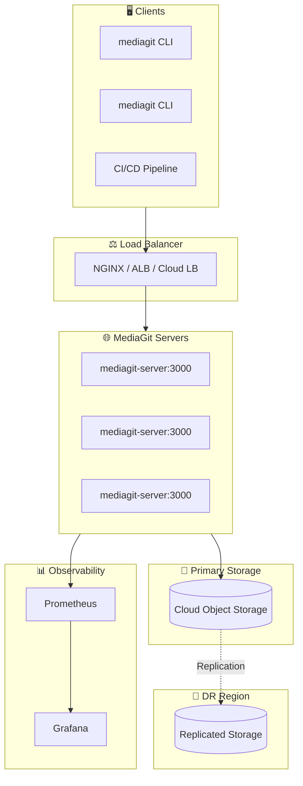
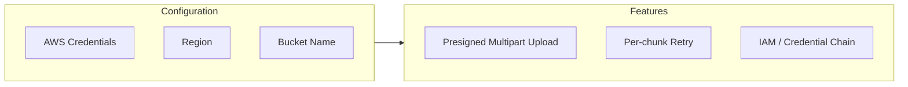
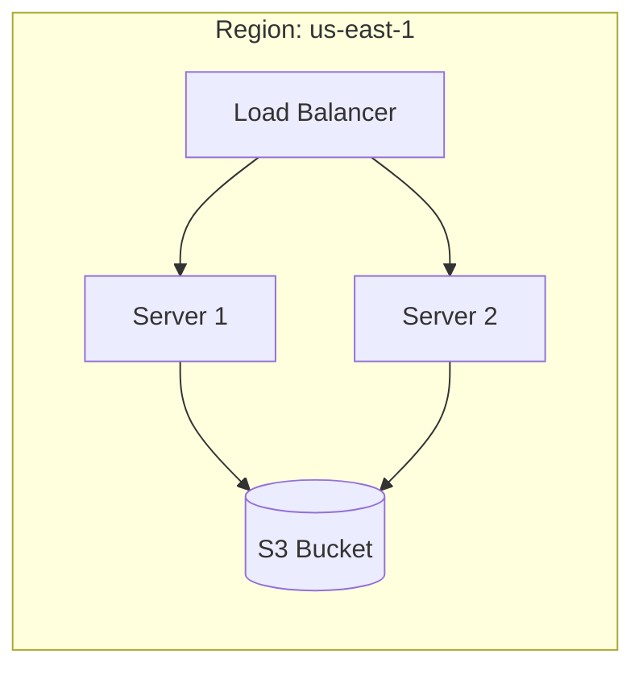
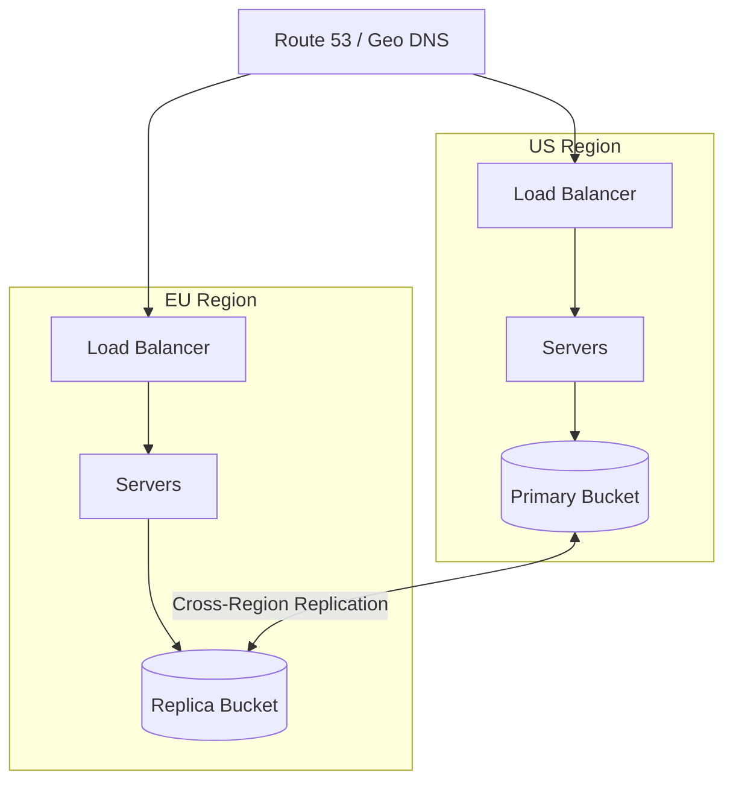
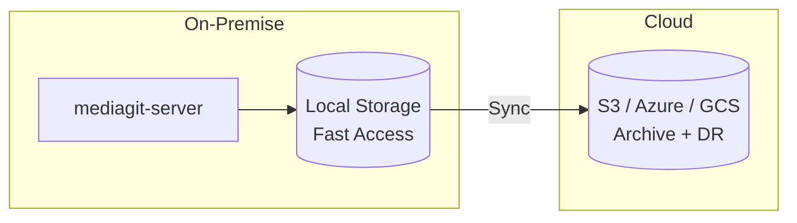
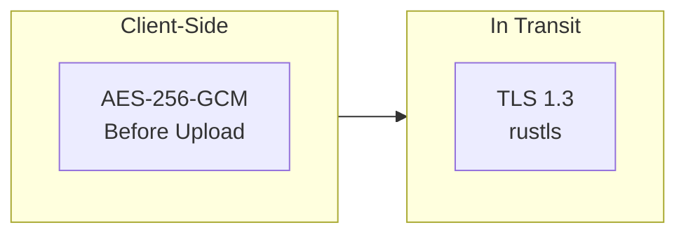
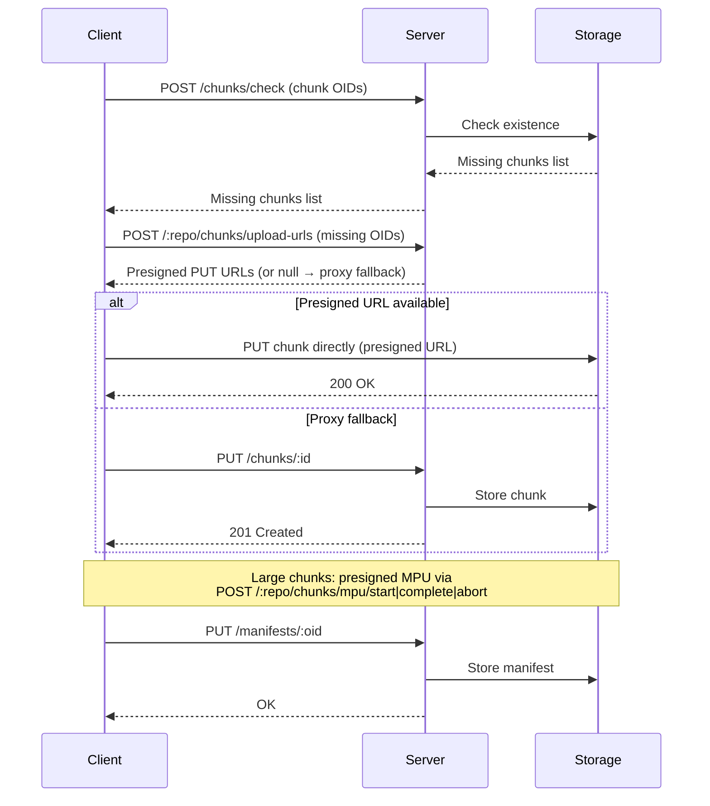
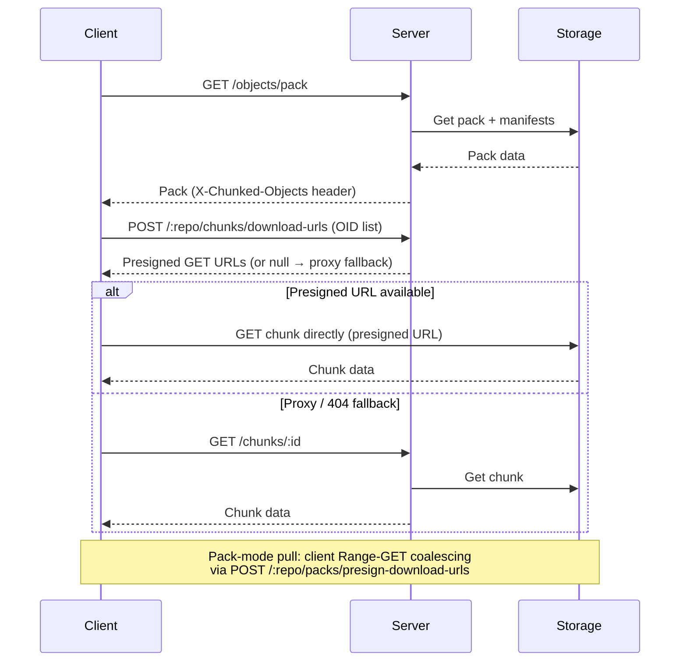
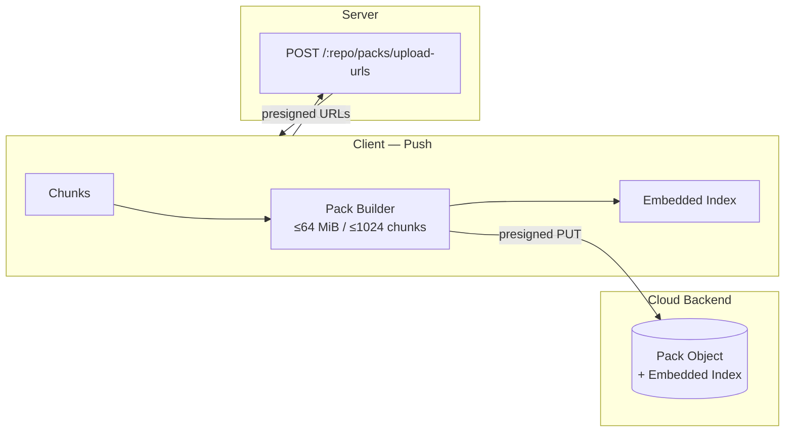
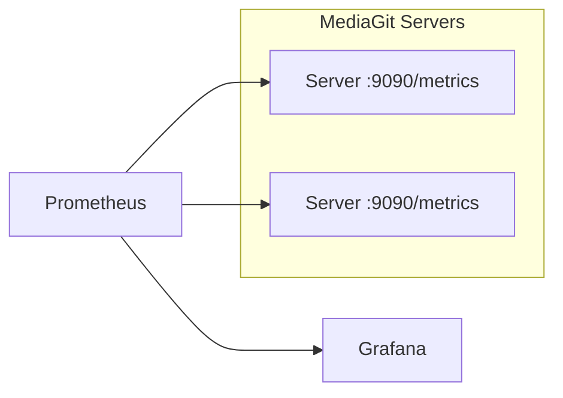

# MediaGit Cloud Architecture Reference

> **Production deployment guide for cloud-native MediaGit infrastructure**

---

## Reference Architecture


```mermaid
flowchart TB
    subgraph Clients["🖥️ Clients"]
        CLI1[mediagit CLI]
        CLI2[mediagit CLI]
        CI[CI/CD Pipeline]
    end
    
    subgraph LoadBalancer["⚖️ Load Balancer"]
        LB[NGINX / ALB / Cloud LB]
    end
    
    subgraph Servers["🌐 MediaGit Servers"]
        S1[mediagit-server:3000]
        S2[mediagit-server:3000]
        S3[mediagit-server:3000]
    end
    
    subgraph Storage["💾 Primary Storage"]
        BUCKET[(Cloud Object Storage)]
    end
    
    subgraph Replicated["🔄 DR Region"]
        REPLICA[(Replicated Storage)]
    end
    
    subgraph Monitoring["📊 Observability"]
        PROM[Prometheus]
        GRAF[Grafana]
    end
    
    Clients --> LB
    LB --> Servers
    Servers --> BUCKET
    BUCKET -.->|Replication| REPLICA
    Servers --> PROM
    PROM --> GRAF
```

---

## Storage Backends

### AWS S3


```mermaid
flowchart LR
    subgraph Config["Configuration"]
        CREDS[AWS Credentials]
        REGION[Region]
        BUCKET[Bucket Name]
    end
    
    subgraph Features["Features"]
        MULTI[Presigned Multipart Upload]
        RETRY[Per-chunk Retry]
        IAM[IAM / Credential Chain]
    end
    
    Config --> Features
```

| Setting | Default | Description |
|---------|---------|-------------|
| `bucket` | Required | S3 bucket name |
| `region` | Required | AWS region |
| `access_key_id` / `secret_access_key` | Optional | Falls back to the AWS credential chain when unset |
| `endpoint` | AWS S3 | Custom endpoint for S3-compatible services |
| `prefix` | `""` | Object key prefix |

`part_size`, concurrency, and retry counts are not `[storage]` config
fields — see [Performance Tuning](#performance-tuning) below for how those
are actually controlled. Server-side encryption (SSE-S3/SSE-KMS/SSE-C) is
not implemented by the S3 backend (`crates/mediagit-storage/src/minio.rs`,
which serves both AWS and MinIO);
see [Security Architecture](#security-architecture) for what encryption the
project actually provides.

**Credential Chain:** there isn't one. S3 credentials come from
`access_key_id` / `secret_access_key` in the repository's own
`.mediagit/config.toml` and nowhere else — no environment variables, no IAM
role, no `~/.aws/credentials`. The chain above was documented for years and is
dead code: see *Storage credentials are not environment variables* below, and
note the module doc in `crates/mediagit-storage/src/b2_spaces_driver.rs` still describes
the same non-existent chain -- though that file is the B2/Spaces driver and is not on the AWS path at all (it carried an S3 name until 2026-09-18).

---

### Azure Blob Storage

Credentials use a tagged `auth` block under `[storage]` (`config_version` 3+):
one of `account_key` (`account_name` + `account_key`), `connection_string`
(`value`), `sas` (`account_name` + `token`), or `emulator` (local Azurite).

| Setting | Description |
|---------|-------------|
| `container` | Blob container name |
| `prefix` | Optional key prefix; lets multiple repos share one container |

Built on Apache OpenDAL (the `azure_storage_blobs` 0.21 line is EOL, and its GA
replacement is Entra-ID-only). Managed-identity / Azure AD auth is not
supported — authenticate by shared key, SAS, or connection string.

**Storage Tiers:**
- **Hot**: Frequently accessed data (active repos)
- **Cool**: Infrequent access (archived branches)
- **Archive**: Long-term retention (compliance)

---

### Google Cloud Storage

| Setting | Description |
|---------|-------------|
| `project` | GCP project ID |
| `bucket` | GCS bucket name |
| `credentials_path` | Service account JSON path |

---

### MinIO (S3-Compatible)

| Setting | Value |
|---------|-------|
| `endpoint` | `http://minio:9000` |
| `access_key_id` | MinIO access key |
| `secret_access_key` | MinIO secret key |
| `bucket` | Bucket name |
| `prefix` | Key prefix (e.g. `media/`) |

**Production Performance:**
- Upload: **108 MB/s**
- Download: **263 MB/s**

---

### Backblaze B2

| Setting | Value |
|---------|-------|
| `endpoint` | `https://s3.{region}.backblazeb2.com` |
| `access_key_id` | B2 Application Key ID |
| `secret_access_key` | B2 Application Key |
| `region` | `us-west-002` |

---

### DigitalOcean Spaces

| Setting | Value |
|---------|-------|
| `endpoint` | `https://{region}.digitaloceanspaces.com` |
| `access_key_id` | Spaces access key |
| `secret_access_key` | Spaces secret key |
| `region` | `nyc3`, `sfo3`, etc. |

---

## Deployment Patterns

### Single-Region


```mermaid
flowchart LR
    subgraph Region["Region: us-east-1"]
        LB[Load Balancer] --> S1[Server 1]
        LB --> S2[Server 2]
        S1 --> B[(S3 Bucket)]
        S2 --> B
    end
```

**Use Case:** Development, small teams, single-geography

---

### Multi-Region (Active-Active)


```mermaid
flowchart TB
    subgraph US["US Region"]
        US_LB[Load Balancer] --> US_S[Servers]
        US_S --> US_B[(Primary Bucket)]
    end
    
    subgraph EU["EU Region"]
        EU_LB[Load Balancer] --> EU_S[Servers]
        EU_S --> EU_B[(Replica Bucket)]
    end
    
    US_B <-->|Cross-Region Replication| EU_B
    DNS[Route 53 / Geo DNS] --> US_LB
    DNS --> EU_LB
```

**Use Case:** Global teams, low latency worldwide, DR

---

### Hybrid (Local + Cloud)


```mermaid
flowchart LR
    subgraph Studio["On-Premise"]
        LOCAL[(Local Storage<br/>Fast Access)]
        SERVER[mediagit-server]
    end
    
    subgraph Cloud["Cloud"]
        CLOUD[(S3 / Azure / GCS<br/>Archive + DR)]
    end
    
    SERVER --> LOCAL
    LOCAL -->|Sync| CLOUD
```

**Use Case:** Media studios, large file workflows, cost optimization

---

## Security Architecture


```mermaid
flowchart LR
    subgraph Client["Client-Side"]
        AES[AES-256-GCM<br/>Before Upload]
    end
    
    subgraph Transit["In Transit"]
        TLS[TLS 1.3<br/>rustls]
    end
    
    Client --> Transit
```

### Security Layers

| Layer | Implementation | Purpose |
|-------|---------------|---------|
| **Client Encryption** | AES-256-GCM (DC-7 at-rest encryption) | End-to-end encryption; server holds per-repo escrow keys, never the process key |
| **Transport** | TLS 1.3 (rustls) | In-transit protection |
| **Authentication** | JWT / API Keys | Access control |
| **Key Derivation** | Argon2 | Password-based keys |
| **Rate Limiting** | tower_governor | DDoS protection |
| **Audit Logging** | Built-in | Compliance |

---

## Data Flow

### Upload Flow (Presigned-Direct)

Client PUTs chunks directly to backend storage using server-minted presigned URLs, bypassing the server for data transfer. If the backend cannot sign (e.g. GCS with ADC), the server returns `null` and the client falls back to proxy upload.


```mermaid
sequenceDiagram
    participant Client
    participant Server
    participant Storage

    Client->>Server: POST /chunks/check (chunk OIDs)
    Server->>Storage: Check existence
    Storage-->>Server: Missing chunks list
    Server-->>Client: Missing chunks list

    Client->>Server: POST /:repo/chunks/upload-urls (missing OIDs)
    Server-->>Client: Presigned PUT URLs (or null → proxy fallback)

    alt Presigned URL available
        Client->>Storage: PUT chunk directly (presigned URL)
        Storage-->>Client: 200 OK
    else Proxy fallback
        Client->>Server: PUT /chunks/:id
        Server->>Storage: Store chunk
        Server-->>Client: 201 Created
    end

    Note over Client,Storage: Large chunks: presigned MPU via<br/>POST /:repo/chunks/mpu/start|complete|abort

    Client->>Server: PUT /manifests/:oid
    Server->>Storage: Store manifest
    Server-->>Client: OK
```

### Download Flow (Presigned-Direct)

Client GETs chunks directly from backend storage using server-minted presigned GET URLs. On 404 or `null` (unsigned), falls back to proxy GET. Pack-mode pull uses client-side Range-GET coalescing.

**Signing capability**: S3, MinIO, and Azure sign natively. GCS requires a service-account key JSON; ADC `authorized_user` credentials have no private key, so presign returns `null` and the client runs at proxy speed.


```mermaid
sequenceDiagram
    participant Client
    participant Server
    participant Storage

    Client->>Server: GET /objects/pack
    Server->>Storage: Get pack + manifests
    Storage-->>Server: Pack data
    Server-->>Client: Pack (X-Chunked-Objects header)

    Client->>Server: POST /:repo/chunks/download-urls (OID list)
    Server-->>Client: Presigned GET URLs (or null → proxy fallback)

    alt Presigned URL available
        Client->>Storage: GET chunk directly (presigned URL)
        Storage-->>Client: Chunk data
    else Proxy / 404 fallback
        Client->>Server: GET /chunks/:id
        Server->>Storage: Get chunk
        Server-->>Client: Chunk data
    end

    Note over Client,Storage: Pack-mode pull: client Range-GET coalescing<br/>via POST /:repo/packs/presign-download-urls
```

---

## Cloud Packs

MediaGit bundles chunks into **cloud pack objects** before uploading (Phase-3 Track F). Instead of storing thousands of individual chunk objects, the client packs up to 1,024 chunks (≤ 64 MiB) into a single object with an embedded index. This dramatically cuts API request count and cost, and speeds clones on small-chunk repos.

- **Object count reduction**: ~10,000 individual chunk objects → hundreds of pack objects (deep tests: 463–467 chunked + 35 delta objects per backend)
- **Clone path**: pack-locate via embedded index → Range-GET to fetch only needed slices
- **Integrity (F8)**: per-slice compressed-hash verification on every pull — all backends clean in deep tests


```mermaid
flowchart LR
    subgraph Client["Client — Push"]
        C1[Chunks] --> PACK[Pack Builder\n≤64 MiB / ≤1024 chunks]
        PACK --> IDX[Embedded Index]
    end

    subgraph Server["Server"]
        UP[POST /:repo/packs/upload-urls]
    end

    subgraph Storage["Cloud Backend"]
        OBJ[(Pack Object\n+ Embedded Index)]
    end

    PACK -->|presigned PUT| OBJ
    Client -->|request URLs| UP
    UP -->|presigned URLs| Client
```

---

## Upload Attestation (0.4.0)

After a push, the server used to read every pack back out of the bucket and hash
it, to confirm the bytes stored intact. On a 16 GB push that is **10.03 GB pulled
back out** — roughly 60% extra load on the same link the push just used.

Where the storage provider has **already validated a checksum of the assembled
object at upload time**, that read-back proves nothing new, and MediaGit skips it.

### What attestation does and does not prove

| Property | Guaranteed by | Still checked? |
|----------|---------------|----------------|
| The bucket holds the bytes we uploaded | **Provider attestation** (this feature) | Skipped when attested |
| A pack's contents match its manifest | **Read path** — `slice_verifies` (compressed hash) and `put_compressed_chunk` (decompress, BLAKE3 == `chunk_id`) | Always, on every read |

Attestation is a **storage-integrity** claim, not a content-correctness one. Nothing
is ever served or stored unverified: both read-path checks fail closed regardless of
attestation, so the practical change is *when* a content mismatch surfaces — on first
read rather than eagerly at push.

### Per-backend support

| Backend | Digest | How it is checked | Read-back |
|---------|--------|-------------------|-----------|
| **AWS S3** | Full-object CRC64NVME | Presence is sufficient — the checksum exists only because we asked for it and S3 validated it at `CompleteMultipartUpload` | **Skipped** |
| **GCS** | crc32c | **Compared**, not merely observed. GCS stores a crc32c for *every* object, so a presence check would answer "attested" for every upload ever made. The server folds the client's per-part digests and compares against GCS's own value | **Skipped** |
| **Azure Blob** | none usable | No validated whole-blob digest exists: `x-ms-blob-content-md5` is client-set and never validated, and per-block `x-ms-content-crc64` cannot ride a presigned URL | **Always runs** |
| **MinIO / B2 / Spaces** | not attested | Gated on an `amazonaws.com` endpoint; `MEDIAGIT_S3_ATTEST` overrides | **Always runs** |

**Fail-closed throughout.** A non-attesting backend, a missing checksum, a HEAD
error or a permission gap all yield "not attested", and the read-back runs exactly
as before. Only a positive answer from the provider skips it.
`MEDIAGIT_PACK_ATTEST_SKIP_READBACK=0` forces the old behaviour everywhere.

### What this means when choosing a backend

**Azure pushes do measurably more I/O than S3 or GCS for the same data.** Because
Azure cannot attest, every pushed pack is read back out of the blob store and
hashed: a 16 GB push does ~10 GB of extra reads that S3 and GCS do not. That is
throughput and egress, not a correctness difference — Azure's integrity guarantees
are identical, and arguably verified more eagerly. But if push time or egress cost
on large repositories is the deciding factor, S3 and GCS have a structural advantage
here that Azure cannot currently match.

This is a property of the Azure Blob API, not of MediaGit's Azure backend. If Azure
ships a service-validated whole-blob digest, the same mechanism applies and the
read-back goes away — a live test asserts Azure still reports "not attested", so
that change would be detected rather than assumed.

---

## Cross-Backend Deep-Test Parity (2026-06-02)

614/614 tests passing across all four backends. All fsck + F8 compressed-hash checks clean.

| Backend | Tests | Cloud Savings | Push Elapsed | Clone Elapsed | Server Mem Δ | fsck / F8 |
|---------|-------|--------------|-------------|--------------|-------------|-----------|
| **MinIO** | 151/151 | 8.4%* | 76 s | 87 s | ±3.7 MB | ✅ Clean |
| **AWS S3** | 150/150 | 26.3% | 154 s | 225 s | +26 MB | ✅ Clean |
| **Azure Blob** | 154/154 | 26.5% | 304 s | 178 s | +35 MB | ✅ Clean |
| **GCS** | 159/159 | 26.4% | 178 s | 212 s | +30 MB | ✅ Clean |

> \* MinIO 8.4% = cumulative multi-push fixture (lower savings expected by design). AWS/Azure/GCS 26.3–26.5% are single-corpus savings.
> AWS/Azure/GCS push and clone are WAN-bound (~62 Mbps to ap-south-1). Reports: `dev-tests/deep-tests/reports/`.

---

## High Availability & DR

### Server Availability

| Component | Strategy |
|-----------|----------|
| **Servers** | **Single instance per directory — enforced at boot.** See [Server topology](#server-topology) |
| **Load Balancer** | Health checks; failover to a standby that owns its own `repos_dir` |
| **Storage** | Cloud-managed durability (11 9s) |

### Server topology

**Supported: one `mediagit-server` process per `repos_dir` (and per
`auth_store_dir`).** The server takes an exclusive lock on both at startup and
refuses to start if another process holds one. The lock lives on an open file
handle, so the OS releases it on any exit — a crashed server does not block its
own restart.

This is a real constraint, not caution. The server keeps state that is
per-process, and a second instance sharing a directory corrupts it *silently*:

| State | What a second instance does |
|---|---|
| `users.jsonl` / `grants.jsonl` | each loads at boot and full-rewrites on mutation; the slower writer's snapshot wins and the other's users and grants vanish |
| `locks.jsonl` | same full rewrite, and the double-lock 409 guard is per-process, so two clients can both hold one path |
| circular chunk-delta guard | in-process only; two instances can write A→B and B→A and leave the repo unpushable |
| pack verification | the same pack is verified twice over the WAN |
| token revocation | logout does not propagate; the sibling keeps accepting a revoked JWT |
| rate limiter | N instances serve N× the configured budget |
| want-cache | negotiation state is per-process, so clone/push negotiation breaks |

None of those raise an error, which is why the enforcement is at boot rather
than at each site.

To scale out today, give each instance its own `repos_dir` and `auth_store_dir`
and shard repositories across them at the load balancer. True horizontal scale —
several instances over one shared store — needs the state above moved to a
shared store (Postgres/Redis) and is **not implemented**.

`MEDIAGIT_ALLOW_MULTI_INSTANCE=1` downgrades the refusal to a warning. It exists
for an operator who has genuinely separated every directory and is only tripping
over a lock file on a shared mount. It does not make the sharing safe.

### Disaster Recovery

| Strategy | RPO | RTO | Cost |
|----------|-----|-----|------|
| **Cross-Region Replication** | Minutes | Minutes | High |
| **Daily Snapshots** | 24 hours | Hours | Medium |
| **Backup to Different Provider** | Hours | Hours | Medium |

---

## Monitoring & Observability

### Prometheus Metrics


```mermaid
flowchart LR
    subgraph Servers["MediaGit Servers"]
        S1["Server :9090/metrics"]
        S2["Server :9090/metrics"]
    end
    
    PROM[Prometheus] --> S1
    PROM --> S2
    PROM --> GRAF[Grafana]
```

### Key Metrics

| Metric | Type | Description |
|--------|------|-------------|
| `mediagit_bytes_uploaded_total` | Counter | Total bytes uploaded |
| `mediagit_bytes_downloaded_total` | Counter | Total bytes downloaded |
| `mediagit_objects_stored_total` | Counter | Total objects stored |
| `mediagit_dedup_ratio` | Gauge | Deduplication ratio |
| `mediagit_compression_ratio` | Gauge | Compression ratio |
| `mediagit_request_duration_seconds` | Histogram | Request latency |

---

## Cost Optimization

### Storage Cost Reduction

| Strategy | Savings |
|----------|---------|
| **Deduplication** | 60-95% (chunk-level) |
| **Compression** | 50-93% (type-aware) |
| **Delta Encoding** | Up to 95% (versioning) |
| **Infrequent Access Tier** | 40-50% (old refs) |

### Egress Optimization

| Strategy | Benefit |
|----------|---------|
| **Compression** | Reduced transfer size |
| **Have/Want Protocol** | Only transfer missing objects |
| **Chunked Transfer** | Resume interrupted downloads |
| **Regional Caching** | Reduce cross-region egress |

---

## Configuration Examples

### AWS S3 (mediagit.toml)

All storage backend fields go directly in `[storage]` alongside the `backend` key:

```toml
[storage]
backend = "s3"
bucket = "my-mediagit-repo"
region = "us-east-1"
# Uses AWS credential chain by default (IAM role, ~/.aws/credentials, env vars)
# Optional: custom endpoint for S3-compatible services
# endpoint = "https://s3.us-east-1.amazonaws.com"
```

### Azure Blob (mediagit.toml)

```toml
[storage]
backend = "azure"
container = "repos"
auth = { type = "account_key", account_name = "mediagitstorage", account_key = "..." }
# variants: connection_string { value }, sas { account_name, token }, emulator {}
# account_key may also come from the AZURE_STORAGE_KEY env var
```

### MinIO (mediagit.toml)

```toml
[storage]
backend = "s3"
bucket = "mediagit"
endpoint = "http://minio.internal:9000"
access_key_id = "minioadmin"        # field: access_key_id
secret_access_key = "minioadmin"    # field: secret_access_key
region = "us-east-1"                # any value; MinIO ignores region
```

### Multi-Backend (mediagit.toml)

```toml
[storage]
backend = "multi"
primary = "primary-s3"
replicas = ["replica-local"]

[storage.backends.primary-s3]
backend = "s3"
bucket = "mediagit-backup"
region = "us-west-2"

[storage.backends.replica-local]
backend = "filesystem"
base_path = "/fast-storage/mediagit"
```

---

## Server Configuration

The server's own settings — bind address, TLS, repo directory — come from
`mediagit-server.toml` and a few CLI flags. They are **not** environment
variables: `MEDIAGIT_PORT`, `MEDIAGIT_HOST`, `MEDIAGIT_TLS_CERT`,
`MEDIAGIT_TLS_KEY` and `MEDIAGIT_API_KEY_ENABLED` appeared in earlier
revisions of this document and have never been read by anything. Because
`ServerConfig` is `deny_unknown_fields`, a mistyped *config key* fails loudly
at startup — but a mistyped env var just does nothing, which is why the list
below is worth being exact about.

```toml
# mediagit-server.toml
port = 3000
host = "0.0.0.0"
repos_dir = "/var/lib/mediagit/repos"

enable_tls = true
tls_port = 3443
tls_cert_path = "/certs/server.crt"
tls_key_path = "/certs/server.key"
```

`--port`, `--host`, `--data-dir` and `--config PATH` override the file.

### Environment Variables

These are the server-side variables that are actually read:

```bash
# Auth
MEDIAGIT_JWT_SECRET=your-secret-key
MEDIAGIT_ADMIN_PASSWORD=...            # initial admin, setup only
MEDIAGIT_GRANTS_ENFORCE=strict         # 0 | strict | unset (per repo)

# Locking
MEDIAGIT_LOCKS_ENFORCE=1
MEDIAGIT_LOCKS_MAX_COMMITS=1000

# Metrics
MEDIAGIT_METRICS_ADDR=0.0.0.0:9091     # binds the Prometheus endpoint

# GCS only - Application Default Credentials
GOOGLE_APPLICATION_CREDENTIALS=/etc/mediagit/gcs-sa.json
GCS_PROJECT_ID=my-project
```

**Storage credentials are not environment variables.** The server resolves a
repository's backend by loading that repository's own `.mediagit/config.toml`,
exactly as the client does, and reads `access_key_id` / `secret_access_key`
from it. `AWS_ACCESS_KEY_ID` and friends are read by no MediaGit code path on
either side. GCS is the one exception above, because its SDK resolves
Application Default Credentials from the environment.

Deployments that keep secrets in the environment must render them into each
repo's `config.toml` at provisioning time.

### Docker Compose Example

```yaml
services:
  mediagit:
    image: ghcr.io/winnyboy5/mediagit-core:0.4.0-rc.1
    entrypoint: mediagit-server
    ports:
      - "3000:3000"
      - "9090:9090"
    environment:
      - MEDIAGIT_METRICS_ADDR=0.0.0.0:9090
    volumes:
      - ./config:/etc/mediagit

  prometheus:
    image: prom/prometheus
    volumes:
      - ./prometheus.yml:/etc/prometheus/prometheus.yml
      
  grafana:
    image: grafana/grafana
    ports:
      - "3001:3000"
```

---

## Performance Tuning

### S3 / Upload Concurrency

These are env-var knobs, not `[storage]` TOML settings — full reference in
[env-knobs.md](env-knobs.md):

| Knob | Default | Impact |
|------|---------|--------|
| `MEDIAGIT_UPLOAD_CONCURRENCY` | 32 | Max concurrent chunk PUT requests |
| `MEDIAGIT_PACK_UPLOAD_CONCURRENCY` | 8 | Concurrent pack uploads from the client pack builder |
| `MEDIAGIT_PACK_WORKERS` | 8 | Concurrent ODB writes while unpacking an incoming push pack server-side |
| `MEDIAGIT_CONTROL_READ_TIMEOUT_SECS` | 300 | Read (inter-byte) timeout on control-plane requests, not a total-request timeout — a slow-but-progressing transfer keeps resetting it |

---

## Summary

| Aspect | Recommendation |
|--------|----------------|
| **Primary Storage** | AWS S3 / Azure Blob / GCS |
| **Cost-Optimized** | Backblaze B2, MinIO |
| **Enterprise** | Multi-region with replication |
| **Studios** | Hybrid (Local + Cloud) |
| **Security** | TLS + Client-side AES-256-GCM |
| **Monitoring** | Prometheus + Grafana |
