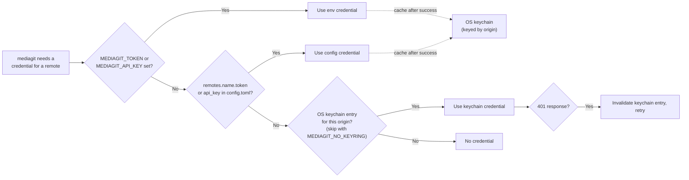

# MediaGit Configuration Reference

Complete reference for configuring the MediaGit **client** (`.mediagit/config.toml`) and the MediaGit **server** (`mediagit-server.toml`), plus the operational environment variables that sit on top of both. Version: 0.3.0-rc.4.

All facts below were verified directly against the source (`crates/mediagit-config/src/schema.rs`, `crates/mediagit-server/src/config.rs`, `crates/mediagit-server/src/main.rs`, `crates/mediagit-cli/src/repo.rs`, and related read-sites) rather than assumed. Where a setting is defined but not actually wired to any runtime behavior, that is called out explicitly rather than left implied.

---

# Part 1 — Client: `.mediagit/config.toml`

## File location

```
<repo-root>/.mediagit/config.toml
```

Created by `mediagit init` / `mediagit clone`. All sections are optional in the file itself — any key not present falls back to its Rust-side default (`#[serde(default)]` in `schema.rs`). Loading goes through `Config::load()` (`crates/mediagit-config/src/schema.rs:174`), which parses the TOML directly — it does **not** apply the environment-variable overlay described in the crate's `README.md`/`lib.rs` doc comment (`apply_env_overrides` / `load_with_overrides`); that overlay method exists in `mediagit-config` but has no caller outside its own tests, so the `MEDIAGIT_APP_*`, `MEDIAGIT_COMPRESSION_*`, `MEDIAGIT_MAX_CONCURRENCY`, `MEDIAGIT_BUFFER_SIZE`, `MEDIAGIT_HTTPS_ENABLED`, and `MEDIAGIT_AUTH_ENABLED` env vars documented in that README do not affect a real `mediagit` invocation today.

## Minimal example

```toml
[author]
name = "Alice Smith"
email = "alice@example.com"
```

## Full example (as written by `mediagit init`)

`mediagit init` writes every section below with its default values (only `[storage]` and the top-level identity keys are customized at init time) — the file is not sparse in practice, even though every key is technically optional:

```toml
cdc_seed = 4891203847502938471
repo_namespace = "my-project"
layout_version = 2
repo_id = "a1b2c3d4-..."
config_version = 2

[author]
name = "Alice Smith"
email = "alice@example.com"

[storage]
backend = "filesystem"
base_path = "./.mediagit/objects"
create_dirs = true
sync = false
file_permissions = "0644"

[compression]
enabled = true
algorithm = "zstd"
level = 3
min_size = 1024

[performance]
max_concurrency = 8
buffer_size = 65536

[performance.cache]
enabled = true
cache_type = "memory"
max_size = 536870912  # 512 MB
ttl = 3600

[performance.connection_pool]
min_connections = 1
max_connections = 10
timeout = 30
idle_timeout = 600

[performance.timeouts]
request = 60
read = 30
write = 30
connection = 30

[observability]
log_level = "info"
log_format = "json"
tracing_enabled = true
sample_rate = 0.1

[observability.metrics]
enabled = true
port = 9090
endpoint = "/metrics"
interval = 60

[remotes.origin]
url = "http://media-server.example.com/my-project"

[protected_branches.main]
prevent_force_push = true
prevent_deletion = true
require_reviews = false
min_approvals = 1
```

---

## Top-level — repository identity & layout

Written once at `mediagit init` / `clone`; not meant to be hand-edited.

| Key | Type | Default | Description |
|-----|------|---------|-------------|
| `cdc_seed` | u64 | `0` | Per-repo content-defined chunking seed. Generated at `init`, propagated to clones via protocol capabilities. `0` reproduces legacy unseeded chunk boundaries (pre-existing repos). |
| `repo_namespace` | string \| absent | *(derived)* | Per-repo storage namespace (layout v2): every object key is prefixed `<repo_namespace>/` so one bucket/root can host multiple repos. Absent on pre-v2 repos (falls back to a sanitized repo-dir basename). Never change it after init — existing keys would be orphaned. |
| `layout_version` | u32 | `1` if the field is absent from the file; new repos get `CURRENT_LAYOUT_VERSION` (`2`) | Physical storage layout version (`1` = flat pre-namespace, `2` = namespaced + hash fanout). Mirrored in the storage root's `LAYOUT` marker; a mismatched client fails fast. |
| `repo_id` | string \| absent | *(generated)* | Unique repo identifier recorded in the `LAYOUT` marker so a namespace collision between independent repos is a hard error instead of a silent key-space merge. |
| `config_version` | u32 | `0` if absent | `config.toml` schema version, migrated automatically by `MigrationManager` on load (distinct from `layout_version`). |

## `[author]` — author identity

Used when creating commits.

| Key | Type | Default | Description |
|-----|------|---------|-------------|
| `name` | string \| absent | absent | Display name on commits. Precedence: `MEDIAGIT_AUTHOR_NAME` env var (`crates/mediagit-cli/src/commands/commit.rs:253`, and similarly in `lock.rs`, `merge.rs`, `tag.rs`) > `[author].name` in config.toml > `$USER`. |
| `email` | string \| absent | absent | Email address on commits. |

## `[storage]` — storage backend

Selected with the `backend` key. All backend-specific fields sit **directly under `[storage]`** alongside `backend` — there is no nested `[storage.s3]`/`[storage.filesystem]` table. `StorageConfig` is a Rust enum tagged on `backend` (`schema.rs:332-354`), so exactly one backend's fields apply per repo.

### Local filesystem (default)

```toml
[storage]
backend = "filesystem"
base_path = "./data"
create_dirs = true
sync = false
file_permissions = "0644"
```

| Key | Type | Default | Description |
|-----|------|---------|-------------|
| `backend` | string | `"filesystem"` | Must be `"filesystem"`. |
| `base_path` | string | `"./data"` | Storage root directory. |
| `create_dirs` | bool | `true` | Auto-create directories. |
| `sync` | bool | `false` | Sync writes to disk (slower, safer). |
| `file_permissions` | string | `"0644"` | Octal file permission string. |

### Amazon S3 (also used for S3-compatible services, e.g. MinIO)

```toml
[storage]
backend = "s3"
bucket = "my-bucket"
region = "us-east-1"
endpoint = "http://localhost:9000"   # MinIO / non-AWS S3-compatible endpoint
prefix = ""
access_key_id = "AKIA..."
secret_access_key = "..."
```

| Key | Type | Default | Description |
|-----|------|---------|-------------|
| `backend` | string | — | Must be `"s3"`. |
| `bucket` | string | — | **Required.** S3 bucket name. |
| `region` | string | — | **Required.** AWS region. |
| `access_key_id` | string \| absent | absent | **Required in practice** — see below. |
| `secret_access_key` | string \| absent | absent | **Required in practice** — see below. |
| `endpoint` | string \| absent | absent | Custom endpoint — set this to point at MinIO or another S3-compatible service (e.g. `http://localhost:9000`). |
| `prefix` | string | `""` | Object key prefix. |

**Credentials come from this file and nowhere else.** There is no environment-variable
override and no IAM-role/instance-profile path: `create_storage_backend`
(`mediagit-cli/src/repo.rs`) passes `access_key_id`/`secret_access_key` straight
through, and `MinIOBackend::new_with_prefix` rejects an empty key outright
("access key cannot be empty"). `MinIOBackend::from_env` exists and reads
`MINIO_*`, but nothing in the shipping binaries calls it. The schema comment
saying these "can be overridden via env" describes an override that was never
implemented.

Two consequences worth planning around:

- Secrets live on disk in the repo's own `.mediagit/config.toml`. On Unix,
  MediaGit warns when that file is world-readable. Treat the file as a secret.
- Automation that has credentials in the environment must **render** them into
  `config.toml` rather than exporting them. That is exactly what this project's
  own QA harness does — it substitutes `AWS_ACCESS_KEY_ID` into a config
  template; the variable never reaches `mediagit` itself.

> **Not supported, despite appearing in earlier revisions of this document:**
> `encryption` and `encryption_algorithm` under `[storage]`. There are no such
> fields on `S3Storage` and no server-side-encryption code on any S3 path. The
> client config is not `deny_unknown_fields`, so these keys **parse without
> complaint and do nothing** — the worst shape for a security setting. For
> encryption that is real, see at-rest encryption (`mediagit key`), which
> encrypts object contents before they ever reach the bucket.

### Azure Blob Storage

```toml
[storage]
backend = "azure"
container = "media-container"
prefix = ""
auth = { type = "account_key", account_name = "mystorageaccount", account_key = "..." }
```

Credentials sit in a tagged `auth` block (`config_version` 3+). Variants:
`account_key` (`account_name` + `account_key`), `connection_string` (`value`),
`sas` (`account_name` + `token`), `emulator` (no fields, local Azurite). The
pre-v3 flat form is migrated automatically on first open; ambiguous or empty
flat configs fail with a message naming the replacement block. The backend
runs on Apache OpenDAL; presign is Service SAS from the account key (see
`KNOWN_LIMITATIONS.md` for the Azurite presign caveat).

| Key | Type | Default | Description |
|-----|------|---------|-------------|
| `backend` | string | — | Must be `"azure"`. |
| `account_name` | string | — | **Required.** Storage account name. |
| `account_key` | string \| absent | absent | Storage account key (prefer env var). |
| `container` | string | — | **Required.** Blob container name. |
| `prefix` | string | `""` | Blob path prefix. |
| `connection_string` | string \| absent | absent | Full connection string (alternative to `account_name`/`account_key`). |

### Google Cloud Storage

```toml
[storage]
backend = "gcs"
bucket = "my-gcs-bucket"
project_id = "my-gcp-project"
prefix = ""
# credentials_path, or Application Default Credentials
```

| Key | Type | Default | Description |
|-----|------|---------|-------------|
| `backend` | string | — | Must be `"gcs"`. |
| `bucket` | string | — | **Required.** GCS bucket name. |
| `project_id` | string | — | **Required.** GCP project ID. |
| `credentials_path` | string \| absent | absent | Path to service-account JSON key (prefer `GOOGLE_APPLICATION_CREDENTIALS`/ADC). |
| `prefix` | string | `""` | Object prefix. |

There is also a `"multi"` backend variant (`MultiBackendStorage`: `primary`, `replicas`, `backends`) defined in the schema; it is not covered further here as it is not part of the verified request scope for this document.

---

## `[compression]` — informational only, not read at runtime

| Key | Type | Default | Description |
|-----|------|---------|-------------|
| `enabled` | bool | `true` | (Informational) `SmartCompressor` is always active regardless of this value. |
| `algorithm` | string | `"zstd"` | (Informational) Actual algorithm is selected per file type, not from this key. |
| `level` | integer | `3` | (Informational) Actual level is selected per file type. |
| `min_size` | integer | `1024` | (Informational) Not enforced. |

Verified: nothing outside `mediagit-config` itself (schema/loader/validation/tests/README) reads `config.compression.*`. `mediagit init` writes this section with defaults, but `SmartCompressor` (in `mediagit-versioning`) makes its algorithm/level choice purely from file type — there is no code path connecting this table to compression behavior.

**Automatic algorithm selection by file type** (always active, not configurable):
- Already-compressed formats (JPEG, MP4, ZIP, DOCX, AI, PDF): stored as-is (`none`)
- PSD, raw formats, 3D models: `zstd` at `Best` level (22)
- Text, JSON, TOML: `zstd` at `Default` level (3)
- ML checkpoints: `zstd` at `Fast` level (1)

---

## `[performance]` — performance tuning

| Key | Type | Default | Description |
|-----|------|---------|-------------|
| `max_concurrency` | usize | `num_cpus::get().max(4)` | Max parallel operations. Not observed to be read outside `mediagit-config` — verify before relying on it to bound a specific operation; use the concurrency knobs below for chunk upload/download/pack behavior. |
| `upload_concurrency` | usize \| absent | `None` | Client-side parallel chunk-upload concurrency override. When unset, falls back to `MEDIAGIT_UPLOAD_CONCURRENCY` env var, then an internal default of 32. Read in `crates/mediagit-cli/src/commands/push.rs`. |
| `download_concurrency` | usize \| absent | `None` | Client-side parallel chunk-download concurrency override. Falls back to `MEDIAGIT_DOWNLOAD_CONCURRENCY`, then an internal default of 24. |
| `pack_workers` | usize \| absent | `None` | Server-side concurrent pack-write worker override. Falls back to `MEDIAGIT_PACK_WORKERS`, then an internal default of 8. |
| `chunk_write_concurrency` | usize \| absent | `None` | Parallel chunk-write concurrency override. Falls back to `MEDIAGIT_CHUNK_WRITE_CONCURRENCY`, then an internal default of `num_cpus`. |
| `buffer_size` | usize | `65536` (64 KB) | I/O buffer size in bytes. |

### `[performance.cache]`

| Key | Type | Default | Description |
|-----|------|---------|-------------|
| `enabled` | bool | `true` | Enable in-memory object cache. |
| `cache_type` | string | `"memory"` | Cache type. |
| `max_size` | u64 | `536870912` (512 MB) | Max cache size in bytes. |
| `ttl` | u64 | `3600` | Cache entry TTL in seconds. |
| `compression` | bool | `false` | Compress cached objects. |

### `[performance.connection_pool]`

| Key | Type | Default | Description |
|-----|------|---------|-------------|
| `min_connections` | usize | `1` | Minimum pool connections. |
| `max_connections` | usize | `10` | Maximum pool connections. |
| `timeout` | u64 | `30` | Connection timeout, seconds. |
| `idle_timeout` | u64 | `600` | Idle connection timeout, seconds. |

### `[performance.timeouts]`

| Key | Type | Default | Description |
|-----|------|---------|-------------|
| `request` | u64 | `60` | Total request timeout, seconds. |
| `read` | u64 | `30` | Read timeout, seconds. |
| `write` | u64 | `30` | Write timeout, seconds. |
| `connection` | u64 | `30` | Connection timeout, seconds. |

Note: `cache`, `connection_pool`, and `timeouts` are struct fields with no `#[serde(default)]` derive shown at the field level, but each nested type implements `Default`, and the containing `PerformanceConfig` is only ever constructed via `Default` or full deserialization — practically, an absent `[performance.cache]` etc. table in the TOML falls back to that type's `Default` impl (`schema.rs:1034-1066`).

---

## `[observability]` — logging and tracing

| Key | Type | Default | Description |
|-----|------|---------|-------------|
| `log_level` | string | `"info"` | `"error"` \| `"warn"` \| `"info"` \| `"debug"` \| `"trace"`. |
| `log_format` | string | `"json"` | `"json"` or `"text"`. |
| `tracing_enabled` | bool | `true` | Enable distributed tracing. |
| `sample_rate` | f64 | `0.1` | Trace sampling rate (0.0–1.0). |

### `[observability.metrics]`

| Key | Type | Default | Description |
|-----|------|---------|-------------|
| `enabled` | bool | `true` | Enable Prometheus metrics. |
| `port` | u16 | `9090` | Metrics HTTP server port. |
| `endpoint` | string | `"/metrics"` | Metrics endpoint path. |
| `interval` | u64 | `60` | Collection interval, seconds. |

This `[observability]` table is part of the client schema (round-trips through `mediagit init`); it is distinct from the server's own metrics wiring (`MEDIAGIT_METRICS_ADDR`, see Part 3), and the CLI's own logging is not observed to read `RUST_LOG` at all — see Part 3.

---

## `[security]` — present in the schema, not applied by the client or the server

| Key | Type | Default | Description |
|-----|------|---------|-------------|
| `https_enabled` | bool | `false` | — |
| `tls_cert_path` | string \| absent | absent | — |
| `tls_key_path` | string \| absent | absent | — |
| `api_key` | string \| absent | absent | — |
| `auth_enabled` | bool | `false` | — |
| `cors_origins` | array | `["http://localhost:3000"]` | — |
| `rate_limiting` | table | `{ enabled = false, requests_per_second = 1000, burst_size = 2000 }` | — |

> `encryption_at_rest` and `encryption_key_path` were listed here until
> 2026-08-17. They have been **removed from the schema** — nothing ever read
> them, so they looked like an at-rest encryption switch and silently were not
> one. At-rest encryption is per repository via `mediagit key init`; the server
> side is `[encryption]` in `mediagit-server`'s own config.

**Verified:** `config.security.*` (and `config.app.*`, also present in the schema) is never read anywhere outside `mediagit-config`'s own loader/validation/tests. `mediagit init` writes this section with its defaults into every new `config.toml`, but it has no effect on either the CLI or `mediagit-server` — the actual server security/TLS/auth/rate-limit/CORS configuration lives entirely in `mediagit-server.toml` (Part 2 of this document). Treat `[security]` in the client config as vestigial; do not rely on it to configure server behavior.

---

## `[remotes.<name>]` — remote repositories

```toml
[remotes.origin]
url = "http://media-server.example.com/my-project"

[remotes.backup]
url = "http://backup-server.example.com/my-project"
```

| Key | Type | Default | Description |
|-----|------|---------|-------------|
| `url` | string | — | **Required.** Remote server URL. |
| `fetch` | string \| absent | `url` | Fetch URL if different from `url`. |
| `push` | string \| absent | `url` | Push URL if different from `url`. |
| `default_fetch` | bool \| absent | absent | Default-fetch flag. |
| `token` | string \| absent | absent | JWT bearer token for this remote. Stored in plaintext; reading it triggers a world/group-readable-file warning. |
| `api_key` | string \| absent | absent | API key for this remote. Same plaintext-storage caveat as `token`; `token` wins if both are set. |

**Credential resolution precedence** (verified in `crates/mediagit-cli/src/repo.rs:152-185`, function `resolve_credentials`, used by every remote command — fetch, pull, push, clone, download, lock):



Note: `RemoteConfig`'s doc comment in `schema.rs` (`token`: "Highest-precedence credential source — checked before `MEDIAGIT_TOKEN`/`MEDIAGIT_API_KEY`") does not match this actual resolution order in `repo.rs` — the env vars are checked first. The precedence above reflects the real code path; the doc comment is stale.

On a successful request, `remember_credentials` writes the credentials used into the OS keychain (unless `MEDIAGIT_NO_KEYRING` is set) so subsequent commands resolve from the faster keychain tier.

---

## `[branches.<name>]` — branch tracking

```toml
[branches.main]
remote = "origin"
merge = "refs/heads/main"
```

Set automatically by `mediagit push -u origin main`. Rarely edited manually.

## `[protected_branches.<name>]` — branch protection

```toml
[protected_branches.main]
prevent_force_push = true
prevent_deletion = true
require_reviews = false
min_approvals = 1
```

| Key | Type | Default | Description |
|-----|------|---------|-------------|
| `prevent_force_push` | bool | `true` | Block force pushes. |
| `prevent_deletion` | bool | `true` | Block branch deletion. |
| `require_reviews` | bool | `false` | Require review before merge. |
| `min_approvals` | u32 | `1` | Minimum approvals required (when `require_reviews` is true). |

---

# Part 2 — Server: `mediagit-server.toml`

Every key in `ServerConfig` (`crates/mediagit-server/src/config.rs:24-89`), `#[serde(deny_unknown_fields)]` — an unrecognized key or section (including a `[storage]` table, see below) fails config load with a parse error rather than being silently ignored.

| Key | Type | Default | Description |
|-----|------|---------|-------------|
| `port` | u16 | `3000` | HTTP listen port. |
| `host` | string | `"127.0.0.1"` | Bind address. |
| `repos_dir` | path | `"./repos"` | Directory containing served repositories. |
| `enable_tls` | bool | `false` | Enable HTTPS/TLS. Requires the binary to be built with the `tls` Cargo feature — `enable_tls = true` on a non-`tls` build fails at boot rather than silently serving plain HTTP. |
| `tls_port` | u16 | `3443` | HTTPS listen port (when `enable_tls = true`). |
| `tls_cert_path` | path \| absent | absent | TLS certificate (PEM). Required unless `tls_self_signed`. |
| `tls_key_path` | path \| absent | absent | TLS private key (PEM). Required unless `tls_self_signed`. |
| `tls_self_signed` | bool | `false` | Generate a self-signed certificate for `localhost` at boot (development only). |
| `tls_min_version` | `"1.2"` \| `"1.3"` \| absent | `"1.3"` | Minimum TLS protocol version to accept. Escape hatch for TLS 1.2-only clients/proxies; any other value fails config load. |
| `enable_auth` | bool | `false` | Enable JWT/API-key authentication. |
| `jwt_secret` | string \| absent | absent | Required when `enable_auth = true` (or set via `MEDIAGIT_JWT_SECRET`, which takes precedence — see Part 3). |
| `presigned_url_ttl_seconds` | u64 | `43200` (12 h) | TTL for presigned PUT URLs issued for direct-to-bucket uploads. Lower this if your cloud credentials use short-lived STS sessions. |
| `enable_rate_limiting` | bool | `false` | Enable request rate limiting. |
| `rate_limit_rps` | u64 | `10` | Requests per second, when rate limiting is enabled. |
| `rate_limit_burst` | u32 | `20` | Burst allowance, when rate limiting is enabled. |
| `auth_store_dir` | path \| absent | *(resolved)* | Directory for `users.jsonl`/`api_keys.jsonl`. When unset, resolves to a sibling `auth/` directory next to `repos_dir` (`resolved_auth_store_dir`, `config.rs:190-197`) — e.g. `repos_dir = "./repos"` → `./auth`. |
| `cors_allowed_origins` | array \| absent | absent (no CORS layer at all) | Allowed CORS origins, exact match (e.g. `"https://app.example.com"`). When unset, the server adds **no** CORS layer and emits no CORS headers — this is stricter than "allow none with headers present." |
| `verify_content_on_complete` | bool | `true` | Server-enforced BLAKE3 content verification of presigned uploads — chunk completion (`POST /:repo/chunks/complete`) and pack registration (`POST /:repo/packs/complete`). Verification runs in the **background**; pushes do not wait for it. See below. |

### How verification works, and what it costs (measured 2026-07-30)

Presigned uploads go client→bucket directly, so the server never sees those bytes.
The only way it can check them is to read them back — and doing that *synchronously*
was unaffordable.

**Measured on real S3:** a 1 GB push with synchronous verification was still
unfinished after 42 minutes, having verified 569 MiB at an aggregate **0.226 MiB/s**
— 33× slower than the ~7.5 MiB/s upload it accompanies, extrapolating to **~12.6
hours for a 10 GB push** against ~20 minutes without.

The cost was **contention, not bandwidth**. The client uploads packs concurrently, so
N `complete_pack` requests each pulled a whole 64 MiB pack back over the same link at
once. Throughput decayed monotonically as they piled up; the final pack, running
alone, was **45× faster**:

| pack | size | elapsed | throughput |
|---|---|---|---|
| 1 | 65.0 MiB | 1147.8 s | 0.057 MiB/s |
| 4 | 66.0 MiB | 1461.2 s | 0.045 MiB/s |
| 8 | 65.7 MiB | 2021.0 s | 0.032 MiB/s |
| **9 (alone)** | 37.1 MiB | **25.4 s** | **1.458 MiB/s** |

**So verification no longer blocks the push.** `complete_pack` writes a durable
`.pending` marker, registers the pack, and returns; a background worker verifies it
under a serialising semaphore (`MEDIAGIT_PACK_VERIFY_PACK_CONCURRENCY`, default 1 —
queueing for one shared link beats fighting over it). Push cost returns to upload
speed.

Two separate knobs, easy to confuse because until 2026-08-20 they shared one name:

| Variable | Axis | Default |
|---|---|---|
| `MEDIAGIT_PACK_VERIFY_PACK_CONCURRENCY` | how many **packs** verify at once | 1 |
| `MEDIAGIT_PACK_VERIFY_CONCURRENCY` | range-reads **inside one pack** | 16 |
| `MEDIAGIT_PACK_VERIFY_BUDGET_SECS` | wall-clock ceiling for one verify attempt | 300 |

Raising the pack axis is the intuitive cure for "my clone is stuck waiting on
verification" and it is the wrong one: measured 2026-08-20 against live GCS,
16 permits turned a 512 MB clone from **131 s into 2042 s** (15.5x worse), because
concurrent whole-pack read-backs thrash the one shared link — the same effect the
table above shows at 9-in-flight.

The budget is what actually protects a clone. A pack whose read *trickles* rather
than stops cannot be caught by a no-progress deadline: on 2026-08-20 one pack took
2628 s for 21 entries (~8 KB/s) while holding the single verify permit, and a clone
blocked behind it for 44 minutes. On breach the pack is parked (nothing
quarantined, no URL minted) so the remaining packs are not held hostage.

**Reads are never speculative**, which is what makes that safe:

| Read path | Behaviour for an **unverified** pack | For a **verified** pack |
|---|---|---|
| `download_chunk` | verifies the requested slice inline (bytes already in hand) | serves directly |
| `batch_get_pack_chunks` | same inline slice check | serves directly |
| `presign_pack_downloads` | verifies the **whole** pack before minting | **mints immediately, zero added cost** |

`presign_pack_downloads` verifies the whole pack because once a URL is minted the
server is permanently out of that request path — there is no revocation, only
expiry (`presigned_url_ttl_seconds`, default 12 h). A pack is unverified only for the
short window between push and the background worker finishing, so in steady state
every pull mints immediately and **media keeps travelling client↔bucket directly in
both directions**.

**Crash safety.** The `.pending` marker is written *before* the manifest and is the
source of truth: marker present ⇒ unverified. A crash mid-verification leaves the
marker, and the startup sweep re-queues that pack rather than silently trusting it.
An unreadable marker is logged and the pack left unverified — it never prevents boot.

**Turning it off** drops back to existence-only checks, which accept any bytes under
a claimed id: a client holding `repo:write` could poison the store, and nothing would
notice until someone reconstructed the file. There is no longer a performance reason
to disable it.

**Always on regardless of this setting:** the proxy upload path
(`PUT /:repo/chunks/:id`) verifies unconditionally. That check is free — the server
already holds those bytes in memory.


### No `[storage]` section here

Storage backend configuration is **per-repo**, living in each served repository's own `.mediagit/config.toml` under `[storage]` (see Part 1). `mediagit-server.toml` has no storage keys at all — including one would fail to parse due to `deny_unknown_fields`.

### Config discovery

- Default config path is `mediagit-server.toml` in the process's current working directory.
- If that default path is missing, the server falls back to built-in defaults and logs a warning (`ServerConfig::load`, `config.rs:148-175`) — first-run operators still get a working (loopback, no-auth) server.
- If an explicit path is given via `-c`/`--config` and that file is missing, the server **errors out** instead of silently using defaults — this prevents an operator from thinking S3/TLS/auth config is wired in when it isn't.

### CLI-argument overrides

`mediagit-server` (`crates/mediagit-server/src/main.rs:28-89`) accepts:

| Flag | Overrides |
|------|-----------|
| `-p`, `--port <PORT>` | `port` |
| `--host <HOST>` | `host` |
| `--data-dir <PATH>` | `repos_dir` |
| `-c`, `--config <PATH>` | which config file is loaded (default `mediagit-server.toml`) |

CLI flags are applied after the config file is loaded, so they win over whatever the file says.

---

# Part 3 — Environment Variables

## Precedence rule

Where both an environment variable and a TOML key configure the same thing, **the environment variable wins**, e.g. `MEDIAGIT_JWT_SECRET` overrides `jwt_secret` (server logs a warning if both are set and different). Client credential resolution has its own five-tier precedence — see [`[remotes.<name>]`](#remotesname--remote-repositories) above: `MEDIAGIT_TOKEN`/`MEDIAGIT_API_KEY` > OS keychain > `remotes.<name>.token`/`.api_key` in config.toml.

## Operational environment variables

| Variable | Default | Effect |
|----------|---------|--------|
| `MEDIAGIT_JWT_SECRET` | unset | Server: JWT signing secret, used when `enable_auth = true`. Wins over the config file's `jwt_secret` key (warns if both set). Required — from either source — when auth is enabled. |
| `MEDIAGIT_ALLOW_INSECURE_BIND` | unset | Server: set to `1` to allow binding a non-loopback host with `enable_auth = false`. Without it, the server refuses to start in that combination (`main.rs:120-131`). |
| `MEDIAGIT_METRICS_ADDR` | unset (metrics endpoint off) | Server: set to `host:port` (e.g. `127.0.0.1:9090`) to start a separate Prometheus `/metrics` listener at boot. Invalid `host:port` logs an error and leaves metrics disabled. |
| `MEDIAGIT_STARTUP_PROBE` | on (any value except `"0"`) | Server: validates every served repo's storage backend at boot before accepting traffic (30 s timeout across up to 4 concurrent probes). Set to `0` to skip. |
| `MEDIAGIT_TOKEN` | unset | Client: bearer token, highest-precedence credential source for talking to a remote. |
| `MEDIAGIT_API_KEY` | unset | Client: API-key credential, checked after `MEDIAGIT_TOKEN`. Also read directly by the server's env-override path in `mediagit-config`'s (unused-by-CLI) loader — not a server runtime effect in practice; see the client credential precedence for the path that matters. |
| `MEDIAGIT_NO_KEYRING` | unset | Client: when set (any value), skips the OS-keychain credential tier entirely on both read and write. |
| `MEDIAGIT_REPO` | unset | Client: repo root override, set internally by `-C <path>`/some multi-step commands (rebase, merge, stash, cherry-pick) to guard the working repo across `.await` points. Not generally meant to be set by hand. |
| `MEDIAGIT_AUTHOR_NAME` | unset | Client: author name for new commits/locks/tags/merges. Precedence: this env var > `[author].name` in config.toml > `$USER`. |
| `MEDIAGIT_AUTH_PERSIST` | on (any value except `"0"`) | Server: persist auth state (`users.jsonl`, `api_keys.jsonl`) to `auth_store_dir`. Set to `0` to force in-memory-only auth (no load, no save) — a persistence failure is otherwise a hard error. |
| `MEDIAGIT_GRANTS_ENFORCE` | on (any value except `"0"`, unless no grants have ever been configured — backward-compat) | Server: enforce per-repo access grants. Set to `0` to disable enforcement. |
| `MEDIAGIT_LOCKS_ENFORCE` | on (any value except `"0"`) | Server: enforce file-lock checks on push. Set to `0` to disable. |
| `MEDIAGIT_LOCKS_MAX_COMMITS` | `1000` | Server: lock enforcement fails open (allows the push) if the pushed commit range exceeds this many commits — bounds the cost of the tree-diff walk. |
| `MEDIAGIT_SIGN` | off | Client: when truthy (`"1"`/`"true"`), sign new annotated tags with SSHSIG (namespace `mediagit-tag`) using the key from `MEDIAGIT_SIGN_KEY`. |
| `MEDIAGIT_SIGN_KEY` | unset | Client: path to the private key used for tag signing when `MEDIAGIT_SIGN` is enabled. Required in that case — signing errors out if unset. |
| `RUST_LOG` | `mediagit_server=debug,tower_http=debug,mediagit_storage=warn` | Server only (`tracing_subscriber::EnvFilter`, `main.rs:61-68`). Overrides `[observability].log_level`/that whole client-side table, which is not read by either binary. The CLI does not initialize `tracing_subscriber` and does not read `RUST_LOG`. |

The full ~88-knob performance/tuning catalog (chunking, compression, upload/download concurrency, pack workers, retry/backoff, timeouts, etc.) lives in [`env-knobs.md`](env-knobs.md) and [`book/src/reference/environment.md`](book/src/reference/environment.md) — this table covers only the operational (auth/bind/metrics/locking/signing) set, not the performance-tuning knobs.

---

## Unverifiable / not independently confirmed

- The exact default `layout_version` shown in the "top-level identity" table (`1` when the field is absent, `2` for new repos) is derived from `default_layout_version()` and `CURRENT_LAYOUT_VERSION` in `schema.rs`; I did not additionally trace every migration path that might touch it.
- `MEDIAGIT_API_KEY`'s row notes that `mediagit-config`'s env-override path also reads it; I did not exhaustively check whether any other, non-CLI consumer of `mediagit-config::ConfigLoader::apply_env_overrides` exists outside this repository (e.g. a downstream tool) — within this repo, no caller exists outside its own tests/README.
- I did not open `env-knobs.md` or `book/src/reference/environment.md` to verify their contents match current code (only confirmed both files exist) — Part 3 defers the full knob catalog to them by reference, not by transcription, so any drift there is out of scope for this document.
- `max_concurrency` under `[performance]`: I confirmed no read-site outside `mediagit-config` itself; I did not exhaustively grep for indirect consumption through a cloned/threaded `PerformanceConfig` value, so "not observed to be read" is a search result, not a proof of dead code.
