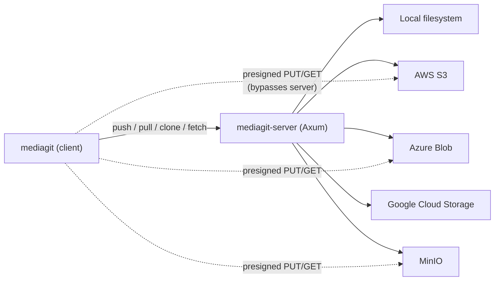
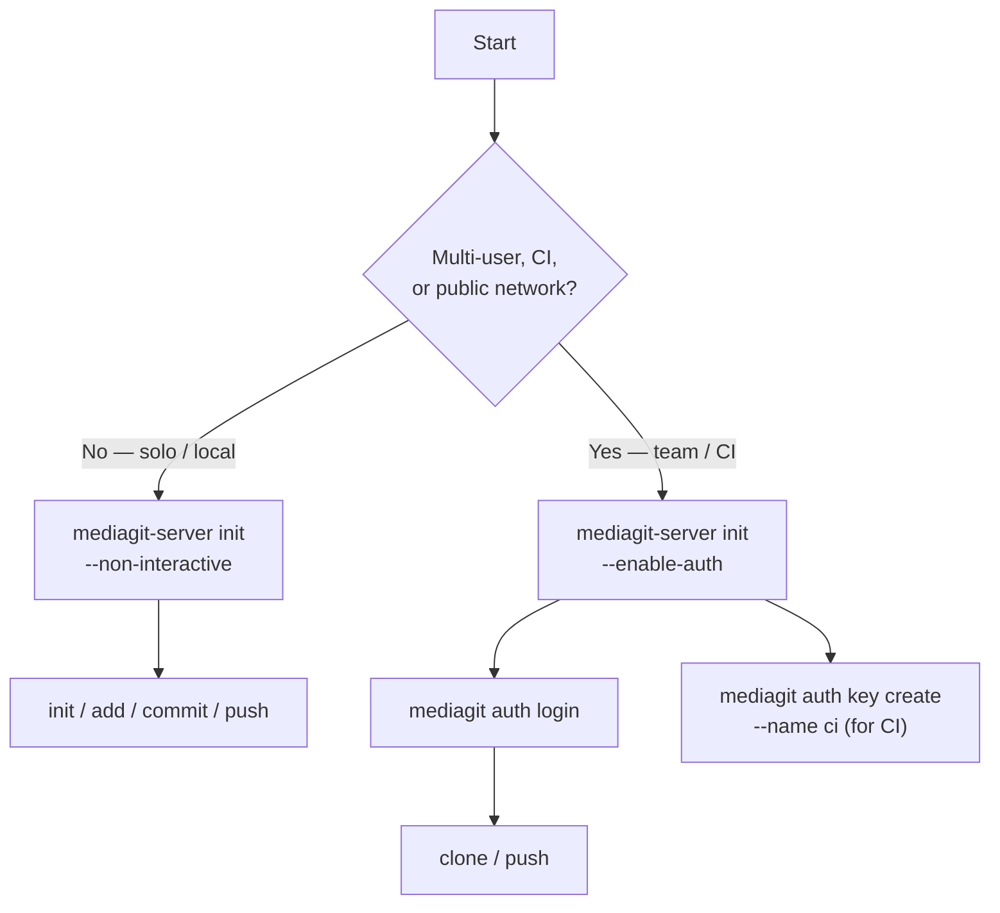
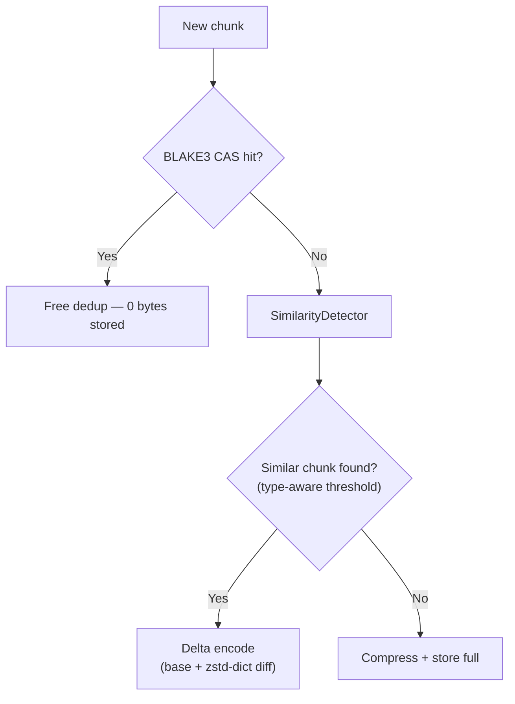

# MediaGit-Core 🎬

> High-performance version control for large media files and binary assets

[](https://github.com/winnyboy5/mediagit-core/actions)
[](LICENSE)
[](https://www.rust-lang.org)
[](FUTURE_TODOS.md)

## 🎯 Status

**Version**: v0.3.0-rc.4
**Status**: 🚧 **RELEASE CANDIDATE**
**Features**: 100% complete (all P0–P3 items from the rc.3 feature-completeness sprint implemented — a closed batch, distinct from the forward-looking backlog in [FUTURE_TODOS.md](FUTURE_TODOS.md), which reuses the same P0–P3 labels as effort/impact tiers for planned work)
**Last Validated**: August 6, 2026 — SCALE QA campaign (`reports/20260806-scale-full`), 0 failures across MinIO, AWS S3, Azure Blob, GCS and local
**Not yet in a campaign**: at-rest encryption (DC-7), added in rc.3. Covered by the workspace suite including an end-to-end encrypted push and read-back over a real server, but no cloud-backend campaign has run against it yet.
**🚨 WARNING 🚨**: This project is under active development. Be aware that large breaking changes may happen before 1.0 is reached.

✅ **614/614 deep-tests passing** across MinIO, AWS S3 (ap-south-1), Azure Blob (South India), Google Cloud Storage
✅ **32 CLI commands validated end-to-end** — 0 crashes, 0 data corruption across all 4 cloud backends
✅ **27+ file types tested** (58 GB dataset) across video, audio, 3D, image, design, ML
✅ **26.3–26.5% storage savings** measured on cloud backends (compression + dedup + delta, validated June 2026)
✅ **Files up to 398 MB** staged and transferred; single-file scalability to 6 GB tested

| Metric | Result |
|--------|--------|
| **Staging (small files < 5 MB)** | 25–182 MB/s |
| **Staging (large video/PSD, no chunking)** | 80–240 MB/s |
| **Staging (chunked files 5–60 MB)** | 2.8–5.2 MB/s |
| **Network push (local server, pack negotiation)** | **134–267 MB/s** (227 MB video, loopback) |
| **Network push (cloud WAN, South Asia)** | ~1.0–2.1 MB/s (WAN-bound, ~260 MB corpus) |
| **Network clone (local server)** | 100 MB/s (150 MB local server) |
| **Network clone (cloud WAN, South Asia)** | 0.03–0.10 MB/s (WAN-bound) |
| **Commit latency** | 30–52 ms (constant regardless of file size) |
| **Storage savings (validated, June 2026)** | **26.3–26.5%** across 4 cloud backends (MinIO, AWS, Azure, GCS) |
| **Storage savings (average mixed media)** | ~30% (compression + dedup + delta) |
| **Exact dedup (CAS): exact duplicate** | 99.9% savings (CAS hit, 0.7 KB overhead) |
| **Exact dedup (CAS): 3× identical MP4** | 66% savings |
| **Exact dedup (CAS): small edit to large file** | 70–95% chunk reuse via CDC + CAS |
| **Similarity delta: STL/OBJ text mesh** | 40–70% savings |
| **Similarity delta: GLB/FBX binary** | 20–52% savings |
| **Similarity delta: PSD/WAV** | 35–65% savings |

---

## Overview

MediaGit is a Git-like version control system optimized for large media files. Built in Rust for maximum performance, security, and reliability.



### Why MediaGit?

Traditional Git struggles with large binary files. MediaGit solves this with:

- **Intelligent Chunking**: Split large files for efficient storage and transfer
- **Smart Compression**: Type-aware compression — lossless audio/RAW up to 55%, text/JSON up to 70%, pre-compressed video/JPEG stored as-is
- **Cloud-Native**: AWS S3, Azure Blob, Google Cloud Storage, MinIO
- **Media Intelligence**: PSD layer merging, video timeline parsing, audio track handling
- **High Performance**: 80–240 MB/s staging throughput for large files (release build)

### Key Features

🚀 **Performance** (release build, March 2026)
- **Pre-compressed files** (MP4, MOV, JPEG, USDZ): 25–240 MB/s — store-mode, zero CPU overhead
- **Compressible files** (PSD, TIFF, WAV): 2–120 MB/s — Zstd compression + optional chunking
- **Chunked large files** (GLB, FLAC, AI): 1.9–5.2 MB/s — CDC chunking + delta encoding
- **Network**: 167 MB/s push · 100 MB/s clone (local server, 150 MB dataset)
- **Commit latency**: 30–52 ms constant regardless of file size
- **Compression**: ~30% average storage savings across mixed media projects
- **Exact dedup (CAS)**: 66–99.9% savings when identical content is re-stored; CDC ensures chunk-level granularity
- **Similarity delta**: 15–65% savings for similar-but-changed chunks; FNV-1a sampler + type-aware thresholds

🎨 **Media-Aware Intelligence**
- **PSD Files**: Layer metadata extraction, auto-merge, conflict detection
- **Video**: Timeline parsing, non-overlapping edit merge
- **Audio**: Track-level merge, format metadata
- **3D Models**: OBJ, FBX, Blend, GLTF support

☁️ **Cloud Storage**
- **AWS S3**: Production-ready with encryption, lifecycle policies
- **Azure Blob**: Managed identity support, access tiers
- **Google Cloud Storage**: Service account auth, storage classes
- **MinIO**: S3-compatible local/private cloud (validated at 100+ MB/s)
- **Others**: Backblaze B2, DigitalOcean Spaces

📦 **Cloud Packs** (Phase-3 Track F)

Instead of uploading thousands of individual chunk objects, MediaGit bundles chunks into **pack objects** (≤ 64 MiB / ≤ 1,024 chunks each) with an embedded index. This collapses ~10,000 small objects into hundreds of packs per repo, cutting API request count and storage costs. Clone uses pack-locate + Range-GET so only needed slices are fetched. F8 integrity verifies every slice's compressed hash on pull.

- Deep tests: 463–467 chunked + 35 delta objects per backend — all fsck/F8 clean
- Release-build QA campaign (`reports/20260716-172951`): STANDARD suite green across MinIO, AWS, Azure, GCS, zero findings (July 16, 2026)

🔗 **Presigned-URL Transfer**

Uploads and downloads bypass the server entirely when the backend supports signing. The server mints presigned PUT/GET URLs; the client communicates directly with cloud storage. On unsigned backends (GCS with ADC) or 404, the client automatically falls back to server-proxy transfer. Large chunks use presigned multipart upload (MPU) on S3/MinIO.

🔒 **Security**
- At-rest encryption (XAES-256-GCM + Argon2id), opt-in per repository at creation time via `mediagit key init`. Push and clone work: the client escrows the repository key with the server, which holds it wrapped under a server master key and uses it to verify what it stores. Encrypting an *existing* repository is not supported yet
- JWT + API key authentication, persisted to disk (`users.jsonl`/`api_keys.jsonl`/`grants.jsonl`, atomic writes; `MEDIAGIT_AUTH_PERSIST`)
- Per-repo authorization grants (Read < Write < Admin; `MEDIAGIT_GRANTS_ENFORCE`) plus admin endpoints for user/key management
- OS-keychain credential storage for CLI remote credentials (Windows Credential Manager; env → config.toml → keychain)
- TLS 1.3 with certificate management (server TLS listener; mTLS not wired)
- Rate limiting and DoS protection

📁 **Supported File Formats (70+ extensions)**

| Category | MediaAware Chunking | Other Formats |
|----------|---------------------|---------------|
| **Video** | MP4, MOV, AVI, MKV, WebM | FLV, WMV, MPG |
| **Audio** | WAV (RIFF) | MP3, FLAC, AAC, OGG |
| **3D Models** | GLB, glTF | OBJ, FBX, Blend, STL |
| **Images** | — | JPEG, PNG, PSD, TIFF, RAW, EXR |
| **Documents** | — | PDF, SVG, EPS, AI |
| **Archives** | — | ZIP, TAR, 7Z |

---

## Quick Start

### Installation

#### Pre-built Binaries (Recommended)

Download the latest release for your platform from [GitHub Releases](https://github.com/winnyboy5/mediagit-core/releases).

**Linux / macOS — one-liner install:**
```bash
curl -fsSL https://raw.githubusercontent.com/winnyboy5/mediagit-core/main/install.sh | sh
```

**Linux x86_64 — manual:**
```bash
curl -fsSL https://github.com/winnyboy5/mediagit-core/releases/download/v0.3.0-rc.4/mediagit-0.3.0-rc.4-x86_64-linux.tar.gz \
  | tar xz -C /usr/local/bin
```

**macOS Apple Silicon — manual:**
```bash
curl -fsSL https://github.com/winnyboy5/mediagit-core/releases/download/v0.3.0-rc.4/mediagit-0.3.0-rc.4-aarch64-macos.tar.gz \
  | tar xz -C /usr/local/bin
```

**Windows x86_64 (PowerShell):**
```powershell
Invoke-WebRequest -Uri "https://github.com/winnyboy5/mediagit-core/releases/download/v0.3.0-rc.4/mediagit-0.3.0-rc.4-x86_64-windows.zip" -OutFile mediagit.zip
Expand-Archive mediagit.zip -DestinationPath "$env:LOCALAPPDATA\MediaGit\bin"
# Add to PATH:
[Environment]::SetEnvironmentVariable("Path", "$env:Path;$env:LOCALAPPDATA\MediaGit\bin", "User")
```

#### Docker

```bash
docker pull ghcr.io/winnyboy5/mediagit-core:0.3.0-rc.4
docker run --rm ghcr.io/winnyboy5/mediagit-core:0.3.0-rc.4 mediagit --version
```

#### From Source

```bash
# Requires Rust 1.97+
git clone https://github.com/winnyboy5/mediagit-core.git
cd mediagit-core
cargo build --release

# Binaries at:
# ./target/release/mediagit
# ./target/release/mediagit-server
```

#### All Available Archives

| Platform | Archive |
|----------|---------|
| Linux x86_64 | `mediagit-0.3.0-rc.4-x86_64-linux.tar.gz` |
| Linux ARM64 | `mediagit-0.3.0-rc.4-aarch64-linux.tar.gz` |
| macOS Intel | `mediagit-0.3.0-rc.4-x86_64-macos.tar.gz` |
| macOS Apple Silicon | `mediagit-0.3.0-rc.4-aarch64-macos.tar.gz` |
| Windows x86_64 | `mediagit-0.3.0-rc.4-x86_64-windows.zip` |

Each archive includes `mediagit` (CLI) and `mediagit-server` binaries, plus a `.sha256` checksum file.

### Choose your setup path



### Auth-off (local, default)

No login needed — `enable_auth` defaults to off. Content must be pushed
before the first clone (cloning an empty repo isn't supported):

```bash
mediagit-server init --non-interactive --data-dir ./repos   # auth off, loopback
mediagit-server --config mediagit-server.toml               # serve

mediagit init myrepo && cd myrepo
echo hi > f.txt && mediagit add f.txt && mediagit commit -m first
mediagit remote add origin http://127.0.0.1:3000/myrepo && mediagit push origin
```

### Auth-on (multi-user)

```bash
mediagit-server init --enable-auth      # wizard: config + JWT secret + first admin
mediagit-server --config mediagit-server.toml

# user, anywhere:
mediagit auth login --server https://host        # stores credential by origin
mediagit clone https://host/myrepo               # credential found by origin
cd myrepo && mediagit push

# CI:
mediagit auth key create --name ci               # prints key once
MEDIAGIT_API_KEY=... mediagit push

# admin:
mediagit auth admin set-role bob admin
```

**See [SETUP.md](SETUP.md) for the full operator guide, or [DEVELOPMENT_GUIDE.md](DEVELOPMENT_GUIDE.md) for building from source.**

---

## CLI Reference

All 32 MediaGit commands, grouped by workflow:

### Repository Setup
| Command | Description |
|---------|-------------|
| `mediagit init` | Initialize a new MediaGit repository in the current directory |
| `mediagit clone <url>` | Clone a remote repository into a new directory |

### Staging & Committing
| Command | Description |
|---------|-------------|
| `mediagit add <path>...` | Stage files for the next commit (supports globs, `--all`) |
| `mediagit commit -m <msg>` | Record staged changes as a new commit |
| `mediagit status` | Show working tree status — staged, unstaged, untracked files |
| `mediagit diff [commit]` | Show changes between working tree and commits |

### History & Inspection
| Command | Description |
|---------|-------------|
| `mediagit log [-n <N>]` | Show commit history (supports git-style `-N` shorthand, e.g. `-5`) |
| `mediagit show <object>` | Show detailed info for a commit, blob, or tree |
| `mediagit reflog` | Show reference history (HEAD movement log) |

### Branching & Merging
| Command | Description |
|---------|-------------|
| `mediagit branch` | List, create, rename, or delete branches |
| `mediagit merge <branch>` | Merge a branch into the current branch |
| `mediagit rebase <upstream>` | Rebase current branch onto upstream |
| `mediagit cherry-pick <commit>` | Apply changes from an existing commit |
| `mediagit stash` | Stash uncommitted changes; restore with `stash pop` |
| `mediagit bisect` | Binary search through history to find a bug-introducing commit |

### Tags
| Command | Description |
|---------|-------------|
| `mediagit tag <name>` | Create, list, or delete tags |

### File Locking
| Command | Description |
|---------|-------------|
| `mediagit lock create <path>` | Acquire a server-enforced lock on a file (e.g. a non-mergeable binary asset) |
| `mediagit lock unlock <path>` | Release a lock (`--force` to release someone else's, requires `repo:admin`) |
| `mediagit lock list` | List active locks |

### Remote Operations
| Command | Description |
|---------|-------------|
| `mediagit remote` | Add, remove, rename, or list remote connections |
| `mediagit fetch [remote]` | Download remote changes without merging |
| `mediagit pull [remote]` | Fetch and integrate remote changes into current branch |
| `mediagit push [remote]` | Upload local commits to the remote repository |
| `mediagit download <path>` | Download a single file from a remote repository by path, without a full clone |

**Push Semantics**: By default, `mediagit push` uploads only the current branch, matching Git behavior. Use `--all` to push all local branches, `--tags` to push all tags, or `--follow-tags` to include tags reachable from pushed commits. On first push to a remote without a configured upstream, use `mediagit push -u [remote] [branch]` to set upstream tracking.

### Media & Sparse Checkout
| Command | Description |
|---------|-------------|
| `mediagit media info <path>` | Inspect media file metadata (image, video, audio, PSD, 3D formats) |
| `mediagit sparse-checkout <set\|list\|disable>` | Materialize only part of the working tree |

### Undoing Changes
| Command | Description |
|---------|-------------|
| `mediagit reset [--soft\|--mixed\|--hard] <ref>` | Move HEAD to a previous state |
| `mediagit revert <commit>` | Create a new commit that undoes a previous commit |

### Storage & Integrity
| Command | Description |
|---------|-------------|
| `mediagit stats` | Show repository storage statistics (compression, dedup, delta ratios) |
| `mediagit gc` | Garbage-collect loose objects and repack for efficiency |
| `mediagit fsck` | Check repository integrity — detect corruption or missing objects |
| `mediagit verify <commit>` | Verify commit signatures and data integrity |

> **Importing from git or git-lfs is not supported.** The migration commands
> (`filter`, `install`, `track`, `untrack`) were removed in v0.2.4, and the two
> crates that backed them were deleted in v0.3.0-rc.4 — neither was ever wired
> to the CLI, and the clean filter replaced file content with a pointer without
> storing the content anywhere. MediaGit is a standalone VCS for media, not a
> git front-end, so an importer must rebuild history through MediaGit's own
> object model. See ARCHITECTURE.md.

### Utility
| Command | Description |
|---------|-------------|
| `mediagit version` | Show MediaGit version and build info |
| `mediagit completions <shell>` | Generate shell completion script (bash, zsh, fish, powershell) |

### Global Flags

```bash
mediagit [--verbose] [--quiet] [--color always|auto|never] [-C <path>] <command>
```

| Flag | Description |
|------|-------------|
| `-v, --verbose` | Enable verbose output |
| `-q, --quiet` | Suppress non-essential output |
| `--color <when>` | Colored output: `always`, `auto` (default), or `never` |
| `-C <path>` | Run as if started in `<path>` (like `git -C`) |

---

## Architecture

MediaGit is organized as a Cargo workspace with specialized crates:

```
mediagit-core/
├── crates/
│   ├── mediagit-cli/          # CLI client
│   ├── mediagit-server/       # HTTP server
│   ├── mediagit-storage/      # Storage backends (S3, Azure, GCS, MinIO, Local)
│   ├── mediagit-versioning/   # Object database & version control
│   ├── mediagit-compression/  # Smart compression (zstd, brotli)
│   ├── mediagit-media/        # Media-aware merge intelligence
│   ├── mediagit-config/       # Configuration management
│   ├── mediagit-security/     # Auth, encryption, TLS
│   └── ...
├── tests/                     # Integration tests
├── Dockerfile                 # Server image build
├── docker-compose.yml         # Local multi-backend dev services (MinIO/Azurite/fake-GCS)
├── docker-compose.minio.yml   # Pinned MinIO-only backend (A7 outage drill)
├── docker-compose.test.yml    # CI integration-test services
├── DEVELOPMENT_GUIDE.md       # Complete setup guide
└── Cargo.toml                 # Workspace configuration
```

### Storage Backends

| Backend | Status | Use Case | Performance |
|---------|--------|----------|-------------|
| **Local Filesystem** | ✅ Ready | Development, testing | Fast |
| **MinIO** | ✅ Validated | Local S3 testing, private cloud | 108 MB/s up, 263 MB/s down |
| **AWS S3** | ✅ Ready | Production, global scale | High |
| **Azure Blob** | ✅ Ready | Azure-centric deployments | High |
| **Google Cloud Storage** | ✅ Ready | GCP-centric deployments | High |
| **Backblaze B2** | ✅ Ready | Cost-effective storage | Good |
| **DigitalOcean Spaces** | ✅ Ready | Simple cloud storage | Good |

---

## Industry Use Cases

MediaGit is built for enterprise-scale media workflows — VFX shot libraries, game dev texture pipelines, virtual production HDRI sync, and ML/dataset versioning. See **[USE_CASES.md](USE_CASES.md)** for concrete command sequences and measured payoffs per industry.

---

## Performance

### Cross-Cloud Throughput (condensed)

| Backend | Push MB/s | Clone MB/s |
|---------|----------:|-----------:|
| MinIO (local) | 146.8 | 65.3 |
| AWS S3 | 11.8 | 7.3 |
| Azure Blob | 13.4 | 10.7 |
| GCS | 14.4 | 10.5 |

MinIO is the loopback software ceiling; AWS/Azure/GCS are real cloud over WAN
(bandwidth-bound). Full table, chart, and methodology: [BENCHMARKS.md](BENCHMARKS.md).

### Validated Staging Throughput (release build)

| Format | Size | Throughput | Strategy | Notes |
|--------|------|------------|----------|-------|
| JPEG | 506 KB | 25 MB/s | Store | Direct write, no chunking |
| PNG | 1.8 MB | 72 MB/s | Store | Direct write, no chunking |
| USDZ | 8.2 MB | 182 MB/s | Store | Direct write, no chunking |
| MP4 | 5.1 MB | 146 MB/s | Store | Direct write, no chunking |
| MP4 (large) | 264 MB | 174 MB/s | Store | Pre-compressed; store-mode |
| MOV (large) | 398 MB | 153 MB/s | Store | Pre-compressed; store-mode |
| PSD | 181 MB | 119 MB/s | Zstd Best | Layer data compresses well |
| PSD | 72 MB | 72–81 MB/s | Zstd Best | Layer data compresses well |
| GLB | 13.8 MB | 3.0–4.2 MB/s | Zstd Best | GLB parser + CDC chunking |
| GLB | 25.4 MB | 5.2 MB/s | Zstd Best | GLB parser + CDC chunking |
| FLAC | 38–39 MB | 2.2–4.1 MB/s | Zstd Best | FastCDC chunking |
| WAV | 55–57 MB | 2.1–3.6 MB/s | Zstd Best | RIFF parser + chunking (CPU-bound) |
| AI (large) | 129 MB | 1.9 MB/s | Zstd Best | Deep delta + chunking |
| AI (very large) | 216 MB | 2.4 MB/s | Zstd Best | Deep delta + chunking |
| MinIO PSD | 72 MB | 72.8 MB/s | Cloud upload | S3-compatible backend |
| Push (150 MB) | — | 167 MB/s | Network | Local server |
| Clone (150 MB) | — | 100 MB/s | Network | Local server |

> WAV is CPU-bound: RIFF chunking + Zstd Best on uncompressed PCM. Throughput scales with CPU core count.

### Compression Efficiency

Compression strategy is selected automatically per file type. Pre-compressed formats are stored as-is to avoid CPU waste and size expansion.

| Category | Extensions | Strategy | Size Reduction | Notes |
|----------|------------|----------|---------------|-------|
| Video (encoded) | MP4, MOV, AVI, MKV, WebM, FLV | Store | ~0% | H.264/H.265 codec; recompression expands |
| Audio (lossy) | MP3, AAC, OGG, Opus | Store | ~0% | Already compressed |
| Images (lossy/compressed) | JPEG, PNG, GIF, WebP, AVIF | Store | ~0% | Pre-compressed |
| GPU textures | DDS, KTX, KTX2, ASTC | Store | ~0% | Hardware-compressed formats |
| Archives | ZIP, GZ, 7Z, RAR, USDZ | Store | ~0% | Pre-compressed containers |
| Office documents | DOCX, XLSX, PPTX, ODT | Store | ~0% | ZIP containers with compressed XML |
| Creative (PDF containers) | AI, INDD | Store | ~0% | PDF-based; recompression expands |
| ML columnar data | Parquet, Arrow, Feather, ORC | Store | ~0% | Already columnar-compressed |
| Audio (lossless) | WAV, AIFF, ALAC | Zstd Best | 20–55% | Uncompressed PCM; content-dependent |
| Audio (FLAC) | FLAC | Zstd Best | 0–15% | FLAC already compressed; limited gain |
| Raw images | TIFF, BMP, EXR, HDR, RAW | Zstd Best | 30–60% | Uncompressed raster; compresses well |
| 3D models (mesh) | STL, OBJ, PLY | Zstd Best | 40–73% | Triangle soup; float data compresses well |
| 3D models (binary) | FBX, GLB, GLTF, DAE | Zstd Best | 20–83% | Mixed binary+metadata; DAE (XML) compresses very well |
| PSD / PSB | PSD, PSB | Zstd Best | 35–65% | Layer data + compressed internal streams |
| Documents | PDF, SVG, EPS | Zstd Default | 20–81% | Mixed binary/text; vector formats compress very well |
| DCC project files | AEP, PRPROJ, BLEND, MA, MB, C4D | Zstd Default | 10–35% | Binary project data |
| Audio projects | .als, .ptx, .logic, .flp | Zstd Default | 10–30% | DAW project files |
| Game projects | .unity, .uasset, .tscn | Zstd Default | 10–35% | Game engine formats |
| ML models | .safetensors, .pkl, .joblib | Zstd Fast | 5–25% | Large float arrays; limited compressibility |
| ML checkpoints | .ckpt, .pt, .pth | Zstd Fast | 5–20% | Training weights |
| Text / Code / Data | TXT, JSON, XML, YAML, TOML, CSV | Brotli Default | 50–75% | Best for structured text |

> **Average across a mixed media project: ~30–46% storage reduction.** Results vary by content — text-heavy and 3D-heavy projects save more, video-heavy projects less.

### Comparison with Competitors

> **See [comparison.md](comparison.md) for the full evidence-based comparison with storage measurements, throughput benchmarks, and pricing analysis.**

| Feature | **MediaGit** | **Git LFS** | **Perforce** | **HF Xet** | **Diversion** |
|---------|:----------:|:---------:|:----------:|:--------:|:-----------:|
| **Architecture** | Native VCS + chunking | Git extension + external store | Centralized VCS | Cloud CDC store | Cloud LFS+delta |
| **Install Complexity** | Single binary | Git + LFS + server | Server + client + license | Cloud only | Cloud only |
| **Content-Defined Chunking** | ✅ FastCDC | ❌ | ❌ | ✅ Gearhash | ❌ LFS-based |
| **Chunk-level Deduplication** | ✅ BLAKE3 CAS | ❌ | File-level only | ✅ BLAKE3 | Partial |
| **Binary Delta** | ✅ Per-chunk zstd dict | ❌ | RCS file-level | ✅ Implicit | ✅ Delta sync |
| **Built-in Compression** | ✅ Zstd+Brotli Smart | ❌ | ❌ | ❌ | ❌ |
| **Storage Savings (validated)** | **26.3–26.5%** (614 tests, 4 clouds) | 0% extra | 0–5% RCS | Not published | Not published |
| **Self-Hosted** | ✅ Primary mode | ✅ LFS server | ✅ Primary | ❌ Cloud-only | ❌ Cloud-only |
| **Cloud Backends** | S3, Azure, GCS, MinIO, B2 | Any LFS server | None native | HF Hub only | Proprietary |
| **Offline Commits** | ✅ | ✅ (Git) | ❌ | ❌ | Not documented |
| **Branching Cost** | ✅ Instant ref-based | ✅ (Git) | ⚠️ Copy-based | N/A | N/A |
| **File Locking** | ✅ Server-enforced (`lock create/unlock/list`, push-time enforcement) | ✅ | ✅ | ❌ | Not documented |
| **Max File Size** | No limit (u64) | 5 GB (GitHub.com) | No limit | No limit | No limit |
| **Price** | **Free (BUSL-1.1)** | Free + server | Free ≤5; $39/user/mo | Free tier + Enterprise | Beta TBD |

**Storage comparison for 100 MB binary file × 2 versions:**

| Tool | Storage Used | How |
|------|------------|-----|
| **MediaGit** | ~75–80 MB | CDC + per-chunk delta; only changed chunks stored |
| Git LFS | 200 MB | 2 full copies, no dedup |
| Perforce | 110–120 MB | File-level RCS delta (binary limited) |
| HF Xet | Not published | CDC + BLAKE3 (cloud-only; no on-prem option) |

### Storage Reduction: Two Complementary Mechanisms

MediaGit achieves storage savings through two distinct layers that work together on every chunk:



#### Layer 1 — Exact Deduplication (CAS)

BLAKE3 content-addressing means identical chunks are stored only once, no matter how many files, commits, or branches reference them. Before storing any chunk, the ODB checks `storage.exists(blake3_key)` — a hit skips the write entirely.

| Scenario | Validated Result | How |
|----------|-----------------|-----|
| Exact duplicate file (506 KB JPEG) | **99.9% savings** (0.7 KB stored vs 506 KB) | Full-object CAS hit |
| 3× identical 5 MB MP4 | **66% savings** | 1 copy stored, 2 zero-cost refs |
| 2× identical 72 MB PSD | **68% savings** | Chunk-level CAS across both files |
| Small edit to large file | **70–95% chunk reuse** | Unchanged CDC chunks → CAS hit; only edited chunks are new |
| Same asset across N team members | ~(N−1)/N savings | Single stored object, N refs |
| Completely different content | 0% dedup | No shared chunks; compression only |

> **CDC + CAS synergy**: Content-defined chunking (FastCDC) splits files at natural boundaries. When you version a large file, only the chunks that actually changed produce new BLAKE3 hashes — all unchanged chunks are free CAS hits.

#### Layer 2 — Similarity-Based Delta Compression

For chunks that are new (no CAS hit) but *similar* to a previously stored chunk, the `SimilarityDetector` samples 10 × 1 KB windows per object using FNV-1a hashing and scores candidates. If the similarity score meets the type-aware threshold, the chunk is stored as a **delta** (base OID + sliding-window diff instructions) rather than a full copy.

```
New chunk → CAS check → miss → SimilarityDetector.find_similar_with_size_ratio()
               ↓                        ↓                          ↓
          hit: free dedup       score ≥ threshold           score < threshold
                              DeltaEncoder.encode()       compress + store full
                              store delta (base + diff)
```

| Format | Eligible? | Similarity Threshold | Size Ratio Threshold | Validated Savings |
|--------|-----------|---------------------|---------------------|-------------------|
| Text / Code / JSON | ✅ Always | 0.85–0.95 | 0.80 | **50–75%** |
| SVG / EPS (vector) | ✅ Always | 0.30 | 0.80 | **20–50%** |
| PSD / PSB | ✅ Always | 0.70 | 0.80 | **15–35%** |
| WAV / AIFF (lossless audio) | ✅ Always | 0.65 | 0.80 | **20–40%** |
| STL / OBJ / PLY (text 3D) | ✅ Always | 0.30 | 0.80 | **40–65%** |
| GLB / FBX (binary 3D) | ✅ If > 1 MB | 0.70 | 0.80 | **20–45%** |
| MP4 / MKV (video) | ✅ If > 100 MB | 0.50 | 0.70 | Variable |
| AI / InDesign (PDF containers) | ✅ If > 50 MB | 0.15 | 0.50 | ~0% (pre-compressed internals) |
| JPEG / PNG / ZIP | ❌ Never | — | — | Not eligible |

**Delta chain cap**: depth 10 maximum. Prevents read-amplification — at depth 10 the object is re-stored as a full compressed copy.

**Real-world storage observations:**
- 329 MB AI (2 versions) → 248 MB stored — **25% saved**, 27 delta + 62 full chunks
- 144 MB mixed dataset → 100 MB stored — **31% saved** (69% storage ratio)
- 3 versioned 506 KB JPEGs: v1 = 496 KB, v2 = +536 KB new, v3 (exact dup of v1) = **+0.7 KB only** (CAS hit)

### Scalability (TB+ Architecture)

MediaGit is **designed for terabyte-scale files**:

| Component | Limit | Evidence |
|-----------|-------|----------|
| **File Size** | 18 exabytes | u64 offset addressing |
| **Chunk Count** | ~2.25 billion | u32 chunk index |
| **Memory** | O(chunk_size) | Streaming I/O |
| **Storage** | Unlimited | S3/cloud backends |

**Tested**: Up to 6GB single file (1,541 chunks)
**Designed for**: TB+ with adaptive 8MB chunks for >100GB files

---

## Configuration

A repository is configured by one file: `.mediagit/config.toml`, written by
`mediagit init`. Storage backend and credentials both live there.

```toml
# .mediagit/config.toml
[storage]
backend = "s3"                     # filesystem | s3 | azure | gcs
bucket = "my-mediagit-bucket"
region = "us-east-1"
access_key_id = "AKIA..."
secret_access_key = "..."
# endpoint = "http://localhost:9000"   # for MinIO / S3-compatible services
```

**There is no environment-variable path for storage settings**, and no
IAM-role or `aws configure` auto-detection — the keys above are read from this
file and passed straight to the backend, which rejects an empty key. Automation
holding credentials in the environment should render them into `config.toml`;
exporting them has no effect. Because secrets sit on disk, treat this file as a
secret (MediaGit warns on Unix if it is world-readable).

Compression needs no configuration: `SmartCompressor` picks algorithm and level
from the file type on its own.

**See [CONFIGURATION.md](./CONFIGURATION.md) for every key, per backend, and
[DEVELOPMENT_GUIDE.md](DEVELOPMENT_GUIDE.md) for end-to-end setup.**

---

## Documentation

### Guides
- **[SETUP.md](./SETUP.md)** - Setup guide for client + server
- **[CONFIGURATION.md](./CONFIGURATION.md)** - Complete client + server configuration reference
- **[DEVELOPMENT_GUIDE.md](DEVELOPMENT_GUIDE.md)** - Complete setup for local, MinIO, AWS, Azure, GCS
- **[ARCHITECTURE.md](ARCHITECTURE.md)** - Project Architecture
- **[comparison.md](comparison.md)** - Evidence-based comparison with Git LFS, Perforce, HF Xet, DVC, Diversion, and 6 other tools


### Examples
- Configuration examples: `crates/mediagit-config/examples/`
- Docker configs: `Dockerfile`, `docker-compose*.yml` (repo root)
- Test scripts: `tests/`

---

## Development

### Prerequisites

- **Rust**: 1.97+ (MSRV — check with `rustc --version`)
- **OS**: Linux, macOS, or WSL2 (Windows)
- **Tools**: cargo, git

### Building

```bash
# Debug build (faster compilation)
cargo build

# Release build (optimized)
cargo build --release

# Build with specific features
cargo build --features tls
```

### Testing

```bash
# Run all tests (uses memory-optimized settings via .cargo/config.toml)
cargo test --workspace

# Limit threads for memory-constrained systems
cargo test --workspace -- --test-threads=2

# Run tests with logging
RUST_LOG=debug cargo test -- --nocapture

# Run ignored tests (large file tests, memory-intensive)
cargo test --workspace -- --ignored
```

#### Test Organization

| Crate | Test File | Coverage |
|-------|-----------|----------|
| **mediagit-cli** | `tests/*.rs` | 20+ test files: init, add, commit, branch, merge, etc. |
| **mediagit-metrics** | `tests/metrics_test.rs` | Registry, dedup, compression, cache metrics |
| **mediagit-security** | `tests/security_test.rs` | Encryption, KDF, audit logging |
| **mediagit-compression** | `tests/proptest_compression.rs` | Property-based compression roundtrip |
| **mediagit-versioning** | `tests/proptest_odb.rs` | Property-based ODB operations |
| **mediagit-storage** | `tests/*.rs` | S3, Azure, GCS, MinIO backends |

#### E2E Tests

```bash
# Run comprehensive E2E suite
cargo test -p mediagit-cli --test comprehensive_e2e_tests

# Run large file tests (requires test files)
cargo test -p mediagit-cli --test large_file_test -- --ignored

# Run performance benchmarks
cargo test -p mediagit-cli --test performance_benchmark_test -- --ignored
```

#### Crate-Specific Tests

```bash
# Test individual crates
cargo test -p mediagit-metrics
cargo test -p mediagit-security
cargo test -p mediagit-compression
cargo test -p mediagit-versioning
cargo test -p mediagit-storage
```


### Code Quality

```bash
# Format code
cargo fmt

# Lint
cargo clippy

# Check compilation
cargo check
```

---

## Platform Support

| Platform | Architecture | Status | Notes |
|----------|--------------|--------|-------|
| **Linux** | x86_64 | ✅ Supported | Primary development platform |
| **Linux** | aarch64 | ✅ Supported | ARM64 support |
| **macOS** | x86_64 | ✅ Supported | Intel Macs |
| **macOS** | Apple Silicon | ✅ Supported | M1/M2/M3 |
| **Windows** | x86_64 | ✅ Supported | Via WSL2 recommended |
| **Windows** | ARM64 | ⬜ Build from source | No release binary; `cross-rs` has no Windows target. See `book/src/installation/windows-arm64.md` |

---

## Production Deployment

### Server Deployment

```bash
# Build release binary
cargo build --release

# Copy binary to production
scp target/release/mediagit-server user@server:/opt/mediagit/

# Run as systemd service
sudo systemctl enable mediagit-server
sudo systemctl start mediagit-server
```

### Configuration Checklist

- [ ] Choose storage backend (S3, Azure, GCS, MinIO)
- [ ] Configure credentials (environment variables or config file)
- [ ] Enable HTTPS/TLS for production
- [ ] Set up authentication (JWT or API keys)
- [ ] Configure rate limiting
- [ ] Set up monitoring and logging
- [ ] Test backup and recovery procedures

**See [DEVELOPMENT_GUIDE.md § Production Deployment](DEVELOPMENT_GUIDE.md#production-deployment-checklist) for complete checklist.**

---

## Contributing

We welcome contributions! Please see [CONTRIBUTING.md](CONTRIBUTING.md) for details.

### Development Workflow

1. Fork the repository
2. Create a feature branch (`git checkout -b feature/amazing-feature`)
3. Make your changes
4. Run tests (`cargo test`)
5. Commit changes (`git commit -m 'Add amazing feature'`)
6. Push to branch (`git push origin feature/amazing-feature`)
7. Open a Pull Request

### Code Standards

- Follow Rust best practices (rustfmt, clippy)
- Write tests for new features
- Update documentation
- Maintain backward compatibility
- Add entries to CHANGELOG.md

---

## Roadmap

### v0.1.0 ✅ — February 27, 2026
*Initial public release — core infrastructure*

- [x] Core CLI: `init`, `add`, `commit`, `status`, `log`, `branch`, `merge`, `push`, `pull`
- [x] Content-addressed object database (BLAKE3, CDC chunking)
- [x] Intelligent compression — Zstd, Brotli, per-type strategy (70+ file types)
- [ ] PSD layer-aware merge intelligence — layer *analysis* works; writing a merged PSD does not (the parser is read-only), so `merge` reports a conflict and checks out one side
- [x] Multi-cloud storage: AWS S3, Azure Blob, GCS, MinIO, Backblaze B2, DO Spaces
- [x] Security: backend-provided encryption at rest (S3 SSE); AES-256-GCM + Argon2id implemented in `mediagit-security`, not yet wired into the CLI
- [x] Observability: structured logging, Prometheus metrics
- [x] 960 unit tests, 80%+ coverage
- [x] Multi-platform binaries: Linux (x86_64 + ARM64), macOS (Intel + Apple Silicon), Windows (x86_64)

### v0.2.0 ✅ — March 5, 2026
*Major features — storage efficiency and security*

- [x] Delta encoding with zstd dictionary compression
- [x] Delta chain depth cap (MAX_DELTA_DEPTH=10) — prevents read-amplification
- [x] Adaptive chunk sizes (1–8 MB) — replaces fixed 64 MB chunks
- [x] Per-type similarity thresholds for delta compression
- [ ] AES-256-GCM client-side encryption with Argon2id KDF — module implemented and tested, no CLI call sites yet
- [x] TLS 1.3 on the server's TLS listener (`tls_min_version`, default `"1.3"`; set `"1.2"` as an escape hatch)
- [x] JWT + API key authentication (server mode)
- [x] Video timeline and audio track-based merging
- [x] Automated multi-platform release CI (Linux, macOS, Windows, Docker, crates.io)
- [x] S3/MinIO bucket auto-create on first use
- [x] 194 tests passing on release build (0 failures)

### v0.2.1 ✅ — March 2026
*Stability and distribution*

- [x] Pre-built release binaries on GitHub Releases (5 platforms)
- [x] Docker multi-arch images on GHCR
- [x] PowerShell installer (`install.ps1`) with `-UseBasicParsing`
- [x] Install scripts with pre-release fallback (fetch `/releases` when no stable exists)
- [x] Automated version bumping (`scripts/bump-version.sh`)
- [x] Full documentation sync: book, architecture, CLI reference
- [x] Security audit clean (`cargo audit`)
- [x] `branch rename` argument order aligned with git semantics (`OLD NEW`)
- [x] Validated on Linux + Windows; all commands stable across both platforms

### v0.2.3 ✅ — March 2026
*Progress reporting and chunked staging improvements*

- [x] Fixed `add` ETA/speed reporting for skipped and large files
- [x] Per-chunk `on_progress` callback for continuous byte-level progress during multi-GB ingestion
- [x] Security: upgraded `quinn-proto` (RUSTSEC-2026-0037)

### v0.2.7-beta.1 — March–May 2026
*Delta engine rewrite, CLI refinements, server improvements*

- [x] Delta encoder replaced: suffix-array sliding-window → **zstd dictionary compression** (+1.3–2.1pp savings, 1.4–2.4× faster, 73% less code)
- [x] Removed `filter`, `install`, `track`, `untrack` commands (git migration deferred)
- [x] `bisect replay` executes scripted bisect sessions from log files
- [x] `log <REVISION>` resolves branch names, tags, and abbreviated OIDs
- [x] `stash push` as git-compatible alias for `stash save`
- [x] `verify [COMMIT]` optional positional argument for targeted verification
- [x] Abbreviated OID resolution across `show`, `revert`, `verify`, and all revision-accepting commands
- [x] HTTP/2 adaptive window tuning (2–4× WAN throughput)
- [x] Raw file serving endpoints (`GET /{repo}/files/{*path}`, `GET /{repo}/tree`)
- [x] `/health` route alias alongside `/healthz`


### v0.3.0-rc.4 — July 2026
*Object-store layout v2, client auth, and reachability tooling, GA hardening: server-enforced locking, durable auth, format freeze*

- [x] Object-store layout v2: per-repo namespace, true two-level hash fanout, `LAYOUT` marker
- [x] Client authentication: env → config → keychain → none precedence (`MEDIAGIT_TOKEN`, `MEDIAGIT_API_KEY`)
- [x] `download` command — single-file fetch from a remote without a full clone
- [x] Parallel checkout across multiple worker threads
- [x] Roaring-bitmap reachability index for faster `gc`/`fsck` (`MEDIAGIT_BITMAP`)
- [x] `ObjectType::Tag` with SSH/ed25519 tag signing (`MEDIAGIT_SIGN`, `MEDIAGIT_SIGN_KEY`)
- [x] Sparse checkout — cone mode and pattern mode (`sparse-checkout set|list|disable`)
- [x] `media info` — inspect image/video/audio/PSD/3D metadata without touching the ODB
- [x] `status` ahead/behind tracking-branch counters and `--json` output
- [x] Server-enforced file locking — `lock create|unlock|list`, push-time enforcement (`MEDIAGIT_LOCKS_ENFORCE`)
- [x] Auth persistence — `users.jsonl` / `api_keys.jsonl` / `grants.jsonl` survive server restarts (`MEDIAGIT_AUTH_PERSIST`)
- [x] Per-repo authorization grants (Read < Write < Admin) + admin endpoints (`/auth/users`, `/auth/keys`, grants)
- [x] OS-keychain credential storage on the client (`MEDIAGIT_NO_KEYRING` to opt out)
- [x] Path-traversal hardening — object-key validation at the storage boundary + server hex-id guards
- [x] `push --repair` — pack-aware re-upload of corrupted remote chunks and objects
- [x] Server-side integrity verification endpoints (chunks + objects, strong BLAKE3 re-hash)
- [x] `gc --repack` chunk consolidation into cloud packs
- [x] Format freeze + compatibility promise — persisted/wire formats frozen as of this release (see `FORMATS.md` §11)


---

## Troubleshooting

### Common Issues

**"Binary not found"**
```bash
# Solution: Build the project
cargo build --release
ls -lh target/release/mediagit
```

**"MinIO connection failed"**
```bash
# Check MinIO status
docker ps | grep minio
curl http://localhost:9000/minio/health/live

# Restart if needed
docker restart mediagit-minio
```

**"AWS S3 access denied"**
```bash
# Verify credentials
aws sts get-caller-identity
aws s3 ls s3://my-bucket/

# Check IAM permissions
aws iam get-user-policy --user-name mediagit-user --policy-name MediaGitS3Policy
```

**"Could not fetch latest version" during install**
```bash
# The /releases/latest API returns 404 when only pre-releases exist.
# Pass the version explicitly:
VERSION=0.3.0-rc.4 curl -fsSL https://raw.githubusercontent.com/winnyboy5/mediagit-core/main/install.sh | sh

# Or on Windows PowerShell:
iwr -UseBasicParsing https://raw.githubusercontent.com/winnyboy5/mediagit-core/main/install.ps1 | iex
```

**See [DEVELOPMENT_GUIDE.md § Troubleshooting](DEVELOPMENT_GUIDE.md#troubleshooting) for complete guide.**

---

## License

MediaGit is **source available** under the
**[Business Source License 1.1](LICENSE)**.

- ✅ **Free for production use at any scale**, by any organisation, with no seat
  cap and no company-size cap
- ✅ Read, modify, fork and self-host freely
- ✅ Each release converts to **AGPL-3.0-or-later four years after publication**
- ⚠️ Offering MediaGit *to third parties* as a hosted, managed or
  software-as-a-service offering requires a
  [commercial licence](LICENSE-COMMERCIAL.md)

Not open source in the OSI sense — the competing-service restriction is a
field-of-use limit, which the Open Source Definition does not permit. See
[LICENSE](LICENSE) for the governing terms, [LICENSE-COMMERCIAL.md](LICENSE-COMMERCIAL.md)
for what needs a commercial licence, and [THIRD_PARTY_LICENSES.md](THIRD_PARTY_LICENSES.md)
for dependency attribution.

---

## Acknowledgments

Built with the modern Rust ecosystem:

- [Tokio](https://tokio.rs/) - Async runtime
- [Clap](https://docs.rs/clap/) - CLI framework
- [Serde](https://serde.rs/) - Serialization
- [Tracing](https://tokio.rs/tokio/topics/tracing) - Observability
- [AWS SDK](https://github.com/awslabs/aws-sdk-rust) - S3 integration
- [Azure SDK](https://github.com/azure/azure-sdk-for-rust) - Blob storage
- [zstd](https://github.com/facebook/zstd) - Fast compression

Special thanks to:
- Rust community for excellent tooling
- Contributors and testers
- Open-source maintainers

---

## Support

- **Documentation**: [DEVELOPMENT_GUIDE.md](DEVELOPMENT_GUIDE.md)
- **Issues**: [GitHub Issues](https://github.com/winnyboy5/mediagit-core/issues)
- **Discussions**: [GitHub Discussions](https://github.com/winnyboy5/mediagit-core/discussions)

---

## Statistics

- **Lines of Code**: 85,000+ (Rust, 218 source files across 14 crates)
- **Features**: 100% complete (all P0–P3 items from the rc.3 feature-completeness sprint — see disambiguation note above)
- **Test Coverage**: 1,765+ unit/integration tests (validated 2026-07-16); **614/614 deep-tests** across MinIO, AWS S3, Azure Blob, GCS (validated 2026-06-02)
- **Staging Throughput**: 25–240 MB/s for small files; 2.8–5.2 MB/s for chunked large files (WAV/PSD/GLB)
- **Network Throughput**: 134–267 MB/s push (local server, pack negotiation); WAN-bound on cloud backends
- **Storage Savings**: **26.3–26.5%** validated on 4 cloud backends (June 2026); ~30% average across mixed media projects
- **Stability**: 0 crashes, 0 data corruption across all validated test runs
- **File Formats**: 70+ extensions (video, audio, image, 3D, DCC, ML, game engines, office)
- **Server Endpoints**: 20 handler routes + auth
- **Platforms**: Linux (x86_64 + ARM64), macOS (Intel + Apple Silicon), Windows (x86_64)

---

**Made with 🦀 and ❤️ by the MediaGit Contributors**

**Status**: Release Candidate | **Version**: v0.3.0-rc.4 | **Updated**: July 16, 2026 | **Cloud-Validated**: QA campaign `20260716-172951` ✅
