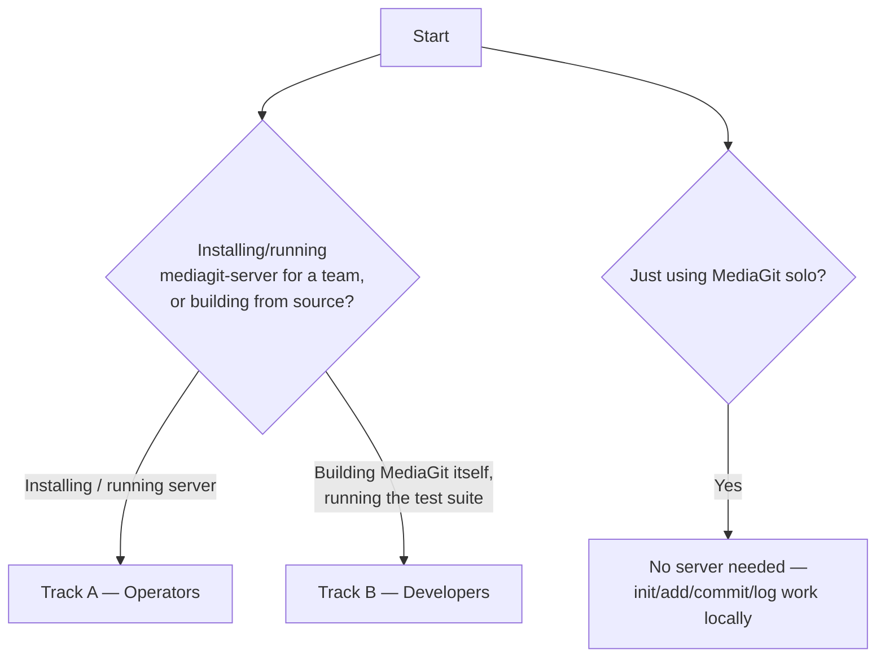
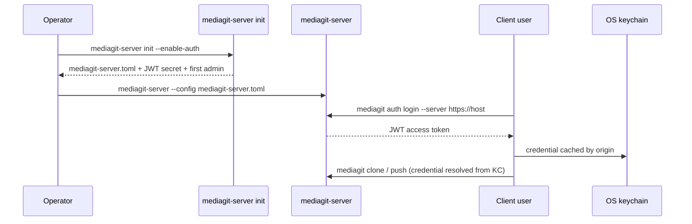

# MediaGit Setup Guide

MediaGit is a standalone version-control system for media files — not built
on Git internals, but a purpose-built VCS with chunk-level deduplication,
BLAKE3-addressed objects, and pluggable storage backends (local filesystem,
AWS S3, Azure Blob, GCS, MinIO). It ships two binaries: `mediagit` (the
client) and `mediagit-server` (an optional HTTP(S) server for push/pull
collaboration). Current release: **0.3.0-rc.5**.

## Which track am I?



- **Track A — Operators**: you want to install MediaGit and/or run
  `mediagit-server` to host repositories for a team. Start there.
- **Track B — Developers**: you're building MediaGit itself from source,
  running the test suite, or working against the local dev harness.
  Start there instead.

You don't need a server at all to use MediaGit solo — `mediagit init`,
`add`, `commit`, `log`, etc. work entirely locally against `.mediagit/`. The
server is only needed for `push`/`pull`/`clone`/`fetch` against a shared repo.

---

## Track A — Operators (self-hosting)

### 1. Install

**Pre-built binaries (recommended).** Each GitHub Release archive bundles
both the `mediagit` client and the `mediagit-server` binary, plus a
`.sha256` checksum file:

| Platform | Archive |
|----------|---------|
| Linux x86_64 | `mediagit-0.4.0-rc.1-x86_64-linux.tar.gz` |
| Linux ARM64 | `mediagit-0.4.0-rc.1-aarch64-linux.tar.gz` |
| macOS Intel | `mediagit-0.4.0-rc.1-x86_64-macos.tar.gz` |
| macOS Apple Silicon | `mediagit-0.4.0-rc.1-aarch64-macos.tar.gz` |
| Windows x86_64 | `mediagit-0.4.0-rc.1-x86_64-windows.zip` |

Download from [GitHub Releases](https://github.com/winnyboy5/mediagit-core/releases).

**Linux / macOS — one-liner install script:**
```bash
curl -fsSL https://raw.githubusercontent.com/winnyboy5/mediagit-core/main/install.sh | sh
```

**Linux x86_64 — manual:**
```bash
curl -fsSL https://github.com/winnyboy5/mediagit-core/releases/download/v0.4.0-rc.1/mediagit-0.4.0-rc.1-x86_64-linux.tar.gz \
  | tar xz -C /usr/local/bin
```

**Windows x86_64 (PowerShell):**
```powershell
Invoke-WebRequest -Uri "https://github.com/winnyboy5/mediagit-core/releases/download/v0.4.0-rc.1/mediagit-0.4.0-rc.1-x86_64-windows.zip" -OutFile mediagit.zip
Expand-Archive mediagit.zip -DestinationPath "$env:LOCALAPPDATA\MediaGit\bin"
# Add to PATH:
[Environment]::SetEnvironmentVariable("Path", "$env:Path;$env:LOCALAPPDATA\MediaGit\bin", "User")
```

This gives you both `mediagit.exe` and `mediagit-server.exe` in the same
archive — no separate download for the server.

**Package managers.** Packaging sources live in the repo under `packaging/`:
- `packaging/apt/build-deb.sh` — builds a `.deb`
- `packaging/chocolatey/mediagit.nuspec` — Chocolatey package spec (Windows)
- `packaging/homebrew/mediagit.rb` — Homebrew formula (macOS/Linux)

These are build recipes, not hosted package feeds — check the repo's release
notes/README for whether a published package index exists yet before
assuming `apt install mediagit` or `brew install mediagit` work out of the box.

**Docker.** The image is built from the root `Dockerfile`: a `debian:bookworm-slim`
base with `mediagit` and `mediagit-server` copied in from
`docker-binaries/${TARGETARCH}/` (populated by CI, not built from source in
the image). The `ENTRYPOINT` is `mediagit` (the CLI, default `CMD ["--help"]`)
— to run the server instead, override the entrypoint:

```bash
docker pull ghcr.io/winnyboy5/mediagit-core:0.4.0-rc.1
docker run --rm ghcr.io/winnyboy5/mediagit-core:0.4.0-rc.1 mediagit --version

# Run the server (override entrypoint), mounting a host dir for repo data:
docker run --rm -p 3000:3000 -v $(pwd)/repos:/data \
  --entrypoint mediagit-server \
  ghcr.io/winnyboy5/mediagit-core:0.4.0-rc.1 --data-dir /data
```

### 2. Minimal server

Running `mediagit-server` with no arguments and no config file works — it
boots on built-in defaults and logs a warning:

```bash
mediagit-server
# WARN No config file at 'mediagit-server.toml'; using built-in defaults
#      (port=3000, host=127.0.0.1, auth=off, rate_limit=off)
```

Defaults: `port = 3000`, `host = 127.0.0.1`, `repos_dir = ./repos`, auth off,
rate limiting off.

Config file discovery: the server looks for `mediagit-server.toml` in the
current working directory. If that exact default filename is missing, it
silently falls back to defaults (with the warning above). If you pass an
**explicit** path via `-c`/`--config` and that file doesn't exist, the
server hard-errors instead of falling back — this is deliberate, so a typo'd
`--config` path can't silently boot on defaults while you think your S3/TLS
config is loaded.

CLI flags override the config file:

| Flag | Overrides |
|------|-----------|
| `-p`, `--port <PORT>` | `port` |
| `--host <HOST>` | `host` |
| `--data-dir <PATH>` | `repos_dir` |
| `-c`, `--config <PATH>` | config file path (default `mediagit-server.toml`) |

```bash
mediagit-server --port 8080 --host 0.0.0.0 --data-dir /srv/mediagit/repos
```

### 3. Production server config

`mediagit-server.toml` uses `deny_unknown_fields` — any key it doesn't
recognize (including a `[storage]` section, which is a **repo-level**
concept, not a server one) causes a hard parse error at boot. Only the keys
below are valid at the top level:

```toml
# Network
port = 3000
host = "0.0.0.0"

# Repository storage root — each subdirectory here is a served repo
repos_dir = "./repos"

# TLS (requires the server binary built with the `tls` Cargo feature,
# which is ON by default — see Track B)
enable_tls = false
tls_port = 3443
tls_cert_path = "/etc/mediagit/cert.pem"
tls_key_path = "/etc/mediagit/key.pem"
tls_self_signed = false   # dev convenience: generate a self-signed cert instead
tls_min_version = "1.3"   # default; "1.2" is the escape hatch for old clients/proxies.
                          # An unrecognized value is a hard boot error, not a fallback.

# Authentication
enable_auth = true
jwt_secret = "replace-with-a-long-random-secret"   # or set MEDIAGIT_JWT_SECRET instead
allow_open_registration = true                     # default; set false so POST /auth/register
                                                   # rejects anonymous callers (`init --enable-auth`
                                                   # writes false). Only read when enable_auth = true
presigned_url_ttl_seconds = 43200                  # 12h; TTL for direct-to-bucket upload URLs
auth_store_dir = "./auth"                          # default: sibling `auth/` dir next to repos_dir

# Rate limiting. These ARE the defaults — do not lower them casually. A push is
# roughly one request per chunk, so the 10/20 this example used to show turned
# every real push into a 429 storm (see the comment above
# `default_rate_limit_rps` in crates/mediagit-server/src/config.rs).
enable_rate_limiting = true
rate_limit_rps = 1000
rate_limit_burst = 2000

# CORS — omit entirely to add no CORS layer (no CORS headers emitted at all)
cors_allowed_origins = ["https://app.example.com"]

# Server-side verification of presigned uploads at chunk/pack completion.
# Defaults to true. Presigned bytes go client→bucket directly, so this is the
# only point the server can check them; turning it off drops to existence-only
# checks, which accept any bytes under a claimed id. Verification runs in the
# background, so it is off the push critical path.
verify_content_on_complete = true

# At-rest encryption of stored objects. Off by default; absent from existing
# config files, which parse unchanged. `master_key_path` is required when
# enabled — it wraps every repository key the server escrows.
[encryption]
enabled = false
master_key_path = "/etc/mediagit/master.key"   # 64 hex chars or 32 raw bytes
```

There is intentionally **no `[storage]` section** in this file — storage
backend configuration is per-repo, not per-server (see §6).

### 4. Auth bootstrap

The `init` wizard sets up auth end-to-end in one step — config, JWT secret,
and the first admin user:

```bash
mediagit-server init --enable-auth
# wizard prompts for host/port/data-dir and the first admin's
# username/email/password; writes mediagit-server.toml with a random
# JWT secret, registration defaults CLOSED, rate limiting enabled
```

Non-interactive (e.g. scripted/CI provisioning):

```bash
# The password comes from the environment, never a flag: a command-line
# argument is visible in `ps` (world-readable on most systems) and is kept
# in shell history long after the bootstrap that needed it.
MEDIAGIT_ADMIN_PASSWORD='a-strong-password' \
mediagit-server init --non-interactive --enable-auth \
  --admin-username alice --admin-email alice@example.com
```

Then start the server and log in from the client:

```bash
mediagit-server --config mediagit-server.toml
mediagit auth login --server https://host   # prompts for username + masked password
```

When run inside a repository, `auth login` also records the authenticated
identity as that repo's commit author (config `[author]` name/email), so your
commits are attributed to your account without a separate `mediagit config`
step. A `--author` flag or `MEDIAGIT_AUTHOR_*` env var still takes precedence.



Admin bootstrap works even without a running server:

```bash
mediagit-server admin create alice alice@example.com --password a-strong-password
# first-admin bootstrap, offline — writes directly to users.jsonl (role Admin)
```

`--force` is required if the server is currently live (it full-rewrites
`users.jsonl` on the next mutation, so restart the server afterward). It sits
on `admin` itself, before the subcommand — `mediagit-server admin --force
create alice ...` — as does `-c/--config`, which resolves the auth store dir
and the host:port used for the running-server guard.

Auth state (`users.jsonl`, `api_keys.jsonl`, `grants.jsonl`) persists as
JSONL files under `auth_store_dir` (default: a sibling `auth/` directory
next to `repos_dir`). Set `MEDIAGIT_AUTH_PERSIST=0` to force pure in-memory
behavior (no load, no writes) — useful for ephemeral test servers.

Per-repo grants and the admin endpoints
(`GET/DELETE /auth/users`, `POST/DELETE /auth/users/{id}/grants`,
`GET/DELETE /auth/keys`) are documented in
[`book/src/reference/authentication.md`](book/src/reference/authentication.md).

#### Advanced / scripting: REST directly

The client flow above wraps these endpoints; call them directly only for
scripting or when no `mediagit` client is available:

```bash
curl -X POST http://host:3000/auth/register \
  -H "Content-Type: application/json" \
  -d '{"username": "bob", "email": "bob@example.com", "password": "a-strong-password"}'

curl -X POST http://host:3000/auth/login \
  -H "Content-Type: application/json" \
  -d '{"identifier": "bob@example.com", "password": "a-strong-password"}'
# → returns a JWT access token ("identifier" accepts username or email)
```

Self-registration (`POST /auth/register`) always creates a **Write**-role
account — there is no client-controlled `role` field. Promote a
self-registered user to Admin with `mediagit auth admin set-role bob admin`
(requires an existing Admin), or use `mediagit-server admin create-user`
offline (see below).

#### Managing users and keys

Once an admin is logged in, day-to-day user/key management goes through the
client:

```bash
printf "bob@example.com
hunter2
" | mediagit auth admin create-user bob --role write
mediagit auth admin set-role bob admin
mediagit auth admin list-users
mediagit auth key create --name ci     # prints the plaintext key once
mediagit auth key list
mediagit auth key revoke <id>
```

Offline equivalents (no running server, direct `users.jsonl` edits) are
available via `mediagit-server admin`:
`create-user <user> <email> --role read|write|admin --password P`,
`list`, `promote <user>`, `demote <user>`, `reset-password <user> --password P`.

#### Roles and per-repo grants

Every user has one of three roles:

| Role | Permissions | Notes |
|------|-------------|-------|
| `Read` | `repo:read` | Read-only access to repos |
| `Write` | `repo:read`, `repo:write` | Can push (self-registration default) |
| `Admin` | All above + `repo:admin`, `user:manage` | Bypasses per-repo grants; can manage users/keys |

For finer-grained access control, an Admin can assign **per-repo grants**
to scope a user's access to specific repositories:

```bash
mediagit auth admin grant alice design-assets write
mediagit auth admin revoke-grant alice design-assets
```

(equivalent REST: `POST`/`DELETE /auth/users/<alice-id>/grants` with a
`{"repo": "...", "level": "..."}` body and an admin bearer token.)

**Important:** the moment any grant is created, per-repo enforcement
activates for *all* repo-scoped permission checks — including repos with
no grant for that user (which then deny access even if their flat role
would allow it). A deployment with zero grants behaves exactly like the
pre-grants flat role check. Set `MEDIAGIT_GRANTS_ENFORCE=0` to opt out of
per-repo enforcement even after grants exist.

Full reference:
[`book/src/reference/authentication.md`](book/src/reference/authentication.md).

#### Running without authentication

Omit `enable_auth` or set `enable_auth = false`. On loopback (`127.0.0.1` /
`localhost`) this works out of the box — all endpoints are open and no
credentials are needed on the client side. Auth endpoints (`/auth/register`,
`/auth/login`, etc.) are not mounted at all when auth is disabled.

To run auth-disabled on a non-loopback address (e.g. behind a reverse proxy
with its own auth layer):

```bash
MEDIAGIT_ALLOW_INSECURE_BIND=1 mediagit-server
```

### 5. TLS

TLS support is gated behind the server's `tls` Cargo feature — which is
**on by default** for binaries built from source or distributed via the
release archives. If a binary is ever built with `--no-default-features`
(no `tls`), setting `enable_tls = true` in the config fails loudly at boot
rather than silently serving plain HTTP.

Set `tls_self_signed = true` for a dev-friendly self-signed cert, or provide
real `tls_cert_path`/`tls_key_path` PEM files for production. When TLS is
enabled, the server runs **both** the HTTP listener (`port`) and the HTTPS
listener (`tls_port`, default `3443`) concurrently — HTTP is not disabled.

The minimum protocol version is TLS 1.3 unless you set `tls_min_version = "1.2"`
as an escape hatch for clients or proxies that can't speak 1.3. Any other value
fails the boot rather than falling back silently.

### 6. Repos and storage backends

Each served repository lives at `<repos_dir>/<name>` and is just a
MediaGit repo (it has its own `.mediagit/config.toml`). The server reads
that repo's own `[storage]` section **at request time** to decide where
object data lives — this is why the server-level TOML has no `[storage]`
key of its own; storage is configured per repo, not globally.

Minimal `[storage]` snippets (drop into `<repo>/.mediagit/config.toml` or a
sibling `config.toml`), based on the working per-backend configs the QA suite
uses — `dev-tests/qa-suite/config/backends/{local,minio,aws,azure,gcs}.toml`,
all five checked in:

**Local filesystem:**
```toml
[storage]
backend = "filesystem"
base_path = "./objects"   # absolute or relative to the repo dir
create_dirs = true
```

**Silo(MinIO) (S3-compatible):**
```toml
[storage]
backend = "s3"
bucket = "my-bucket"
region = "us-east-1"
access_key_id = "minioadmin"
secret_access_key = "minioadmin"
endpoint = "http://localhost:9000"   # presence of `endpoint` routes to the MinIO-compatible path
prefix = "media/"
```

**AWS S3** (omit `endpoint` — its absence is what selects the native AWS
SigV4 path instead of the MinIO-compatible path):
```toml
[storage]
backend = "s3"
bucket = "my-bucket"
region = "ap-south-1"
access_key_id = "AKIA..."
secret_access_key = "..."
prefix = "media/"
```

**Azure Blob Storage:**
```toml
[storage]
backend = "azure"
container = "my-container"
prefix = "media/"
auth = { type = "account_key", account_name = "myaccount", account_key = "..." }
# or: auth = { type = "connection_string", value = "..." }
# or: auth = { type = "sas", account_name = "myaccount", token = "sv=..." }
# or: auth = { type = "emulator" }   # local Azurite
```

**Google Cloud Storage:**
```toml
[storage]
backend = "gcs"
bucket = "my-bucket"
project_id = "my-gcp-project"
credentials_path = "path/to/service-account.json"   # omit to fall back to ADC
```

At boot, the server runs a **startup probe** that validates every repo's
storage backend can actually be constructed (credentials resolve, bucket
reachable, etc.) before it starts accepting traffic — a bad S3/Azure/GCS
config fails the boot instead of surfacing as a 500 on a client's first
request. Set `MEDIAGIT_STARTUP_PROBE=0` to skip it (e.g. if a backend is
briefly unreachable and you want to boot anyway).

### 7. Client connect

Point the client at a server repo:

```bash
mediagit remote add origin http://host:3000/<repo-name>
```

**Only `http://` and `https://` reach the remote protocol.** `mediagit remote add`
also *accepts* `file://`, `ssh://` and `git://`, but no transport implements
them — `clone` treats any non-HTTP(S) URL as a local directory path (a folder
containing `.mediagit`), so an `ssh://` remote fails as a missing local path
rather than dialling anything. Clone from a local repo by passing the path
directly, not a `file://` URL.

Credentials are resolved in this order:
1. Environment: `MEDIAGIT_TOKEN` (JWT) or `MEDIAGIT_API_KEY`
2. `remotes.<name>.token` or `remotes.<name>.api_key` in the repo's
   `.mediagit/config.toml` (`token` wins if both are set)
3. OS keychain, keyed by server origin (skip this tier with `MEDIAGIT_NO_KEYRING`)

An **explicit config token outranks the keychain cache** — editing
`remotes.<name>.token` takes effect immediately. After a successful request,
the working credential is cached to the OS keychain (keyed by origin) so later
commands across every repo on that server resolve without re-prompting; this
write-through only happens on a successful server response, never
speculatively. If a keychain-sourced credential is rejected with `401`, that
entry is invalidated and the next tier is tried — no stale token can wedge you.

There is no top-level `auth_token` config key — if you see that referenced
anywhere, it's a stale doc artifact, not a real field.

```bash
export MEDIAGIT_TOKEN="<jwt-from-login>"
mediagit clone http://host:3000/<repo-name>
mediagit push
mediagit pull
```

File locking for exclusive-checkout workflows (binary assets that can't
merge) is available via `mediagit lock` — see
[`book/src/cli/lock.md`](book/src/cli/lock.md).

---

## Track B — Developers (from source)

### Prerequisites

- **Rust 1.97+** (pinned via `rust-version` in the workspace `Cargo.toml`) — verify with `rustc --version`
- Linux/macOS: `build-essential`/`xcode-select` toolchain, `pkg-config`, `libssl-dev` (per `DEVELOPMENT_GUIDE.md`)
- Docker, if you want to test against a local MinIO backend

### Build

```bash
git clone https://github.com/winnyboy5/mediagit-core.git
cd mediagit-core
cargo build              # debug build
cargo build --release    # release build
```

The `mediagit-server` crate builds the `tls` feature **by default**
(`default = ["tls"]` in `crates/mediagit-server/Cargo.toml`) — you don't
need to pass `--features tls` explicitly unless you've built with
`--no-default-features` and want to add it back:

```bash
cargo build --release --no-default-features --features tls -p mediagit-server
```

Binaries land at `./target/{debug,release}/mediagit{,-server}`.

### Run the dev harness

**`dev-tests/dev-server/` is gitignored.** `.gitignore:202` ignores `dev-tests/*`
and re-includes only `!dev-tests/qa-suite/` (itself minus `work/`, `logs/`,
`reports/`, `fixtures-synthetic/` and `.venv/`); `compat-fixture` is tracked
because it predates the rule. So `dev-server/` is a scratch directory a
maintainer accumulates locally, not something a fresh clone has — build your own
harness rather than looking for one that isn't there:

```bash
mkdir -p /tmp/mg-dev && cd /tmp/mg-dev
/path/to/target/debug/mediagit-server init --non-interactive --data-dir ./repos
/path/to/target/debug/mediagit-server
```

Two checked-in server configs are worth reading first:
`crates/mediagit-server/mediagit-server.example.toml` and
`mediagit-server-production.example.toml`. For `[storage]`, the five
per-backend configs under `dev-tests/qa-suite/config/backends/` are tracked and
current — those are repo-level `[storage]` snippets, not alternate server
configs, since the server config never has a `[storage]` key.

### Local MinIO for backend testing

```bash
docker compose -f docker-compose.minio.yml up -d
```

This runs `pgsty/silo` — the Pigsty community fork of MinIO, adopted after
upstream discontinued its open-source edition. Silo keeps the S3 API and
on-disk format, so it's a drop-in; the service, container, and volume are
still named `minio` on purpose, since the QA suite's A7 backend-outage drill
and the documented `MG_QA_MINIO` endpoint knob depend on that name (see the
header comment in `docker-compose.minio.yml`).

S3 API on `localhost:9000`, web console on `localhost:9001`, default
credentials `minioadmin`/`minioadmin`. A ready-made MinIO `[storage]`
template is at `dev-tests/qa-suite/config/backends/minio.toml`.

### Test suites

```bash
cargo test --workspace
```

For broader integration/economics/abuse/perf coverage against real or
MinIO-backed storage, see the QA harness at
`dev-tests/qa-suite/scripts/run_all.ps1` (PowerShell; env-knob driven,
credentials via `dev-tests/qa-suite/scripts/campaign_env.ps1`).

A default run executes `00`–`08`, then `12` (safety), `13` (docs) and `14`
(docs surface), and finally `09`, which aggregates them into the report; the
`SCALE` tier (`MG_QA_TIER=SCALE`) inserts `10` before `09`. Phase `11`
(memprofile) is opt-in via `-Phases`. A phase *token* globs to
`scripts\<token>*.ps1`, so one token can run several scripts — `07` alone
covers abuse, auth, cli_auth, creds, ratelimit, setup and users.

---

## Further reading

- [`CONFIGURATION.md`](CONFIGURATION.md) — complete client + server configuration reference
- [`env-knobs.md`](env-knobs.md) — performance/behavior tuning environment variables
- [`book/`](book/) — user guide (CLI command reference, workflows)
- [`DEVELOPMENT_GUIDE.md`](DEVELOPMENT_GUIDE.md) — building, testing, and contributing to MediaGit itself
