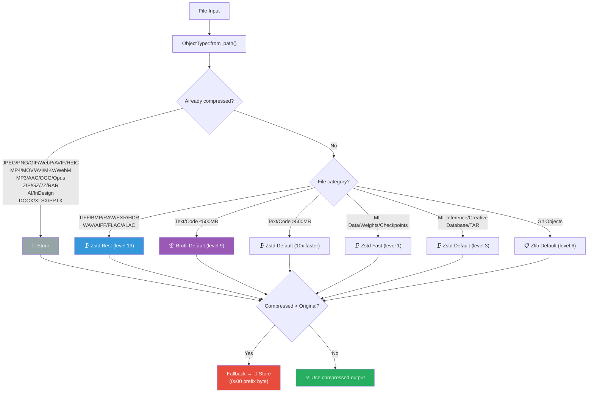
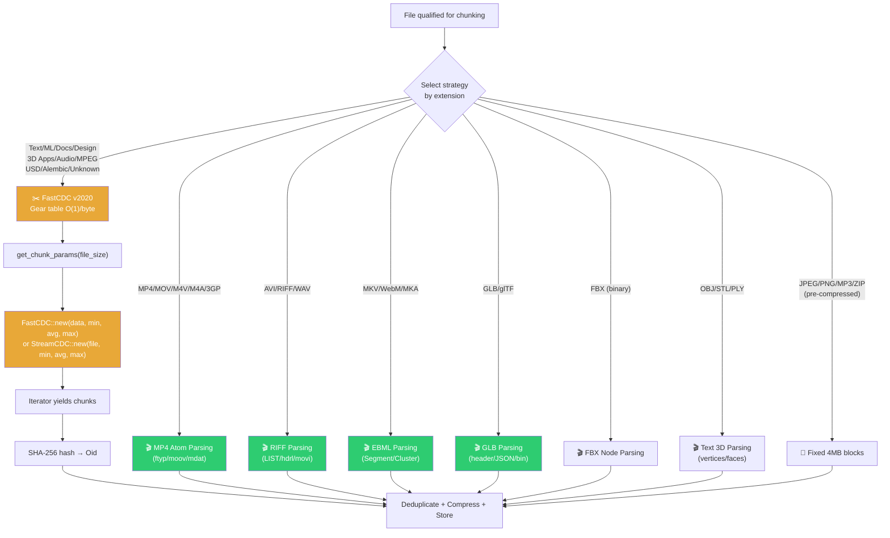

# Supported Formats

> Complete reference for every file format MediaGit recognizes,
> including the compression, chunking, delta, and merge pipelines applied to each.

---

## Quick Reference

| Icon | Meaning |
|------|---------|
| 💾 Store | No compression (already compressed) |
| 🗜️ Zstd | Zstandard compression |
| 📦 Brotli | Brotli compression |
| 📋 Zlib | Zlib compression (Git compat) |
| 🔀 Delta | Delta compression eligible |
| ✂️ FastCDC | Content-defined chunking (FastCDC v2020 gear hash) |
| 🎬 Media | Structure-aware media chunking |
| 📐 Fixed | Fixed 4 MB blocks |
| 🧩 Merge | Media-aware merge strategy |

---

## Compression Pipeline

---

## Chunking Pipeline

---

## FastCDC Details

MediaGit uses the **`fastcdc` crate v3.2** (`fastcdc::v2020`) for all content-defined chunking.

> [!NOTE]
> FastCDC uses a **gear table-based hash** that achieves **O(1) boundary detection per byte**,
> approximately **10× faster** than traditional Buzhash or Rabin fingerprint rolling hashes.

### Two operating modes

| Mode | Rust API | Method | When Used |
|------|----------|--------|-----------|
| **In-memory** | `fastcdc::v2020::FastCDC::new(data, min, avg, max)` | `chunk_rolling()` | Default: data already in memory |
| **Streaming** | `fastcdc::v2020::StreamCDC::new(file, min, avg, max)` | `chunk_file_streaming()` | Large files via ODB streaming path |

### Adaptive chunk parameters

| File Size | Avg Chunk | Min Chunk | Max Chunk |
|-----------|-----------|-----------|-----------|
| < 1 MB | 256 KB | 128 KB | 512 KB |
| 1–10 MB | 512 KB | 256 KB | 1 MB |
| 10–100 MB | 1 MB | 512 KB | 2 MB |
| 100 MB–1 GB | 2 MB | 1 MB | 4 MB |
| > 1 GB | 4 MB | 2 MB | 8 MB |

### Formats that use FastCDC

FastCDC is dispatched by `chunk_media_aware()` → `chunk_rolling()` for formats that don't have a dedicated media parser:

| Format Group | Extensions |
|--------------|-----------|
| Text/Code | csv, tsv, json, xml, html, txt, md, rs, py, js, ts, go, java, c, cpp, yaml, toml, sql, proto, ... |
| ML Data | parquet, arrow, feather, orc, avro, hdf5, npy, npz, tfrecords, petastorm |
| ML Models | pt, pth, ckpt, pb, safetensors, bin, pkl, joblib |
| ML Deployment | onnx, gguf, ggml, tflite, mlmodel, coreml, keras, pte, llamafile |
| Documents | pdf, svg, eps, ai |
| Design Tools | fig, sketch, xd, indd |
| Lossless Audio | flac, aiff, alac |
| MPEG Streams | mpg, mpeg, vob, mts, m2ts |
| USD/Alembic | usd, usda, usdc, usdz, abc |
| 3D Apps | blend, max, ma, mb, c4d, hip, zpr, ztl |
| Unknown | All unrecognized extensions |

---

## Images

### Compressed (Lossy)

| Format | Extensions | Compression | Chunking | Delta | Merge |
|--------|-----------|-------------|----------|-------|-------|
| JPEG | `.jpg`, `.jpeg` | 💾 Store | 📐 Fixed 4MB | ❌ | 🧩 Image |
| PNG | `.png` | 💾 Store | 📐 Fixed 4MB | ❌ | 🧩 Image |
| GIF | `.gif` | 💾 Store | 📐 Fixed 4MB | ❌ | 🧩 Image |
| WebP | `.webp` | 💾 Store | 📐 Fixed 4MB | ❌ | 🧩 Image |
| AVIF | `.avif` | 💾 Store | 📐 Fixed 4MB | ❌ | 🧩 Image |
| HEIC/HEIF | `.heic`, `.heif` | 💾 Store | 📐 Fixed 4MB | ❌ | 🧩 Image |

### Uncompressed / Lossless

| Format | Extensions | Compression | Chunking | Delta | Merge |
|--------|-----------|-------------|----------|-------|-------|
| TIFF | `.tif`, `.tiff` | 🗜️ Zstd Best | ✂️ FastCDC (≥5MB) | ✅ Always | 🧩 Image |
| BMP | `.bmp`, `.dib` | 🗜️ Zstd Best | ✂️ FastCDC (≥5MB) | ✅ Always | 🧩 Image |
| RAW | `.raw`, `.cr2`, `.cr3`, `.nef`, `.arw`, `.dng`, `.orf`, `.rw2` | 🗜️ Zstd Best | ✂️ FastCDC (≥5MB) | ❌ | 🧩 Image |
| OpenEXR | `.exr` | 🗜️ Zstd Best | ✂️ FastCDC (≥5MB) | ❌ | 🧩 Image |
| HDR | `.hdr`, `.pic` | 🗜️ Zstd Best | ✂️ FastCDC (≥5MB) | ❌ | 🧩 Image |

### GPU Textures

| Format | Extensions | Compression | Chunking | Delta | Merge |
|--------|-----------|-------------|----------|-------|-------|
| GPU Textures | `.dds`, `.ktx`, `.ktx2`, `.astc`, `.pvr`, `.basis` | 💾 Store | 📐 Fixed 4MB | ❌ | 🧩 Image |

### Layered / PSD

| Format | Extensions | Compression | Chunking | Delta | Merge |
|--------|-----------|-------------|----------|-------|-------|
| Photoshop | `.psd`, `.psb` | 🗜️ Zstd Default | ✂️ FastCDC (≥5MB) | ✅ Always | 🧩 PSD (layer-based) |

> **PSD merge**: Auto-merges non-overlapping layer changes. Conflicts flagged when same layer modified by both branches.

---

## Video

| Format | Extensions | Compression | Chunking | Delta | Merge |
|--------|-----------|-------------|----------|-------|-------|
| MP4 | `.mp4`, `.m4v` | 💾 Store | 🎬 Atom parsing (≥5MB) | 🔀 >100MB | 🧩 Video |
| QuickTime | `.mov`, `.qt` | 💾 Store | 🎬 Atom parsing (≥5MB) | ✅ Always | 🧩 Video |
| AVI | `.avi` | 💾 Store | 🎬 RIFF parsing (≥5MB) | ✅ Always | 🧩 Video |
| Matroska | `.mkv` | 💾 Store | 🎬 EBML parsing (≥5MB) | 🔀 >100MB | 🧩 Video |
| WebM | `.webm` | 💾 Store | 🎬 EBML parsing (≥5MB) | ❌ | 🧩 Video |
| FLV | `.flv`, `.f4v` | 💾 Store | ✂️ FastCDC (≥5MB) | 🔀 >100MB | 🧩 Video |
| WMV | `.wmv`, `.asf` | 💾 Store | ✂️ FastCDC (≥5MB) | 🔀 >100MB | 🧩 Video |
| MPEG | `.mpg`, `.mpeg`, `.m2v` | 💾 Store | ✂️ FastCDC (≥5MB) | ❌ | 🧩 Video |

### Professional Video

| Format | Extensions | ObjectType | Merge |
|--------|-----------|------------|-------|
| MXF | `.mxf` | Video (via MediaType) | 🧩 Video |
| RED | `.r3d` | Video (via MediaType) | 🧩 Video |
| Blackmagic | `.braw` | Video (via MediaType) | 🧩 Video |
| ARRI | `.ari` | Video (via MediaType) | 🧩 Video |

> **Video merge**: Timeline-based auto-merge for non-overlapping segment edits.

---

## Audio

### Compressed

| Format | Extensions | Compression | Chunking | Delta | Merge |
|--------|-----------|-------------|----------|-------|-------|
| MP3 | `.mp3` | 💾 Store | 📐 Fixed 4MB | ❌ | 🧩 Audio |
| AAC | `.aac`, `.m4a` | 💾 Store | 📐 Fixed 4MB | ❌ | 🧩 Audio |
| OGG/Vorbis | `.ogg`, `.oga` | 💾 Store | 📐 Fixed 4MB | ❌ | 🧩 Audio |
| Opus | `.opus` | 💾 Store | 📐 Fixed 4MB | ❌ | 🧩 Audio |

### Uncompressed / Lossless

| Format | Extensions | Compression | Chunking | Delta | Merge |
|--------|-----------|-------------|----------|-------|-------|
| WAV | `.wav` | 🗜️ Zstd Best | 🎬 RIFF parsing (≥10MB) | ✅ Always | 🧩 Audio |
| AIFF | `.aiff`, `.aif`, `.aifc` | 🗜️ Zstd Best | ✂️ FastCDC (≥10MB) | ✅ Always | 🧩 Audio |
| FLAC | `.flac` | 🗜️ Zstd Best | ✂️ FastCDC (≥10MB) | ❌ | 🧩 Audio |
| ALAC | `.alac` | 🗜️ Zstd Best | ✂️ FastCDC (≥10MB) | ❌ | 🧩 Audio |

### Additional Audio (via MediaType)

| Format | Extensions | Merge |
|--------|-----------|-------|
| DSD | `.dsd`, `.dsf`, `.dff` | 🧩 Audio |
| APE | `.ape` | 🧩 Audio |
| MIDI | `.mid`, `.midi` | 🧩 Audio |

> **Audio merge**: Track-based auto-merge for non-overlapping track modifications.

---

## 3D Models

### Interchange Formats

| Format | Extensions | Compression | Chunking | Delta | Merge |
|--------|-----------|-------------|----------|-------|-------|
| glTF/GLB | `.gltf`, `.glb` | 🗜️ Zstd Default | 🎬 GLB parsing (≥10MB) | ✅ | 🧩 3D |
| OBJ | `.obj` | 🗜️ Zstd Default | 🎬 Text 3D parsing (≥10MB) | ✅ | 🧩 3D |
| FBX | `.fbx` | 🗜️ Zstd Default | 🎬 FBX parsing (≥10MB) | ✅ | 🧩 3D |
| STL | `.stl` | 🗜️ Zstd Default | 🎬 Text 3D parsing (≥10MB) | ❌ | 🧩 3D |
| PLY | `.ply` | 🗜️ Zstd Default | 🎬 Text 3D parsing (≥10MB) | ❌ | 🧩 3D |
| COLLADA | `.dae` | 🗜️ Zstd Default | ✂️ FastCDC (≥10MB) | ❌ | 🧩 3D |
| 3DS | `.3ds` | 🗜️ Zstd Default | ✂️ FastCDC (≥10MB) | ❌ | 🧩 3D |

### USD Ecosystem

| Format | Extensions | Compression | Chunking | Merge |
|--------|-----------|-------------|----------|-------|
| USD | `.usd`, `.usda`, `.usdc`, `.usdz` | 🗜️ Zstd Default | ✂️ FastCDC (≥10MB) | 🧩 3D |

### Alembic

| Format | Extensions | Compression | Chunking | Merge |
|--------|-----------|-------------|----------|-------|
| Alembic | `.abc` | 🗜️ Zstd Default | ✂️ FastCDC (≥10MB) | 🧩 3D |

> **3D merge**: Structural analysis of vertices, faces, bones, materials.
> Always flags for manual review in 3D software.

---

## Creative Project Files

### Adobe Creative Cloud

| Application | Extensions | Compression | Chunking | Merge |
|-------------|-----------|-------------|----------|-------|
| Photoshop | `.psd`, `.psb` | 🗜️ Zstd Default | ✂️ FastCDC (≥5MB) | 🧩 PSD |
| Illustrator | `.ai`, `.ait` | 💾 Store | ✂️ FastCDC (≥5MB) | 🧩 VFX |
| InDesign | `.indd`, `.idml`, `.indt` | 💾 Store | ✂️ FastCDC (≥5MB) | 🧩 VFX |
| After Effects | `.aep`, `.aet` | 🗜️ Zstd Default | ✂️ FastCDC (≥10MB) | 🧩 VFX |
| Premiere Pro | `.prproj`, `.psq` | 🗜️ Zstd Default | ✂️ FastCDC (≥10MB) | 🧩 VFX |

> **Why AI/InDesign use Store**: These are PDF-based containers with internally compressed
> streams. Compression expands the data, wasting CPU.

### Video Editing

| Application | Extensions | Compression | Chunking | Merge |
|-------------|-----------|-------------|----------|-------|
| DaVinci Resolve | `.drp`, `.drp_proxies` | 🗜️ Zstd Default | ✂️ FastCDC (≥10MB) | 🧩 VFX |
| Final Cut Pro | `.fcpbundle`, `.fcpxml`, `.fcpxmld` | 🗜️ Zstd Default | ✂️ FastCDC (≥10MB) | 🧩 VFX |
| Avid Media Composer | `.avb`, `.avp`, `.avs` | 🗜️ Zstd Default | ✂️ FastCDC | 🧩 VFX |

### 3D / DCC

| Application | Extensions | Compression | Chunking | Merge |
|-------------|-----------|-------------|----------|-------|
| Blender | `.blend`, `.blend1` | 🗜️ Zstd Default | ✂️ FastCDC (≥10MB) | 🧩 3D |
| Maya | `.ma`, `.mb` | 🗜️ Zstd Default | ✂️ FastCDC (≥10MB) | 🧩 3D |
| 3ds Max | `.max` | 🗜️ Zstd Default | ✂️ FastCDC (≥10MB) | 🧩 3D |
| Cinema 4D | `.c4d` | 🗜️ Zstd Default | ✂️ FastCDC (≥10MB) | 🧩 3D |
| Houdini | `.hip`, `.hipnc`, `.hiplc` | 🗜️ Zstd Default | ✂️ FastCDC (≥10MB) | 🧩 3D |
| ZBrush | `.zpr`, `.ztl` | 🗜️ Zstd Default | ✂️ FastCDC (≥10MB) | 🧩 3D |

### Audio DAWs

| Application | Extensions | Compression | Chunking | Merge |
|-------------|-----------|-------------|----------|-------|
| Pro Tools | `.ptx`, `.ptf` | 🗜️ Zstd Default | ✂️ FastCDC | — |
| Ableton Live | `.als` | 🗜️ Zstd Default | ✂️ FastCDC | — |
| FL Studio | `.flp` | 🗜️ Zstd Default | ✂️ FastCDC | — |
| Logic Pro | `.logic`, `.logicx` | 🗜️ Zstd Default | ✂️ FastCDC | — |

### CAD

| Application | Extensions | Compression | Chunking | Merge |
|-------------|-----------|-------------|----------|-------|
| AutoCAD | `.dwg`, `.dxf` | 🗜️ Zstd Default | ✂️ FastCDC | — |
| SketchUp | `.skp` | 🗜️ Zstd Default | ✂️ FastCDC | — |
| Revit | `.rvt`, `.rfa`, `.rte` | 🗜️ Zstd Default | ✂️ FastCDC | — |

### Game Engines

| Engine | Extensions | Compression | Chunking | Merge |
|--------|-----------|-------------|----------|-------|
| Unity | `.unity`, `.prefab`, `.asset`, `.unity3d` | 🗜️ Zstd Default | ✂️ FastCDC | — |
| Unreal Engine | `.uasset`, `.umap`, `.upk` | 🗜️ Zstd Default | ✂️ FastCDC | — |
| Godot | `.tscn`, `.tres`, `.godot` | 🗜️ Zstd Default | ✂️ FastCDC | — |

### Design Tools (via MediaType::Vfx)

| Tool | Extensions | Merge |
|------|-----------|-------|
| Figma | `.fig` | 🧩 VFX |
| Sketch | `.sketch` | 🧩 VFX |
| Adobe XD | `.xd` | 🧩 VFX |
| Nuke | `.nk`, `.nknc` | 🧩 VFX |

---

## Documents

| Format | Extensions | Compression | Chunking | Delta | Merge |
|--------|-----------|-------------|----------|-------|-------|
| PDF | `.pdf` | 🗜️ Zstd Default | ✂️ FastCDC (≥5MB) | ❌ | 🧩 VFX |
| SVG | `.svg`, `.svgz` | 🗜️ Zstd Default | — | ❌ | — |
| EPS | `.eps` | 🗜️ Zstd Default | ✂️ FastCDC (≥5MB) | ❌ | — |

---

## Office Documents

| Format | Extensions | Compression | Chunking | Merge |
|--------|-----------|-------------|----------|-------|
| Word | `.docx`, `.doc`, `.docm`, `.dot`, `.dotx` | 💾 Store | ✂️ FastCDC (≥5MB) | — |
| Excel | `.xlsx`, `.xls`, `.xlsm`, `.xlsb`, `.xlt`, `.xltx` | 💾 Store | ✂️ FastCDC (≥5MB) | — |
| PowerPoint | `.pptx`, `.ppt`, `.pptm`, `.pot`, `.potx` | 💾 Store | ✂️ FastCDC (≥5MB) | — |
| OpenDocument | `.odt`, `.ods`, `.odp`, `.odg`, `.odf` | 💾 Store | ✂️ FastCDC (≥5MB) | — |

> **Why Store**: Modern Office documents are ZIP containers with internally compressed XML.

---

## Text & Code

| Category | Extensions | Compression | Chunking | Delta |
|----------|-----------|-------------|----------|-------|
| Documentation | `.txt`, `.md`, `.markdown`, `.rst`, `.adoc` | 📦 Brotli Default | ✂️ FastCDC (≥5MB) | ✅ |
| Rust | `.rs` | 📦 Brotli Default | ✂️ FastCDC (≥5MB) | ✅ |
| JavaScript/TS | `.js`, `.ts`, `.jsx`, `.tsx` | 📦 Brotli Default | ✂️ FastCDC (≥5MB) | ✅ |
| Python | `.py` | 📦 Brotli Default | ✂️ FastCDC (≥5MB) | ✅ |
| Go | `.go` | 📦 Brotli Default | ✂️ FastCDC (≥5MB) | ✅ |
| C/C++ | `.c`, `.cpp`, `.cc`, `.cxx`, `.h`, `.hpp`, `.hh`, `.hxx` | 📦 Brotli Default | ✂️ FastCDC (≥5MB) | ✅ |
| Java/Kotlin | `.java`, `.kt` | 📦 Brotli Default | ✂️ FastCDC (≥5MB) | ✅ |
| Other | `.swift`, `.rb`, `.php`, `.sh`, `.bash`, `.zsh`, `.fish`, `.vim`, `.lua`, `.pl`, `.r`, `.m` | 📦 Brotli Default | ✂️ FastCDC (≥5MB) | ✅ |

### Structured Data

| Category | Extensions | Compression | Chunking | Delta |
|----------|-----------|-------------|----------|-------|
| JSON | `.json`, `.json5`, `.jsonc` | 📦 Brotli Default | ✂️ FastCDC (≥5MB) | ✅ |
| XML/HTML | `.xml`, `.html`, `.xhtml`, `.htm`, `.xsl`, `.xslt` | 📦 Brotli Default | ✂️ FastCDC (≥5MB) | ✅ |
| YAML | `.yml`, `.yaml` | 📦 Brotli Default | ✂️ FastCDC (≥5MB) | ✅ |
| TOML | `.toml` | 📦 Brotli Default | ✂️ FastCDC (≥5MB) | ✅ |
| CSV | `.csv`, `.tsv`, `.psv` | 📦 Brotli Default | ✂️ FastCDC (≥5MB) | ✅ |

> **Size threshold**: Text files over **500 MB** automatically switch from Brotli to
> Zstd Default for 10× faster compression with ~20% ratio loss.

---

## ML / Data Science

### Data Formats

| Format | Extensions | Compression | Chunking | Delta |
|--------|-----------|-------------|----------|-------|
| Parquet | `.parquet` | 💾 Store | ✂️ FastCDC (≥5MB) | ❌ |
| Arrow/Feather | `.arrow`, `.feather` | 💾 Store | ✂️ FastCDC (≥5MB) | ❌ |
| ORC | `.orc` | 💾 Store | ✂️ FastCDC (≥5MB) | ❌ |
| Avro | `.avro` | 💾 Store | ✂️ FastCDC (≥5MB) | ❌ |
| HDF5 | `.hdf5`, `.h5` | 🗜️ Zstd Fast | ✂️ FastCDC (≥5MB) | ❌ |
| NetCDF | `.nc`, `.netcdf` | 🗜️ Zstd Fast | ✂️ FastCDC (≥5MB) | ❌ |
| NumPy | `.npy`, `.npz` | 🗜️ Zstd Fast | ✂️ FastCDC (≥5MB) | ❌ |
| TFRecords | `.tfrecords` | 🗜️ Zstd Fast | ✂️ FastCDC (≥5MB) | ❌ |
| Petastorm | `.petastorm` | 🗜️ Zstd Fast | ✂️ FastCDC (≥5MB) | ❌ |

### Model Weights

| Format | Extensions | Compression | Chunking | Delta |
|--------|-----------|-------------|----------|-------|
| SafeTensors | `.safetensors` | 🗜️ Zstd Fast | ✂️ FastCDC (≥5MB) | ❌ |
| ProtoBuf | `.pb` | 🗜️ Zstd Fast | ✂️ FastCDC (≥5MB) | ❌ |
| Pickle | `.pkl` | 🗜️ Zstd Fast | ✂️ FastCDC (≥5MB) | ❌ |
| Joblib | `.joblib` | 🗜️ Zstd Fast | ✂️ FastCDC (≥5MB) | ❌ |

### Training Checkpoints

| Format | Extensions | Compression | Chunking | Delta |
|--------|-----------|-------------|----------|-------|
| PyTorch | `.pt`, `.pth` | 🗜️ Zstd Fast | ✂️ FastCDC (≥5MB) | ❌ |
| Checkpoint | `.ckpt` | 🗜️ Zstd Fast | ✂️ FastCDC (≥5MB) | ❌ |
| Binary weights | `.bin` | 🗜️ Zstd Fast | ✂️ FastCDC (≥5MB) | ❌ |

### Inference / Deployment

| Format | Extensions | Compression | Chunking | Delta |
|--------|-----------|-------------|----------|-------|
| ONNX | `.onnx` | 🗜️ Zstd Default | ✂️ FastCDC (≥5MB) | ❌ |
| GGUF/GGML | `.gguf`, `.ggml` | 🗜️ Zstd Default | ✂️ FastCDC (≥5MB) | ❌ |
| TFLite | `.tflite` | 🗜️ Zstd Default | ✂️ FastCDC (≥5MB) | ❌ |
| Core ML | `.mlmodel`, `.coreml` | 🗜️ Zstd Default | ✂️ FastCDC (≥5MB) | ❌ |
| Keras | `.keras` | 🗜️ Zstd Default | ✂️ FastCDC (≥5MB) | ❌ |
| LlamaFile | `.llamafile` | 🗜️ Zstd Default | ✂️ FastCDC (≥5MB) | ❌ |
| Others | `.pte`, `.mleap`, `.pmml` | 🗜️ Zstd Default | ✂️ FastCDC (≥5MB) | ❌ |

---

## Archives

| Format | Extensions | Compression | Chunking | Delta |
|--------|-----------|-------------|----------|-------|
| ZIP | `.zip`, `.zipx` | 💾 Store | ❌ | ❌ |
| TAR | `.tar` | 🗜️ Zstd Default | ✂️ FastCDC (≥5MB) | ❌ |
| GZIP | `.gz`, `.gzip` | 💾 Store | ❌ | ❌ |
| 7-Zip | `.7z` | 💾 Store | ❌ | ❌ |
| RAR | `.rar` | 💾 Store | ❌ | ❌ |

---

## Database

| Format | Extensions | Compression | Chunking | Delta |
|--------|-----------|-------------|----------|-------|
| SQLite | `.sqlite`, `.sqlite3`, `.db`, `.db3`, `.s3db` | 🗜️ Zstd Default | ✂️ FastCDC | ❌ |

---

## Media-Aware Chunking Detail

For files that qualify for **MediaAware** chunking, the system parses internal file structure instead of using FastCDC:

```mermaid
graph LR
    subgraph MP4["MP4/MOV Parser"]
        A1["Walk ISO BMFF<br/>atom tree"] --> B1["ftyp → chunk"]
        B1 --> C1["moov → chunk"]
        C1 --> D1["mdat → split at<br/>max_chunk_size"]
    end

    subgraph RIFF["AVI/RIFF Parser"]
        A2["Parse RIFF<br/>container"] --> B2["LIST hdrl → chunk"]
        B2 --> C2["LIST movi → chunk"]
        C2 --> D2["idx1 → chunk"]
    end

    subgraph EBML["MKV/WebM Parser"]
        A3["Parse EBML<br/>element tree"] --> B3["Segment header → chunk"]
        B3 --> C3["Tracks → chunk"]
        C3 --> D3["Each Cluster → chunk"]
    end

    subgraph GLB["GLB Parser"]
        A4["Read 12-byte<br/>header"] --> B4["JSON chunk"]
        B4 --> C4["Binary chunk<br/>(split if large)"]
    end

    subgraph FBX["FBX Parser"]
        A5["Parse binary<br/>node tree"] --> B5["Header + Version"]
        B5 --> C5["Each top-level<br/>node → chunk"]
    end

    subgraph Text3D["OBJ/STL/PLY Parser"]
        A6["Scan structural<br/>keywords"] --> B6["Split on v/vt/vn/<br/>f boundaries"]
    end

    style MP4 fill:#2ECC71,color:#fff
    style RIFF fill:#2ECC71,color:#fff
    style EBML fill:#2ECC71,color:#fff
    style GLB fill:#2ECC71,color:#fff
```

| Parser | Formats | How It Works |
|--------|---------|--------------|
| **MP4/MOV** | `.mp4`, `.mov`, `.m4v`, `.m4a`, `.3gp` | Walks ISO base media file atom tree (`ftyp`, `moov`, `mdat`) |
| **AVI/RIFF** | `.avi`, `.riff`, `.wav` | Parses RIFF container chunks (`LIST`, `hdrl`, `movi`, `idx1`) |
| **MKV/WebM** | `.mkv`, `.webm`, `.mka`, `.mk3d` | Parses EBML element tree (Segment, Cluster, Tracks) |
| **GLB** | `.glb`, `.gltf` | Parses header + JSON chunk + binary chunk |
| **FBX** | `.fbx` | Binary: node tree parsing. ASCII: falls back to FastCDC |
| **OBJ/STL/PLY** | `.obj`, `.stl`, `.ply` | Text-based: splits on structural keywords (vertices, faces, normals) |

All other formats use **FastCDC** (`fastcdc::v2020`) or **Fixed 4 MB** blocks.

---

## Magic Bytes Detection

When file extension is unavailable, the ODB uses magic byte signatures:

| Signature | Format |
|-----------|--------|
| `FF D8 FF` | JPEG |
| `89 50 4E 47` | PNG |
| `47 49 46 38` (GIF8) | GIF |
| `RIFF....WEBP` | WebP |
| `49 49 2A 00` / `4D 4D 00 2A` | TIFF |
| `42 4D` | BMP |
| `25 50 44 46` (%PDF) | PDF |
| `....ftyp` (offset 4) | MP4 |
| `50 4B 03 04` / `50 4B 05 06` | ZIP |
| `1F 8B` | GZIP |
