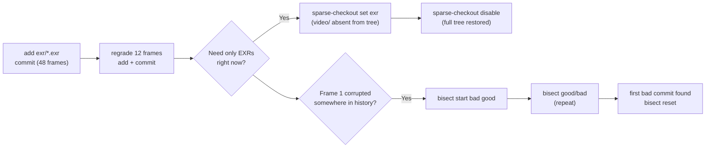
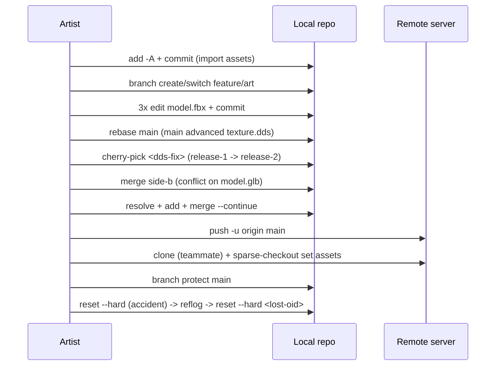
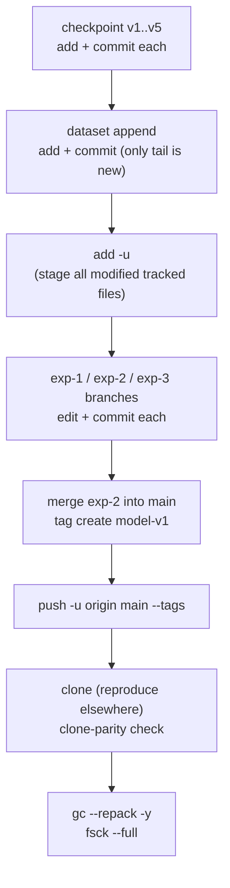
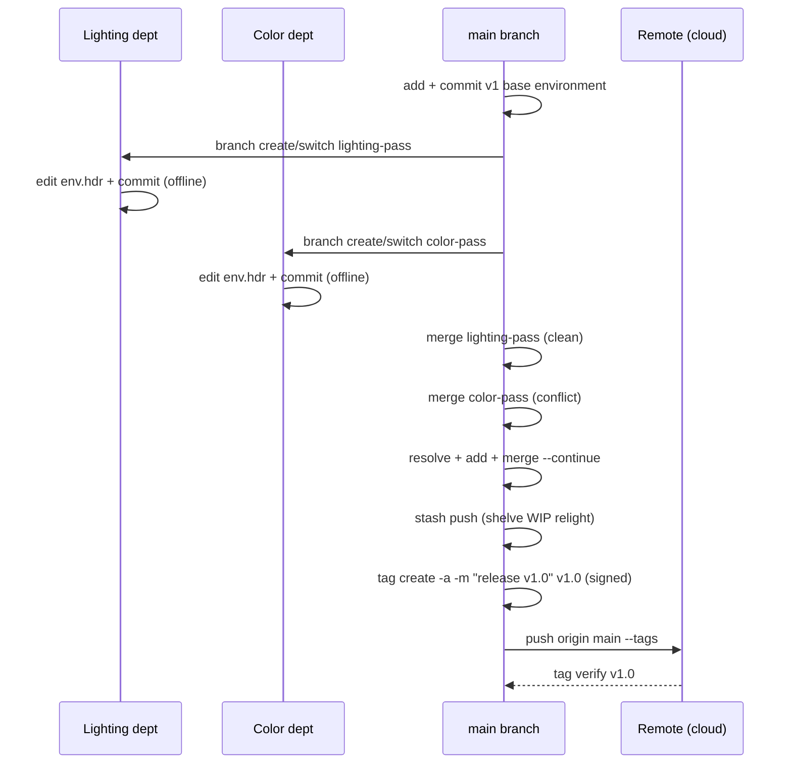

# MediaGit Use Cases

**Version**: 0.3.0-rc.5

Concrete command sequences for four industry workflows. Each is grounded in
the QA-suite persona scripts that exercise it end-to-end
(`dev-tests/qa-suite/scripts/03_persona_*.ps1`) — the commands below are
ones MediaGit actually runs in CI, not illustrative pseudocode. Storage/perf
figures are cited from [BENCHMARKS.md](BENCHMARKS.md); see that
doc for full methodology.

---

## VFX Studio: 50TB Shot Library

### Scenario

A shot's EXR frame sequence gets re-graded a dozen frames at a time across
review rounds. Editors need to check out just the frame sequence (not the
video dailies sitting alongside it), and when a frame turns out corrupted
somewhere in the last 10 commits, they need to find which commit did it
without eyeballing history by hand.

### Workflow



### Command sequence

```bash
mediagit init shot010 && cd shot010
mediagit add exr/*.exr
mediagit commit -m "shot010: 48 frames"

# re-grade 12 of 48 frames; only the changed chunks cost storage
mediagit add exr/*.exr
mediagit commit -m "regrade 12 frames"

# review-only checkout: keep exr/, drop video/ dailies from the working tree
mediagit sparse-checkout set exr
mediagit sparse-checkout disable   # restore full tree when done

# frame_001 is corrupted somewhere in the last 10 commits
mediagit bisect start <bad-commit> <good-commit>
mediagit bisect good     # or: mediagit bisect bad — repeat until located
mediagit bisect reset
```

### Payoff

3D/binary delivery formats in the same pipelines dedup strongly across
edits — GLB reached **100% delta efficiency** (3–4 KB overhead) on a
13–24 MB three-version chain, and the general similarity-delta band for
GLB/FBX binary assets is **20–52%** (README §Performance). Across a
realistic mixed corpus (frames + video + comps), aggregate savings land
around **26.5%** — see [BENCHMARKS.md](BENCHMARKS.md#summary-per-format-and-mixed-corpus-savings).

---

## Game Dev: 10TB Texture Library

### Scenario

A texture/model library gets imported wholesale, then iterated per-feature
on branches that need rebasing as `main` advances. Hotfixes get
cherry-picked between release branches, and two artists editing the same
`.glb`/`.blend` file need a real conflict — not a silent last-write-wins
overwrite. Clients only pull the `assets/` subtree they need.

### Workflow



### Command sequence

```bash
mediagit init game-assets && cd game-assets
mediagit add -A
mediagit commit -m "import game assets"
mediagit stats

# feature branch, rebased onto an advancing main
mediagit branch create feature/art
mediagit branch switch feature/art
# ... edit model.fbx across 3 commits ...
mediagit rebase main

# cherry-pick a texture fix from release-1 onto release-2
mediagit branch switch release-2
mediagit cherry-pick <fix-commit>

# two artists edit the same .glb -> real binary conflict, not overwrite
mediagit merge side-b
# resolve by choosing one side's bytes, then:
mediagit add model.glb
mediagit merge --continue

# ship to the team; teammate pulls only assets/
mediagit remote add origin http://host:3000/game-assets
mediagit push -u origin main
mediagit clone http://host:3000/game-assets client-checkout
cd client-checkout && mediagit sparse-checkout set assets

# protect main; recover from an accidental reset --hard via reflog
mediagit branch protect main
mediagit reflog
mediagit reset --hard <lost-oid>
```

### Payoff

The `.glb` chain in the same fixture set dedups to **100%** delta
efficiency; the general similarity-delta band for GLB/FBX binary assets is
**20–52%** (README §Performance). Real binary conflicts (no silent
data loss on concurrent edits) are the fix for the exact bug class MediaGit's
QA campaign targeted in the game-dev persona.

---

## ML/Datasets: 100TB Training Data

### Scenario

A training run produces a checkpoint every epoch; datasets grow by
append-only writes; experiments run on parallel branches that get merged,
tagged, and pushed to cloud storage for reproducibility. Periodic `gc`
keeps the object store lean without breaking any historical checkpoint.

### Workflow



### Command sequence

```bash
mediagit init training && cd training

# checkpoint chain: only changed weights cost storage
mediagit add model.safetensors
mediagit commit -m "checkpoint v1"
# ... repeat add + commit for v2..v5 ...

# dataset append: only the new tail is new storage
mediagit add data.parquet
mediagit commit -m "dataset v2 (appended)"

# stage only modified tracked files across a large tree
mediagit add -u

# 3 parallel experiments, merge the winner, tag the reproducible release
mediagit branch switch -c exp-1
mediagit branch switch -c exp-2
mediagit branch switch -c exp-3
mediagit branch switch main
mediagit merge exp-2
mediagit tag create model-v1

# push the full experiment history + tag to cloud storage
mediagit remote add origin http://host:3000/training
mediagit push -u origin main --tags
mediagit clone http://host:3000/training training-clone

# maintenance: repack, aggressive gc, full integrity check
mediagit gc --repack -y
mediagit gc --repack -y
mediagit fsck --full
mediagit stats --json
```

### Payoff

Measured checkpoint chains: **Safetensors 45.5%** savings (v1→v5 weight
chain), **NPZ 76.7%** (v1→v3 checkpoint chain) — see
[BENCHMARKS.md](BENCHMARKS.md#summary-per-format-and-mixed-corpus-savings).
Mixed-corpus aggregate across a realistic project is **~26.5%**.

---

## Virtual Production: 20TB HDRI Library

### Scenario

On-set virtual production teams iterate the same environment/HDRI assets
across departments — lighting and color grading both touch the same file
independently, offline, and need a real merge (not a silent overwrite) when
reconciling back. Approved builds get a signed tag before syncing to cloud
storage for other stages.

### Workflow



### Command sequence

```bash
mediagit init hdri-library && cd hdri-library
mediagit add env_courtyard.hdr
mediagit commit -m "v1 base environment"

# two departments edit the same environment file, offline, on branches
mediagit branch create lighting-pass
mediagit branch create color-pass
mediagit branch switch lighting-pass
mediagit add env_courtyard.hdr && mediagit commit -m "lighting edit"
mediagit branch switch color-pass
mediagit add env_courtyard.hdr && mediagit commit -m "color edit"

# reconcile back on main: binary conflict surfaced, not silently overwritten
mediagit branch switch main
mediagit merge lighting-pass
mediagit merge color-pass        # conflict: resolve, then...
mediagit add env_courtyard.hdr
mediagit merge --continue

# shelve an in-progress edit without committing
mediagit stash push wip-relight

# approved build: signed tag, push to cloud, verify after sync
MEDIAGIT_SIGN=1 MEDIAGIT_SIGN_KEY=~/.ssh/id_ed25519 \
  mediagit tag create -a -m "release v1.0" v1.0
mediagit remote add origin http://host:3000/hdri-library
mediagit push origin main --tags
mediagit tag verify v1.0
```

### Payoff

Large uncompressed/lossless binary formats in this class dedup well —
**PSD reached 66.7%** savings on a comparable v1→v3 production edit chain
(BENCHMARKS.md), and cross-department offline commits + a real 3-way
merge avoid the silent-overwrite failure mode that ad-hoc file-share sync
can't detect. Cloud sync throughput for the push/tag/clone round-trip is in
[BENCHMARKS.md § Cross-Backend Throughput](BENCHMARKS.md#cross-backend-throughput).
