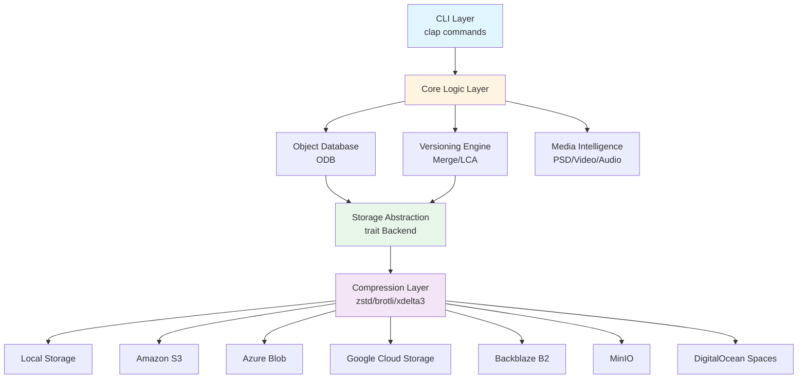
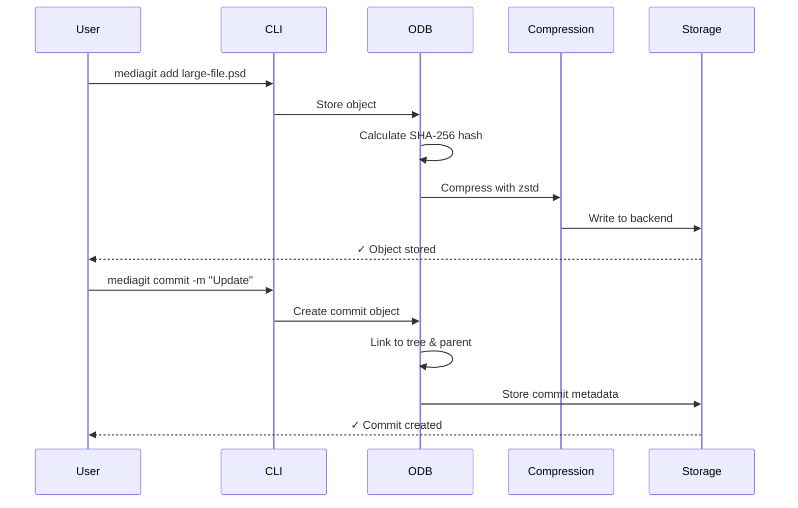

# Architecture Overview

MediaGit-Core is designed as a modular, extensible version control system optimized for large media files. The architecture follows a layered approach with clear separation of concerns.

## System Architecture

## Core Components

### 1. CLI Layer
- **Technology**: Clap derive macros for type-safe command parsing
- **Responsibility**: User interface, command validation, help system
- **Location**: `crates/mediagit-cli/`

### 2. Core Logic
- **Object Database (ODB)**: Content-addressable storage with SHA-256 hashing
- **Versioning Engine**: Branch management, merge strategies, LCA algorithms
- **Media Intelligence**: Format-aware parsing and merging for PSD, video, audio
- **Location**: `crates/mediagit-versioning/`, `crates/mediagit-media/`

### 3. Storage Abstraction
- **Design**: Trait-based abstraction (`Backend` trait)
- **Implementations**: 7 storage backends (local, S3, Azure, GCS, B2, MinIO, Spaces)
- **Benefits**: Easy backend switching, testability, cloud-agnostic design
- **Location**: `crates/mediagit-storage/`

### 4. Compression Layer
- **Algorithms**: zstd (default), brotli, xdelta3 (delta encoding)
- **Strategy**: Automatic algorithm selection based on file type
- **Performance**: Async compression with tokio runtime
- **Location**: `crates/mediagit-compression/`

## Data Flow

## Design Principles

### Content-Addressable Storage
- **Why**: Automatic deduplication, data integrity verification
- **How**: SHA-256 hashing of all objects (blobs, trees, commits)
- **Benefit**: Identical files stored only once across all branches

### Async-First Architecture
- **Why**: Handle large file I/O without blocking
- **How**: Tokio runtime with async/await throughout
- **Benefit**: Concurrent operations, better resource utilization

### Media-Aware Intelligence
- **Why**: Generic byte-level merging fails for structured media
- **How**: Format parsers for PSD layers, video tracks, audio channels
- **Benefit**: Preserve layer hierarchies, avoid corruption

### Trait-Based Abstraction
- **Why**: Decouple logic from storage implementation
- **How**: `Backend` trait with 7 implementations
- **Benefit**: Easy testing (mock backends), cloud provider flexibility

## Performance Characteristics

| Operation | Local Backend | S3 Backend | Optimization |
|-----------|---------------|------------|--------------|
| Add 1GB file | ~2-3 seconds | ~15-20 seconds | Delta encoding for updates |
| Commit | <100ms | ~200-500ms | Metadata-only operation |
| Checkout | ~3-5 seconds | ~20-30 seconds | Parallel object fetch |
| Merge | ~1-2 seconds | ~5-10 seconds | Media-aware strategies |

## Security Model

### Authentication
- Local: File system permissions
- S3/Azure/GCS: IAM roles, service principals, service accounts
- B2/MinIO/Spaces: Application keys with bucket-level permissions

### Integrity
- SHA-256 content verification on all read operations
- Cryptographic hashing prevents data tampering
- `mediagit verify` for repository health checks

### Encryption
- At-rest: Cloud provider encryption (SSE-S3, Azure Storage Service Encryption)
- In-transit: TLS 1.2+ for all network operations
- Future: Client-side encryption support

## Scalability

### Repository Size
- Tested with repositories up to 500GB
- Object count: Millions of objects supported
- Recommendation: Use cloud backends for >100GB repos

### Concurrency
- Parallel object fetch during checkout (configurable workers)
- Async I/O prevents thread pool exhaustion
- Lock-free read operations for status/log/diff

### Network Optimization
- HTTP/2 support for cloud backends
- Connection pooling (reqwest library)
- Automatic retry with exponential backoff

## Monitoring and Observability

### Metrics
- **Crate**: `mediagit-metrics`
- **Export**: Prometheus format
- **Metrics**: Operation latency, object size, cache hit rate, error rate

### Logging
- **Crate**: `mediagit-observability`
- **Levels**: ERROR, WARN, INFO, DEBUG, TRACE
- **Format**: Structured JSON logging for production

### Health Checks
- `mediagit fsck`: Repository integrity verification
- `mediagit verify`: Cryptographic object verification
- `mediagit stats`: Repository statistics and health metrics

## Extension Points

### Custom Merge Strategies
- Implement `MergeStrategy` trait
- Register strategy in `MergeEngine`
- Example: Custom video frame merging

### Storage Backend Development
- Implement `Backend` trait
- Provide `get`, `put`, `exists`, `delete`, `list` operations
- Example: IPFS backend, SFTP backend

### Media Format Support
- Implement format parser (e.g., FBX, Blender, CAD)
- Register with `MediaIntelligence` module
- Example: 3D model layer-aware merging

## Technology Stack

- **Language**: Rust 1.91.0
- **Async Runtime**: Tokio 1.40+
- **CLI Framework**: Clap 4.5+
- **Compression**: zstd, brotli, xdelta3
- **Cloud SDKs**: aws-sdk-s3, azure_storage, google-cloud-storage
- **Testing**: proptest (property-based), criterion (benchmarking)

## Related Documentation

- [Core Concepts](./concepts.md)
- [Object Database (ODB)](./odb.md)
- [Storage Backends](./storage-backends.md)
- [Media-Aware Merging](./media-merging.md)
- [Security](./security.md)
