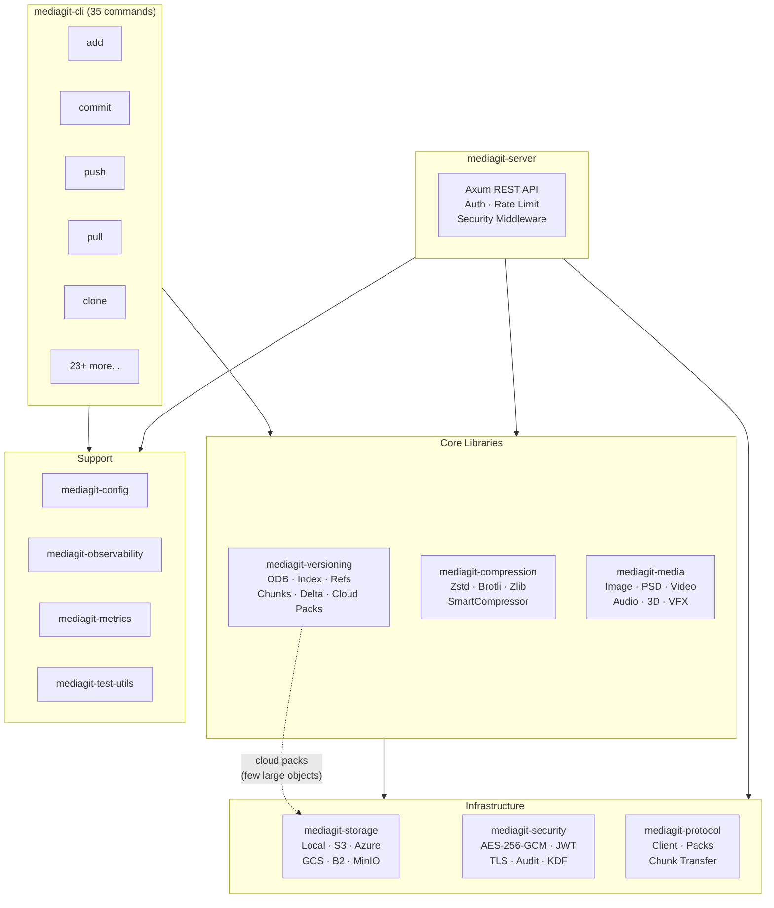
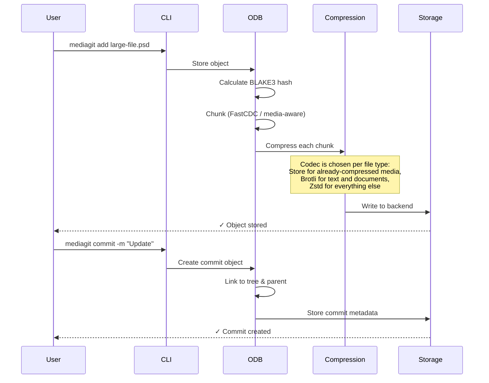

# Architecture Overview

MediaGit-Core is designed as a modular, extensible version control system optimized for large media files. The architecture follows a layered approach with clear separation of concerns.

## System Architecture

```mermaid
graph TD
    subgraph CLI["mediagit-cli (35 commands)"]
        ADD["add"]
        COMMIT["commit"]
        PUSH["push"]
        PULL["pull"]
        CLONE["clone"]
        OTHER["23+ more..."]
    end

    subgraph Core["Core Libraries"]
        VER["mediagit-versioning<br/>ODB · Index · Refs<br/>Chunks · Delta · Cloud Packs"]
        COMP["mediagit-compression<br/>Zstd · Brotli · Zlib<br/>SmartCompressor"]
        MEDIA["mediagit-media<br/>Image · PSD · Video<br/>Audio · 3D · VFX"]
    end

    subgraph Infra["Infrastructure"]
        STORE["mediagit-storage<br/>Local · S3 · Azure<br/>GCS · B2 · MinIO"]
        SEC["mediagit-security<br/>AES-256-GCM · JWT<br/>TLS · Audit · KDF"]
        PROTO["mediagit-protocol<br/>Client · Packs<br/>Chunk Transfer"]
    end

    subgraph Support["Support"]
        CFG["mediagit-config"]
        OBS["mediagit-observability"]
        MET["mediagit-metrics"]
        TEST["mediagit-test-utils"]
    end

    subgraph Server["mediagit-server"]
        AXUM["Axum REST API<br/>Auth · Rate Limit<br/>Security Middleware"]
    end

    CLI --> Core
    Core --> Infra
    Server --> Core
    Server --> Infra
    CLI --> Support
    Server --> Support
    VER -.->|"cloud packs<br/>(few large objects)"| STORE
```

## Core Components

### 1. CLI Layer
- **Technology**: Clap derive macros for type-safe command parsing
- **Responsibility**: User interface, command validation, help system
- **Location**: `crates/mediagit-cli/`

### 2. Core Logic
- **Object Database (ODB)**: Content-addressable storage with BLAKE3 hashing
- **Versioning Engine**: Branch management, merge strategies, LCA algorithms
- **Media Intelligence**: Format-aware parsing and merging for PSD, video, audio
- **Location**: `crates/mediagit-versioning/`, `crates/mediagit-media/`

### 3. Storage Abstraction
- **Design**: Trait-based abstraction (`StorageBackend` trait)
- **Implementations**: 7 storage backends (local, S3, Azure, GCS, B2, MinIO, Spaces)
- **Benefits**: Easy backend switching, testability, cloud-agnostic design
- **Location**: `crates/mediagit-storage/`

### 4. Compression Layer
- **Algorithms**: zstd (default), brotli, delta (zstd dictionary)
- **Strategy**: Automatic algorithm selection based on file type
- **Performance**: Async compression with tokio runtime
- **Location**: `crates/mediagit-compression/`

## Data Flow

```mermaid
sequenceDiagram
    participant User
    participant CLI
    participant ODB
    participant Compression
    participant Storage

    User->>CLI: mediagit add large-file.psd
    CLI->>ODB: Store object
    ODB->>ODB: Calculate BLAKE3 hash
    ODB->>ODB: Chunk (FastCDC / media-aware)
    ODB->>Compression: Compress each chunk
    Note over Compression: Codec is chosen per file type:<br/>Store for already-compressed media,<br/>Brotli for text and documents,<br/>Zstd for everything else
    Compression->>Storage: Write to backend
    Storage-->>User: ✓ Object stored

    User->>CLI: mediagit commit -m "Update"
    CLI->>ODB: Create commit object
    ODB->>ODB: Link to tree & parent
    ODB->>Storage: Store commit metadata
    Storage-->>User: ✓ Commit created
```

## Design Principles

### Content-Addressable Storage
- **Why**: Automatic deduplication, data integrity verification
- **How**: BLAKE3 hashing of all objects (blobs, trees, commits)
- **Benefit**: Identical files stored only once across all branches

### Async-First Architecture
- **Why**: Handle large file I/O without blocking
- **How**: Tokio runtime with async/await throughout
- **Benefit**: Concurrent operations, better resource utilization

### Media-Aware Intelligence
- **Why**: Generic byte-level merging fails for structured media
- **How**: Format parsers inspect PSD layers, video tracks, audio channels to detect whether concurrent edits actually overlap
- **Benefit**: Avoids corrupting binary files with inline conflict markers; a real conflict is reported instead of silently mangled. This is conflict *detection*, not an auto-merge — see [Media-Aware Merging](./media-merging.md)

### Trait-Based Abstraction
- **Why**: Decouple logic from storage implementation
- **How**: `StorageBackend` trait with 7 implementations
- **Benefit**: Easy testing (mock backends), cloud provider flexibility

## Performance Characteristics

| Operation | Local Backend | S3 Backend | Optimization |
|-----------|---------------|------------|--------------|
| Add 1GB file | ~2-3 seconds | ~15-20 seconds | Delta encoding for updates |
| Commit | <100ms | ~200-500ms | Metadata-only operation |
| Checkout | ~3-5 seconds | ~20-30 seconds | Parallel object fetch |
| Merge | ~1-2 seconds | ~5-10 seconds | Media-aware strategies |

## Security Model

### Authentication (to storage backends)
- Local: File system permissions
- S3 (and MinIO/B2/Spaces, all built through the S3-compatible path): config-file `access_key_id`/`secret_access_key` only — no IAM role, instance-profile, or environment-variable path
- Azure: a tagged `auth` credential in `config.toml` (`account_key`, `connection_string`, `sas`, or `emulator`) — no service-principal or environment-variable path
- GCS: the only backend with a real out-of-config path — falls back to Application Default Credentials (service account key file, `gcloud` login, or workload identity) when `credentials_path` is unset

### Integrity
- BLAKE3 content verification on all read operations
- Cryptographic hashing prevents data tampering
- `mediagit verify` for repository health checks

### Encryption
- At-rest, MediaGit's own: **implemented and enabled per repository.** The `MGEN` v2
  object envelope (XAES-256-GCM) is wired into `SmartCompressor`, and `mediagit key init`
  turns it on -- on an *empty* repository only, since sealing what is already there would
  mean rewriting every object. Key escrow delivers the key to the client on the
  presigned-upload path, so encrypted `push` and `clone` both work. With no key
  configured, output is byte-for-byte identical to a build without the feature.
  Encrypting an *existing* repository is not supported. See [Security](security.md).
- At-rest, cloud SSE: **not wired either.** `[storage] encryption` /
  `encryption_algorithm` are not fields on `S3Storage` at all, and unknown keys are
  silently discarded rather than rejected — so setting them looks fine and does
  nothing. No request sets an SSE header. (Bucket-level encryption configured
  outside MediaGit still applies; it just isn't these keys.)
- In-transit: TLS 1.3 by default when the server's TLS listener is enabled; `tls_min_version = "1.2"` in `mediagit-server.toml` is an escape hatch for TLS 1.2-only clients/proxies. mTLS is not wired.

## Scalability

### Repository Size
- Validated with a 58 GB dataset across 27+ file types; single-file scalability tested to 6 GB (see README "Last Validated" for the current campaign numbers) — no evidence found for a 500 GB repository-scale test
- Object count: Millions of objects supported
- Recommendation: Use cloud backends for >100GB repos

### Concurrency
- Parallel object fetch during checkout (configurable workers)
- Async I/O prevents thread pool exhaustion
- Lock-free read operations for status/log/diff

### Network Optimization
- HTTP/2 support for cloud backends
- Connection pooling (reqwest library)
- Automatic retry with exponential backoff

## Monitoring and Observability

### Metrics
- **Crate**: `mediagit-metrics`
- **Export**: Prometheus format
- **Metrics**: Operation latency, object size, cache hit rate, error rate

### Logging
- **Crate**: `mediagit-observability`, used by both binaries
- **Levels**: ERROR, WARN, INFO, DEBUG, TRACE
- **Formats**: `full` (the server default), `pretty` (the CLI default),
  `compact`, `json`
- **Selecting one**: `log_format` in `mediagit-server.toml`, or
  `mediagit --log-format json`, or `MEDIAGIT_LOG_FORMAT` for either.
  An unrecognised value is an error, not a silent fallback.
- **Filter**: `RUST_LOG` on the server, `MEDIAGIT_LOG` (then `RUST_LOG`)
  on the CLI. The filter and the format are separate settings.

> Until 2026-09-18 this said "Structured JSON logging for production" and
> that was not true of either binary: the server did not depend on the
> crate at all and the CLI hardcoded `pretty`, so the JSON renderer was
> unreachable. It is now selectable in both.

### Health Checks
- `mediagit fsck`: Repository integrity verification
- `mediagit verify`: Cryptographic object verification
- `mediagit stats`: Repository statistics and health metrics

## Extension Points

### Merge Strategies

`MergeStrategy` (`crates/mediagit-versioning/src/merge.rs`) is a closed enum
— `Recursive` (default), `Ours`, `Theirs` — not a trait, so there is no
pluggable/third-party merge-strategy mechanism today. Adding a new strategy
means adding a variant and teaching `MergeEngine` to handle it, not
implementing an extension point.

### Storage Backend Development
- Implement `StorageBackend` trait
- Provide `get`, `put`, `exists`, `delete`, `list_objects` operations (plus the presign/MPU trio, default no-op)
- Example: IPFS backend, SFTP backend

## Technology Stack

- **Language**: Rust 1.97.1
- **Async Runtime**: Tokio 1.40+
- **CLI Framework**: Clap 4.5+
- **Compression**: zstd, brotli, delta (zstd dictionary)
- **Cloud SDKs**: aws-sdk-s3, opendal (Azure Blob — replaced the EOL `azure_storage_blobs` stack), google-cloud-storage
- **Testing**: proptest (property-based), criterion (benchmarking)

## Related Documentation

- [Core Concepts](./concepts.md)
- [Object Database (ODB)](./odb.md)
- [Storage Backends](./storage-backends.md)
- [Media-Aware Merging](./media-merging.md)
- [Security](./security.md)
