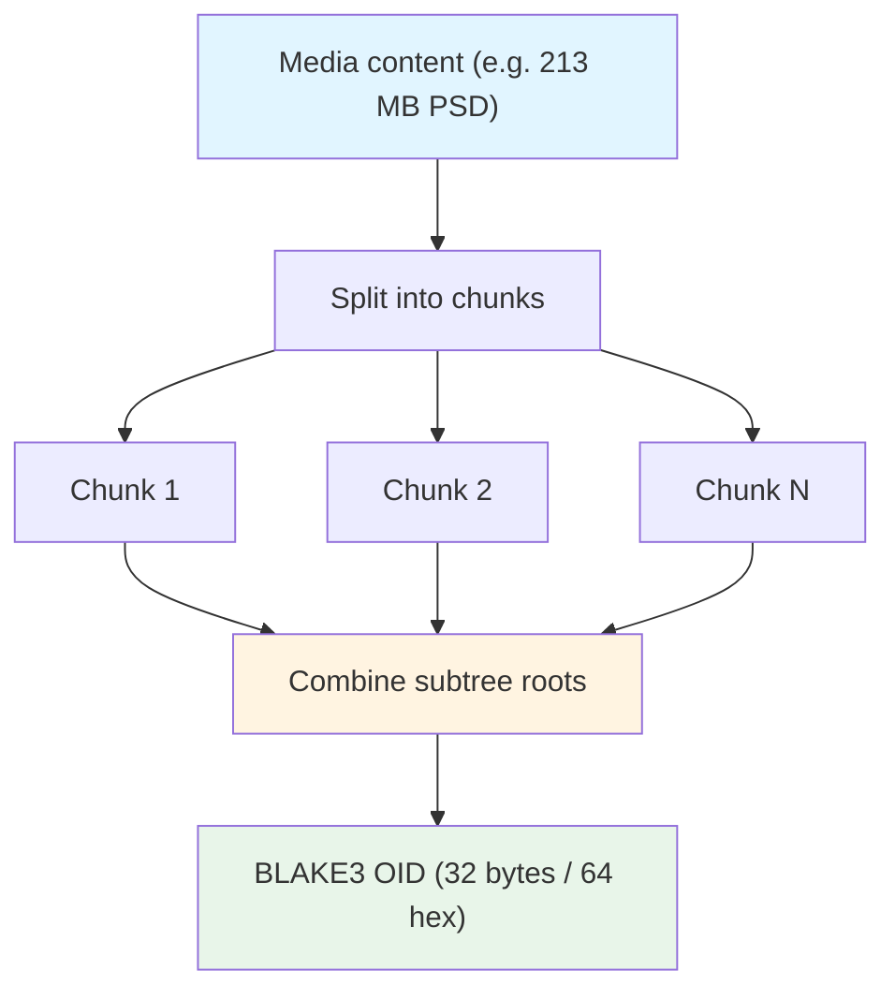

# BLAKE3 Hashing

MediaGit identifies every object — blobs, trees, commits, tags, and chunks — by its **BLAKE3** content hash. BLAKE3 replaced SHA-256 as the object hash during the beta cycle and is now the sole hashing primitive for content addressing.

## Why BLAKE3 over SHA-256

| Property | SHA-256 | BLAKE3 |
|----------|---------|--------|
| Digest size | 32 bytes (256-bit) | 32 bytes (256-bit) |
| Display | 64 hex characters | 64 hex characters |
| Throughput | Serial, ~0.5–1 GB/s | Multi-GB/s, scales with cores |
| Large-input parallelism | None | Tree-structured (`update_rayon`) |
| Security margin | 128-bit collision | 128-bit collision |

BLAKE3 keeps the same 256-bit security level and the same 64-hex on-screen representation, so OIDs look identical to users. What changes is speed: for the large media files MediaGit targets (multi-hundred-MB PSDs, 3D scenes, video), hashing was a measurable share of `add`/`commit` time. BLAKE3's internal Merkle-tree structure lets it split a large input into chunks and hash them in parallel across cores, then combine the subtree roots — turning a serial bottleneck into a parallel one.

## Digest and OID

- **Output**: a fixed 32-byte digest.
- **Display**: rendered as 64 lowercase hex characters, e.g. `9a2e...` (illustrative).
- **Sharding**: the first 2 hex characters form the object directory prefix (`objects/9a/2e...`), identical to the previous scheme.

## Tree-Parallel Hashing



For inputs above roughly 128 KiB, MediaGit hashes through the tree-parallel path (`Hasher::update_rayon`, gated behind the `rayon` feature). Smaller inputs use the plain incremental path. Both produce bit-identical digests.

## Single Entry Point

All hashing flows through one wrapper in `hash.rs`, which wraps `blake3::Hasher`:

```rust
use blake3::Hasher;

// One-shot
let oid = blake3::hash(content); // 32-byte digest

// Incremental / streaming (large files, chunk-by-chunk)
let mut hasher = Hasher::new();
hasher.update(chunk_a);
hasher.update(chunk_b);
let oid = hasher.finalize();

// Tree-parallel for large buffers (rayon feature)
let mut hasher = Hasher::new();
hasher.update_rayon(large_buffer);
let oid = hasher.finalize();
```

Routing every call through `hash.rs` guarantees that the OID definition stays consistent across the ODB, chunking, delta verification, and pack integrity checks. No call site constructs a hasher directly.

> **Note on `sha2`**: SHA-256/SHA-512 are still present in `mediagit-security`, used only for key derivation and API-key handling. They are **not** used for object hashing.

## Beta Migration Note

MediaGit is in beta and makes **no backward-compatibility guarantee** before GA. The SHA-256 → BLAKE3 switch is a breaking change to the object format: repositories created under the old hash are not compatible and must be re-initialized. This window for format-breaking changes closes at launch.

## Related Documentation

- [Content-Addressable Storage](./cas.md)
- [Object Database (ODB)](./odb.md)
- [Security](./security.md)
