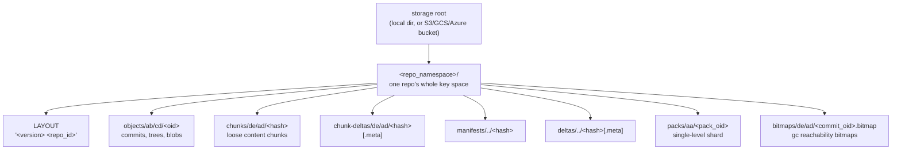
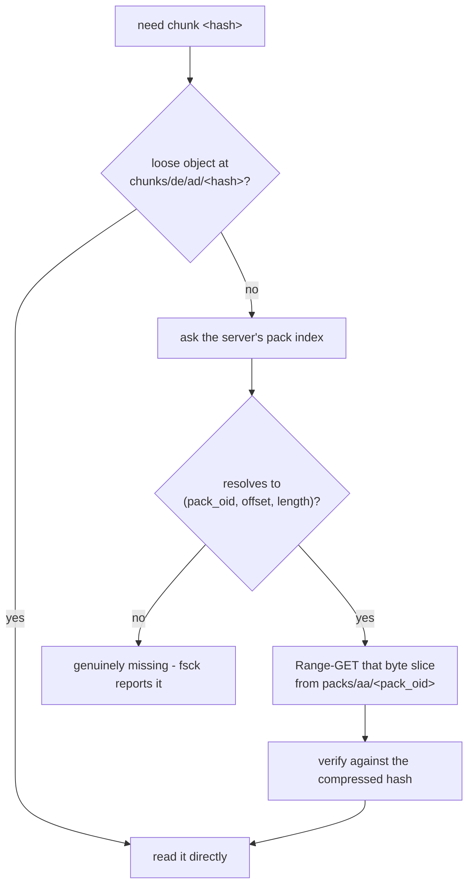

# Content-Addressable Storage

Content-Addressable Storage (CAS) is the foundation of MediaGit's deduplication and integrity verification.

## Concept

In CAS, data is retrieved by its content (hash) rather than by name or location:
- **Traditional FS**: `path/to/file.txt` → content
- **CAS**: `BLAKE3(content)` → content

## BLAKE3 Hashing

MediaGit uses **BLAKE3** as the content hash for every object (blobs, trees, commits, chunks). The digest is 32 bytes (64 hex characters) and is computed through a single entry point in `hash.rs`:
```rust
use blake3::Hasher;

let content = b"hello world";
let mut hasher = Hasher::new();
hasher.update(content);
let oid = hasher.finalize(); // 32-byte digest, displayed as 64 hex chars
// oid = 9a2e... (illustrative)
```

BLAKE3 is significantly faster than SHA-256 and hashes large media in parallel via its internal tree structure (`update_rayon`). See the dedicated [BLAKE3 Hashing](./blake3.md) chapter for the rationale, tree-parallel design, and the beta migration note.

## Benefits

### 1. Automatic Deduplication
Identical files stored only once:
```
Branch A: large-file.psd (100 MB) → 5891b5b522...
Branch B: large-file.psd (100 MB) → 5891b5b522... (same hash, no duplication)
```

### 2. Data Integrity
Hash mismatch immediately detected:
```rust
let stored_oid = "5891b5b522...";
let content = read_object(stored_oid);
let actual_oid = blake3_hash(&content);

if actual_oid != stored_oid {
    panic!("Corruption detected!");
}
```

### 3. Distributed Synchronization
Objects identifiable across repositories without central server.

## Object Identification

### Full OID
```
5891b5b522d5df086d0ff0b110fbd9d21bb4fc7163af34d08286a2e846f6be03
```

### Short OID
Abbreviated to 7-12 characters (Git-style):
```
5891b5b  // Unique prefix
```

MediaGit accepts short OIDs if unambiguous:
```bash
mediagit show 5891b5b
mediagit show 5891b5b522d5df086d0ff0b110fbd9d21bb4fc7163af34d08286a2e846f6be03
```

## Storage Layout

### Directory Sharding
Objects are stored under a per-repo namespace directory, sharded two levels deep on the hash itself (storage layout v2):
```
<repo_namespace>/
  objects/
    58/
      91/
        5891b5b522d5df086d0ff0b110fbd9d21bb4fc7163af34d08286a2e846f6be03
    a3/
      c5/
        a3c5d3e8f2a1b7c4d5e6f7a8b9c0d1e2f3a4b5c6d7e8f9a0b1c2d3e4f5a6b7c8d9
```

**Rationale**: Prevents millions of files in single directory (filesystem optimization). The `repo_namespace` prefix lets one storage root or bucket safely host multiple repositories.

### The full key space

`objects/` is one of seven key families, and they all shard the same way: on
the **hash**, never on the key string's own prefix. That distinction is the
whole point of layout v2 — sharding on the key prefix would put every chunk
in a single `chunks/` directory and defeat the fanout.



Two details carry real consequences:

- **`LAYOUT` is a guard, not a note.** It records the version *and* the
  `repo_id`. A client on a different layout version fails fast rather than
  writing keys the other side cannot find, and a second repo that resolves to
  the same namespace is rejected as a collision instead of silently merging
  its key space into yours.
- **`repo_namespace` is permanent.** Every key is written under it. Change it
  after init and every existing object is orphaned — still stored, no longer
  reachable.

### Where a chunk actually is

A chunk has one identity — `BLAKE3(uncompressed bytes)` — but two possible
homes, and the reader resolves them in a fixed order. This is the part worth
internalizing: "the chunk is missing from `chunks/`" is usually not a
missing chunk, it is a packed one.



Packing exists because cloud object stores charge and stall per request, not
per byte: a pack bundles up to 1024 chunks or 64 MiB into one object that
carries its own index, so a clone fetches a few large objects and Range-GETs
slices out of them instead of issuing a request per chunk. Nothing about the
chunk's identity changes when it is packed — the same hash addresses it
either way.

Packs are built client-side. The server stores them as opaque objects and
keeps the index that maps a chunk OID to its `(pack, offset, length)`.

## Collision Resistance

BLAKE3 produces a 256-bit digest, giving 2^256 possible outputs (approximately 10^77):
- **Probability of collision**: Negligible (< 10^-60 for millions of objects)
- **Comparison**: More atoms in observable universe than BLAKE3 outputs

### Collision Handling
If collision detected (theoretical):
1. Verify content matches
2. If content differs, abort (catastrophic error)
3. If content identical, continue (deduplication worked)

## Performance Characteristics

### Hashing Speed
- **Small files** (<1 MB): <1ms
- **Medium files** (10-100 MB): 10-100ms
- **Large files** (>1 GB): Streaming hash (chunked)

### Memory Usage
- Fixed memory (streaming hash): 32 bytes (hash state)
- No need to load entire file into memory

## Implementation Details

### Rust Code
```rust
use blake3::Hasher;
use std::io::Read;

pub fn hash_object(data: &[u8]) -> [u8; 32] {
    let mut hasher = Hasher::new();
    hasher.update(data);
    hasher.finalize().into()
}

pub fn hash_stream<R: Read>(reader: &mut R) -> std::io::Result<[u8; 32]> {
    let mut hasher = Hasher::new();
    let mut buffer = [0u8; 8192];

    loop {
        let n = reader.read(&mut buffer)?;
        if n == 0 {
            break;
        }
        hasher.update(&buffer[..n]);
    }

    Ok(hasher.finalize().into())
}
```

## Related Documentation

- [BLAKE3 Hashing](./blake3.md)
- [Object Database (ODB)](./odb.md)
- [Core Concepts](./concepts.md)
