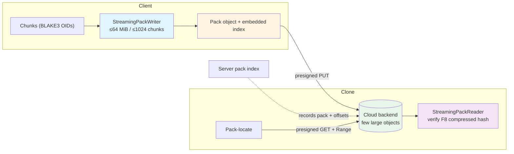

# Cloud Packs

Cloud packs bundle many small chunk objects into a few large pack objects before they reach cloud storage, eliminating the per-object overhead that dominates clone and push time on object stores.

## The Problem

MediaGit's content-defined chunking can split a single large media file into thousands of chunks. Stored naively, each chunk becomes its own cloud object:

- A repository with millions of chunks means **millions of cloud objects**.
- Every clone issues one request per object — latency-bound, not bandwidth-bound.
- Object stores price and rate-limit per request (LIST/GET), so small objects are slow *and* expensive.

For small-chunk repositories this turned clone into a per-request storm: tens of thousands of round-trips for what is only a few hundred MB of data.

## The Solution

The client bundles chunks **into pack objects** with an embedded index, so a repository that would have produced ~10,000 cloud objects instead produces a few hundred:

- **Pack size cap**: ≤ 64 MiB per pack
- **Chunk count cap**: ≤ 1024 chunks per pack
- **Embedded index**: each pack carries its own chunk-offset index, so a single Range-GET locates and fetches any chunk
- **Compressed-hash integrity (F8)**: every slice is verified against its compressed hash on read

Packing is done client-side; the server stores and serves opaque pack objects.

## Data Flow

## Components

- **`StreamingPackWriter` / `StreamingPackReader`** (`mediagit-versioning/streaming_pack.rs`): stream chunks into a pack and read them back by Range without buffering the whole pack. `finalize_cloud` emits a `CloudPackResult` describing the pack and its index; `PackKind::CloudObject` marks cloud-destined packs.
- **`StreamingPackIndex`** (`streaming_index.rs`): O(1)-memory index build/lookup — the index does not grow with chunk count in RAM.
- **`pack.rs` / `PackTransaction`** (`transaction.rs`): batch the chunk-to-pack assignment and the atomic commit of a pack set.
- **Server side** (`handlers/transfer.rs`, `chunks.rs`, `repo.rs`): records the pack index so clones can resolve a chunk OID to `(pack, offset, length)`.

## Upload and Clone

- **Upload**: packs are uploaded via **presigned PUT URLs** — the server mints the URL and the client PUTs the pack directly to the backend. When a backend cannot sign (e.g. GCS under ADC), MediaGit falls back to a server proxy upload; large packs on S3/MinIO use presigned multipart upload.
- **Clone**: the client performs **pack-locate** (resolve the chunk's pack and byte range from the server index), then issues a **presigned Range-GET** to pull only the needed slice directly from the backend. A proxy-GET fallback covers 404/null responses.

## Results

- **Object-count reduction**: repositories that previously created ~10,000 cloud objects now create a few **hundred** — roughly two orders of magnitude fewer requests, yielding the headline 5–10× clone speedup on small-chunk repositories.
- **Verification**: all **614/614** deep tests pass across MinIO (151), AWS (150), Azure (154), and GCS (159), 2026-06-02. F8 compressed-hash integrity is clean across backends, with cloud storage savings of 26.3–26.5%.

The F-series tasks **F1–F11** delivered this design end to end; **F8** is the per-slice compressed-hash integrity verification.

## Related Documentation

- [Storage Backends](./storage-backends.md)
- [Delta Encoding](./delta-encoding.md)
- [Object Database (ODB)](./odb.md)
