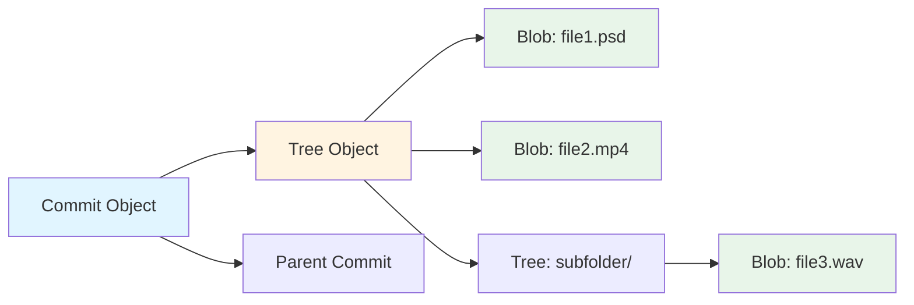
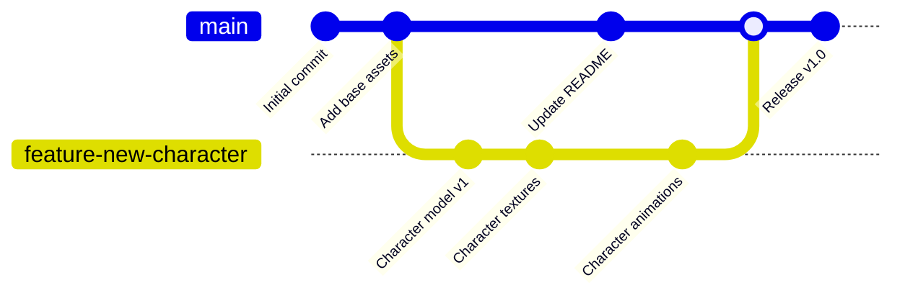
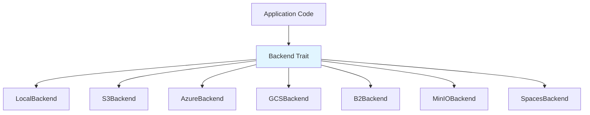

# Core Concepts

MediaGit-Core is built on several fundamental concepts that enable efficient version control for large media files.

## Content-Addressable Storage (CAS)

### What is CAS?
Content-addressable storage identifies objects by their content (via cryptographic hash) rather than by name or location.

### How MediaGit Uses CAS
```
File Content → SHA-256 Hash → Object ID (OID)
   "hello"   →   5891b5b522...  →  objects/58/91b5b522...
```

Every object (blob, tree, commit) is stored under its SHA-256 hash:
- **Blobs**: Raw file content
- **Trees**: Directory listings
- **Commits**: Snapshots with metadata

### Benefits
1. **Automatic Deduplication**: Identical files stored only once
2. **Integrity Verification**: Hash mismatch = corruption detected
3. **Distributed Sync**: Objects identifiable across repositories
4. **Efficient Transfers**: Only send missing objects

## Object Model

MediaGit uses a four-object model inspired by Git:



### Blob Objects
- **Purpose**: Store raw file content
- **Properties**: No filename, no metadata, just bytes
- **Example**: `large-file.psd` → compressed bytes

### Tree Objects
- **Purpose**: Represent directories
- **Contains**: List of blobs and sub-trees with filenames and modes
- **Example**:
  ```
  100644 blob a3c5d... README.md
  100644 blob f7e2a... large-file.psd
  040000 tree b8f3c... assets/
  ```

### Commit Objects
- **Purpose**: Snapshot of repository at a point in time
- **Contains**:
  - Root tree hash
  - Parent commit(s) hash(es)
  - Author signature (name, email, timestamp)
  - Committer signature
  - Commit message
- **Example**:
  ```
  tree f3a5d...
  parent e8c2b...
  author Alice <alice@example.com> 1699564800
  committer Alice <alice@example.com> 1699564800

  Add updated PSD with new layers
  ```

### Reference Objects
- **Purpose**: Human-readable names for commits
- **Types**:
  - `refs/heads/main` → points to latest commit on main branch
  - `refs/tags/v1.0` → points to tagged release commit
  - `HEAD` → symbolic ref to current branch

## Delta Encoding

MediaGit uses delta encoding (via bsdiff) to store only differences between versions.

### When Deltas Are Used
- **Scenario**: Large file with small changes
- **Strategy**: Store base version + delta to new version
- **Benefit**: Massive storage savings (90%+ reduction common)

### Delta Chain Example
```
Version 1: project.psd (100 MB) → Stored as full blob
Version 2: project.psd (100 MB) → Stored as delta from v1 (5 MB)
Version 3: project.psd (100 MB) → Stored as delta from v2 (3 MB)
```

**Total storage**: 108 MB instead of 300 MB (64% reduction)

### Delta Chain Limits
- Maximum chain depth: 50 (configurable)
- `mediagit gc` recompresses long chains
- Base objects chosen for optimal reconstruction speed

## Compression Strategy

MediaGit employs intelligent compression based on file type:

### Compression Algorithms
1. **zstd** (default): Fastest, good ratio for all file types
2. **brotli**: Better ratio for text/code, slower
3. **bsdiff**: Delta encoding for large binary files with small changes

### Automatic Selection
```
.psd, .psb → zstd level 3 (preserve layers)
.mp4, .mov → store (already compressed)
.txt, .md  → brotli level 6 (high text compression)
.blend     → zstd + delta (frequently updated 3D scenes)
```

### Compression Levels
- **Fast**: Quick compression, lower ratio (zstd level 1)
- **Default**: Balanced speed/ratio (zstd level 3)
- **Best**: Maximum compression, slower (zstd level 19)

## Branching Model

MediaGit supports lightweight branches similar to Git:

### Branch Storage
- Branches are just files in `refs/heads/`
- Each file contains a commit hash (40 hex characters)
- Creating a branch = writing a 40-byte file (instant)

### Branch Visualization


### Branch Protection
- Branches can be marked as protected
- Protected branches require merge requests
- Prevents force-push and deletion

## Merge Strategies

MediaGit provides multiple merge strategies:

### 1. Fast-Forward Merge
- **When**: Target branch is direct ancestor
- **Action**: Just move branch pointer forward
- **Result**: Linear history, no merge commit
- **Use**: Feature branches with no conflicts

### 2. Three-Way Merge
- **When**: Branches have diverged
- **Action**: Find LCA (Lowest Common Ancestor), apply both changesets
- **Result**: Merge commit with two parents
- **Use**: Concurrent work on different files

### 3. Media-Aware Merge
- **When**: Merging structured media (PSD, video, audio)
- **Action**: Parse file format, merge layers/tracks/channels
- **Result**: Merged media file preserving structure
- **Use**: Collaborative media editing

### 4. Rebase
- **When**: Want linear history
- **Action**: Replay commits on top of target branch
- **Result**: No merge commit, clean history
- **Use**: Preparing feature branch for merge

## Conflict Resolution

### Text Conflicts
```
<<<<<<< HEAD (your changes)
Layer 1: Blue Background
=======
Layer 1: Red Background
>>>>>>> feature-branch (their changes)
```

### Media Conflicts
MediaGit detects conflicting layers in PSD files:
```
Conflict in large-file.psd:
  - Layer "Background" modified in both branches
  - Your version: Blue (#0000FF)
  - Their version: Red (#FF0000)

Resolution options:
  1. Keep yours (blue)
  2. Keep theirs (red)
  3. Manual merge (open in Photoshop)
```

## Storage Abstraction

MediaGit separates storage interface from implementation:



### Backend Trait
```rust
#[async_trait]
pub trait Backend: Send + Sync {
    async fn get(&self, key: &str) -> Result<Vec<u8>>;
    async fn put(&self, key: &str, data: &[u8]) -> Result<()>;
    async fn exists(&self, key: &str) -> Result<bool>;
    async fn delete(&self, key: &str) -> Result<()>;
    async fn list(&self, prefix: &str) -> Result<Vec<String>>;
}
```

### Benefits
- **Testability**: Mock backends for unit tests
- **Flexibility**: Swap backends without code changes
- **Extensibility**: Add new backends by implementing trait

## Garbage Collection

Over time, unreachable objects accumulate (orphaned by branch deletion, rebases, etc.).

### What Gets Collected
- Objects not reachable from any branch or tag
- Dangling blobs from incomplete operations
- Long delta chains (recompressed)

### GC Process
1. **Mark Phase**: Traverse from all refs, mark reachable objects
2. **Sweep Phase**: Delete unmarked objects
3. **Repack Phase**: Optimize delta chains, recompress

### Safety
- Preserves recent objects (default: 2 weeks grace period)
- Dry-run mode to preview deletions
- Backup recommended before aggressive GC

## Repository Structure

```
.mediagit/
├── config                  # Repository configuration
├── HEAD                    # Current branch pointer
├── refs/
│   ├── heads/             # Branch pointers
│   │   ├── main
│   │   └── feature-branch
│   └── tags/              # Tag pointers
│       └── v1.0
├── objects/               # Object database (CAS)
│   ├── 5a/
│   │   └── 91b5b522...   # Blob object
│   └── f3/
│       └── a5d3c1e8...   # Tree object
└── logs/                  # Reflog (operation history)
    └── HEAD
```

## Performance Considerations

### Object Packing
- Small objects stored individually
- Large objects chunked for streaming
- Frequently accessed objects cached in memory

### Network Optimization
- Object transfer uses HTTP/2 multiplexing
- Parallel object fetch (configurable workers)
- Automatic retry with exponential backoff

### Disk I/O
- Async I/O prevents thread blocking
- Memory-mapped files for large objects
- Sequential writes for optimal SSD performance

## Related Documentation

- [Object Database (ODB)](./odb.md)
- [Content-Addressable Storage](./cas.md)
- [Delta Encoding](./delta-encoding.md)
- [Compression Strategy](./compression.md)
- [Storage Backends](./storage-backends.md)
