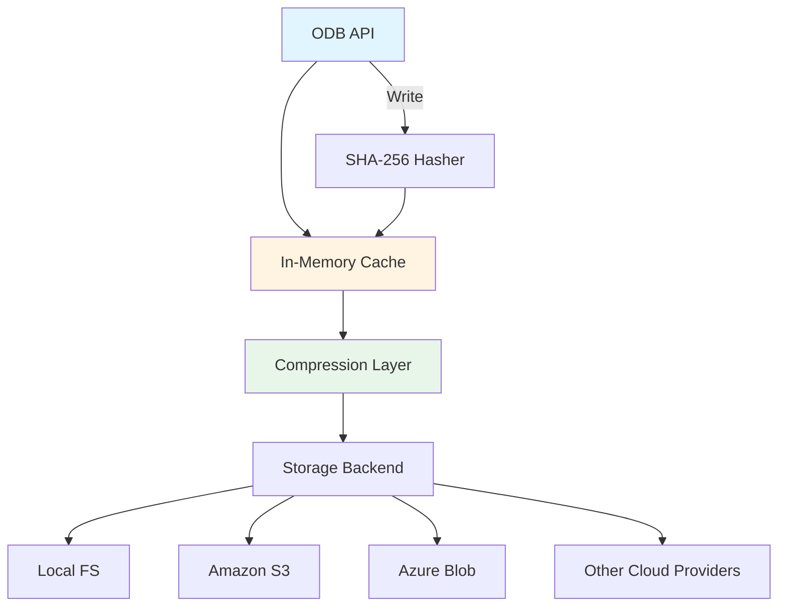
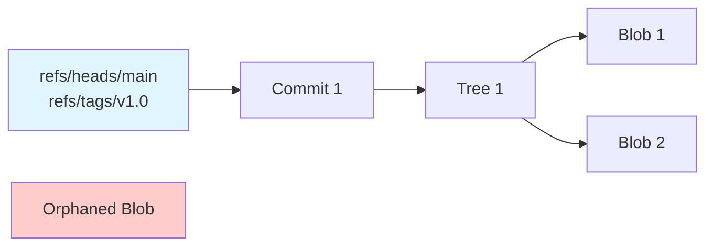

# Object Database (ODB)

The Object Database (ODB) is the core storage engine for MediaGit, managing content-addressable objects with SHA-256 hashing.

## Architecture



## Core Operations

### Writing Objects

```rust
// 1. Calculate SHA-256 hash
let oid = sha256(&content);

// 2. Check cache
if cache.contains(&oid) {
    return Ok(oid); // Already stored
}

// 3. Compress content
let compressed = compress(&content, CompressionAlgorithm::Zstd);

// 4. Write to backend
backend.put(&oid.to_path(), &compressed).await?;

// 5. Update cache
cache.insert(oid, content);
```

### Reading Objects

```rust
// 1. Check cache
if let Some(content) = cache.get(&oid) {
    return Ok(content);
}

// 2. Read from backend
let compressed = backend.get(&oid.to_path()).await?;

// 3. Decompress
let content = decompress(&compressed)?;

// 4. Verify integrity
let actual_oid = sha256(&content);
if actual_oid != oid {
    return Err(CorruptedObject);
}

// 5. Update cache
cache.insert(oid, content.clone());
Ok(content)
```

## Object Types

### Blob Objects
- **Purpose**: Store raw file content
- **Format**: Pure bytes (no metadata)
- **Example**: PSD file → compressed blob
- **Size**: Unlimited (automatic chunking for large files)

**Large File Handling**:
For files >100MB, MediaGit automatically chunks the content:
- **Chunk Size**: 64MB (configurable)
- **Strategy**: Content-defined chunking (CDC) for deduplication
- **Overhead**: Minimal (chunk index ~0.1% of file size)
- **Benefit**: Parallel processing and efficient delta compression

### Tree Objects
- **Purpose**: Represent directories
- **Format**:
  ```
  <mode> <type> <oid> <name>
  100644 blob a3c5d... README.md
  100644 blob f7e2a... large.psd
  040000 tree b8f3c... assets/
  ```
- **Sorted**: Entries sorted by name for consistent hashing

### Commit Objects
- **Purpose**: Snapshot with metadata
- **Format**:
  ```
  tree <tree-oid>
  parent <parent-oid>
  author <name> <email> <timestamp>
  committer <name> <email> <timestamp>

  <commit message>
  ```

### Tag Objects
- **Purpose**: Annotated tags with metadata
- **Format**:
  ```
  object <commit-oid>
  type commit
  tag v1.0.0
  tagger <name> <email> <timestamp>

  <tag message>
  ```

## Object Addressing

### OID (Object ID)
- **Hash**: SHA-256 (64 hex characters)
- **Example**: `5891b5b522d5df086d0ff0b110fbd9d21bb4fc7163af34d08286a2e846f6be03`

### Path Mapping
Objects stored with 2-character prefix for directory sharding:
```
OID: 5891b5b522d5df086d0ff0b110fbd9d21bb4fc7163af34d08286a2e846f6be03
Path: objects/58/91b5b522d5df086d0ff0b110fbd9d21bb4fc7163af34d08286a2e846f6be03
```

**Benefit**: Prevents single directory with millions of files (filesystem optimization)

## Caching Strategy

### Memory Cache
- **Implementation**: LRU cache (Least Recently Used)
- **Default Size**: 100 MB
- **Eviction**: Oldest unused objects evicted first
- **Hit Rate Target**: >80% for typical workflows

### Cache Warming
Pre-load frequently accessed objects:
- HEAD commit and tree
- Recent commits (last 10)
- Currently checked out files

### Cache Invalidation
- Object modification (rare due to immutability)
- Explicit cache clear (`mediagit gc --clear-cache`)
- Repository verification failures

## Compression Integration

### Algorithm Selection
```rust
fn select_compression(path: &Path, size: u64) -> CompressionAlgorithm {
    match path.extension() {
        // Already compressed media
        Some("mp4" | "mov" | "jpg" | "png") => CompressionAlgorithm::None,

        // Text and code
        Some("txt" | "md" | "rs" | "py") => CompressionAlgorithm::Brotli,

        // Large binaries
        Some("psd" | "blend" | "fbx") if size > 10_MB => {
            CompressionAlgorithm::ZstdWithDelta
        }

        // Default
        _ => CompressionAlgorithm::Zstd,
    }
}
```

### Compression Levels
- **Fast**: zstd level 1 (150 MB/s compression)
- **Default**: zstd level 3 (100 MB/s, better ratio)
- **Best**: zstd level 19 (slow, maximum compression)

## Delta Encoding

### When to Use Deltas
- File size > 10 MB
- Multiple versions exist
- File type supports delta (PSD, Blender, FBX)

### Delta Chain Management
```
Base Object (v1)    100 MB
  ↓ delta
Object v2           + 5 MB (delta)
  ↓ delta
Object v3           + 3 MB (delta)
  ↓ delta
Object v4           + 2 MB (delta)

Total: 110 MB (instead of 400 MB)
Chain depth: 3
```

### Chain Breaking
- Maximum depth: 50
- After depth exceeded, new base created
- `mediagit gc` optimizes chains

## Integrity Verification

### Read-Time Verification
Every object read is verified:
```rust
let content = backend.get(&oid.to_path()).await?;
let actual_oid = sha256(&content);
if actual_oid != oid {
    return Err(OdbError::CorruptedObject {
        expected: oid,
        actual: actual_oid,
    });
}
```

### Bulk Verification
`mediagit verify` checks all objects:
- Read every object
- Verify SHA-256 hash
- Report corrupted objects
- Optionally repair from remote

### Repair Operations
```bash
# Verify repository
mediagit verify

# Fetch missing/corrupted objects from remote
mediagit verify --fetch-missing

# Aggressive repair (expensive)
mediagit verify --repair --fetch-missing
```

## Performance Optimization

### Parallel Object Access
```rust
// Fetch multiple objects concurrently
let futures: Vec<_> = oids.iter()
    .map(|oid| odb.read(oid))
    .collect();

let objects = futures::future::join_all(futures).await;
```

### Batch Operations
```rust
// Write multiple objects in one backend call
odb.write_batch(&[
    (oid1, content1),
    (oid2, content2),
    (oid3, content3),
]).await?;
```

### Memory Management
- Stream large objects (chunking)
- Memory-mapped files for very large blobs
- Automatic cache eviction under memory pressure

## Large File Chunking

MediaGit implements intelligent chunking for efficient large file storage and processing.

### Chunking Strategy

**Content-Defined Chunking (CDC)**:
```rust
// Chunks split at natural content boundaries
// Uses rolling hash to find split points
// Average chunk size: 64MB
// Range: 16MB - 128MB (adaptive)
```

**Benefits**:
- **Deduplication**: Identical chunks shared across files
- **Parallel Processing**: Chunks processed concurrently
- **Delta Efficiency**: Small changes affect few chunks
- **Memory Efficiency**: Stream without loading entire file

### Automatic Chunking Thresholds

| File Size | Chunking Strategy | Chunk Count |
|-----------|-------------------|-------------|
| < 100 MB  | No chunking (single blob) | 1 |
| 100-500 MB | Automatic chunking | 2-8 |
| 500 MB - 2 GB | Aggressive chunking | 8-32 |
| > 2 GB | Streaming chunks | 32+ |

### Chunking Configuration

```toml
[storage.chunking]
# Enable automatic chunking
enabled = true

# Minimum file size for chunking (default: 100MB)
min_size = "100MB"

# Target chunk size (default: 64MB)
chunk_size = "64MB"

# Minimum chunk size (prevents tiny chunks)
min_chunk_size = "16MB"

# Maximum chunk size (prevents huge chunks)
max_chunk_size = "128MB"
```

### Chunking Performance

**Validated with 6GB Test File**:
- **Chunks Created**: 1,541 chunks
- **Average Chunk Size**: 4.12 MB (adaptive based on content)
- **Processing**: Parallel chunk compression and delta encoding
- **Throughput**: 35.5 MB/s (streaming mode)
- **Memory Usage**: < 256 MB (constant, regardless of file size)

### Chunk Storage

Chunks stored as individual objects:
```
File: large-video.mp4 (6 GB)
  → Chunk 1: 58/91b5b522... (64 MB)
  → Chunk 2: a3/c5d7e2f... (64 MB)
  → Chunk 3: f7/e2a1b8c... (64 MB)
  ...
  → Chunk Index: 5a/2b3c4d... (6.2 MB)
```

**Chunk Index** contains:
- Chunk OIDs (SHA-256 hashes)
- Chunk offsets in original file
- Chunk sizes
- Reconstruction order

### Deduplication Benefits

When same content appears in multiple files:
```
File A (5 GB):
  → Chunks: [C1, C2, C3, C4, C5]

File B (5 GB with 60% overlap):
  → Chunks: [C1, C2, C3, C6, C7]
  → Only C6, C7 stored (2 GB)
  → C1-C3 reused (deduplication)

Storage: 7 GB instead of 10 GB (30% savings)
```

## Storage Backend Integration

### Backend Requirements
```rust
#[async_trait]
pub trait Backend {
    async fn get(&self, key: &str) -> Result<Vec<u8>>;
    async fn put(&self, key: &str, data: &[u8]) -> Result<()>;
    async fn exists(&self, key: &str) -> Result<bool>;
    async fn delete(&self, key: &str) -> Result<()>;
}
```

### Object Key Format
```
objects/{prefix}/{oid}
objects/58/91b5b522d5df086d0ff0b110fbd9d21bb4fc7163af34d08286a2e846f6be03
```

### Backend-Specific Optimizations
- **S3**: Multipart upload for large objects
- **Azure**: Parallel block upload
- **Local**: Direct file I/O, no network overhead

## Garbage Collection

### Reachability Analysis


### GC Process
1. **Mark**: Traverse from all refs
2. **Sweep**: Delete unmarked objects
3. **Repack**: Optimize delta chains
4. **Verify**: Check repository integrity

### Safety Mechanisms
- Grace period (14 days default)
- Reflog preservation
- Dry-run mode
- Backup recommendations

## Error Handling

### Common Errors
- **ObjectNotFound**: OID not in database
- **CorruptedObject**: Hash mismatch
- **BackendError**: Storage backend failure
- **CompressionError**: Decompression failure

### Recovery Strategies
- Retry with exponential backoff (transient errors)
- Fetch from remote (missing objects)
- Repair with verification (corruption)
- Fallback to uncompressed storage (compression errors)

## Monitoring Metrics

### Key Metrics
- Object count
- Total size (compressed vs uncompressed)
- Cache hit rate
- Average object size
- Delta chain depth distribution

### Performance Metrics
- Read latency (p50, p99)
- Write latency (p50, p99)
- Compression ratio
- Backend throughput

## API Reference

See [API Documentation](../reference/api.md) for detailed Rust API documentation.

## Related Documentation

- [Content-Addressable Storage](./cas.md)
- [Compression Strategy](./compression.md)
- [Delta Encoding](./delta-encoding.md)
- [Storage Backends](./storage-backends.md)
