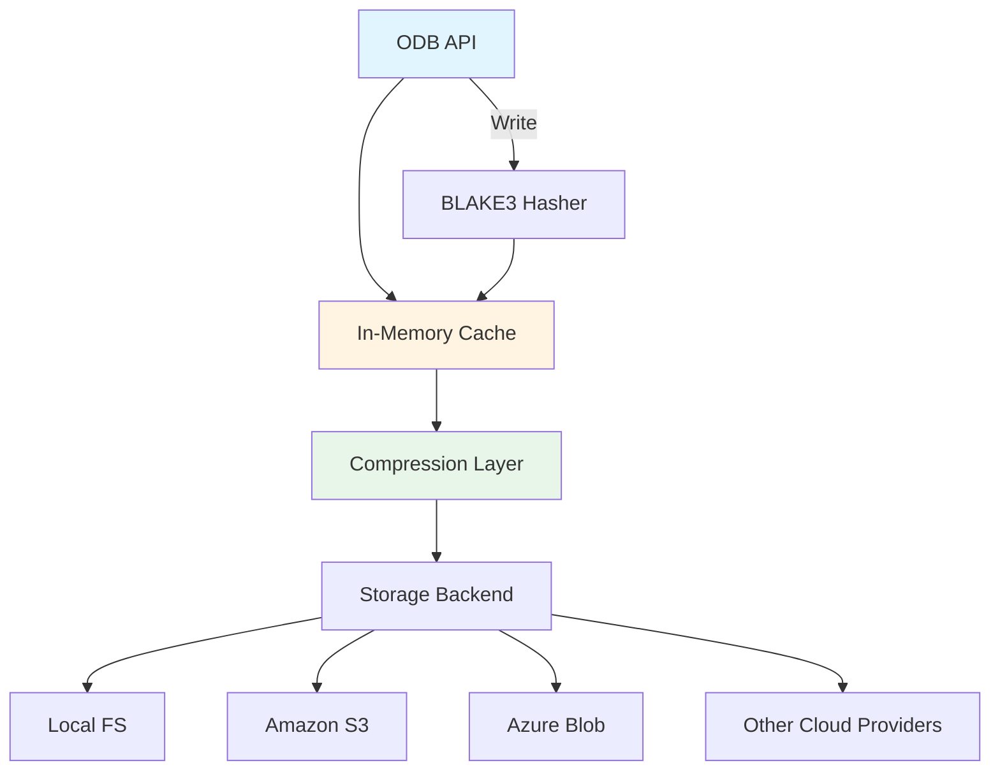
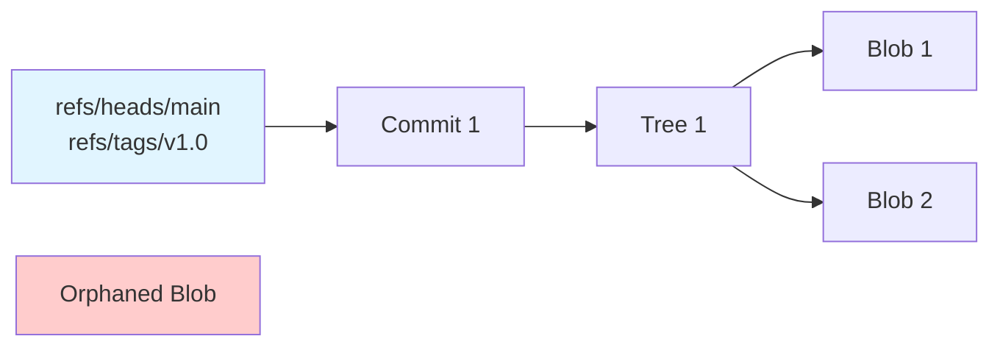

# Object Database (ODB)

The Object Database (ODB) is the core storage engine for MediaGit, managing content-addressable objects with BLAKE3 hashing.

## Architecture


```mermaid
graph TB
    API[ODB API] --> Cache[In-Memory Cache]
    Cache --> Compression[Compression Layer]
    Compression --> Backend[Storage Backend]

    API --> |Write| Hash[BLAKE3 Hasher]
    Hash --> Cache

    Backend --> Local[Local FS]
    Backend --> S3[Amazon S3]
    Backend --> Azure[Azure Blob]
    Backend --> Cloud[Other Cloud Providers]

    style API fill:#e1f5ff
    style Cache fill:#fff4e1
    style Compression fill:#e8f5e9
```

## Core Operations

### Writing Objects

```rust
// 1. Calculate BLAKE3 hash
let oid = blake3_hash(&content);

// 2. Check cache
if cache.contains(&oid) {
    return Ok(oid); // Already stored
}

// 3. Compress content
let compressed = compress(&content, CompressionAlgorithm::Zstd);

// 4. Write to backend
backend.put(&oid.to_path(), &compressed).await?;

// 5. Update cache
cache.insert(oid, content);
```

### Reading Objects

```rust
// 1. Check cache
if let Some(content) = cache.get(&oid) {
    return Ok(content);
}

// 2. Read from backend
let compressed = backend.get(&oid.to_path()).await?;

// 3. Decompress
let content = decompress(&compressed)?;

// 4. Verify integrity
let actual_oid = blake3_hash(&content);
if actual_oid != oid {
    return Err(CorruptedObject);
}

// 5. Update cache
cache.insert(oid, content.clone());
Ok(content)
```

## Object Types

### Blob Objects
- **Purpose**: Store raw file content
- **Format**: Pure bytes (no metadata)
- **Example**: PSD file → compressed blob
- **Size**: Unlimited (automatic chunking for large files)

**Large File Handling**:
For files exceeding type-specific thresholds (5-10MB), MediaGit automatically chunks the content:
- **Chunk Size**: 1-8 MB adaptive based on file size (via `get_chunk_params()`)
- **Strategy**: Content-defined chunking (FastCDC v2020) for deduplication
- **Overhead**: Minimal (chunk index ~0.1% of file size)
- **Benefit**: Parallel processing and efficient delta compression

### Tree Objects
- **Purpose**: Represent directories
- **Format**:
  ```
  <mode> <type> <oid> <name>
  100644 blob a3c5d... README.md
  100644 blob f7e2a... large.psd
  040000 tree b8f3c... assets/
  ```
- **Sorted**: Entries sorted by name for consistent hashing

### Commit Objects
- **Purpose**: Snapshot with metadata
- **Format**:
  ```
  tree <tree-oid>
  parent <parent-oid>
  author <name> <email> <timestamp>
  committer <name> <email> <timestamp>

  <commit message>
  ```

### Tag Objects
- **Purpose**: Annotated tags with metadata
- **Format**:
  ```
  object <commit-oid>
  type commit
  tag v1.0.0
  tagger <name> <email> <timestamp>

  <tag message>
  ```

## Object Addressing

### OID (Object ID)
- **Hash**: BLAKE3 (32 bytes, displayed as 64 hex characters)
- **Example**: `5891b5b522d5df086d0ff0b110fbd9d21bb4fc7163af34d08286a2e846f6be03`

### Path Mapping
Objects are stored under a per-repo namespace directory with a two-level hash
fanout on the OID itself (storage layout v2):
```
OID: 5891b5b522d5df086d0ff0b110fbd9d21bb4fc7163af34d08286a2e846f6be03
Path: <repo_namespace>/objects/58/91/5891b5b522d5df086d0ff0b110fbd9d21bb4fc7163af34d08286a2e846f6be03
```

**Benefit**: Prevents single directory with millions of files (filesystem optimization). The `repo_namespace` prefix also lets one storage root or bucket safely host multiple repositories.

## Caching Strategy

### Memory Cache
- **Implementation**: LRU cache (Least Recently Used)
- **Default Size**: 100 MB
- **Eviction**: Oldest unused objects evicted first
- **Hit Rate Target**: >80% for typical workflows

### Cache Warming
Pre-load frequently accessed objects:
- HEAD commit and tree
- Recent commits (last 10)
- Currently checked out files

### Cache Invalidation
- Object modification (rare due to immutability)
- Explicit cache clear (`mediagit gc --clear-cache`)
- Repository verification failures

## Compression Integration

### Algorithm Selection
The `CompressionAlgorithm` enum itself has four members — `None`, `Zlib` (Git-compatible), `Zstd`, `Brotli` — and selection is driven by detected `ObjectType` (`CompressionStrategy::for_object_type` in `mediagit-compression`), not by file extension directly:
```rust
fn select_compression(obj_type: ObjectType) -> CompressionStrategy {
    match obj_type {
        // Already compressed media: store as-is
        ObjectType::Mp4 | ObjectType::Mov | ObjectType::Jpeg | ObjectType::Png => {
            CompressionStrategy::Store
        }

        // Lossless audio (uncompressed — good zstd ratio)
        ObjectType::Wav | ObjectType::Aiff => CompressionStrategy::Zstd(CompressionLevel::Best),

        // Text and code
        ObjectType::Text => CompressionStrategy::Brotli(CompressionLevel::Default),

        // Default
        _ => CompressionStrategy::Zstd(CompressionLevel::Default),
    }
}
```
Chunk-level delta (base chunk as a zstd dictionary) is a separate mechanism applied by the ODB on top of this compression choice — see [Delta Encoding](./delta-encoding.md).

### Compression Levels
- **Fast**: zstd level 1 (150 MB/s compression)
- **Default**: zstd level 3 (100 MB/s, better ratio)
- **Best**: zstd level 19 (slow, maximum compression)

## Delta Encoding

### When to Use Deltas
- File size > 10 MB
- Multiple versions exist
- File type supports delta (PSD, Blender, FBX)

### Delta Chain Management
```
Base Object (v1)    100 MB
  ↓ delta
Object v2           + 5 MB (delta)
  ↓ delta
Object v3           + 3 MB (delta)
  ↓ delta
Object v4           + 2 MB (delta)

Total: 110 MB (instead of 400 MB)
Chain depth: 3
```

### Chain Breaking
- Maximum depth: 10 (`MAX_DELTA_DEPTH`)
- On reaching the limit, the next delta is re-targeted at the chain's **root**
  (a full chunk) rather than the nominated base, so the chunk stays
  delta-compressed while the chain restarts at depth 1
- Enforced on write for every chunk-delta path, and on read: `get_chunk`
  refuses to reconstruct a deeper chain
- `mediagit fsck` reports an over-deep chain; `mediagit fsck --repair`
  flattens it by re-storing the chunk in full
- `mediagit gc` does **not** optimize chains — it only reclaims orphaned
  delta objects

## Integrity Verification

### Read-Time Verification
Every object read is verified:
```rust
let content = backend.get(&oid.to_path()).await?;
let actual_oid = blake3_hash(&content);
if actual_oid != oid {
    return Err(OdbError::CorruptedObject {
        expected: oid,
        actual: actual_oid,
    });
}
```

### Bulk Verification
`mediagit verify` checks all objects:
- Read every object
- Verify BLAKE3 hash
- Report corrupted objects

`mediagit fsck` additionally checks connectivity and finds dangling/unreachable objects, and supports `--repair` to fix repairable issues locally.

### Repair Operations
```bash
# Verify repository (fast checksum + ref check)
mediagit verify

# Comprehensive integrity check with repair
mediagit fsck --repair

# Re-verify every chunk reachable from pushed refs and repair from remote
mediagit push --repair
```

## Performance Optimization

### Parallel Object Access
```rust
// Fetch multiple objects concurrently
let futures: Vec<_> = oids.iter()
    .map(|oid| odb.read(oid))
    .collect();

let objects = futures::future::join_all(futures).await;
```

### Batch Operations
```rust
// Write multiple objects in one backend call
odb.write_batch(&[
    (oid1, content1),
    (oid2, content2),
    (oid3, content3),
]).await?;
```

### Memory Management
- Stream large objects (chunking)
- Memory-mapped files for very large blobs
- Automatic cache eviction under memory pressure

## Large File Chunking

MediaGit implements intelligent chunking for efficient large file storage and processing.

### Chunking Strategy

**Content-Defined Chunking (CDC)**:
```rust
// Chunks split at natural content boundaries
// Uses FastCDC v2020 gear-table hash for O(1)/byte
// Average chunk size: 1-8 MB (adaptive by file size)
// Range: 512 KB - 32 MB
```

**Benefits**:
- **Deduplication**: Identical chunks shared across files
- **Parallel Processing**: Chunks processed concurrently
- **Delta Efficiency**: Small changes affect few chunks
- **Memory Efficiency**: Stream without loading entire file

### Automatic Chunking Thresholds

| File Size | Chunking Strategy | Chunk Count |
|-----------|-------------------|-------------|
| < 5-10 MB (type-dependent) | No chunking (single blob) | 1 |
| 5-100 MB | FastCDC (1 MB avg) | 5-100 |
| 100 MB - 10 GB | FastCDC (2 MB avg) | 50-5000 |
| > 10 GB | FastCDC (4-8 MB avg) | 2500+ |

### Chunking Configuration

```toml
[storage.chunking]
# Enable automatic chunking
enabled = true

# Chunk sizes are adaptive by file size (from get_chunk_params()):
# < 100 MB:     avg 1 MB,  min 512 KB, max 4 MB
# 100 MB-10 GB: avg 2 MB,  min 1 MB,   max 8 MB
# 10-100 GB:    avg 4 MB,  min 1 MB,   max 16 MB
# > 100 GB:     avg 8 MB,  min 1 MB,   max 32 MB
```

### Chunking Performance

**Validated with 6GB Test File**:
- **Chunks Created**: 1,541 chunks
- **Average Chunk Size**: 4.12 MB (adaptive based on content)
- **Processing**: Parallel chunk compression and delta encoding
- **Throughput**: 35.5 MB/s (streaming mode)
- **Memory Usage**: < 256 MB (constant, regardless of file size)

### Chunk Storage

Chunks stored as individual objects:
```
File: large-video.mp4 (6 GB)
  → Chunk 1: 58/91b5b522... (2 MB)
  → Chunk 2: a3/c5d7e2f... (2 MB)
  → Chunk 3: f7/e2a1b8c... (2 MB)
  ...
  → Chunk Index: 5a/2b3c4d... (metadata)
```

**Chunk Index** contains:
- Chunk OIDs (BLAKE3 hashes)
- Chunk offsets in original file
- Chunk sizes
- Reconstruction order

### Deduplication Benefits

When same content appears in multiple files:
```
File A (5 GB):
  → Chunks: [C1, C2, C3, C4, C5]

File B (5 GB with 60% overlap):
  → Chunks: [C1, C2, C3, C6, C7]
  → Only C6, C7 stored (2 GB)
  → C1-C3 reused (deduplication)

Storage: 7 GB instead of 10 GB (30% savings)
```

## Storage Backend Integration

### Backend Requirements
```rust
#[async_trait]
pub trait StorageBackend: Send + Sync + Debug {
    async fn get(&self, key: &str) -> Result<Vec<u8>>;
    async fn put(&self, key: &str, data: &[u8]) -> Result<()>;
    async fn exists(&self, key: &str) -> Result<bool>;
    async fn delete(&self, key: &str) -> Result<()>;
    async fn list_objects(&self, prefix: &str) -> Result<Vec<String>>;
}
```

### Object Key Format
```
objects/{prefix}/{oid}
objects/58/91b5b522d5df086d0ff0b110fbd9d21bb4fc7163af34d08286a2e846f6be03
```

### Backend-Specific Optimizations
- **S3**: Multipart upload for large objects
- **Azure**: Parallel block upload
- **Local**: Direct file I/O, no network overhead

## Garbage Collection

### Reachability Analysis

```mermaid
graph LR
    Refs[refs/heads/main<br/>refs/tags/v1.0] --> C1[Commit 1]
    C1 --> T1[Tree 1]
    T1 --> B1[Blob 1]
    T1 --> B2[Blob 2]

    Orphan[Orphaned Blob]

    style Refs fill:#e1f5ff
    style Orphan fill:#ffcccc
```

### GC Process
1. **Mark**: Traverse from all refs
2. **Sweep**: Delete unmarked objects
3. **Repack**: Optimize delta chains
4. **Verify**: Check repository integrity

### Safety Mechanisms
- Grace period (14 days default)
- Reflog preservation
- Dry-run mode
- Backup recommendations

## Error Handling

### Common Errors
- **ObjectNotFound**: OID not in database
- **CorruptedObject**: Hash mismatch
- **BackendError**: Storage backend failure
- **CompressionError**: Decompression failure

### Recovery Strategies
- Retry with exponential backoff (transient errors)
- Fetch from remote (missing objects)
- Repair with verification (corruption)
- Fallback to uncompressed storage (compression errors)

## Monitoring Metrics

### Key Metrics
- Object count
- Total size (compressed vs uncompressed)
- Cache hit rate
- Average object size
- Delta chain depth distribution

### Performance Metrics
- Read latency (p50, p99)
- Write latency (p50, p99)
- Compression ratio
- Backend throughput

## API Reference

See [API Documentation](../reference/api.md) for detailed Rust API documentation.

## Related Documentation

- [Content-Addressable Storage](./cas.md)
- [Compression Strategy](./compression.md)
- [Delta Encoding](./delta-encoding.md)
- [Storage Backends](./storage-backends.md)
