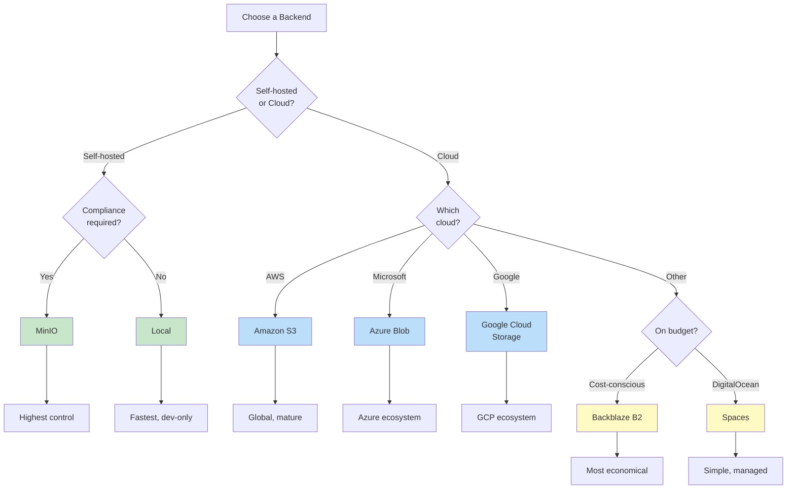

# Storage Backends

MediaGit supports 7 storage backends through a unified trait-based abstraction. All 614/614 deep tests pass across the cloud backends (MinIO 151, AWS 150, Azure 154, GCS 159; 2026-06-02), with cloud storage savings of 26.3–26.5%.

## Available Backends

1. **Local** - File system storage
2. **S3** - Amazon S3
3. **Azure** - Azure Blob Storage
4. **GCS** - Google Cloud Storage
5. **B2** - Backblaze B2
6. **MinIO** - Self-hosted S3-compatible
7. **Spaces** - DigitalOcean Spaces

## Backend Trait

```rust
#[async_trait]
pub trait StorageBackend: Send + Sync + Debug {
    async fn get(&self, key: &str) -> Result<Vec<u8>>;
    async fn put(&self, key: &str, data: &[u8]) -> Result<()>;
    async fn exists(&self, key: &str) -> Result<bool>;
    async fn delete(&self, key: &str) -> Result<()>;
    async fn list_objects(&self, prefix: &str) -> Result<Vec<String>>;
    async fn head(&self, key: &str) -> Result<Option<u64>>;
    // + presign_put / presign_get / MPU trio (default Ok(None), overridden per backend)
}
```

## Cloud Packs and Presigned Transfer

For cloud backends, MediaGit does not store each chunk as its own object. The client bundles chunks into **cloud packs** (≤ 64 MiB / ≤ 1024 chunks, with an embedded index), cutting per-repository object counts from tens of thousands to a few hundred. See [Cloud Packs](./cloud-packs.md) for the full design.

Transfer is **presigned** wherever the backend can sign:

- **Upload**: the server mints presigned PUT URLs and the client PUTs packs directly to the backend (presigned multipart upload for large packs on S3/MinIO; proxy-upload fallback when the backend can't sign).
- **Download/clone**: the server mints presigned GET URLs and the client issues Range-GETs direct from the backend (proxy-GET fallback on 404/null).

## Configuration

See individual backend documentation:
- [Local Storage](./backend-local.md)
- [Amazon S3](./backend-s3.md)
- [Azure Blob](./backend-azure.md)
- [Google Cloud Storage](./backend-gcs.md)
- [Backblaze B2](./backend-b2.md)
- [MinIO](./backend-minio.md)
- [DigitalOcean Spaces](./backend-do.md)

## Choosing a Backend



| Backend | Best For | Cost | Performance |
|---------|----------|------|-------------|
| Local | Development, small teams | Free | Fastest |
| S3 | Production, global teams | $$$ | Excellent |
| Azure | Microsoft ecosystem | $$$ | Excellent |
| GCS | Google Cloud users | $$$ | Excellent |
| B2 | Cost-effective archival | $ | Good |
| MinIO | Self-hosted, compliance | Free* | Excellent |
| Spaces | Simple cloud storage | $$ | Good |

*MinIO requires infrastructure costs

## Migration Between Backends

```bash
# Clone from S3 to local
mediagit clone s3://my-bucket/repo.git ./repo

# Push to different backend
cd repo
mediagit remote add azure azure://my-account/my-container/repo.git
mediagit push azure main
```
