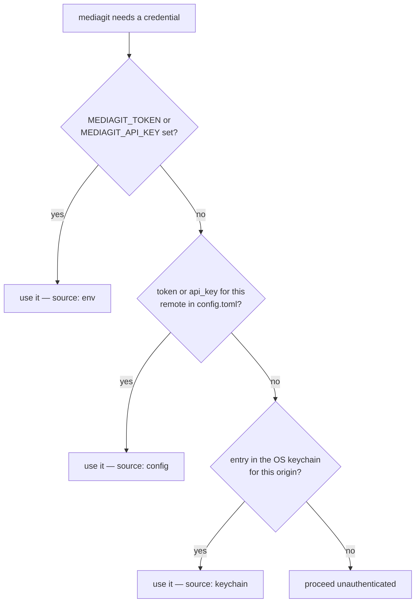
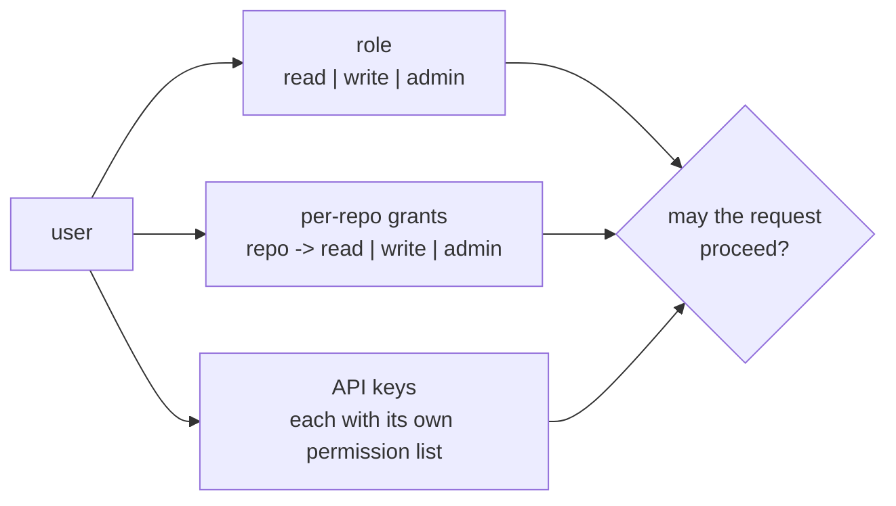

# mediagit auth

Manage authentication with a MediaGit server.

## Synopsis

```bash
mediagit auth login    [--server <URL>] [--username <USERNAME>] [--token <TOKEN>] [--api-key <API_KEY>]
mediagit auth register [--server <URL>]
mediagit auth status   [--server <URL>]
mediagit auth logout   [--server <URL>] [--all]
mediagit auth passwd   [--server <URL>]
mediagit auth whoami   [--server <URL>]
mediagit auth key    <create|list|revoke> ...
mediagit auth admin  <list-users|set-role|create-user|reset-password|grant|revoke-grant> ...
```

Every subcommand takes `--server <URL>`. When omitted it defaults to the current
repository's `origin` remote, so inside a cloned repo you rarely need it.

A server only mounts the `/auth/*` routes when it is configured with
authentication enabled. Against a server with auth switched off these commands
report that clearly rather than surfacing a raw HTTP error.

## Where credentials come from

Three tiers are consulted in order, and the first hit wins:



`auth login` writes to the keychain tier. `auth status` reports which tier is
actually in effect, which is the quickest way to explain "it works in one shell
and not another" — usually an environment variable shadowing a stored
credential.

Set `MEDIAGIT_NO_KEYRING` to skip the keychain tier entirely.

## Subcommands

| Subcommand | Description |
|---|---|
| `login` | Log in and store the credential |
| `register` | Register a new account on the server |
| `status` | Show which credential tier is active and the server's auth mode |
| `logout` | Delete the stored credential for a server |
| `passwd` | Change your own password |
| `whoami` | Show your identity, role, and granted repos |
| `key` | Manage your own API keys |
| `admin` | Administrative user and grant management (requires the admin role) |

### login

| Flag | Description |
|---|---|
| `--server <URL>` | Server to log in to |
| `--username <USERNAME>` | Username or email; prompted for if omitted |
| `--token <TOKEN>` | Store this bearer token directly instead of prompting for a password |
| `--api-key <API_KEY>` | Store this API key directly instead of prompting for a password |

`--token` and `--api-key` are mutually exclusive. With neither, you are prompted
for a password and the resulting credential is stored for you.

### logout

| Flag | Description |
|---|---|
| `--server <URL>` | Server whose credential to remove |
| `--all` | Remove every locally known credential, not just this server's |

### key

| Command | Arguments | Description |
|---|---|---|
| `key create` | `--name <NAME>` `[--permissions <LIST>]` | Mint a new API key for yourself |
| `key list` | — | List your own API keys |
| `key revoke` | `<ID>` | Revoke one of your own API keys (or, as admin, anyone's) |

`--name` is required and is just a memorable label (for example `ci`).
`--permissions` takes a comma-separated list and defaults to your own full
permission set — so a key never grants more than the user who minted it.

The key's plaintext value is shown **once**, at creation. `key list` shows ids
and metadata, never the secret. `<ID>` for `key revoke` is the id from
`key list`.

### admin

Requires the admin role. A non-admin calling these gets a 403.

| Command | Arguments | Description |
|---|---|---|
| `admin list-users` | — | List every user account |
| `admin set-role` | `<USER> <ROLE>` | Change a user's role (`read`, `write`, `admin`) |
| `admin create-user` | `<USER> --role <ROLE>` | Create a user with an explicit role, for closed-registration servers |
| `admin reset-password` | `<USER>` | Reset a user's password (forgot-password recovery) |
| `admin grant` | `<USER> <REPO> <LEVEL>` | Grant a user access to a repo (`read`, `write`, `admin`) |
| `admin revoke-grant` | `<USER> <REPO>` | Remove a user's grant on a repo |

`<USER>` accepts a username or a user id.

## Roles and grants

Authorisation has two independent layers, which is why `whoami` reports both:



The role is account-wide; a grant applies to one repository. An API key carries
its own permission list, bounded by its owner's. Revoking a key does not change
the owner's role or grants.

## Common options

| Flag | Description |
|---|---|
| `-v`, `--verbose` | Enable verbose output |
| `-q`, `--quiet` | Suppress output |
| `--color <WHEN>` | Colored output: `always`, `auto`, or `never` (default `auto`) |
| `-C`, `--repository <PATH>` | Run as if invoked in `PATH` |
| `-h`, `--help` | Print help |
| `-V`, `--version` | Print version |

## Environment

| Variable | Effect |
|---|---|
| `MEDIAGIT_TOKEN` | Bearer token; highest-precedence credential tier |
| `MEDIAGIT_API_KEY` | API key; same tier as `MEDIAGIT_TOKEN` |
| `MEDIAGIT_NO_KEYRING` | Skip the OS-keychain tier entirely |
| `MEDIAGIT_AUTH_TIMEOUT_SECS` | Connect and read timeout for `auth` HTTP calls (default `60`; `0` restores the previous unbounded behaviour) |

## Examples

### Log in and confirm which credential is in use

```bash
mediagit auth login --server https://mediagit.example.com
mediagit auth status
mediagit auth whoami
```

### Mint an API key for CI

```bash
mediagit auth key create --name ci
```

Copy the printed key immediately — it is not recoverable afterwards. In CI,
supply it as `MEDIAGIT_API_KEY` rather than storing it in a repository.

### Revoke a key you no longer trust

```bash
mediagit auth key list
mediagit auth key revoke ak_2f8a...
```

### Give a user write access to one repository

```bash
mediagit auth admin grant alice my-project write
mediagit auth admin list-users
```

### Log out everywhere

```bash
mediagit auth logout --all
```

## See also

- [Authentication](../reference/authentication.md) — the server-side model
- [key](./key.md) — repository encryption keys, which are unrelated to API keys
- [Environment Variables](../reference/environment.md)
