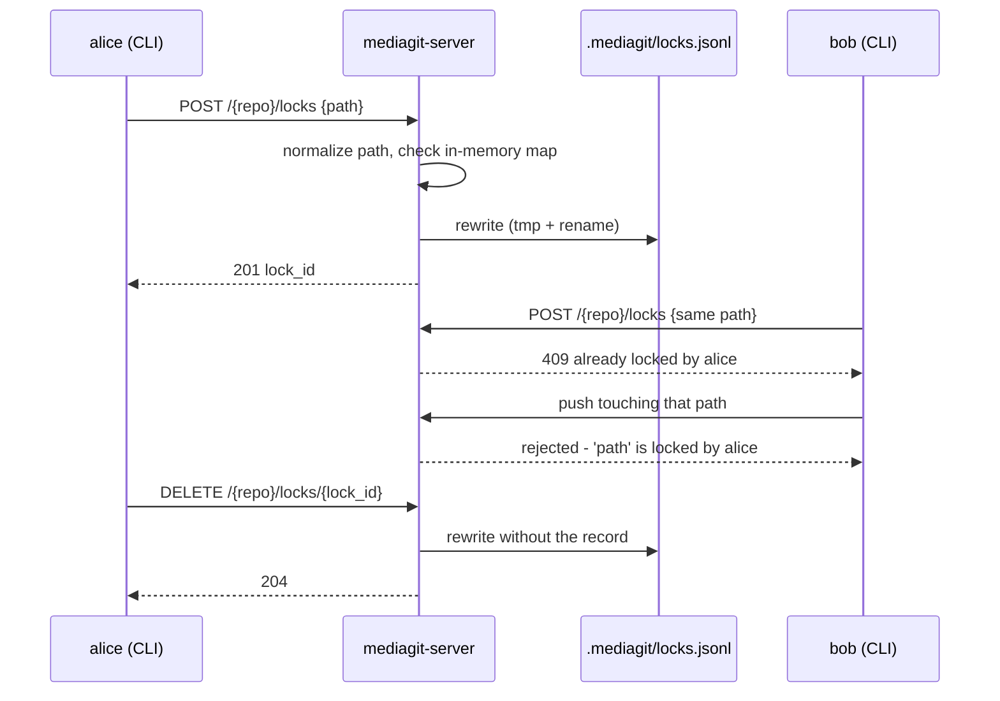
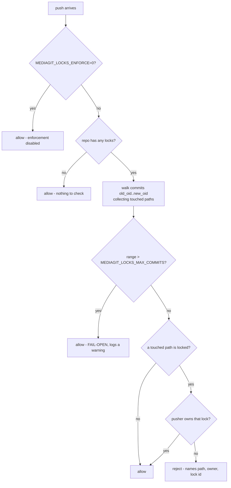

# mediagit lock

Manage server-enforced file locks.

## Synopsis

```bash
mediagit lock create <PATH> [--owner <NAME>] [--remote <REMOTE>]
mediagit lock unlock [<PATH>] [--id <LOCK_ID>] [--force] [--remote <REMOTE>]
mediagit lock list [--json] [--remote <REMOTE>]
```

## Description

Acquires, releases, and lists exclusive locks on repo-relative file paths,
enforced by the server at push time. `lock` is a thin CLI wrapper over the
protocol client's `create_lock` / `list_locks` / `delete_lock` calls, which
hit the server's `/{repo}/locks` HTTP surface directly — there's no local
lock state; every subcommand talks to a remote.

Locking exists for files that can't be usefully merged (binary media:
`.psd`, `.blend`, video, etc.) — a lock tells collaborators "I'm editing
this, don't push conflicting changes" before they invest work that would
have to be thrown away.

## Server Enforcement

Whether locks are actually enforced against pushes is a server-side
decision, controlled by two environment variables on the **server**:

- `MEDIAGIT_LOCKS_ENFORCE=0` — disables push-time lock checking entirely.
  Locks can still be created/listed/released, but pushes are never
  rejected for touching a locked path. Enabled (enforced) by default.
- `MEDIAGIT_LOCKS_MAX_COMMITS` (default `1000`) — caps how many commits a
  push's lock check will walk. A push whose range exceeds this fails open
  (the walk is abandoned, a warning is logged, and the push proceeds
  unchecked) rather than stalling on an expensive walk.

When enforcement is active, a push is rejected if any commit in the pushed
range touches a path locked by someone other than the pusher. With
authentication enabled, "the pusher" is the authenticated user; with no
authentication, there's no proven pusher identity, so any touched, locked
path rejects the push outright — an unauthenticated server can't tell one
client's push from another's.

### Where a lock lives

There is no local lock state. Every subcommand is an HTTP call, and the
server holds the answer in two places at once: an in-memory map that every
check reads, and `<repo>/.mediagit/locks.jsonl` that exists only so locks
survive a restart. Mutations rewrite the whole file (tmp + rename) rather
than appending, because lock sets are small — they are human-scale "I'm
working on this asset" claims, not a log.



Paths are normalized before they are compared — backslashes become forward
slashes, and a leading `./` or `/` is stripped — so a Windows client locking
`assets\a.psd` does block a push touching `assets/a.psd`.

### What a push actually checks

Enforcement is not a single yes/no. Three separate conditions let a push
through *without* consulting the locks, and knowing which one applied is
usually the difference between "locking is broken" and "locking was switched
off". Only the last branch rejects:



The fail-open branch is deliberate and it is loud: a push whose range exceeds
the cap logs `Lock enforcement fail-open for '<repo>'` and proceeds
**unchecked**. If lock enforcement matters to you, that warning is the line
to alert on.

"Pusher owns that lock" needs an identity to compare. With auth enabled it is
the authenticated user. With auth disabled there is no proven pusher at this
call site, so the ownership test can never succeed and **any** touched locked
path rejects the push. That is the safe default, not a bug — but it means an
unauthenticated server cannot give one client push access past its own locks.

## Subcommands

### `create`

Acquire a lock on a file.

```bash
mediagit lock create <PATH> [--owner <NAME>] [--remote <REMOTE>]
```

Arguments:
- `PATH` — Repo-relative path to lock

Options:
- `--owner <NAME>` — Identity to attribute the lock to. Required by
  no-auth servers (they have no other notion of who's asking);
  authenticated servers derive the owner from the credential and ignore
  this flag. See [Owner Resolution](#owner-resolution) below.
- `--remote <REMOTE>` — Remote to talk to (default: `origin`)

Fails with a conflict if the path is already locked by someone else.

### `unlock`

Release a lock, by path or by lock id.

```bash
mediagit lock unlock [<PATH>] [--id <LOCK_ID>] [--force] [--remote <REMOTE>]
```

Arguments:
- `PATH` — Repo-relative path of the lock to release. Resolved to a lock
  id via `lock list` first, since the server deletes by id, not path.

Options:
- `--id <LOCK_ID>` — Lock id to release directly, instead of resolving by
  path
- `--force` — Force-release someone else's lock. Requires `repo:admin`.
  Required on no-auth servers, which have no owner identity to match the
  requester against.
- `--remote <REMOTE>` — Remote to talk to (default: `origin`)

One of `PATH` or `--id` is required.

### `list`

List active locks.

```bash
mediagit lock list [--json] [--remote <REMOTE>]
```

Aliases: `ls`

Options:
- `--json` — Output as JSON
- `--remote <REMOTE>` — Remote to talk to (default: `origin`)

## Owner Resolution

When `--owner` isn't given to `lock create`, it's resolved in this order:

1. `MEDIAGIT_AUTHOR_NAME` environment variable
2. `[author].name` in `config.toml`
3. `$USER` environment variable
4. `"unknown"` if none of the above are set

This only matters against no-auth servers — an authenticated server
ignores the supplied owner and uses the authenticated user's identity
instead.

## Examples

### Lock a file before editing it

```bash
$ mediagit lock create textures/hero_diffuse.psd
Locked 'textures/hero_diffuse.psd' as alice (id 3f2a9c1b)
```

### Lock with an explicit owner (no-auth server)

```bash
$ mediagit lock create scene.blend --owner alice
Locked 'scene.blend' as alice (id 7d0e441a)
```

### List active locks

```bash
$ mediagit lock list
textures/hero_diffuse.psd	alice	3f2a9c1b	1731600000
scene.blend	alice	7d0e441a	1731600120
```

### List as JSON

```bash
$ mediagit lock list --json
[
  {
    "lock_id": "3f2a9c1b",
    "path": "textures/hero_diffuse.psd",
    "owner": "alice",
    "created_at": 1731600000
  }
]
```

### Release a lock by path

```bash
$ mediagit lock unlock textures/hero_diffuse.psd
Unlocked 3f2a9c1b
```

### Force-release someone else's lock (requires repo:admin)

```bash
$ mediagit lock unlock --id 7d0e441a --force
Unlocked 7d0e441a
```

## Exit Status

- **0**: Success
- **1**: Network error, lock conflict, not found, or permission denied


## Common options

Accepted by this command in addition to the options above.

| Flag | Description |
|---|---|
| `--color <WHEN>` | Colored output: `always`, `auto`, or `never` (default `auto`) |
| `-C`, `--repository <PATH>` | Run as if invoked in `PATH` |
| `-q`, `--quiet` | Suppress output |
| `-v`, `--verbose` | Enable verbose output |
| `-h`, `--help` | Print help |
| `-V`, `--version` | Print version |
## See Also

- [mediagit push](./push.md) - Push changes to remote (rejected if it touches a locked path someone else owns)
- [Authentication](../reference/authentication.md) - Server auth, credentials, and per-repo grants
