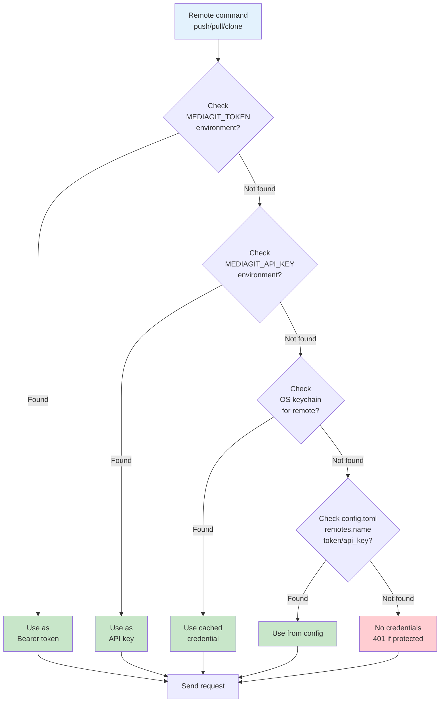

# Configuration

MediaGit configuration reference.

## Credential Resolution

When connecting to a remote server, MediaGit resolves credentials in this order:



The moment any credential succeeds, it's written through to the OS keychain so the next invocation resolves faster.

## Repository Configuration

Located in `.mediagit/config.toml`:

```toml
[storage]
backend = "filesystem"
base_path = "./data"

[compression]
algorithm = "zstd"
level = 3

[author]
name = "Your Name"
email = "your.email@example.com"
```

See [Configuration Reference](./reference/config.md) for all options.
