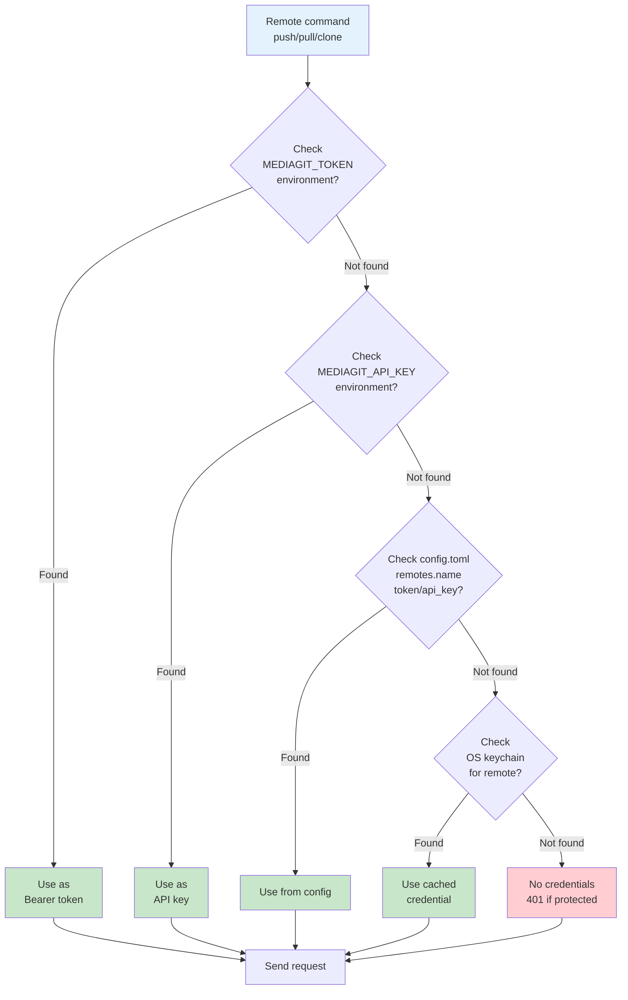
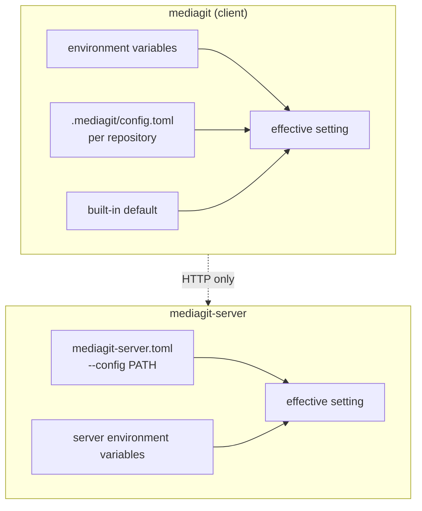

# Configuration

MediaGit configuration reference.

## Credential Resolution

When connecting to a remote server, MediaGit resolves credentials in this order:



The moment any credential succeeds, it's written through to the OS keychain so the next invocation resolves faster.

## Repository Configuration

Located in `.mediagit/config.toml`:

```toml
[storage]
backend = "filesystem"
base_path = "./data"

[compression]
algorithm = "zstd"
level = 3

[author]
name = "Your Name"
email = "your.email@example.com"
```

See [Configuration Reference](./reference/config.md) for all options.

## Three surfaces, not three layers

The most common configuration mistake is assuming these stack. They do not.
MediaGit has three independent configuration surfaces, each read by a
different process, and a setting written to the wrong one is simply not read
by anything:



Within the client, precedence is **environment variable → repo
`config.toml` → built-in default**, first match wins. A concrete example is
the storage namespace: `MEDIAGIT_REPO_NAMESPACE` beats `repo_namespace` in
`config.toml`, which beats a sanitized basename of the repo directory.

The server does not read `.mediagit/config.toml`, and the client does not
read `mediagit-server.toml`. Setting a server option in a repo config is
inert, and vice versa.

### One family of variables that does nothing

`MEDIAGIT_APP_*`, `MEDIAGIT_LOG_LEVEL`, `MEDIAGIT_METRICS_ENABLED` /
`_PORT`, `MEDIAGIT_COMPRESSION_ENABLED` / `_LEVEL`,
`MEDIAGIT_MAX_CONCURRENCY`, `MEDIAGIT_BUFFER_SIZE`, and
`MEDIAGIT_HTTPS_ENABLED` / `MEDIAGIT_AUTH_ENABLED` **have no effect**. They
are recorded here so nobody spends an afternoon on why setting one changed
nothing.

Watch the near-misses: `MEDIAGIT_METRICS_ADDR` is real and does bind the
Prometheus endpoint, while `MEDIAGIT_METRICS_ENABLED` and
`MEDIAGIT_METRICS_PORT` beside it do nothing at all.

The override code that reads them exists but is never called, and — this is
the part that makes it more than a missing function call — the fields it
would write are not read anywhere outside that crate's own tests. The
server's real settings live in a different type loaded from
`mediagit-server.toml`, which these variables never reach. Wiring the call
in would set fields nobody consults, which is worse than the current state:
it would *look* configured.

For settings that do work, see
[Environment Variables](./reference/environment.md).
