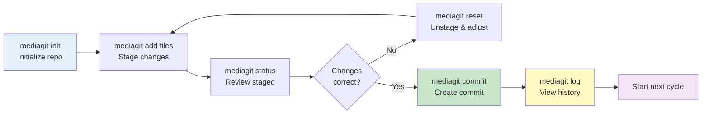

# Basic Workflow

See [Quickstart Guide](../quickstart.md) for complete installation and setup instructions. This guide covers the core commit workflow.

## The Commit Cycle



## Typical Session

```bash
# Start a session (once per repo)
mediagit init my-project
cd my-project

# Add or modify files
echo "Hello" > greeting.txt
mediagit add greeting.txt

# Check what you staged
mediagit status

# Commit your work
mediagit commit -m "Add greeting file"

# View your commits
mediagit log
```

For team collaboration using remotes, see [Working with Remote Repositories](./remote-repos.md).