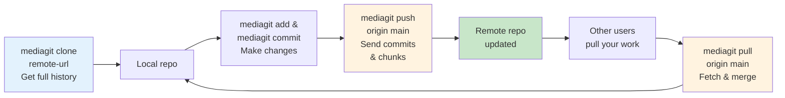

# Working with Remote Repositories

Guide to remote repository workflows.

## Remote Workflow



## Setup

Add a remote to an existing repo:

```bash
mediagit remote add origin https://host:3000/my-repo
mediagit remote add backup s3://bucket/backup-repo
```

List configured remotes:

```bash
mediagit remote list
```

## Push/Pull

Push your commits to a remote:

```bash
# Push current branch
mediagit push origin main

# Push all branches
mediagit push origin
```

Pull updates from a remote (fetch + merge):

```bash
mediagit pull origin main
```

Or fetch without merging, then merge manually:

```bash
mediagit fetch origin
mediagit merge origin/main
```

## Collaboration