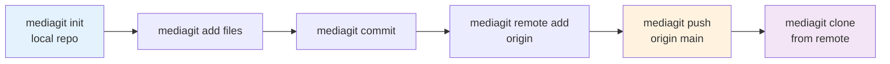

# Quickstart Guide

Get up and running with MediaGit in 5 minutes!

## Prerequisites

- Rust 1.97.1 or later (if building from source)
- Git (for installing from source or contributing)

## Installation

### Quick Install (Recommended)

```bash
# Linux/macOS — one-liner install
curl -fsSL https://raw.githubusercontent.com/winnyboy5/mediagit-core/main/install.sh | sh
```

```powershell
# Windows (PowerShell)
Invoke-WebRequest -Uri "https://github.com/winnyboy5/mediagit-core/releases/download/v0.3.0-rc.5/mediagit-0.3.0-rc.5-x86_64-windows.zip" -OutFile mediagit.zip
Expand-Archive mediagit.zip -DestinationPath "$env:LOCALAPPDATA\MediaGit\bin"
```

### Docker

```bash
docker pull ghcr.io/winnyboy5/mediagit-core:0.3.0-rc.5
docker run --rm ghcr.io/winnyboy5/mediagit-core:0.3.0-rc.5 mediagit --version
```

### From Pre-built Binaries

Download the latest release for your platform from [GitHub Releases](https://github.com/winnyboy5/mediagit-core/releases):

| Platform | Archive |
|----------|---------|
| Linux x86_64 | `mediagit-0.3.0-rc.5-x86_64-linux.tar.gz` |
| Linux ARM64 | `mediagit-0.3.0-rc.5-aarch64-linux.tar.gz` |
| macOS Intel | `mediagit-0.3.0-rc.5-x86_64-macos.tar.gz` |
| macOS Apple Silicon | `mediagit-0.3.0-rc.5-aarch64-macos.tar.gz` |
| Windows x86_64 | `mediagit-0.3.0-rc.5-x86_64-windows.zip` |

### From Source

```bash
git clone https://github.com/winnyboy5/mediagit-core.git
cd mediagit-core
cargo build --release
```

## Your First Repository

### 1. Initialize a Repository

```bash
mkdir my-media-project
cd my-media-project
mediagit init
```

Output:
```
✓ Initialized empty MediaGit repository in .mediagit/
```

### 2. Add Files

```bash
# Add a single file
mediagit add my-video.mp4

# Add multiple files
mediagit add images/*.jpg videos/*.mp4

# Add entire directory
mediagit add assets/
```

### 3. Check Status

```bash
mediagit status
```

Output:
```
On branch main

Changes to be committed:
  new file:   my-video.mp4
  new file:   images/photo1.jpg
  new file:   images/photo2.jpg
```

### 4. Commit Changes

```bash
mediagit commit -m "Initial commit: Add project media files"
```

Output:
```
[main abc1234] Initial commit: Add project media files
 3 files changed
 Compression ratio: 15.2% (saved 42.3 MB)
 Deduplication: 2 identical chunks found
```

### 5. View History

```bash
mediagit log
```

Output:
```
commit abc1234def5678
Author: Your Name <you@example.com>
Date:   Mon Nov 24 2025 12:00:00

    Initial commit: Add project media files

    Files: 3
    Size: 42.3 MB → 6.4 MB (84.8% savings)
```

## Your First Remote Push

To collaborate with others, push your repository to a server:

```bash
# Initialize a remote server (see deployment guide for production)
mediagit-server init --non-interactive --data-dir ./repos

# Start the server
mediagit-server --config mediagit-server.toml

# From your repo, add a remote and push
mediagit remote add origin http://127.0.0.1:3000/my-project
mediagit push origin main
```



Other users can now clone your repository:

```bash
mediagit clone http://127.0.0.1:3000/my-project ./my-project
cd my-project
mediagit status
```

## Working with Branches

### Create a Feature Branch

```bash
mediagit branch create feature/new-assets
mediagit branch switch feature/new-assets
```

### Make Changes

```bash
# Add new files
mediagit add new-video.mp4
mediagit commit -m "Add new promotional video"
```

### Merge Back to Main

```bash
mediagit branch switch main
mediagit merge feature/new-assets
```

## Storage Backend Configuration

MediaGit supports multiple storage backends. By default, it uses local filesystem storage.

**Storage is configured by editing `.mediagit/config.toml` directly.** There is
no `mediagit config set` command for storage keys — `config set` accepts only
`author.name`, `author.email`, `performance.upload_concurrency` and
`performance.download_concurrency`, and any other key is rejected.

### Configure AWS S3 Backend

Open `.mediagit/config.toml` in your editor and replace the `[storage]` section:

```toml
[storage]
backend = "s3"
bucket = "my-media-bucket"
region = "us-west-2"
access_key_id = "AKIA..."
secret_access_key = "..."
```

Backend fields sit **directly under `[storage]`** alongside `backend` — there is
no nested `[storage.s3]` table. Credentials must be in this file: MediaGit does
not read `AWS_ACCESS_KEY_ID` and has no IAM-role or instance-profile path.

### Configure Azure Blob Storage

The credential goes in a tagged `auth` table, so exactly one credential is
expressible:

```toml
[storage]
backend = "azure"
container = "media-container"
auth = { type = "account_key", account_name = "my-storage-account", account_key = "..." }
```

Other `type` values are `connection_string` (with `value`), `sas` (with
`account_name` and `token`), and `emulator` for local Azurite. Writing
`account_name`/`account_key` flat under `[storage]` is the pre-v3 layout;
MediaGit detects it and reports a migration error rather than silently ignoring
it.

See [Storage Backend Configuration](./guides/storage-config.md) for detailed setup instructions.

## Media-Aware Features

### Format inspection — available now

`mediagit media` parses format structure without altering it:

```bash
mediagit media info design.psd     # layer names, dimensions, colour mode
mediagit media info sequence.mp4   # streams, codecs, duration
```

### Media-aware merging — not yet available

This section previously described layer- and timeline-level auto-merge as
though it worked. It does not, and the gap is larger than "not wired up":
MediaGit can *analyse* PSD layers, video timelines and audio tracks and tell
whether edits overlap, but it cannot **write** a merged file back in any of
those formats — PSD writing is unsupported by the parser it uses, and video or
audio would need re-encoding. An auto-merge that cannot produce a real file is
not an auto-merge, so those strategies report an informative conflict instead.

What `mediagit merge` does today with a conflicting binary file:

```bash
mediagit merge feature/design-updates
```

- The conflict is detected and recorded in the index.
- **One side is checked out** into the working tree so the file stays valid —
  conflict markers are never inlined into binary content, which would corrupt
  it.
- You resolve by choosing or producing the file you want, then `mediagit add`
  it. Staging is the acknowledgement that clears the conflict.

Deduplication and delta compression still apply to every version involved, so
keeping both variants while you decide is cheap.

## Performance Tips

### Enable Compression

Compression is enabled by default. Adjust levels in `.mediagit/config.toml`:

```toml
[compression]
algorithm = "zstd"  # or "brotli"
level = 3           # zstd: 1 (fastest) – 22 (best); brotli: 0–11
```

### Delta Encoding

Delta encoding is automatic — there is no `[delta]` config table to enable
or tune it. When you add a new version of a file, MediaGit compares it
against similar stored chunks and stores only the difference once the
similarity score clears a type-aware threshold (15–95% depending on file
type; see the [FAQ](./reference/faq.md#how-does-delta-encoding-work)). Delta
chains are capped at depth 10, a fixed internal limit, not a config option.

### Deduplication

MediaGit automatically deduplicates identical content:

```bash
# Check deduplication statistics
mediagit stats

# Output:
# 📊 Repository Statistics
#
# Storage:
#   Total objects: 1,234 (856 loose, 320 chunks, 58 deltas)
#   Original size: 1.8 GB
#   Storage used:  1.2 GB
#   Compression:   1.5x ratio (33.3% saved)
```

## Next Steps

- 📚 [Basic Workflow Guide](./guides/basic-workflow.md) - Learn common workflows
- 🌿 [Branching Strategies](./guides/branching-strategies.md) - Effective branch management
- 🎨 [Merging Media Files](./guides/merging-media.md) - Advanced media-aware merging
- 🚀 [Performance Optimization](./guides/performance.md) - Optimize for large files
- 📖 [CLI Reference](./cli/README.md) - Complete command documentation

## Getting Help

- 📖 [Documentation](https://winnyboy5.github.io/mediagit-core)
- 🐛 [Issue Tracker](https://github.com/winnyboy5/mediagit-core/issues)
- 💬 [Discussions](https://github.com/winnyboy5/mediagit-core/discussions)

## Common Issues

### Permission Denied on Install

```bash
# Linux/macOS: Use sudo
sudo sh -c 'curl -fsSL https://raw.githubusercontent.com/winnyboy5/mediagit-core/main/install.sh | sh'

# Or install to user directory
curl -fsSL https://raw.githubusercontent.com/winnyboy5/mediagit-core/main/install.sh | sh -s -- --no-sudo
```

### Command Not Found After Install

Add MediaGit to your PATH:

```bash
# Linux/macOS (bash)
echo 'export PATH="$HOME/.mediagit/bin:$PATH"' >> ~/.bashrc
source ~/.bashrc

# macOS (zsh)
echo 'export PATH="$HOME/.mediagit/bin:$PATH"' >> ~/.zshrc
source ~/.zshrc

# Windows
# Add %USERPROFILE%\.mediagit\bin to System PATH
```

### Large File Upload Timeout

Increase timeout in configuration:

```toml
[performance.timeouts]
request = 300   # 5 minutes
write = 120
```

For more troubleshooting, see the [Troubleshooting Guide](./guides/troubleshooting.md).
