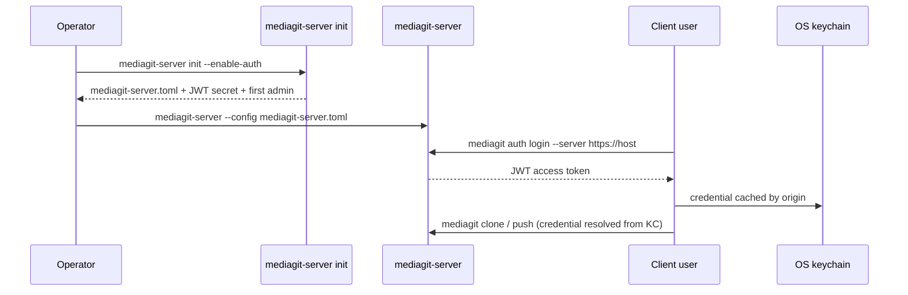
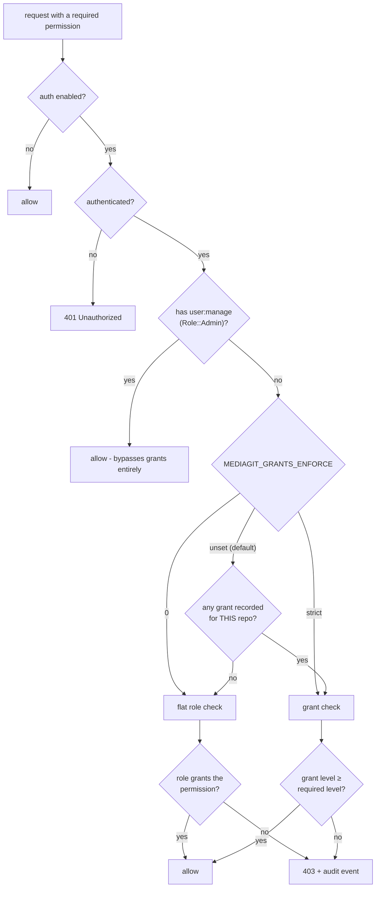

# Authentication

Reference for MediaGit server authentication: registration, login, JWT
refresh, API keys, per-repo grants, persistence, and the client-side
credential story. Server behavior is off by default — a repository created
with `mediagit init` and pushed to a server with `enable_auth = false`
requires no credentials at all.

## Enabling Authentication

Set in the server config:

```toml
enable_auth = true
jwt_secret = "a long random secret"
```

Or supply the secret via environment instead of the config file:

```bash
MEDIAGIT_JWT_SECRET=a-long-random-secret mediagit-server
```

If both are set, the environment variable wins (and a warning is logged).
Starting with `enable_auth = true` and no secret in either place is a hard
error. Starting with `enable_auth = false` on a non-loopback host is also a
hard error, unless `MEDIAGIT_ALLOW_INSECURE_BIND=1` is set — MediaGit
refuses to bind an open, credential-free server to the network by default.

## Setting Up Authentication

The typical workflow for multi-user collaboration:



After initial setup:

- **Operator** runs `mediagit-server init --enable-auth`, creating the server config and first admin account
- **Server** starts with `mediagit-server --config mediagit-server.toml`
- **Users** run `mediagit auth login --server https://host` once per origin (prompts for username + password)
- **Credentials** are cached in the OS keychain by origin; future `clone`, `push`, `pull` commands find them automatically

## Auth Model

Two credential types authenticate a request, tried in this order:

1. **JWT bearer token** — `Authorization: Bearer <token>` header
2. **API key** — `X-API-Key: <key>` header

Either resolves to an `AuthUser` with a `user_id` and a permission list.
Requests with neither (or an invalid one) get `401 Unauthorized` from any
protected endpoint.

### Roles and Permissions

Every user has a flat `Role`, which maps to permission strings:

| Role | Permissions |
|------|-------------|
| `Read` | `repo:read` |
| `Write` | `repo:read`, `repo:write` |
| `Admin` | `repo:read`, `repo:write`, `repo:admin`, `user:manage` |

Self-registration (`POST /auth/register`) always creates a `Write`-role
account — there's no client-controlled `role` field, so a caller can't
mint themselves an `Admin` account through the registration endpoint.

## Endpoints

### Public (no credential required)

| Method | Path | Description |
|--------|------|--------------|
| POST | `/auth/register` | Register a new user. Body: `{username, email, password}`. Returns `{user, tokens}` with `201`. |
| POST | `/auth/login` | Log in with email or username. Body: `{identifier, password}`. Returns `{user, tokens}`. |
| POST | `/auth/refresh` | Exchange a refresh token for a new access token. Body: `{refresh_token}`. Returns a new `TokenPair`. |
| POST | `/auth/logout` | No-op beyond `204 No Content` — JWTs are stateless, so logout is a client-side token deletion. Exists for API consistency and future blacklisting. |

Password requirements: at least 8 characters. Username: at least 3
characters. Passwords are hashed with bcrypt and never stored in
plaintext.

### Protected (requires a valid JWT or API key)

| Method | Path | Description |
|--------|------|--------------|
| GET | `/auth/me` | Current authenticated user's info (id, username, email, role, permissions). |

### Admin (requires `user:manage`, i.e. `Role::Admin`)

| Method | Path | Description |
|--------|------|--------------|
| GET | `/auth/users` | List all users: `{id, username, role}` per entry (no email, no password hash). |
| DELETE | `/auth/users/{id}` | Delete a user account. Cascades: also removes every grant that user held. |
| POST | `/auth/users/{id}/grants` | Upsert a per-repo grant. Body: `{repo, level}`, `level` one of `read`/`write`/`admin`. |
| DELETE | `/auth/users/{id}/grants` | Remove a per-repo grant. Body: `{repo}`. |
| GET | `/auth/keys` | List all API keys across all users: `{id, name, user_id, created_at}` (metadata only — the key hash and plaintext are never returned). |
| DELETE | `/auth/keys/{id}` | Revoke an API key. |

## JWT Tokens

Generated as an access/refresh pair:

- **Access token**: 24-hour expiry, carries `sub` (user id), `iat`,
  `exp`, and the user's `permissions` at issuance time.
- **Refresh token**: 30-day expiry, same claim shape.

`POST /auth/refresh` validates the refresh token and mints a new access
token with the same permissions — it does not re-check whether the user's
role or grants have since changed, so a permission downgrade doesn't take
effect until the old access token expires (up to 24 hours) or refresh
fails for another reason.

## API Keys

Generated server-side per user (there is currently no `POST /auth/keys`
issuance endpoint documented here beyond the admin listing/revoke pair —
key generation happens through `ApiKeyAuth::generate_key` on the server).
The plaintext key is returned exactly once at creation; only its SHA-256
hash is stored. Send it as `X-API-Key: <key>`.

## Per-Repo Grants

A grant is `{user_id, repo, level}` with `level` one of `Read < Write <
Admin` (each level satisfies any requirement at or below it). Grants sit
alongside the flat role system and can scope a user's access to specific
repositories once any grant exists.

Enforcement order, per request:

1. Auth disabled → allow everything.
2. No authenticated user → `401`.
3. `Role::Admin` (flat `user:manage` permission) → always allowed,
   regardless of grants.
4. `MEDIAGIT_GRANTS_ENFORCE=0`, or **no grant recorded for the repo being
   accessed** → fall back to the flat role permission check (pre-grants
   behavior).
5. Otherwise → the user's grant level for the target repo must be at or
   above the level implied by the requested permission
   (`repo:read`/`repo:write`/`repo:admin`). A permission string that
   isn't repo-scoped (e.g. `user:manage`) always falls back to the flat
   check regardless of grants.



Both denial paths emit an audit event, not just a log line — an audit
stream that went quiet on exactly the repos an operator configured tenancy
for would be worse than none.

### Enforcement is decided per repo, not globally

**Step 4 is scoped to the repository under access.** Recording a grant on
one repo does not change how any other repo is authorized. Repos with no
grants keep behaving exactly like the pre-grants flat role check, however
many grants exist elsewhere on the server.

This is worth stating explicitly because it used to work the other way, and
the old behavior was a live hazard: enforcement keyed on whether the store
held *any* grant, so the first grant an operator recorded while onboarding
one tenant flipped **every other repository** to grant-based authorization
at the same instant — locking out every user who had no explicit grant
there. A routine onboarding step had server-wide blast radius, and nothing
in the API hinted at it (AU-4).

`MEDIAGIT_GRANTS_ENFORCE` takes three values:

| Value | Behavior |
|---|---|
| `0` | Off everywhere. Flat roles only. |
| `strict` | On for **every** repo, including those with no grants recorded — an ungranted repo denies instead of falling back. |
| *unset* (default) | Per repo: enforced on repos that have grants, flat-role fallback on those that don't. |

`strict` is the fail-closed posture the old global behavior produced by
accident. It is now something an operator opts into deliberately, rather
than something triggered by recording an unrelated grant.

## Persistence

When a server is started with `enable_auth = true`, user accounts, API
keys, and grants are persisted as JSONL files under the auth store
directory (`auth_store_dir` in the server config, defaulting to a sibling
`auth/` directory next to `repos_dir`):

- `users.jsonl`
- `api_keys.jsonl`
- `grants.jsonl`

Each file starts with a `{"v":1}` header line followed by one JSON record
per line. Every mutation (register, revoke, grant, etc.) triggers a full
rewrite via a tmp-file-then-rename, so a crash mid-write can't corrupt the
live file. A file that exists but fails to parse — a bad header or an
unparsable line — is a **hard error at server startup**, not silently
treated as an empty store: that distinction matters because "no users
registered" and "storage is broken" must never look the same.

Set `MEDIAGIT_AUTH_PERSIST=0` to force pure in-memory behavior (no load,
no writes) even when a store directory is configured — useful for tests
or an ephemeral server.

## Client Credential Resolution

For remote commands (`push`, `pull`, `fetch`, `clone`, `download`,
`lock`), the CLI resolves credentials for a given remote in this order:

1. **Environment variables** (checked first, wins over everything):
   - `MEDIAGIT_TOKEN` → sent as a bearer token
   - `MEDIAGIT_API_KEY` → sent as an API key
2. **OS keychain** — a per-remote entry keyed by the resolved remote URL
   (skip entirely with `MEDIAGIT_NO_KEYRING`)
3. **Config file** — `remotes.<name>.token` / `.api_key` in `config.toml` (token wins over api_key if both are set)
4. **No credentials** → 401 if the server requires auth

**Write-through caching**: After a successful request using environment or config credentials, the CLI writes the credential to the OS keychain so the next invocation resolves faster. This only happens after success — credentials are never cached speculatively — and is best-effort; a locked keychain doesn't block commands.

## See Also

- [mediagit lock](../cli/lock.md) — server-enforced file locking, which
  uses the same authenticated identity for lock ownership when auth is
  enabled
- [Security](../architecture/security.md) — the broader security model,
  including data integrity and encryption
- [Configuration Reference](./config.md) — `config.toml` remote and
  author sections
